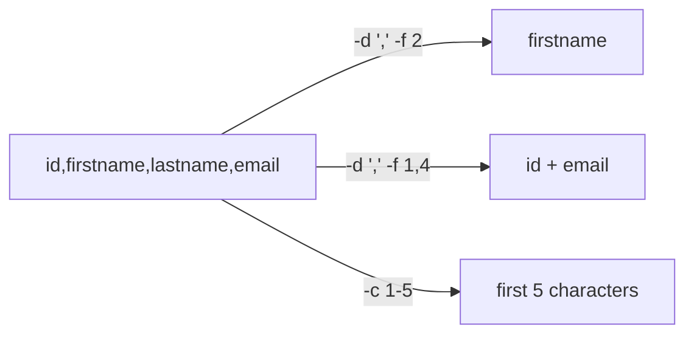

# Cut Command in Linux

## Overview

The `cut` command extracts specific sections — bytes, characters, or delimited fields — from each line of a file or input stream. It is a fast, single-purpose column selector that shines when data is consistently formatted (CSV, `:`-separated system files, fixed-width records, or space-separated logs).

Typical uses:

- Extracting columns from CSV or text files
- Parsing `/etc/passwd` and other `:`-delimited system files
- Filtering log files
- Processing command output inside shell scripts

## Concepts

`cut` selects text one of three ways. Choose the mode that matches how your data is structured:

| Mode | Flag | Selects by | Best for |
|---|---|---|---|
| Byte | `-b` | Byte offset | Fixed-width binary-safe data |
| Character | `-c` | Character offset | Fixed-width text columns |
| Field | `-f` (with `-d`) | Delimited fields | CSV, `/etc/passwd`, TSV, logs |



## Syntax

```bash
cut [OPTION] [FILE]
```

> [!NOTE]
> If no file is provided, `cut` reads from standard input — which is what makes it a natural stage in a pipeline (`command | cut …`).

## Configuration

### CSV File (`users.csv`)

```bash
vim users.csv
```

```text
id,firstname,lastname,email
100,Belinda,Lorenz,Belinda.Lorenz@yopmail.com
101,Miquela,Cornelia,Miquela.Cornelia@yopmail.com
102,Kellen,Melony,Kellen.Melony@yopmail.com
103,Aurore,Boycey,Aurore.Boycey@yopmail.com
104,Juliane,Nerita,Juliane.Nerita@yopmail.com
105,Amii,Arne,Amii.Arne@yopmail.com
106,Konstance,Fredi,Konstance.Fredi@yopmail.com
107,Sybille,Lory,Sybille.Lory@yopmail.com
108,Susette,Kenney,Susette.Kenney@yopmail.com
109,Gretal,Howlyn,Gretal.Howlyn@yopmail.com
110,Joelly,Sacken,Joelly.Sacken@yopmail.com
111,Kristan,Xerxes,Kristan.Xerxes@yopmail.com
112,Orelia,Erminia,Orelia.Erminia@yopmail.com
113,Lynde,Malvino,Lynde.Malvino@yopmail.com
114,Marguerite,Vittoria,Marguerite.Vittoria@yopmail.com
115,Josephine,Dom,Josephine.Dom@yopmail.com
116,Dede,Blase,Dede.Blase@yopmail.com
117,Romona,Ricki,Romona.Ricki@yopmail.com
118,Dulce,Bebe,Dulce.Bebe@yopmail.com
```

## Commands

### Extract by Byte Position (`-b`)

- Extracts bytes 1 through 5 from each line.

```bash
cut -b 1-5 filename.txt
```

### Extract by Character (`-c`)

- Extracts characters 1 through 10 from each line.

```bash
cut -c 1-10 filename.txt
```

### Extract by Field (`-f`) with Delimiter (`-d`)

- Extracts the first field using `:` as the delimiter.

```bash
cut -d ':' -f 1 /etc/passwd
```

### Combine Field Ranges

- Extracts fields 1 and 3 through 5 from a CSV file.

```bash
cut -d ',' -f 1,3-5 data.csv
```

### Use with Pipes

- Extracts the second word from each line using a space delimiter.

```bash
cat file.txt | cut -d ' ' -f 2
```

### Suppress Lines Without Delimiter

- Skips lines that do not contain the delimiter.

```bash
cut -d ':' --only-delimited -f 1 file.txt
```

## Examples

### Common Examples

- Extract usernames from `/etc/passwd`.

```bash
cut -d ':' -f 1 /etc/passwd
```

- Extract file extensions.

```bash
ls | cut -d '.' -f 2
```

### Working with CSV Files

- Display the full CSV file.

```bash
cat users.csv
```

- Extract the first column (ID).

```bash
cut -d ',' -f 1 users.csv
```

- Extract the second column (first name).

```bash
cut -d ',' -f 2 users.csv
```

- Extract the third column (last name).

```bash
cut -d ',' -f 3 users.csv
```

### Extract Multiple Columns

- Extract ID, first name, and last name.

```bash
cut -d ',' -f 1,2,3 users.csv
```

- Extract a field range.

```bash
cut -d ',' -f 1-3 users.csv
```

- Extract ID and email.

```bash
cut -d ',' -f 1,4 users.csv
```

- Save output to a new file.

```bash
cut -d ',' -f 1,4 users.csv > my-csv2.csv
```

### Space-Separated Text File (`users.txt`)

Create the file:

```bash
vim users.txt
```

```text
id firstname lastname email
100 Belinda Lorenz Belinda.Lorenz@yopmail.com
101 Miquela Cornelia Miquela.Cornelia@yopmail.com
102 Kellen Melony Kellen.Melony@yopmail.com
103 Aurore Boycey Aurore.Boycey@yopmail.com
104 Juliane Nerita Juliane.Nerita@yopmail.com
105 Amii Arne Amii.Arne@yopmail.com
106 Konstance Fredi Konstance.Fredi@yopmail.com
107 Sybille Lory Sybille.Lory@yopmail.com
108 Susette Kenney Susette.Kenney@yopmail.com
109 Gretal Howlyn Gretal.Howlyn@yopmail.com
110 Joelly Sacken Joelly.Sacken@yopmail.com
111 Kristan Xerxes Kristan.Xerxes@yopmail.com
112 Orelia Erminia Orelia.Erminia@yopmail.com
113 Lynde Malvino Lynde.Malvino@yopmail.com
114 Marguerite Vittoria Marguerite.Vittoria@yopmail.com
115 Josephine Dom Josephine.Dom@yopmail.com
116 Dede Blase Dede.Blase@yopmail.com
117 Romona Ricki Romona.Ricki@yopmail.com
118 Dulce Bebe Dulce.Bebe@yopmail.com
```

- Display file contents.

```bash
cat users.txt
```

- Extract the first field.

```bash
cut -f 1 users.txt
```

- Extract the first three fields using a space delimiter.

```bash
cut -d ' ' -f 1-3 users.txt
```

> [!TIP]
> With a **default tab delimiter**, `cut -f 1 users.txt` on space-separated data returns the whole line because there are no tabs. Always pass `-d ' '` when your columns are separated by spaces.

### Working with `/etc/passwd`

- Extract usernames.

```bash
cut -d ':' -f 1 /etc/passwd
```

- Extract username, home directory, and shell.

```bash
cut -d ':' -f 1,6,7 /etc/passwd
```

- Extract multiple fields.

```bash
cut -f1,2,3,4 -d ":" /etc/passwd
```

- Extract fields 1, 5, 6, and 7.

```bash
cut -f 1,5,6,7 -d":" /etc/passwd
```

- Extract all first seven fields.

```bash
cut -f 1-7 -d":" /etc/passwd
```

### Network Interface Examples

- Extract the first field from `ifconfig`.

```bash
ifconfig | cut -f1 -d" "
```

- Extract the first three fields.

```bash
ifconfig | cut -f1-3 -d " "
```

- Extract the IP address.

```bash
ifconfig | grep "inet " | cut -f10 -d" "
```

- Alternative syntax:

```bash
ifconfig | grep "inet " | cut -d " " -f 10
```

- Extract the MAC address.

```bash
ifconfig | grep ether | cut -f 10 -d " "
```

- Extract the netmask.

```bash
ifconfig | grep netmask | cut -f 13 -d' '
```

- Extract MTU information.

```bash
ifconfig | grep mtu | cut -f 1 -d " "
```

> [!WARNING]
> Field numbers in `ifconfig` output depend on exact spacing and the distro's `net-tools` version. These fixed field offsets (10, 13, …) are brittle — for reliable parsing prefer `ip addr` with `awk`, which collapses runs of whitespace.

### Filesystem Indexing with `find` and `cut`

- Generate a file index.

```bash
find / > fileindex.db
```

- Count indexed files.

```bash
wc -l fileindex.db
```

- Extract second-level directories.

```bash
cut -d "/" -f 2 fileindex.db
```

- Extract the first two levels.

```bash
cut -d "/" -f1,2 fileindex.db
```

- Sort and remove duplicates.

```bash
cut -d "/" -f 1,2 fileindex.db | sort -u
```

- Count unique directories.

```bash
cut -d "/" -f 2 fileindex.db | uniq -c
```

- Sort directory counts.

```bash
cut -d "/" -f 2 fileindex.db | uniq -c | sort -n -r
```

- Filter `/root` entries.

```bash
grep "^/root" fileindex.db
```

- Filter `/etc` entries.

```bash
cut -d "/" -f1- fileindex.db | grep "^\/etc" | sort -u
```

- Filter `/etc/yum.repos.d`.

```bash
cut -d "/" -f1- fileindex.db | grep "^\/etc\/yum\.repos\.d" | sort -u
```

#### Path Filtering Examples

- Find paths containing `home`.

```bash
grep home fileindex.db
```

- Find paths under `/home`.

```bash
grep "^/home/" fileindex.db
```

- Extract the top 3 path components.

```bash
grep "^/home" fileindex.db | cut -f 1,2,3 -d "/" | sort -u
```

- Filter `/home/infosec`.

```bash
grep "^/home/infosec" fileindex.db
```

#### File Extension Filtering

- Find `.db` files.

```bash
grep "\.db$" fileindex.db
```

- Find `.conf` files.

```bash
grep "\.conf$" fileindex.db
```

- Find `.html` files.

```bash
grep "\.html$" fileindex.db
```

### Access Log Analysis

- Extract unique IP addresses.

```bash
cat access.log | cut -d " " -f 1 | sort -u
```

- Count requests per IP.

```bash
cat access.log | cut -d " " -f 1 | sort | uniq -c | sort -urn
```

- Extract requests from a specific IP.

```bash
cat access.log | grep '192.168.1.10' | cut -d "\"" -f 2 | uniq -c
```

## Reference

### Useful `cut` Options

| Option | Description |
|---|---|
| `-b` | Select bytes |
| `-c` | Select characters |
| `-d` | Specify delimiter |
| `-f` | Select fields |
| `--complement` | Exclude selected fields |
| `--only-delimited` | Skip lines without delimiter |

## Best Practices

- `cut` works best with consistently formatted, single-character-delimited text.
- It is commonly combined with `grep`, `awk`, `sort`, `uniq`, and `sed`.
- `cut` cannot handle runs of whitespace as one delimiter or reorder fields — for that, reach for `awk`.

> [!TIP]
> `uniq -c` only collapses **adjacent** duplicate lines. Pipe through `sort` first (`sort | uniq -c`) when counting non-adjacent duplicates, as shown in the access-log examples.

## Troubleshooting

| Symptom | Cause | Fix |
|---|---|---|
| Whole line returned instead of a field | Default delimiter is a tab; data uses spaces/commas | Pass the correct `-d` delimiter |
| Multiple spaces break field numbering | `cut` treats each space as a separate delimiter | Squeeze with `tr -s ' '` or use `awk` |
| Lines without the delimiter still appear | Default keeps such lines intact | Add `--only-delimited` (`-s`) |

## Related
- [String-Processing](String-Processing.md) — text-processing toolkit hub
- [awk-Command](awk-Command.md) — more flexible, whitespace-aware field extraction
- [grep-Command](grep-Command.md) — filter lines before cutting columns
- [sed](sed.md) — stream-editing alternative
- [File-Finding-in-Linux](File-Finding-in-Linux.md) — pairs `find` output with `cut` for indexing
- [Standard-Data-Streams](../Linux-Basic-Commands/Standard-Data-Streams.md) — pipes feed `cut` its input
- [Linux Administration & Server Hardening](../Readme.md) — Linux administration & server hardening hub
