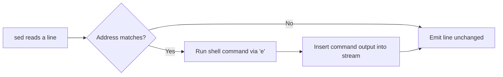

# `e` (Execute Shell Command) in `sed`

## Overview

The `e` command lets `sed` run an external **shell command** during stream processing and fold its output back into the stream. It turns `sed` from a pure text filter into a small automation engine — able to stamp lines with the current date, inject `id` output, or call any program on matching lines.

> [!IMPORTANT]
> `e` is a **GNU `sed` extension** and is **not POSIX compliant**. Scripts that rely on it will not run under BSD/macOS `sed` or a strict POSIX `sed`.

## Concepts

- The `e` command executes a shell command and inserts its output into the current processing stream.
- The command runs through the shell, so it can be any valid shell one-liner (including `;`-separated sequences).
- It can be scoped by the same address forms as any other `sed` command.

| Address form | Scope | Example |
|---|---|---|
| `Ne` | A single line number | `1e date` |
| `N,Me` | A line-number range | `1,3e id` |
| `1,$e` | Every line (line 1 to last) | `1,$e echo …; date` |
| `/pattern/e` | Lines matching a regex | `/armour/e date` |



## Commands

### Execute Commands on Specific Lines

- Execute `date` after line `1`.

```bash
sed '1e date' user-list.txt
```

- Execute `echo -n "Date: "; date` after line `1`.

```bash
sed '1e echo -n "Date: "; date' user-list.txt
```

### Execute Commands on Multiple Lines

- Execute `echo -n "Date: "; date` after every line in the file.

```bash
sed '1,$e echo -n "Date: "; date' user-list.txt
```

- Execute `echo -n "Date: "; date` after lines `1` through `3`.

```bash
sed '1,3e echo -n "Date: "; date' user-list.txt
```

- Execute `id` after lines `1` through `3`.

```bash
sed '1,3e id' user-list.txt
```

### Execute Commands on Pattern Match

- On lines matching `armour`, execute `echo -n "Date: "; date`.

```bash
sed '/armour/e echo -n "Date: "; date' user-list.txt
```

- On lines matching `armour`, execute `date`.

```bash
sed '/armour/e date' user-list.txt
```

## Best Practices

- Reserve `e` for controlled, trusted input and known scripts — keep the executed command constant, never built from file data.
- If portability matters, avoid `e` entirely and precompute values in the surrounding shell script instead.
- Document any use of `e` in shared scripts, since a hidden shell call inside a "text filter" is easy for reviewers to miss.

## Security Considerations

> [!WARNING]
> `e` can execute **arbitrary shell commands**. If any part of the command line is derived from untrusted input — a filename, a matched pattern, or attacker-controlled data — it becomes a command-injection / remote-code-execution primitive. Treat a `sed … e …` construct with the same scrutiny as `eval`. In offensive contexts, a writable `sed` script processed by a privileged job is a viable code-execution vector (see Remote-Code-Execution-to-Reverse-shell).

Useful (legitimate) applications:

- Dynamic command execution during a controlled pipeline
- Debugging and inspecting stream state
- Inserting system information (date, host identity) into generated output
- Automation scripts on trusted input

## Troubleshooting

| Symptom | Cause | Fix |
|---|---|---|
| `sed: -e expression … unknown command: 'e'` | Not GNU `sed` (BSD/macOS/POSIX build) | Use GNU `sed` (`gsed` on macOS) or precompute in shell |
| Output appears in unexpected order | `e` inserts command output relative to the addressed line | Adjust the address, or use `echo`/`printf` framing |
| Command runs more times than expected | Address matched more lines than intended | Tighten the pattern or use a specific line/range |

## Related
- [sed](sed.md) — parent `sed` command reference
- [s (substitute)](s-(substitute-command).md) — pairs `e` with substitution workflows
- Remote-Code-Execution-to-Reverse-shell — shell-command execution from `sed` is an RCE vector
- [String-Processing](String-Processing.md) — text-processing toolkit hub
- [Linux Administration & Server Hardening](../Readme.md) — Linux administration & server hardening hub
