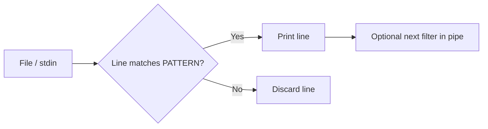

# grep Command – Pattern Matching in Linux

## Overview

`grep` (**G**lobal **R**egular **E**xpression **P**rint) searches for patterns in files or input streams and prints the lines that match. It is the workhorse of text search on Linux — used to find usernames, keywords, log entries, configuration values, and much more.

Common uses:

- Searching log files
- Finding usernames in system files
- Filtering command output
- Matching regular expressions
- Excluding comments or blank lines
- Recursive searches through directories

## Concepts

`grep` reads input line by line, tests each line against a pattern, and prints the lines that match (or, with `-v`, the lines that do not). The pattern can be a fixed string or a regular expression, and its power comes from combining flags, regex anchors, and pipelines.



| `grep` variant | Behaviour |
|---|---|
| `grep` | Basic regular expressions (BRE) |
| `grep -E` / `egrep` | Extended regular expressions (ERE) — `+`, `?`, `|`, `()` without escaping |
| `grep -F` / `fgrep` | Fixed strings — no regex, fastest for literal matches |

## Basic Syntax

```bash
grep [options] PATTERN [FILE...]
```

## Commands

### Basic Examples

- Searches for lines containing the string `root` in `/etc/passwd`. Typically used to check root user account information.

```bash
grep root /etc/passwd
```

- Searches for the string `armour` in `/etc/passwd`. Used to check if a user named `armour` exists on the system.

```bash
grep armour /etc/passwd
```

- Searches for `armour` in both `/etc/passwd` and `/etc/shadow`.

```bash
grep armour /etc/passwd /etc/shadow
```

- Searches for lines containing the string `home` in `/etc/passwd`. Useful for listing users whose home directories are under `/home`.

```bash
grep home /etc/passwd
```

- Searches both `/etc/passwd` and `/etc/shadow` for the string `root`.

```bash
grep root /etc/passwd /etc/shadow
```

- Searches `/etc/passwd`, `/etc/shadow`, `/etc/group`, and `/etc/gshadow` for references to `root`.

```bash
grep root /etc/passwd /etc/shadow /etc/group /etc/gshadow
```

- Searches `/var/log/messages` for lines containing `root`.

```bash
grep root /var/log/messages
```

- Searches `/var/log/messages` for `Root` (capital `R`).

```bash
grep Root /var/log/messages
```

- Performs a case-insensitive search for `root`.

```bash
grep -i root /var/log/messages
```

### Using cat with grep

- Searches `/var/log/messages` for `root` using a pipeline with `cat`.

```bash
cat /var/log/messages | grep root
```

- Performs a case-insensitive search using a pipeline.

```bash
cat /var/log/messages | grep -i root
```

> [!NOTE]
> `cat` is unnecessary in these examples because `grep` can read files directly. The pipeline form is shown for completeness, but `grep -i root /var/log/messages` is preferred.

### Quoting Patterns

- Searches for the exact phrase `Started session`.

```bash
grep "Started session" /var/log/messages
```

```bash
grep 'Started session' /var/log/messages
```

```bash
grep Started\ session /var/log/messages
```

### Multiple Pattern Matching

- Searches for lines containing either `root` or `armour`.

```bash
grep -E "(root|armour)" /var/log/messages
```

- Searches for lines containing the word `Session`.

```bash
grep "Session" /var/log/messages
```

- Performs a case-insensitive search for `Session`.

```bash
grep -i "Session" /var/log/messages
```

- Searches for lines containing both `Session` and `Start`.

```bash
grep "Session" /var/log/messages | grep Start
```

- Searches for lines containing `Session`, `Start`, and `root`.

```bash
grep "Session" /var/log/messages | grep Start | grep root
```

- Performs a case-insensitive search for lines containing `Session`, `Start`, and `root`.

```bash
grep -i "Session" /var/log/messages | grep -i Start | grep -i root
```

- Searches for lines containing `Session` and `Start`, excluding `root`.

```bash
grep "Session" /var/log/messages | grep Start | grep -v root
```

### Grouped Searches

- Searches for either `Started` or `Starting`.

```bash
grep -E "(Started|Starting)" /var/log/messages
```

- Searches for session start messages involving `armour` or `root`.

```bash
grep -E "(Started Session|Starting Session)" /var/log/messages | grep -E "(armour|root)"
```

```bash
grep -iE "(Started Session|Starting Session)" /var/log/messages | grep -E "(armour|root)"
```

- Excludes lines containing `root` or `armour`.

```bash
grep -E "(Started Session|Starting Session)" /var/log/messages | grep -vE "(root|armour)"
```

### Regex Operators

- Searches for the literal string `root.`

```bash
grep "root\." /var/log/messages
```

- Searches for `root.` at the end of a line.

```bash
grep "root\.$" /var/log/messages
```

- Searches for lines beginning with `Apr 8`.

```bash
grep "^Apr  8" /var/log/messages
```

- Filters lines starting with `Dec 7` and containing `Session`.

```bash
grep "^Dec  7" /var/log/messages | grep Session
```

- Searches `/etc/passwd` for entries ending with `bash`.

```bash
grep 'bash$' /etc/passwd
```

- Searches for comment lines in `anaconda-ks.cfg`.

```bash
grep "^#" anaconda-ks.cfg
```

### Excluding Comments and Empty Lines

- Excludes lines containing `#`.

```bash
grep -v '#' /etc/httpd/conf/httpd.conf
```

- Excludes comments and empty lines.

```bash
grep -v '#' /etc/httpd/conf/httpd.conf | grep -v '^$'
```

- Displays non-empty lines only.

```bash
grep -v '^$' /etc/ssh/sshd_config
```

- Removes empty lines and comment lines.

```bash
grep -v '^$' /etc/ssh/sshd_config | grep -v '^#'
```

- Filters out both comments and blank lines using extended regex.

```bash
grep -v -E "(^#|^$)" /etc/ssh/sshd_config
```

> [!TIP]
> `grep -vE "(^#|^$)" file` is the fastest way to view the *effective* configuration of a service — every directive that is actually in force, with the noise stripped out. Invaluable when auditing `sshd_config` against CIS Benchmarks.

### Pattern Matching with Wildcards

- Searches for lines beginning with `gpgcheck`.

```bash
grep "^gpgcheck" /etc/yum.conf
```

- Searches for `s` followed by any character.

```bash
grep "s." /etc/yum.conf
```

- Searches for lines containing either `a` or `n`.

```bash
grep "[an]" /etc/yum.conf
```

### Matching from a File

Create a URL list:

```bash
vim url-list.txt
```

```text
https://myblossom.com:8443
https://myfitnesspal.com:443
https://mtn.zm:443
https://myplenity.com:443
https://myndr.nl:443
http://moviexchange.com:80
```

Create a domain list:

```bash
vim domain-name.txt
```

```text
netzclub.net
o2.de
o2business.de
o2online.de
n26.com
nextiva.com
myblossom.com
```

- Searches `url-list.txt` for `netzclub.net`.

```bash
grep netzclub.net url-list.txt
```

- Searches using patterns from `domain-name.txt`.

```bash
grep -f domain-name.txt url-list.txt
```

- Displays lines that do not match patterns in `domain-name.txt`.

```bash
grep -v -f domain-name.txt url-list.txt
```

- Performs fixed-string matching and saves results.

```bash
grep -Ff domain-name.txt url-list.txt > matching-urls.txt
```

### Regex Practice File

Create a user test file:

```bash
vim user.txt
```

```text
user
user.
user1
user12
user123
user1234
user 1234
user	1234
user-name
user_name
user name
123
1234
12345
USERNAME
```

- Searches for `user`.

```bash
grep "user" user.txt
```

- Matches `user` followed by one character.

```bash
grep "user." user.txt
```

- Matches `user` followed by two characters.

```bash
grep "user.." user.txt
```

- Matches `user` followed by three characters.

```bash
grep "user..." user.txt
```

- Matches the literal string `user.` case-insensitively.

```bash
grep -i "user\." user.txt
```

### Numeric Pattern Matching

- Matches any digit.

```bash
grep "[0-9]" user.txt
```

- Matches two consecutive digits.

```bash
grep "[0-9][0-9]" user.txt
```

- Matches three consecutive digits.

```bash
grep "[0-9][0-9][0-9]" user.txt
```

- Matches numbers in the `40–49` range.

```bash
grep "4[0-9]" user.txt
```

- Matches `user` followed by exactly three digits.

```bash
grep "user[0-9][0-9][0-9]" user.txt
```

### Alphabetic Pattern Matching

- Matches lowercase letters.

```bash
grep "[a-z]" user.txt
```

- Matches uppercase letters.

```bash
grep "[A-Z]" user.txt
```

- Case-insensitive alphabetic match.

```bash
grep -i "[a-z]" user.txt
```

- Matches any character from the set `a`, `r`, `m`, `o`, `u`, or `r`.

```bash
grep -i "[armour]" /etc/passwd
```

### Character Classes

- Matches special characters.

```bash
grep "[@#$%]" /var/log/messages
```

- Matches uppercase letters.

```bash
grep "[[:upper:]]" user.txt
```

- Matches lowercase letters.

```bash
grep "[[:lower:]]" user.txt
```

- Matches alphabetic characters.

```bash
grep "[[:alpha:]]" user.txt
```

- Matches digits.

```bash
grep "[[:digit:]]" user.txt
```

- Matches alphanumeric characters.

```bash
grep "[[:alnum:]]" user.txt
```

- Matches whitespace characters.

```bash
grep "[[:space:]]" user.txt
```

### Grep with Process and Network Commands

- Displays IPv4 addresses only.

```bash
ifconfig | grep inet | grep -v inet6
```

```bash
ifconfig | grep 'inet '
```

- Displays processes containing `root`.

```bash
ps -aux | grep root
```

- Displays processes excluding `root`.

```bash
ps -aux | grep -v root
```

- Displays processes owned by `root`.

```bash
ps -aux | grep "^root"
```

### Recursive Search

- Recursively searches `/etc/` for `armour`.

```bash
grep -r "armour" /etc/
```

- Recursive, case-insensitive search with line numbers.

```bash
grep -irn root /etc/* 2> /dev/null
```

```bash
grep -inr "armour" /etc/ 2> /dev/null
```

- Displays only filenames containing matches.

```bash
grep -ilR root /etc/* 2> /dev/null
```

### File and Line Number Output

- Displays filenames containing `TLSv1.1`.

```bash
grep -l "TLSv1.1" *sslscan.log
```

```bash
grep -l "armour" /etc/* 2> /dev/null
```

- Recursive search with line numbers.

```bash
grep -nR "armour" /etc/
```

- Searches PHP files for the string `exec`.

```bash
grep -r "exec" /var/www/html/php
```

### Output Matching Strings Only (`-o`)

- Displays only matching four-digit numbers.

```bash
grep [0-9][0-9][0-9][0-9] passwd -o
```

## Reference

### Useful grep Options

| Option | Description |
|---|---|
| `-i` | Ignore case |
| `-v` | Invert match |
| `-n` | Show line numbers |
| `-r` / `-R` | Recursive search |
| `-l` | Show matching filenames only |
| `-o` | Show matched text only |
| `-E` | Extended regular expressions |
| `-F` | Fixed string matching |
| `-c` | Count matching lines |
| `-w` | Match whole words only |
| `-x` | Match entire line |
| `-A` | Show lines after match |
| `-B` | Show lines before match |
| `-C` | Show surrounding context |

## Best Practices

- Use `-i` for case-insensitive searches and `-v` to exclude matches.
- Use `-E` for advanced regex patterns and `-F` for fast literal matching.
- Use `-n` to display line numbers and `-r` for recursive directory searches.
- Combine `grep` with `awk`, `sed`, `cut`, `sort`, and `uniq` for advanced text processing.
- Prefer direct file input over unnecessary `cat` pipelines.
- Quote patterns to protect regex metacharacters and spaces from the shell.

## Security Considerations

> [!WARNING]
> `grep`-ing system files such as `/etc/shadow` requires root and exposes password hashes — handle the output as sensitive. When auditing, redirect `stderr` (`2> /dev/null`) only to suppress permission noise, never to hide real errors. In blue-team work, `grep -F -f iocs.txt` against logs is an effective IOC sweep; in red-team work, `grep -rl` for secrets across `/etc`, web roots, and history files is a fast credential-hunting technique.

## Troubleshooting

| Symptom | Cause | Fix |
|---|---|---|
| `+`, `?`, `|` treated literally | Basic regex mode | Use `grep -E` (extended regex) |
| No matches on a known-present string | Case mismatch or metacharacter | Add `-i`; escape or use `-F` for literals |
| `grep: /path: Permission denied` floods output | Recursive scan hits protected files | Append `2> /dev/null` |
| Pattern with spaces splits into filenames | Unquoted pattern | Wrap the pattern in quotes |

## Related
- [String-Processing](String-Processing.md) — parent text-processing hub
- [awk-Command](awk-Command.md) — pattern matching with field awareness
- [sed](sed.md) — stream editing the lines grep selects
- [cut-Command](cut-Command.md) — extract columns from grep output
- [File-Finding-in-Linux](File-Finding-in-Linux.md) — locate files, then grep their contents
- [Linux Administration & Server Hardening](../Readme.md) — Linux administration & server hardening hub
