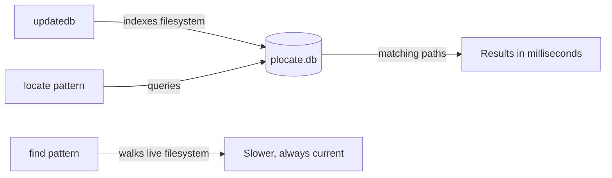

# locate

## Overview

- The `locate` command is a fast file-search utility in Linux that queries a prebuilt file-index database to quickly find files and directories by name.

- Unlike `find`, which walks the filesystem in real time, `locate` reads a precomputed database, making it dramatically faster for name-based lookups.

- The trade-off is freshness: results are only as current as the last database build, so newly created files may not appear until the index is regenerated.

> [!TIP]
> Use `locate` for fast, name-based searches on relatively static filesystems, and fall back to `find` when you need real-time results or attribute-based criteria (permissions, size, modification time, ownership).

---

## Concepts

### How locate Works

- `locate` consults a database file, commonly:

```bash
/var/lib/plocate/plocate.db
```

- The database is created and refreshed by `updatedb`, which is typically run automatically by a scheduled `cron` or `systemd` timer:

```bash
updatedb
```

> [!NOTE]
> Searches are typically completed in milliseconds because no live filesystem traversal takes place.



### When to Use locate

|Use Case|Use `locate`?|
|---|---|
|Need ultra-fast file search|Yes|
|Frequent searches on static filesystems|Yes|
|Real-time filesystem search|No — use `find`|
|Searching newly created files|Run `updatedb` first|
|Permission-sensitive searches|Prefer `find`|

### Common Features

|Feature|Example|
|---|---|
|Glob pattern matching|`locate "*.log"`|
|Regex support|`locate -r '\.conf$'`|
|Case-insensitive search|`locate -i pass`|
|Count results|`locate -c passwd`|
|Limit output|`locate -n 20 pass`|

---

## Configuration

### Install `plocate`

- RHEL / CentOS / Fedora

```bash
yum install plocate
```

- Debian / Ubuntu

```bash
apt install plocate
```

### Update the Database

- Rebuild the file database used by `locate`:

```bash
updatedb
```

> [!WARNING]
> Newly created files may not appear until the database is updated. Run `updatedb` manually after adding files you need to find immediately, or rely on the scheduled job to refresh it periodically.

### Help & Database Information

- Display help for `locate`:

```bash
locate --help
```

- Display the raw database contents:

```bash
cat /var/lib/plocate/plocate.db
```

---

## Commands

### Basic Searches

- Find files named `messages`:

```bash
locate messages
```

- Find files containing `Root` (case-sensitive):

```bash
locate Root
```

- Find files containing `root` (case-sensitive):

```bash
locate root
```

### Case-Insensitive Searches

- Case-insensitive search for `root`:

```bash
locate -i root
```

- Case-insensitive search for `*pass*`:

```bash
locate -i *pass*
```

- Case-insensitive search for `*password*`:

```bash
locate -i *password*
```

- Count matches for `*password*`:

```bash
locate -c -i *password*
```

### Regex Searches

- Find files ending in `.txt`:

```bash
locate -r '\.txt$'
```

- Find files ending in `.conf`:

```bash
locate -r '\.conf$'
```

- Find files ending in `.exe`:

```bash
locate -r '\.exe$'
```

- Find files ending in `ple`:

```bash
locate -r '\ple$'
```

```bash
locate -r 'ple$'
```

- Find files named `passwd`:

```bash
locate -r 'passwd$'
```

- Find `.html` files using regex:

```bash
locate -r '\.html$'
```

### Glob Pattern Matching

- Find `.html` files using glob:

```bash
locate "*.html"
```

- Find `.txt` files using glob:

```bash
locate '*.txt'
```

### Limiting & Paging Output

- Limit output to 20 matches:

```bash
locate "*.html" -n 20
```

- Show lines 10-20 from `.log` matches:

```bash
locate "*.log" | sed -n '10,20p'
```

---

## Examples

### Practical One-Liners

- Find SSH configuration files:

```bash
locate sshd_config
```

- Find all `.log` files:

```bash
locate "*.log"
```

- Find files inside `/etc`:

```bash
locate "/etc/*"
```

- Count `.conf` files:

```bash
locate -c "*.conf"
```

- Find files matching multiple terms:

```bash
locate passwd | grep passwd
```

### Common Command Combinations

- `locate` + `grep`

```bash
locate "*.conf" | grep apache
```

- `locate` + `head`

```bash
locate "*.log" | head
```

- `locate` + `tail`

```bash
locate "*.log" | tail
```

- `locate` + `xargs`

```bash
locate "*.tmp" | xargs rm -f
```

> [!WARNING]
> Be careful when combining `locate` with destructive commands like `rm`. Because the database can contain stale or unexpected paths, review the output first — for example with `locate "*.tmp" | less` — before piping it into anything that deletes files.

---

## Best Practices

- Use `locate` instead of `find` for fast filename searches on stable filesystems.

- Run `updatedb` regularly (or trust the scheduled job) to keep results current.

- Use regex (`-r`) for advanced pattern matching and anchoring (`$`, `^`).

- Combine with `grep`, `head`, `tail`, or `sed` to filter and page large result sets.

---

## Security Considerations

- `locate` only searches indexed paths stored in the database; anything excluded from indexing will never appear in results.

- Results may reference files the current user cannot actually access — the database is built with elevated privileges, so a match does not imply read permission.

- Sensitive directories may be deliberately excluded from indexing via `PRUNEPATHS` / `PRUNEFS` in `/etc/updatedb.conf`; review this configuration on hardened hosts.

- Database freshness depends on how often `updatedb` runs, so `locate` should not be treated as an authoritative, real-time view of the filesystem during incident response — use `find` for that.

---

## Troubleshooting

|Symptom|Likely Cause|Resolution|
|---|---|---|
|`locate: command not found`|`plocate`/`mlocate` not installed|Install with `apt install plocate` or `yum install plocate`|
|A known new file is not found|Database is stale|Run `updatedb`, then retry|
|`can not stat () '/var/lib/plocate/plocate.db'`|Database has never been built|Run `updatedb` once as root|
|Too many results|Pattern too broad|Anchor with regex (`-r '\.conf$'`) or pipe to `grep`|

---

## References

| Resource | Description |
|---|---|
| `man locate` | Full manual page |
| `locate --help` | Quick option summary |
| `man updatedb` | Database build tool documentation |
| `/etc/updatedb.conf` | Indexing configuration (pruned paths/filesystems) |

```bash
man locate
```

```bash
locate --help
```

## Related
- [Find-Command](Find-Command.md) — real-time filesystem search
- [File-Finding-in-Linux](File-Finding-in-Linux.md) — overview of file-search tools
- [whereis](whereis.md) — locate binaries and man pages
- [which](which.md) — find an executable in PATH
- [Linux Administration & Server Hardening](../Readme.md) — course hub
