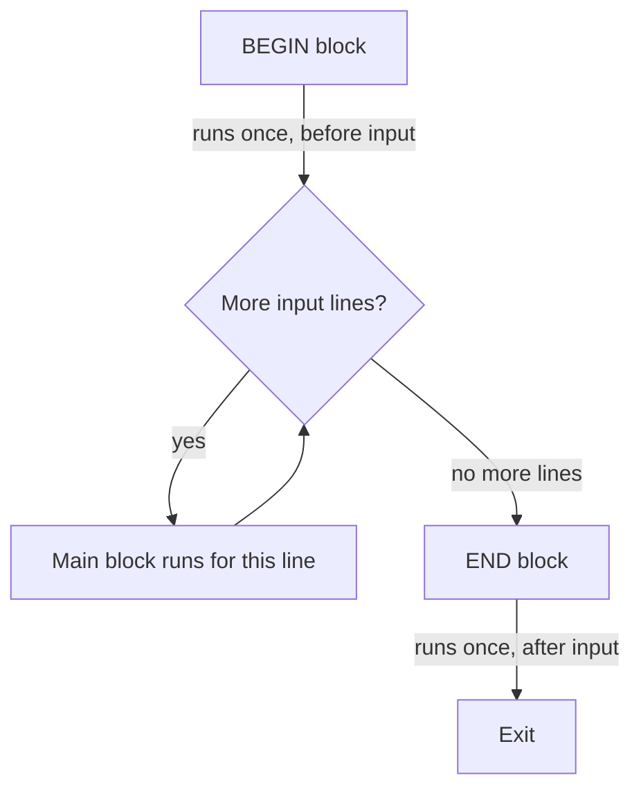

# AWK Structure: `BEGIN`, `{}`, `END`

## Overview

Every `awk` program is built from three optional blocks that run at well-defined points in the input-processing lifecycle. Understanding when each block executes is the key to writing correct `awk` one-liners for reporting, aggregation, and log processing.

- `BEGIN { ... }` — runs **once before** any input is read.

- `{ ... }` — the **main block**; runs **once for every input line** (record).

- `END { ... }` — runs **once after** all input has been read.

> [!NOTE]
> All three blocks are optional. A program may contain any combination — a lone `BEGIN`, a lone `END`, just a main block, or all three together.

---

## Concepts

### Execution Order

The blocks always execute in the same relative order regardless of how they are written on the command line: `BEGIN` first, then the main block for each record, then `END` last.



### Block Responsibilities

| Block | Runs | Typical Use |
|---|---|---|
| `BEGIN { }` | Once, before input | Print headers, set variables, define `FS`/`OFS` |
| `{ }` (main) | Once per input line | Process fields, filter, accumulate totals |
| `END { }` | Once, after input | Print footers, summaries, computed totals |

### General Structure

```bash
echo "one two three four" | awk 'BEGIN{code_in_BEGIN_section} {code_in_main_body_section} END{code_in_END_section}'
```

---

## Examples

### All Three Blocks Together

- Prints `demo`, then `demo1` for the input line, and `demo2` after processing.

```bash
echo "one two three four" | awk 'BEGIN{print "demo"} {print "demo1"} END{print "demo2"}'
```

- Prints a header and footer around the content.

```bash
echo "one two three four" | awk 'BEGIN{print "START PRINT"} {print $0} END{print "END PRINT"}'
```

### Using Only BEGIN or END

- Prints only the `BEGIN` block.

```bash
echo "one two three four" | awk 'BEGIN{print "START PRINT"}'
```

- Prints only the `END` block.

```bash
echo "one two three four" | awk 'END{print "END PRINT"}'
```

### Using Only the Main Block

- Prints the full line (default behavior).

```bash
echo "one two three four" | awk '{print $0}'
```

- Prints the string `Hello` for each input line.

```bash
awk '{print "Hello"}'
```

### Simple BEGIN or END Standalone

> [!TIP]
> A `BEGIN`-only program runs even with **no input at all**, which makes `awk 'BEGIN{...}'` a handy way to test expressions or perform quick calculations.

- Prints `Hello` before any input, even without input.

```bash
awk 'BEGIN{print "Hello"}'
```

- Prints `Hello` after processing, even if there is no input.

```bash
awk 'END{print "Hello"}'
```

### Real File Example

- Prints the first field (username) from `/etc/passwd` using colon `:` as the delimiter.

```bash
awk -F: '{ print $1 }' /etc/passwd
```

---

## Best Practices

- Put one-time setup (variable initialization, header rows, `FS`/`OFS` assignment) in `BEGIN` so it is not repeated per line.

- Accumulate running totals in the main block and print the final result in `END` — this is the canonical pattern for sums, counts, and averages.

- Keep the main block focused on per-record logic; anything that only needs to happen once belongs in `BEGIN` or `END`.

- Remember that an `END`-only or `BEGIN`-only program is valid and useful for summaries and quick tests.

---

## Security Considerations

- When parsing sensitive system files such as `/etc/passwd`, treat extracted fields (usernames, UIDs, shells) as account metadata and avoid writing them to world-readable locations.

- Never pass untrusted input directly into a dynamically constructed `awk` program string; a crafted field could alter program behavior. Prefer passing data as input records, not as code.

---

## Related
- [awk-Command](awk-Command.md) — awk language overview
- [$1-$2-Dollars-everywhere]($1-$2-Dollars-everywhere.md) — fields printed per record
- [Arithmetic](Arithmetic.md) — compute values to print
- [Searching-Pattern](Searching-Pattern.md) — print only matching records
- [Linux Administration & Server Hardening](../Readme.md) — course hub
