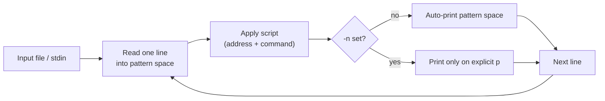

# sed (Stream Editor)

## Overview

`sed` stands for **Stream Editor**. It is a non-interactive, line-oriented utility for parsing, filtering, and transforming text streams. Because it reads and edits input a line at a time and writes results to standard output, it scales to arbitrarily large files and slots naturally into shell pipelines.

- Reads input line by line
- Applies editing commands
- Sends modified output to standard output

### Common Use Cases

- Search and replace
- Delete lines
- Insert or append text
- Filter output
- Process configuration files
- Automate text editing tasks

> [!TIP]
> `sed` shines at *stream* edits and one-liners. For column/field-oriented data reach for [awk](awk-Command.md); for pure pattern matching reach for [grep](grep-Command.md).

---

## Concepts

### sed Syntax

```bash
sed [OPTIONS] 'SCRIPT' [FILE]
```

| Component | Description |
|---|---|
| `OPTIONS` | Flags controlling sed behavior |
| `SCRIPT` | sed command(s) |
| `FILE` | Input file |

### Processing Model



### Common Options

| Option | Description |
|---|---|
| `-n` | Suppress automatic printing |
| `-i` | Edit files in-place |
| `-e` | Execute multiple commands |
| `-r` | Use extended regular expressions |
| `-f` | Read commands from file |
| `-z` | Treat input as null-separated |
| `--version` | Show sed version |

### Addressing in sed

sed commands can target specific lines, ranges, or pattern matches:

| Address Type | Example |
|---|---|
| Specific line | `5p` |
| Line range | `2,10d` |
| Last line | `$d` |
| Pattern match | `/root/p` |
| Negation | `1,5!p` |

### Common sed Commands

| Command | Description |
|---|---|
| `p` | Print |
| `d` | Delete |
| `s` | Substitute |
| `a\` | Append text |
| `i\` | Insert text |
| `c\` | Change line |
| `q` | Quit |
| `r` | Read file |
| `w` | Write to file |
| `y` | Transliterate characters |
| `=` | Print line number |
| `n` | Read next line |

### Hold Space Commands

The **hold space** is a secondary buffer sed can use to stash and recombine lines across iterations.

| Command | Description |
|---|---|
| `h` | Copy pattern space to hold space |
| `H` | Append to hold space |
| `g` | Copy hold space to pattern space |
| `G` | Append hold space to pattern space |
| `x` | Exchange hold and pattern spaces |

- Example:

```bash
sed -n '1h;2g;2p' passwd
```

---

## Examples

### Printing

- Print Specific Lines

```bash
sed -n '1,5p' passwd
```

- Print Matching Lines

```bash
sed -n '/root/p' /etc/passwd
```

- Print Non-Matching Lines

```bash
sed -n '/root/!p' /etc/passwd
```

- Print Last Line

```bash
sed -n '$p' passwd
```

- Print Every Second Line

```bash
sed -n '2~2p' passwd
```

### Delete Operations

- Delete Specific Line

```bash
sed '3d' passwd
```

- Delete Multiple Lines

```bash
sed '2,5d' passwd
```

- Delete Last Line

```bash
sed '$d' passwd
```

- Delete Empty Lines

```bash
sed '/^$/d' passwd
```

- Delete Commented Lines

```bash
sed '/^#/d' config.conf
```

- Delete Lines Matching Pattern

```bash
sed '/nologin/d' passwd
```

### Substitution Operations

- Replace First Match

```bash
sed 's/root/ROOT/' passwd
```

- Replace All Matches

```bash
sed 's/root/ROOT/g' passwd
```

- Replace Only on Specific Line

```bash
sed '10 s/root/ROOT/' passwd
```

- Replace in Line Range

```bash
sed '1,10 s/root/ROOT/g' passwd
```

- Case-Insensitive Replace

```bash
sed 's/root/ROOT/Ig' passwd
```

- Print Only Modified Lines

```bash
sed -n 's/root/ROOT/p' passwd
```

### Alternate Delimiters

- Useful when replacing paths.

```bash
sed 's/\/bin\/bash/\/opt\/bin\/bash/g' passwd
```

```bash
sed 's/\/home\/armour/\/opt\/home\/armour/g' passwd
```

### In-Place Editing

> [!WARNING]
> `-i` rewrites the file on disk with no undo. Test the script without `-i` first, or use `-i.bak` to keep a backup.

- Edit File Directly

```bash
sed -i 's/root/ROOT/g' passwd
```

- Create Backup Before Editing

```bash
sed -i.bak 's/root/ROOT/g' passwd
```

### Insert, Append, and Change

- Append Text After Match

```bash
sed '/pattern/a New line added' passwd
```

- Insert Text Before Match

```bash
sed '/pattern/i New line inserted' passwd
```

- Replace Entire Line

```bash
sed '/pattern/c Entire line replaced' passwd
```

### Working with Blank Lines

- Add Blank Line After Every Line

```bash
sed 'G' passwd
```

- Add Multiple Blank Lines

```bash
sed 'G;G' passwd
```

- Remove Blank Lines

```bash
sed '/^$/D' passwd
```

- Remove Multiple Blank Lines

```bash
sed '/^$/N;/^\n$/D' passwd
```

### Using Regular Expressions

- Match Beginning of Line

```bash
sed -n '/^root/p' passwd
```

- Match End of Line

```bash
sed -n '/bash$/p' passwd
```

- Match Digits

```bash
sed -n '/[0-9]/p' passwd
```

- Match Multiple Patterns

```bash
sed -nr '/root|admin/p' passwd
```

### Capture Groups

- Swap Words

```bash
echo "John Doe" | sed -r 's/(.*) (.*)/\2 \1/'
```

> Output:

```bash
Doe John
```

- Rearrange IP Address

```bash
echo "192.168.1.10" | sed -r 's/([0-9]+)\.([0-9]+)\.([0-9]+)\.([0-9]+)/\4.\3.\2.\1/'
```

### Transliteration

- Convert Lowercase to Uppercase

```bash
echo "linux" | sed 'y/abcdefghijklmnopqrstuvwxyz/ABCDEFGHIJKLMNOPQRSTUVWXYZ/'
```

### Multiple Commands

- Using Multiple -e

```bash
sed -e 's/root/ROOT/g' -e '/nologin/d' passwd
```

- Using Semicolon

```bash
sed 's/root/ROOT/g;/nologin/d' passwd
```

### Reading sed Commands from File

- Create sed Script

```bash
vim script.sed
```

```bash
s/root/ROOT/g
/nologin/d
```

- Execute sed Script

```bash
sed -f script.sed passwd
```

### File Operations

- Write Matching Lines to Another File

```bash
sed -n '/root/w output.txt' passwd
```

- Read Content from Another File

```bash
sed '/pattern/r extra.txt' passwd
```

### Advanced sed Examples

- Remove Leading Spaces

```bash
sed 's/^[ \t]*//' passwd
```

- Remove Trailing Spaces

```bash
sed 's/[ \t]*$//' passwd
```

- Remove All Spaces

```bash
sed 's/ //g' passwd
```

- Replace Multiple Spaces with Single Space

```bash
sed 's/  */ /g' passwd
```

- Remove Duplicate Empty Lines

```bash
sed '/^$/N;/^\n$/D' passwd
```

### Line Number Examples

- Show Line Numbers

```bash
sed '=' passwd
```

- Show Line Numbers with Content

```bash
sed = passwd | sed 'N;s/\n/ /'
```

### Quit Examples

- Quit After Line 5

```bash
sed '5q' passwd
```

- Quit After First Match

```bash
sed '/root/q' passwd
```

### Practical Examples

- Extract Usernames from /etc/passwd

```bash
sed 's/:.*//' /etc/passwd
```

- Replace Tabs with Spaces

```bash
sed 's/\t/    /g' passwd
```

- Remove HTML Tags

```bash
sed 's/<[^>]*>//g' file.html
```

- Convert CSV to Colon-Separated

```bash
sed 's/,/:/g' file.csv
```

- Comment All Lines

```bash
sed 's/^/#/' passwd
```

- Uncomment Lines

```bash
sed 's/^#//' passwd
```

### Combining sed with Pipes

- Process Command Output

```bash
ps aux | sed -n '1,5p'
```

- Modify grep Output

```bash
grep root /etc/passwd | sed 's/root/ROOT/'
```

- Replace Text from echo

```bash
echo "hello world" | sed 's/world/linux/'
```

### GNU sed Useful Extensions

- Print Line Length

```bash
sed -n 's/.*//;=;x' passwd
```

- Use Extended Regex

```bash
sed -r 's/(root|admin)/SUPERUSER/g' passwd
```

---

## Best Practices

> [!TIP]
> Always dry-run a substitution (without `-i`) and eyeball the output before committing it to disk. Pair `-i.bak` with in-place edits on production config files so you can roll back instantly.

- Choose an **alternate delimiter** (`s|old|new|`) instead of escaping every `/` when your pattern contains paths — it is far more readable.
- Keep complex, reusable transforms in a `.sed` script file (`sed -f script.sed`) rather than an unwieldy one-liner.
- Use `-r` (extended regex) to avoid backslash-heavy patterns with `+`, `?`, `|`, and groups.

---

## Security Considerations

- Editing sensitive files such as `/etc/passwd`, `/etc/shadow`, or PAM/SSH configs with `sed -i` can corrupt authentication if the pattern is wrong — always back up (`-i.bak`) and validate afterward.
- Never build sed scripts by interpolating untrusted input directly into the pattern/replacement; crafted delimiters or `w`/`r`/`e` commands can write or read arbitrary files.
- The GNU `e` command executes shell commands from within sed — treat any script that uses it as capable of arbitrary code execution and review it accordingly.

---

## Troubleshooting

| Symptom | Likely Cause | Resolution |
|---|---|---|
| `sed: -e expression … unknown option to 's'` | Unescaped `/` in the pattern | Switch to an alternate delimiter, e.g. `s|/old|/new|` |
| In-place edit produced an empty file | Redirecting `sed ... file > file` instead of using `-i` | Use `sed -i` (never redirect a file onto itself) |
| `+`, `?`, `()` treated literally | Basic regex mode | Add `-r` (or `-E`) for extended regex |
| No output at all | `-n` set without a matching `p` | Add a `p` command or drop `-n` |

---

## Quick Reference Table

| Action | Command |
|---|---|
| Print line 5 | `sed -n '5p' file` |
| Delete line 5 | `sed '5d' file` |
| Replace text | `sed 's/old/new/g' file` |
| Edit file directly | `sed -i 's/old/new/g' file` |
| Print matching lines | `sed -n '/pattern/p' file` |
| Delete matching lines | `sed '/pattern/d' file` |
| Append text | `sed '/pattern/a text' file` |
| Insert text | `sed '/pattern/i text' file` |
| Show line numbers | `sed '=' file` |
| Remove blank lines | `sed '/^$/d' file` |
| Remove spaces | `sed 's/ //g' file` |
| Remove comments | `sed '/^#/d' file` |
| Replace tabs | `sed 's/\t/ /g' file` |
| Quit after line | `sed '10q' file` |

---

## References

- Manual page:

```bash
man sed
```

- GNU sed manual (`info sed`) for the full command and hold-space reference.

---

## Related

- [s-(substitute-command)](s-(substitute-command).md) — deep dive on the core `s///` substitute command.
- [String-Processing](String-Processing.md) — parent text-processing hub for this module.
- [grep-Command](grep-Command.md) — regex line-matching companion.
- [awk-Command](awk-Command.md) — column-oriented stream processor.
- [cut-Command](cut-Command.md) — extract fixed fields/columns from each line.
- [Linux Administration & Server Hardening](../Readme.md) — Linux administration & server hardening hub.
