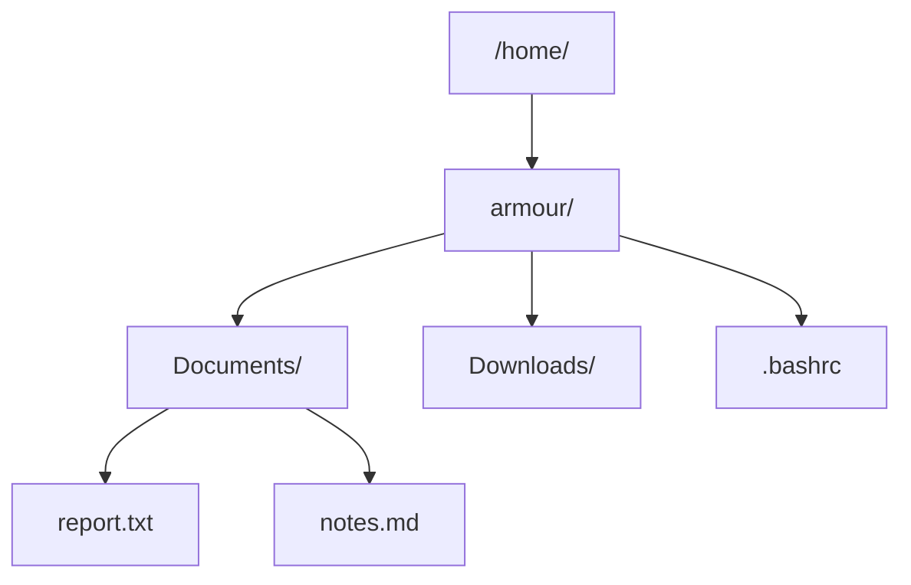

# tree

## Overview

The `tree` command displays directories and their contents as a **hierarchical, indented tree** — a much more readable view of nested structure than a flat `ls -R`. It draws the classic branch connectors, can summarise file counts, and is invaluable for documenting layouts, exploring an unfamiliar filesystem, or capturing a directory snapshot for a report.

> [!NOTE]
> `tree` is not installed by default on many minimal server images. Install it from your distribution's package manager (see [Installation](#installation)).

---

## Concepts

`tree` recurses from a starting directory (the current directory by default) and prints each entry beneath its parent, connected by branch characters. Depth, sorting, filtering, and the amount of metadata shown are all controlled by flags.



### Common Options

| Option | Description |
|---|---|
| `-a` | Include hidden files (dotfiles) |
| `-d` | List directories only |
| `-L <n>` | Limit recursion to `n` levels deep |
| `-f` | Print the full path prefix for each entry |
| `-p` | Show file permissions |
| `-s` | Show file sizes (bytes) |
| `-h` | Show human-readable sizes (K, M, G) |
| `-v` | Sort by version |
| `-r` | Reverse the sort order |
| `-t` | Sort by last-modification time |
| `-I <pattern>` | Ignore files/dirs matching the pattern |

---

## Installation

- Debian/Ubuntu

```bash
apt install tree
```

- RHEL/CentOS/Fedora

```bash
yum install tree
```

---

## Commands

### Basic Usage

- Display Current Directory Structure

```bash
tree
```

- Display Help

```bash
tree --help
```

---

## Examples

### Directory Tree Examples

- Show `/home` Directory Structure

```bash
tree /home/
```

- Include Hidden Files

```bash
tree -a /home/
```

- Include Hidden Files in `Documents`

```bash
tree -a Documents/
```

- Show `/var/log` Structure

```bash
tree /var/log/
```

- Show `/var/log` Including Hidden Files

```bash
tree -a /var/log/
```

> [!NOTE]
> **📸 Screenshot**
> _Capture: Terminal output of tree /home/ showing the armour home directory expanded into Documents and Downloads subfolders with branch connectors and a file/directory count summary line_

### Sorting Options

- Sort by Version

```bash
tree -a -v
```

- Reverse Sort Order

```bash
tree -a -r
```

- Sort by Modification Time

```bash
tree -a -t
```

### Limit Directory Depth

- Show Only 2 Levels Deep

```bash
tree -L 2
```

- Show Only 3 Levels in `/etc`

```bash
tree -L 3 /etc/
```

- Show Only Directories

```bash
tree -d
```

- Show File Permissions

```bash
tree -p
```

- Show File Sizes

```bash
tree -s
```

- Human Readable File Sizes

```bash
tree -h
```

- Save Output to a File

```bash
tree > tree-output.txt
```

### Ignore Specific Files or Directories

```bash
tree -I "*.log"
```

```bash
tree -I "node_modules|vendor"
```

### Display Full Path Prefix

```bash
tree -f
```

---

## Best Practices

> [!TIP]
> On large trees, always cap the depth with `-L` (e.g. `tree -L 2`) and exclude noisy directories with `-I` (e.g. `-I "node_modules|.git"`). This keeps output readable and avoids traversing thousands of files.

- Combine `-p -h` to produce a permission-and-size inventory that reads like a lightweight audit report.
- Pipe or redirect to a file (`tree -a > layout.txt`) to capture a filesystem snapshot for documentation or before/after comparisons.

---

## Security Considerations

- `tree -a -p` is a quick way to eyeball hidden files and unexpected permissions across a directory (for example, world-writable files or stray dotfiles in a web root).
- Running `tree` against sensitive trees (`/etc`, `/root`, user home directories) may expose file names that reveal configuration or credential locations — treat saved `tree` output as potentially sensitive.
- Deep, unbounded traversals of large or network-mounted filesystems can be slow and I/O heavy; bound them with `-L`.

---

## Troubleshooting

| Symptom | Likely Cause | Resolution |
|---|---|---|
| `tree: command not found` | Package not installed | Install via `apt install tree` / `yum install tree` |
| Output floods the terminal | No depth limit on a deep tree | Add `-L <n>` and/or `-I <pattern>` |
| Hidden files missing | Dotfiles excluded by default | Add `-a` |
| Broken/garbled connectors | Terminal not UTF-8 | Use `tree --charset ascii` or fix the locale |

---

## References

- Built-in help:

```bash
tree --help
```

---

## Related

- [File-Finding-in-Linux](File-Finding-in-Linux.md) — overview of file-search and filesystem-navigation tools.
- [Find-Command](Find-Command.md) — search within the directory tree by name, type, size, or time.
- [locate](locate.md) — database-backed, filesystem-wide file lookup.
- [Linux Administration & Server Hardening](../Readme.md) — Linux administration & server hardening hub.
