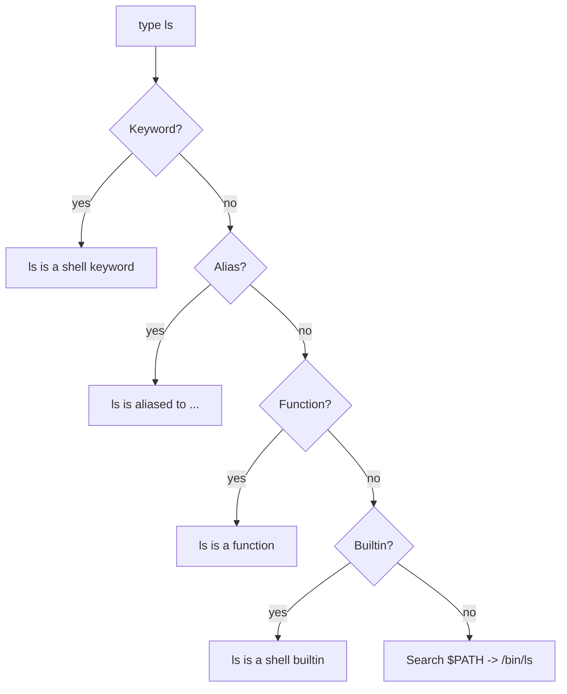

# type

## Overview

The `type` command displays how a command name would be interpreted by the shell. Because it is a **shell builtin**, it resolves names exactly the way the running shell would when you actually type them — making it the most accurate answer to *"what will happen when I run this?"*.

`type` can identify whether a name is:

- A shell **builtin**
- An **alias**
- A shell **function**
- A shell **keyword** (reserved word)
- An **executable file** on `$PATH`

> [!NOTE]
> Unlike `which` (an external program that only searches `$PATH`), `type` sees the full shell environment — aliases and functions included — so it reflects true command resolution.

---

## Concepts

### When to Use `type`

| Use Case | Recommended Tool |
|---|---|
| Check if a command is an alias / function / builtin | `type` |
| Determine actual command resolution in your shell | `type` |
| Inspect shell aliases | `type` |
| Locate the executable path only | `which` |
| POSIX-portable command lookup | `command -v` |

### How `type` Works

`type` resolves a name in the same precedence order the shell uses to execute it:

1. Checks the shell environment first (keywords, aliases, functions, builtins).
2. Resolves aliases before binaries.
3. Detects shell builtins and functions.
4. Searches `$PATH` for an executable if no earlier match is found.



### Related Commands

| Command | Description |
|---|---|
| `which` | Shows executable path only (external command, `$PATH` search) |
| `whereis` | Shows binary, source, and man page locations |
| `command -v` | POSIX-compliant command lookup |

---

## Commands

### Basic Syntax

```bash
type [command]
```

- Example:

```bash
type ls
```

> Example output:

```bash
ls is aliased to `ls --color=auto`
```

### Options

| Option | Description |
|---|---|
| `-a` | Show **all** locations/resolutions for a name |
| `-p` | Print the executable path only (empty if alias/function/builtin) |
| `-t` | Print a single-word type (`alias`, `keyword`, `function`, `builtin`, `file`) |
| `-f` | Suppress function lookup (like `command`) |

---

## Examples

### List Current Aliases

```bash
alias
```

### Check How a Name Resolves

- Check the `ls` command

```bash
type ls
```

- Check the `cd` command

```bash
type cd
```

> Example output:

```bash
cd is a shell builtin
```

- Check the `bash` executable

```bash
type bash
```

- Check the `python` command

```bash
type python
```

- Check the `vim` editor

```bash
type vim
```

### Alias Detection

- Shows alias information

```bash
type ll
```

> Example output:

```bash
ll is aliased to `ls -alF`
```

### Function Detection

- Detects shell functions

```bash
type myfunction
```

> Example output:

```bash
myfunction is a function
```

### Builtin Detection

- Identifies shell builtins

```bash
type echo
```

> Example output:

```bash
echo is a shell builtin
```

### Keyword Detection

- Detects shell keywords

```bash
type if
```

> Example output:

```bash
if is a shell keyword
```

### Show All Command Resolutions

- Displays all matches for a command

```bash
type -a python
```

Example output:

```bash
python is /usr/bin/python
python is /bin/python
```

### Show Executable Path Only

- Displays only the executable path

```bash
type -p bash
```

> Example output:

```bash
/usr/bin/bash
```

### Print the Type Word Only

- Print a single-word classification

```bash
type -t ls
```

> Example output:

```bash
alias
```

Possible outputs:

| Output | Meaning |
|---|---|
| `alias` | Shell alias |
| `function` | Shell function |
| `builtin` | Shell builtin |
| `file` | Executable file |
| `keyword` | Shell keyword |

> [!NOTE]
> **📸 Screenshot**
> _Capture: Terminal running type ls, type cd and type -t ls, showing an alias line, a shell builtin line, and the single word alias respectively_

### Useful Practical Examples

- Check whether `grep` is aliased

```bash
type grep
```

- Verify shell builtin commands

```bash
type pwd
```

- Check all Python binaries

```bash
type -a python3
```

- Verify command source

```bash
type tar
```

### Compare with `which`

- `which`

```bash
which ls
```

> Example output:

```bash
/bin/ls
```

- `type`

```bash
type ls
```

> Example output:

```bash
ls is aliased to `ls --color=auto`
```

### Combining `type` With Other Tools

- `type` + `grep`

```bash
type ls | grep alias
```

- `type` + `awk`

```bash
type python | awk '{print $NF}'
```

- `type` + `xargs`

```bash
type -p bash | xargs ls -l
```

---

## Best Practices

> [!TIP]
> In scripts, prefer `command -v` or `type -t` for portable command-existence checks. `type -t` returns a clean single word that is easy to test in a conditional.

- Use `type -a` when you suspect a name resolves to something other than the binary you expect.
- Reach for `type` (not `which`) whenever aliases or shell functions might be in play — `which` cannot see them.

---

## Security Considerations

- Aliases and shell functions can **override** system commands (e.g. an alias or function named `sudo`, `ls`, or `ssh`), silently changing behaviour.
- Use `type -a <cmd>` to reveal every resolution for a name and confirm the intended binary wins.
- `type` is a valuable quick check for detecting **PATH hijacking** or a malicious alias/function planted in a startup file (`~/.bashrc`, `~/.bash_profile`, `/etc/profile.d/`).

---

## Troubleshooting

| Symptom | Likely Cause | Resolution |
|---|---|---|
| `type -p` prints nothing | Name is an alias/function/builtin, not a file | Use plain `type` or `type -t` to see the real classification |
| `type` differs from `which` | An alias or function shadows the binary | Inspect with `type -a`; review shell startup files |
| Works interactively, fails in a script | Aliases are off in non-interactive shells | Rely on the binary path or `command -v` inside scripts |

---

## References

- Built-in help:

```bash
help type
```

- Shell manual:

```bash
man bash
```

---

## Related

- [which](which.md) — resolve a command to the executable that `$PATH` would run.
- [whereis](whereis.md) — locate a command's binary, source, and man page files.
- [File-Finding-in-Linux](File-Finding-in-Linux.md) — overview of the file- and command-search tool family.
- [Linux Administration & Server Hardening](../Readme.md) — Linux administration & server hardening hub.
