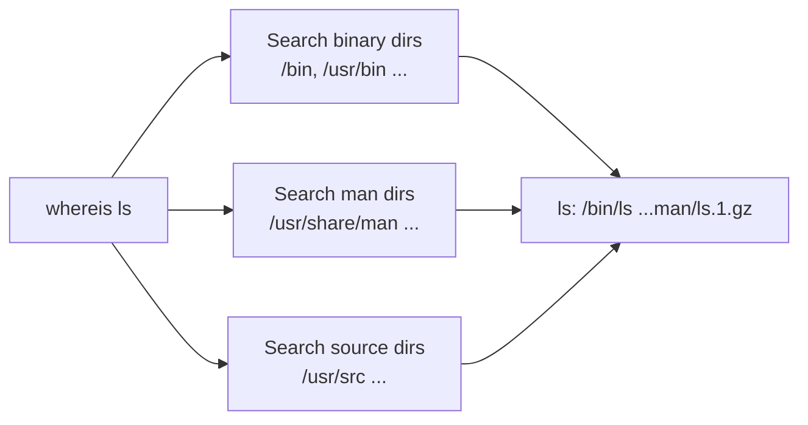

# whereis

## Overview

The `whereis` command locates the **binary**, **source**, and **manual page** files associated with a given command. It is a fast, purpose-built lookup that searches a fixed set of well-known system directories rather than walking the whole filesystem or honouring the interactive `$PATH`.

It is one of several "where does this command live?" tools on Linux. Use it when you want more than just the executable path — for example, to confirm that a package shipped its man pages, or to audit exactly which files a program installed.

> [!NOTE]
> `whereis` answers *"which files on disk belong to this command?"*, whereas `which` answers *"which executable will my shell run?"* and `type` answers *"how will my shell interpret this name?"*.

---

## Concepts

### When to Use `whereis`

| Use Case | Recommended Tool |
|---|---|
| Want binary + source + man page locations | `whereis` |
| Need only the executable location | `which` |
| Need alias / function / builtin detection | `type` |
| Filesystem-wide indexed search | `locate` |
| Real-time filesystem search | `find` |

### How `whereis` Works

`whereis` searches a compiled-in list of standard system paths, including:

- `/bin`
- `/usr/bin`
- `/usr/sbin`
- `/usr/share/man`
- `/usr/src`

Key behaviours:

- It does **not** use the `$PATH` environment variable — it uses its own hard-coded directory list (plus any locations you supply with `-B`, `-M`, `-S`).
- It classifies results into three buckets: **binaries**, **manual pages**, and **source files**.
- It is well suited to locating binaries, source trees, and documentation in one shot.



---

## Commands

### Basic Syntax

```bash
whereis [options] command
```

- Example:

```bash
whereis ls
```

> Example output:

```bash
ls: /bin/ls /usr/share/man/man1/ls.1.gz
```

### Common Options

| Option | Description |
|---|---|
| `-b` | Search binaries only |
| `-m` | Search man pages only |
| `-s` | Search source files only |
| `-u` | Show unusual entries (commands with an unexpected number of results) |
| `-B` | Specify binary search path |
| `-M` | Specify man page search path |
| `-S` | Specify source search path |
| `-f` | Terminate the directory list given to `-B`/`-M`/`-S` |

### Related Commands

| Command | Description |
|---|---|
| `which` | Shows the executable path resolved from `$PATH` |
| `type` | Shows alias, function, builtin, or binary |
| `locate` | Searches an indexed filesystem database |
| `find` | Real-time filesystem search |

---

## Examples

### Common Lookups

- Show the location of the `ls` binary and man page

```bash
whereis ls
```

- Show the location of the `vim` binary, source, and man page

```bash
whereis vim
```

- Show paths related to the `passwd` command

```bash
whereis passwd
```

- Find binary, source, and documentation for `nmap`

```bash
whereis nmap
```

- Show paths related to the `python` binary and documentation

```bash
whereis python
```

- Show binary, man page, and related files for `php`

```bash
whereis php
```

### Search Specific File Types

- Search only binaries

```bash
whereis -b bash
```

- Search only manual pages

```bash
whereis -m bash
```

- Search only source files

```bash
whereis -s bash
```

### Limit Search Results

- Limits output to a single result per category

```bash
whereis -u bash
```

### Search Custom Paths

- Search binaries in specific directories

```bash
whereis -B /usr/bin -f python
```

- Search man pages in custom directories

```bash
whereis -M /usr/share/man -f ls
```

### Useful Practical Examples

- Locate the `gcc` compiler

```bash
whereis gcc
```

- Locate Apache files

```bash
whereis apache2
```

- Locate SSH binaries and man pages

```bash
whereis ssh
```

- Locate MySQL binaries

```bash
whereis mysql
```

### Compare with `which`

- `which`

```bash
which python
```

> Example output:

```bash
/usr/bin/python
```

- `whereis`

```bash
whereis python
```

> Example output:

```bash
python: /usr/bin/python /usr/share/man/man1/python.1.gz
```

> [!NOTE]
> **📸 Screenshot**
> _Capture: Terminal showing whereis python and which python side by side, whereis listing the binary and man page path while which lists only the /usr/bin/python executable_

### Combining `whereis` With Other Tools

- `whereis` + `grep`

```bash
whereis python | grep bin
```

- `whereis` + `awk`

```bash
whereis bash | awk '{print $2}'
```

- `whereis` + `xargs`

```bash
whereis python | awk '{print $2}' | xargs ls -l
```

---

## Best Practices

> [!TIP]
> When scripting, remember the first field of `whereis` output is `command:` — strip it (e.g. `awk '{print $2}'`) before feeding paths to another tool.

- Prefer `whereis` for a quick inventory of what a package installed (binary + docs + source).
- Use `-b` / `-m` / `-s` to narrow output when you only care about one file type.
- For custom install prefixes (e.g. `/opt`, `/usr/local`), pass explicit paths with `-B` / `-M` / `-S`, since `whereis` will not find them otherwise.

---

## Security Considerations

- `whereis` does **not** verify that a returned file is actually executable or trustworthy — it only reports that a file with a matching name exists in a known directory.
- Results vary with installed packages and filesystem layout; absence of a result is not proof a binary is missing (it may live outside the default search paths).
- During an audit, cross-check `whereis` output against `which` and `type` to detect duplicate or shadowing binaries that could indicate PATH manipulation or a planted tool.

---

## Troubleshooting

| Symptom | Likely Cause | Resolution |
|---|---|---|
| Command returns nothing | Binary installed outside default paths (e.g. `/opt`) | Use `whereis -B /opt/app/bin -f <cmd>` or fall back to `find` / `which` |
| No man page listed | Docs package not installed | Install the `-doc`/`man` package; verify with `whereis -m <cmd>` |
| Unexpected extra results | Multiple versions installed | Investigate each with `ls -l`; review `$PATH` ordering |

---

## References

- Help & usage:

```bash
whereis --help
```

- Manual page:

```bash
man whereis
```

---

## Related

- [which](which.md) — resolve a command to the executable that `$PATH` would run.
- [type](type.md) — show how the shell interprets a name (alias, function, builtin, file).
- [locate](locate.md) — database-backed, filesystem-wide file lookup.
- [Find-Command](Find-Command.md) — real-time recursive filesystem search.
- [File-Finding-in-Linux](File-Finding-in-Linux.md) — overview of the file-search tool family.
- [Linux Administration & Server Hardening](../Readme.md) — Linux administration & server hardening hub.
