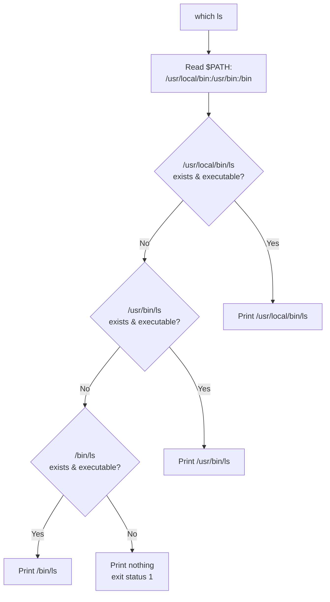

# which

## Overview

The `which` command locates the executable file that the shell would run for a given command name. It walks the directories listed in the `$PATH` environment variable, in order, and prints the full path of the **first** matching executable it finds.

`which` is the quickest way to answer three practical questions: *Is this command installed? Where does it live? Which copy runs when several exist?* Because it consults `$PATH` exactly the way the shell does when it resolves a bare command name, it is a staple of installation checks, troubleshooting broken tooling, and auditing a host's binary layout.

> [!NOTE]
> `which` is an external program that only knows about files on disk. It does **not** see shell aliases, functions, or builtins. To resolve *everything* the shell might run for a name — alias, function, builtin, keyword, or file — use the shell builtin [type](type.md) or the POSIX-portable `command -v`.

---

## Concepts

### How resolution works

When you type a bare command such as `ls`, the shell searches each directory in `$PATH` from left to right and executes the first match. `which` reproduces that search and simply reports the winning path instead of running it.

- Searches only the directories listed in `$PATH`.
- Returns only files that are **executable** by the current user.
- Prints the first match by default; `-a` prints every match, in `$PATH` order.
- Does not inspect aliases or shell functions — those are resolved by the shell before `$PATH` is ever consulted.



### When to use `which`

| Use Case | Use `which`? |
|---|---|
| Check if a command is installed | Yes |
| Find where a command executes from | Yes |
| Check command resolution in `$PATH` | Yes |
| Need alias / function / builtin details | Use [type](type.md) instead |
| Need man page and source locations too | Use [whereis](whereis.md) instead |

---

## Commands

### Basic syntax

```bash
which [command]
```

A minimal lookup:

```bash
which ls
```

Plausible output:

```text
/bin/ls
```

### Options

| Option | Description |
|---|---|
| `-a` | Print **all** matching executables in `$PATH`, not just the first |
| `-h`, `--help` | Show usage help |
| *(no option)* | Print the first match; exit status `1` if nothing is found |

> [!NOTE]
> Option support varies by implementation. The GNU/Debian `which` supports `-a`; some minimal builds (BusyBox) offer a reduced flag set. Run `which --help` on the target host to confirm.

### Help & usage

Show available options:

```bash
which
```

Display help:

```bash
which -h
```

```bash
which --help
```

Read the manual page:

```bash
man which
```

---

## Examples

### Locate common binaries

Full path of the `ls` command:

```bash
which ls
```

Full path of the `vim` editor:

```bash
which vim
```

Full path of the `passwd` command:

```bash
which passwd
```

Full path of the `tree` utility:

```bash
which tree
```

Full path of the `nmap` network scanner:

```bash
which nmap
```

Full path of the `python` binary:

```bash
which python
```

Full path of the `php` interpreter:

```bash
which php
```

### Query several commands at once

Search for multiple commands in a single invocation:

```bash
which bash python perl ruby
```

### Show every match with `-a`

Display all matching executables in `$PATH` — useful when two copies of the same tool are installed and you need to know which one wins:

```bash
which -a python
```

Plausible output:

```text
/usr/bin/python
/bin/python
```

The path printed **first** is the one the shell actually runs.

### Confirm the active shell and Git

Check the current shell executable:

```bash
which bash
```

Find the Git binary location:

```bash
which git
```

### Compare with `type`

`which` looks only at files on disk:

```bash
which ls
```

Plausible output:

```text
/bin/ls
```

[type](type.md) resolves the shell's own view, including aliases:

```bash
type ls
```

Plausible output:

```text
ls is aliased to `ls --color=auto`
```

This difference matters: `which ls` reports the on-disk binary even when your interactive shell would actually run an alias. When behaviour surprises you, cross-check with `type`.

### Inspect the search path

Display the current `$PATH`:

```bash
echo $PATH
```

Plausible output:

```text
/usr/local/bin:/usr/bin:/bin
```

### Combine with other tools

`which` + `xargs` — long-list the resolved binary:

```bash
which python | xargs ls -l
```

`which` + `file` — identify the binary type:

```bash
file $(which bash)
```

`which` + `ldd` — inspect shared-library dependencies of a resolved binary:

```bash
ldd $(which nginx)
```

---

## Related Commands

| Command | Description |
|---|---|
| `type` | Shows whether a name is an alias, function, builtin, or binary (shell builtin) |
| `whereis` | Shows binary, source, and man-page locations |
| `command -v` | POSIX-compliant, script-safe alternative to `which` |

---

## Best Practices

- **Prefer `command -v` in scripts.** `which` is an external program with inconsistent exit-status and output behaviour across distributions; `command -v` is a POSIX builtin, is faster, and behaves predictably in `if` tests.

```bash
if command -v nmap >/dev/null 2>&1; then
    echo "nmap is installed"
fi
```

- **Use `-a` when duplicates are possible.** On hosts with `/usr/local/bin` shadowing `/usr/bin`, `which -a` reveals every candidate so you can confirm which copy takes precedence.
- **Reach for [type](type.md) for interactive debugging.** If a command behaves unexpectedly, `type` shows the alias or function the shell is really using — something `which` cannot see.

> [!TIP]
> Remember the division of labour: `which` = "which file on disk", `type` = "what the shell will actually run", `whereis` = "binary + source + manual". Picking the right one saves troubleshooting time.

---

## Security Considerations

`which` resolves commands exactly the way the shell does, which makes it a useful lens on **`$PATH` hijacking** risk.

- **Beware writable directories in `$PATH`.** If any directory listed in `$PATH` — especially one appearing *before* `/usr/bin` — is writable by unprivileged users, an attacker can drop a malicious binary that shadows a trusted command. This is a classic Linux privilege-escalation vector, particularly dangerous when the affected command is later run by root or a `sudo`/cron job.
- **Audit precedence with `-a`.** `which -a <cmd>` lists every match in search order; the first is the one that executes. Use it to detect a rogue binary sitting ahead of the legitimate one.

```bash
# List every 'ls' on PATH; a match under a user-writable dir is a red flag
which -a ls
```

- **Never put `.` (the current directory) in `$PATH`.** It causes commands to be resolved from whatever directory you happen to be in, letting a planted `./ls` or `./make` run instead of the system tool. CIS Benchmarks explicitly flag empty or `.` entries in root's `$PATH`.
- **Harden the search path.** Keep `$PATH` limited to root-owned, non-world-writable directories, and put system paths ahead of any user paths.

> [!WARNING]
> A `which` result that points into `/tmp`, a home directory, or any world-writable path is a strong indicator of `$PATH` poisoning. Investigate before running the command.

---

## Troubleshooting

| Symptom | Likely cause | Fix |
|---|---|---|
| `which cmd` prints nothing / non-zero exit | Command not installed, or its directory is not in `$PATH` | Install the package, or add the directory to `$PATH` |
| `which` disagrees with what actually runs | An alias or shell function is intercepting the name | Check with `type cmd` |
| Wrong version of a tool runs | A duplicate earlier in `$PATH` shadows it | Run `which -a cmd` and reorder `$PATH` |
| `which: command not found` | `which` itself is absent (minimal container) | Use the builtin `command -v` or `type` instead |

> [!NOTE]
> **📸 Screenshot**
> _Capture: Terminal showing 'which -a python' printing two paths, /usr/bin/python then /bin/python, illustrating PATH precedence between duplicate binaries_

---

## References

- `man 1 which` — manual page for the `which` command.
- POSIX specification for `command -v` — the portable, script-safe alternative.
- CIS Linux Benchmark — guidance on securing root's `$PATH` (no world-writable or `.` entries).

---

## Related

- [Linux Administration & Server Hardening](../Readme.md) — Linux administration & server hardening hub.
- [Readme](../Readme.md) — String Processing and Finding Files module index.
- [type](type.md) — Resolve aliases, functions, builtins, and binaries as the shell sees them.
- [whereis](whereis.md) — Locate the binary, source, and manual page for a command.
- [locate](locate.md) — Find files anywhere on disk via a prebuilt database.
- [Find-Command](Find-Command.md) — Search the filesystem live by name, type, size, and more.
- [File-Finding-in-Linux](File-Finding-in-Linux.md) — Overview of file-location tools in Linux.
