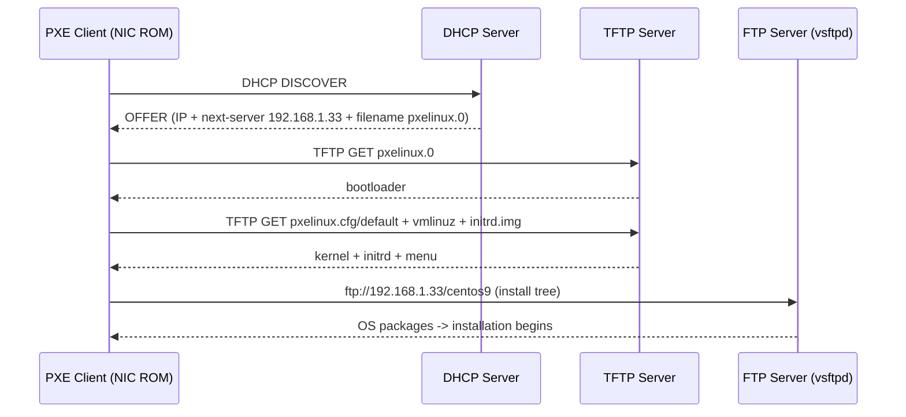

# Preboot eXecution Environment (PXE) Boot Server

## Overview

The **Preboot eXecution Environment (PXE)** lets a client machine boot an operating system entirely from the network, before it has any OS installed on local disk. The client's NIC firmware asks for an IP over **DHCP**, downloads a bootloader and kernel over **TFTP**, then pulls the full installation tree over **FTP** (or HTTP/NFS). This makes PXE the backbone of automated, at-scale OS provisioning in data centers and labs.

This note builds a complete PXE server on **CentOS 9 Stream** that installs CentOS 9 to network clients, combining four services: **DHCP**, **TFTP**, **vsftpd (FTP)**, and **Syslinux** for the boot menu.

> [!NOTE]
> **Roles of each service**
> DHCP hands out the address **and** points the client at the boot file; TFTP delivers the bootloader + kernel; FTP serves the OS install tree; Syslinux provides `pxelinux.0` and the boot menu.

## Architecture

### PXE boot flow



### Service-to-port map

| Service | Package | Port(s) | Role in PXE |
|---|---|---|---|
| DHCP | `dhcp-server` | UDP 67/68 | Assigns IP, sets `next-server` + `filename` |
| TFTP | `tftp-server` | UDP 69 | Serves `pxelinux.0`, kernel, initrd, menu |
| FTP | `vsftpd` | TCP 21 + 55000–55999 (passive) | Serves the OS installation tree |
| Boot menu | `syslinux` | — | Provides `pxelinux.0`, `menu.c32`, etc. |

## Installation

- Install necessary packages:

```bash
yum install dhcp-server vsftpd tftp-server syslinux
```

> No `xinetd` needed. TFTP is managed by `systemd` now.

## Configuration

### 1. DHCP Server Configuration

- Edit `/etc/dhcp/dhcpd.conf`:

```bash
vim /etc/dhcp/dhcpd.conf
```

> Add:

```conf
authoritative;
subnet 192.168.1.0 netmask 255.255.255.0 {
    option routers 192.168.1.1;
    option domain-name-servers 8.8.8.8, 8.8.4.4;
    option broadcast-address 192.168.1.255;
    default-lease-time 60000;
    max-lease-time 720000;
    range 192.168.1.150 192.168.1.200;
    next-server 192.168.1.33;
    filename "pxelinux.0";
}
```

> [!IMPORTANT]
> **The two PXE-critical DHCP options**
> `next-server 192.168.1.33` tells the client which host runs TFTP, and `filename "pxelinux.0"` names the bootloader to fetch. Without both, the client gets an address but never boots. `192.168.1.33` is this PXE server's own IP.

- Enable and restart DHCP server:

```bash
systemctl enable dhcpd
```

> [!WARNING]
> **Never run a rogue DHCP server**
> A second DHCP server on a production LAN will hand out conflicting leases and can black-hole clients. Run this PXE/DHCP host on an isolated provisioning VLAN, or coordinate with the network owner before enabling `dhcpd`.

### 2. FTP Server Configuration

- Edit `/etc/vsftpd/vsftpd.conf`:

```bash
vim /etc/vsftpd/vsftpd.conf
```

> Set:

```conf
anonymous_enable=YES
local_enable=YES
write_enable=YES
listen=YES
listen_ipv6=NO
allow_writeable_chroot=YES
pam_service_name=vsftpd
pasv_enable=YES
pasv_min_port=55000
pasv_max_port=55999
```

- Enable and restart FTP server:

```bash
systemctl enable vsftpd
```

> [!NOTE]
> **Anonymous FTP is deliberate here**
> `anonymous_enable=YES` lets the PXE installer pull packages without credentials. That is acceptable for a read-only install tree on an isolated network, but the anonymous share must expose **only** the OS media — nothing sensitive.

### 3. Prepare Installation Files

- Mount CentOS 9 DVD (or ISO) and copy contents:

```bash
mount /dev/sr0 /mnt/
```

```bash
mkdir -p /var/ftp/centos9/
```

```bash
cp -vr /mnt/* /var/ftp/centos9/
```

```bash
chmod -R 755 /var/ftp/centos9/
```

- Copy boot images to TFTP directory:

```bash
cp -vr /var/ftp/centos9/images/pxeboot /var/lib/tftpboot/images
```

### 4. TFTP Server Configuration

- Since `xinetd` is not used, TFTP is managed via systemd directly.

- Check and edit `/etc/systemd/system/tftp-server.service.d/override.conf` if needed:

```bash
mkdir -p /etc/systemd/system/tftp.service.d/
```

```bash
vim /etc/systemd/system/tftp.service.d/override.conf
```

> Add:

```conf
[Service]
ExecStart=
ExecStart=/usr/sbin/in.tftpd -s /var/lib/tftpboot
```

- Enable and start TFTP server:

```bash
systemctl enable tftp.service
```

> ( If you get a "unit not found" error, enable the socket instead: `systemctl enable --now tftp.socket`.)

> [!TIP]
> **The empty `ExecStart=` is intentional**
> A drop-in override that resets `ExecStart` to empty before setting a new value is the standard `systemd` idiom for **replacing** (not appending to) the unit's command line. Omitting the blank `ExecStart=` would fail with a "multiple ExecStart" error. For the full TFTP unit, see [Trivial-File-Transfer-Protocol(TFTP)-Server](Trivial-File-Transfer-Protocol(TFTP)-Server.md).

### 5. Syslinux for Boot Menu

- Copy PXE boot files:

```bash
cp /usr/share/syslinux/pxelinux.0 /var/lib/tftpboot/
cp /usr/share/syslinux/menu.c32 /var/lib/tftpboot/
cp /usr/share/syslinux/memdisk /var/lib/tftpboot/
cp /usr/share/syslinux/mboot.c32 /var/lib/tftpboot/
cp /usr/share/syslinux/chain.c32 /var/lib/tftpboot/
```

- Create PXE configuration directory:

```bash
mkdir -p /var/lib/tftpboot/pxelinux.cfg/
```

- Create PXE boot menu `/var/lib/tftpboot/pxelinux.cfg/default`:

```bash
vim /var/lib/tftpboot/pxelinux.cfg/default
```

> Content:

```text
default menu.c32
prompt 0
timeout 600
ONTIMEOUT local
menu title ########## PXE Boot Menu ##########

label 1
    menu label ^1) Install CentOS 9
    kernel images/pxeboot/vmlinuz
    append initrd=images/pxeboot/initrd.img method=ftp://192.168.1.33/centos9 devfs=nomount

label 2
    menu label ^2) Boot from local drive
    localboot 0
```

> [!NOTE]
> **📸 Screenshot**
> _Capture: PXE Boot Menu rendered on a client at boot, showing option 1 "Install CentOS 9" and option 2 "Boot from local drive"_

### 6. FirewallD Configuration

- On CentOS 9, use `firewalld` instead of `iptables`.

> Open required ports:

```bash
firewall-cmd --permanent --add-service=dhcp
firewall-cmd --permanent --add-service=ftp
firewall-cmd --permanent --add-service=tftp
firewall-cmd --permanent --add-port=69/udp
firewall-cmd --permanent --add-port=55000-55999/tcp
firewall-cmd --reload
```

| Rule | Covers |
|---|---|
| `--add-service=dhcp` | DHCP (UDP 67/68) |
| `--add-service=ftp` | FTP control channel (TCP 21) |
| `--add-service=tftp` | TFTP (UDP 69) |
| `--add-port=69/udp` | TFTP explicit port (redundant safeguard) |
| `--add-port=55000-55999/tcp` | vsftpd passive-mode data range |

### 7. Final Step: Ensure all services are running

```bash
systemctl restart dhcpd
systemctl restart vsftpd
systemctl restart tftp.service  # or tftp.socket
systemctl restart firewalld
```

- Now your PXE server is ready to serve CentOS 9 Stream!

## Result: What clients receive

When clients boot from PXE, they'll get:

- IP via DHCP
- Bootloader/kernel via TFTP
- OS install files via FTP

## Best Practices

- **Isolate the provisioning network** — run DHCP/TFTP/FTP on a dedicated VLAN so a rogue DHCP server never leaks onto production.
- **Prefer HTTP or NFS for large trees** — FTP works, but HTTP/NFS install sources scale better and are easier to firewall; keep FTP anonymous access read-only.
- **Automate installs with Kickstart** — pass `inst.ks=` in the `append` line to drive fully unattended installs and eliminate manual menu selection.
- **Pin the boot images** — keep `vmlinuz`/`initrd.img` versions matched to the install tree they were copied from to avoid boot failures.
- **Consider UEFI PXE** — `pxelinux.0` is BIOS/legacy; modern UEFI clients need `grub2`/`shim` and a `filename` served via DHCP option architecture matching.

## Security Considerations

- **PXE has no authentication** — any host that can reach the DHCP/TFTP server can boot from it. Segment the network and restrict which MACs receive leases where possible.
- **Anonymous FTP exposes the install tree** — ensure `/var/ftp/centos9` contains only OS media and is read-only; `write_enable=YES` here is for the vsftpd config generally, but the anonymous root must never be writable.
- **Cleartext everywhere** — DHCP, TFTP, and FTP are all unencrypted; an attacker on the segment can observe or tamper with the boot chain (a classic evil-maid / boot-image poisoning vector). Physical and L2 controls (port security, DHCP snooping) matter.
- **Keep SELinux enforcing** — set correct contexts on `/var/lib/tftpboot` and `/var/ftp` rather than disabling SELinux.
- **Firewall least privilege** — only open the passive FTP range you actually configured (`55000-55999`) and scope services to the internal zone.

## Troubleshooting

| Symptom | Likely cause | Fix |
|---|---|---|
| Client gets no IP | `dhcpd` not running or wrong subnet | Check `systemctl status dhcpd`; verify subnet matches the client LAN |
| `PXE-E32` / TFTP timeout | Firewall blocking UDP/69 or wrong `next-server` | Open TFTP; confirm `next-server` = PXE host IP |
| Boots menu but install fails | FTP path/`method=` wrong or passive ports blocked | Verify `ftp://192.168.1.33/centos9` browsable; open `55000-55999/tcp` |
| `unit not found` for tftp | Service unit absent | Enable the socket: `systemctl enable --now tftp.socket` |
| Menu never appears | `pxelinux.0`/`menu.c32` missing from TFTP root | Re-copy Syslinux files into `/var/lib/tftpboot/` |

## References

- Red Hat / CentOS — Preparing for a Network Installation (PXE)
- Syslinux / PXELINUX project documentation
- `man dhcpd.conf`, `man vsftpd.conf`, `man in.tftpd`
- RFC 1350 (TFTP), RFC 2131 (DHCP)

## Related

- [Trivial-File-Transfer-Protocol(TFTP)-Server](Trivial-File-Transfer-Protocol(TFTP)-Server.md) — PXE delivers boot files over TFTP
- [TFTP-Client](TFTP-Client.md) — verify the TFTP leg of the boot chain from a client
- [DHCP-Server](../Dynamic-Host-Configuration-Protocol-DHCP/DHCP-Server.md) — PXE relies on DHCP `next-server` / `filename` options
- [Network-File-System-(NFS)-Server](../NFS-Server/Network-File-System-(NFS)-Server.md) — NFS root as an alternative network-install source
- [Linux Administration & Server Hardening](../Readme.md) — course hub
