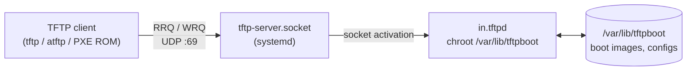

# Trivial File Transfer Protocol (TFTP) Server

## Overview

The **Trivial File Transfer Protocol (TFTP)** is a lightweight, connectionless file-transfer protocol that runs over **UDP port 69**. It has no authentication, no directory listing, and no encryption — by design it does the absolute minimum needed to move a file between two hosts. That minimalism is exactly why it remains the workhorse for **network booting (PXE)**, pushing firmware to routers and switches, and backing up device configurations.

This note covers installing and configuring a TFTP server on **RHEL / CentOS (Stream 9)**, wiring it up under `systemd` socket activation, opening the firewall, and confirming the daemon is listening.

> [!WARNING]
> **TFTP is unauthenticated and cleartext**
> TFTP transmits every byte in the clear and performs no client authentication. Treat any TFTP server as a public read surface on its subnet. Never expose it to untrusted networks, never store secrets in the TFTP root, and disable write (`-c`) unless you specifically need uploads.

## Concepts

| Property | TFTP | FTP / SFTP |
|---|---|---|
| Transport | UDP/69 | TCP/21 (FTP), TCP/22 (SFTP) |
| Authentication | None | Username/password (or keys) |
| Directory listing | Not supported | Supported |
| Encryption | None | SFTP is encrypted |
| Typical use | PXE boot, firmware, config backup | General file transfer |
| Daemon (RHEL) | `in.tftpd` | `vsftpd`, `sshd` |

The reference daemon on RHEL/CentOS is **`in.tftpd`**, shipped in the `tftp-server` package. It is almost always launched by **`systemd` socket activation**: a `.socket` unit listens on UDP/69 and spawns `in.tftpd` on demand, so no long-running daemon is needed.

### Common `in.tftpd` flags

| Flag | Meaning |
|---|---|
| `-s <dir>` | Change root (`chroot`) to the given TFTP directory (default `/var/lib/tftpboot`) |
| `-c` | Allow creation of new files (enable **uploads / PUT**) |
| `-p` | Perform no additional permission checks beyond the OS (rely on filesystem perms) |
| `-v` | Verbose logging (repeat for more detail) |
| `-l` | Run standalone (listen) instead of under socket activation |

## Architecture



## Package Verification And Installation

- Check if the `tftp` client or server is already installed:

```bash
rpm -qa | grep tftp
```

- Install both the TFTP client and server:

```bash
yum install tftp tftp-server
```

## TFTP Package Information

Query RPM to understand exactly what the package ships before configuring it.

| Command | Purpose |
|---|---|
| `rpm -qi tftp-server` | Package metadata (version, license, summary) |
| `rpm -ql tftp-server` | List every file installed by the package |
| `rpm -qc tftp-server` | Show configuration files |
| `rpm -qd tftp-server` | Show documentation files |

- View details about the installed TFTP server package:

```bash
rpm -qi tftp-server
```

- List all files installed by the `tftp-server` package:

```bash
rpm -ql tftp-server
```

- Display the configuration files:

```bash
rpm -qc tftp-server
```

- Show documentation files provided by the package:

```bash
rpm -qd tftp-server
```

## Directory Setup For TFTP Boot

The default TFTP root — the directory `in.tftpd` chroots into — is `/var/lib/tftpboot/`.

- Navigate to the default TFTP root directory:

```bash
cd /var/lib/tftpboot/
```

- Check if the directory exists:

```bash
ls -lha /var/lib/ | grep "tftpboot"
```

- Copy test files, such as logs, into the TFTP root directory:

```bash
cp -v /var/log/* /var/lib/tftpboot/
```

- Set full permissions on the directory (for testing purposes only, not recommended for production):

```bash
chmod -R 777 /var/lib/tftpboot/
```

> [!WARNING]
> **`chmod 777` is for lab testing only**
> World-writable `777` on the TFTP root is convenient in a lab but is a serious misconfiguration in production. Grant the minimum required permissions instead — read-only (`755`, owned by `root`) for a download-only server, and a narrowly-scoped writable subdirectory only if uploads are truly needed. This aligns with CIS Benchmark least-privilege guidance for shared directories.

## Configuration

TFTP on modern RHEL/CentOS is managed entirely through `systemd` socket activation rather than the legacy `xinetd` super-server. The pattern below copies the stock units to custom `tftp-server.*` names so the defaults remain untouched.

### Systemd Configuration For TFTP

- Copy the default systemd service and socket unit files to the custom path:

```bash
cp -v /usr/lib/systemd/system/tftp.service /etc/systemd/system/tftp-server.service
```

```bash
cp -v /usr/lib/systemd/system/tftp.socket /etc/systemd/system/tftp-server.socket
```

- Review the TFTP daemon documentation:

```bash
man in.tftpd
```

### TFTP Server Service File (tftp-server.service)

```bash
vim /etc/systemd/system/tftp-server.service
```

```systemd
[Unit]
Description=Tftp Server
Requires=tftp-server.socket
Documentation=man:in.tftpd

[Service]
ExecStart=/usr/sbin/in.tftpd -c -p -s /var/lib/tftpboot
StandardInput=socket

[Install]
WantedBy=multi-user.target
Also=tftp-server.socket
```

> [!NOTE]
> The `ExecStart` line uses `-c -p -s`: `-c` permits file **creation** (uploads), `-p` skips extra permission checks, and `-s /var/lib/tftpboot` chroots into the TFTP root. Drop `-c` on a download-only server to prevent writes.

### TFTP Server Socket File (tftp-server.socket)

```bash
vim /etc/systemd/system/tftp-server.socket
```

```systemd
[Unit]
Description=Tftp Server Activation Socket

[Socket]
ListenDatagram=69
BindIPv6Only=both

[Install]
WantedBy=sockets.target
```

## Commands

### Starting And Enabling The TFTP Server

- Restart the TFTP socket to activate the service:

```bash
systemctl restart tftp-server.socket
```

- Enable the service to start on boot:

```bash
systemctl enable tftp-server
```

## Firewall Configuration Using Firewalld

- Check if `firewalld` is active:

```bash
systemctl status firewalld
```

- Start and enable `firewalld` if not running:

```bash
systemctl start firewalld
```

```bash
systemctl enable firewalld
```

- Add the TFTP service to the public zone permanently:

```bash
firewall-cmd --zone=public --add-service=tftp --permanent
```

> Or open UDP port 69 directly:

```bash
firewall-cmd --zone=public --add-port=69/udp --permanent
```

- Reload the firewall configuration:

```bash
firewall-cmd --reload
```

- Verify the rule is applied:

```bash
firewall-cmd --zone=public --list-all
```

> [!TIP]
> **Scope the rule to a trusted zone**
> The commands above open TFTP in the `public` zone. On a segmented network, bind the interface serving PXE/TFTP to an `internal` zone and add the service there so TFTP is never reachable from the public-facing interface.

## Verifying TFTP Server Status

- Use `netstat` or `ss` to confirm that TFTP is listening on UDP port 69:

```bash
netstat -nltup | grep 69
```

> Or with `ss`:

```bash
ss -uln | grep 69
```

> You should see `in.tftpd` listening on `0.0.0.0:69` or `[::]:69`.

> [!NOTE]
> **📸 Screenshot**
> _Capture: Terminal output of `ss -uln | grep 69` showing the TFTP daemon bound to UDP port 69 on 0.0.0.0 and [::]_

## Security Considerations

- **No authentication or encryption** — never place TFTP on an internet-facing or untrusted interface. Restrict it to the provisioning VLAN with firewall zones.
- **Disable uploads when unneeded** — remove the `-c` flag from `ExecStart` so the server is strictly read-only, closing the write vector.
- **Least-privilege permissions** — keep the TFTP root owned by `root` and world-readable only (e.g. `755`); avoid `777`. Store nothing sensitive under `/var/lib/tftpboot`.
- **SELinux enforcing** — keep SELinux in enforcing mode with the correct `tftpdir_t` / `public_content_t` contexts rather than disabling it.
- **Chroot confinement** — always run with `-s <dir>` so a client cannot request paths outside the TFTP root via directory traversal.
- **Audit access** — enable verbose logging (`-v`) and monitor `journalctl -u tftp-server` for unexpected read/write requests.

## Troubleshooting

| Symptom | Likely cause | Fix |
|---|---|---|
| Client times out | Firewall blocking UDP/69 | Add the `tftp` service or port `69/udp` in `firewalld` and reload |
| `Permission denied` on GET | File not world-readable or wrong SELinux context | `chmod` the file; `restorecon -Rv /var/lib/tftpboot` |
| `Access violation` on PUT | Server started without `-c`, or dir not writable | Add `-c` to `ExecStart`; grant write on a scoped subdir |
| `unit not found` for service | Custom unit not reloaded | `systemctl daemon-reload`, then restart the `.socket` |
| Nothing listening on :69 | Socket not started/enabled | `systemctl restart tftp-server.socket` |

```bash
# Watch TFTP traffic live to confirm requests reach the server
tcpdump -i any port 69 -n
```

## References

- `man in.tftpd` — TFTP server daemon manual
- RFC 1350 — The TFTP Protocol (Revision 2)
- Red Hat Enterprise Linux — Network Boot / TFTP documentation
- CIS Red Hat Enterprise Linux Benchmark — service hardening and least-privilege guidance

## Related

- [TFTP-Client](TFTP-Client.md) — client side of TFTP (`tftp` / `atftp` GET & PUT operations)
- [Preboot-eXecution-Environment(PXE)-Boot-Server](Preboot-eXecution-Environment(PXE)-Boot-Server.md) — PXE relies on this TFTP server to deliver boot files
- [DHCP-Server](../Dynamic-Host-Configuration-Protocol-DHCP/DHCP-Server.md) — DHCP `next-server`/`filename` options point clients at this TFTP server
- [Network-File-System-(NFS)-Server](../NFS-Server/Network-File-System-(NFS)-Server.md) — alternative install source for network provisioning
- FTP-Enumeration — closest file-transfer enumeration hub
- [Linux Administration & Server Hardening](../Readme.md) — course hub
