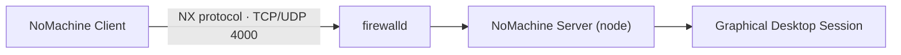

# NoMachine

## Overview

NoMachine is a high-performance, proprietary remote-desktop platform built on the **NX** protocol. Compared with traditional VNC or RDP, its adaptive compression and low-latency transport deliver a noticeably smoother experience over both LAN and high-latency WAN links, making it a common choice for remote graphical administration of Linux hosts.

This note covers installing the NoMachine server package, confirming that its listener is active, and opening the required firewall port with `firewalld` — including a hardened, source-restricted rule.

> [!NOTE]
> NoMachine listens on **TCP/UDP port 4000** by default (the NX protocol port). Both transports should be permitted for full functionality.

## Concepts

| Term | Description |
|:--|:--|
| NX protocol | The low-bandwidth remote-display protocol NoMachine is built on. |
| Port 4000 | Default listening port for the NoMachine server (TCP and UDP). |
| Node / server | The host running the NoMachine service that clients connect to. |
| Client | The NoMachine viewer used to reach the server. |

## Architecture

The client speaks the NX protocol to the server over port 4000; `firewalld` gates that traffic, and the NoMachine node attaches the connection to a graphical desktop session.



## Installation

Download the NoMachine server package and install it. On RPM-based distributions you can install the downloaded `.rpm` directly.

- Fetch the server package:

```bash
wget https://download.nomachine.com/download/8.16/Linux/nomachine_8.16.1_1_x86_64.rpm
```

- Install it with the package manager (resolves dependencies automatically):

```bash
yum install ./nomachine_8.16.1_1_x86_64.rpm
```

- Alternatively, install a downloaded `.rpm` directly with `rpm`:

```bash
rpm -ivh nomachine_7.6.2_4_x86_64.rpm
```

> [!TIP]
> Always fetch the current package version and matching architecture from the [official NoMachine download page](https://www.nomachine.com/). Packages are available for Linux, Windows, and macOS.

## Commands

### Verify the service

Confirm NoMachine is listening on port 4000:

```bash
netstat -nltup | grep 4000
```

## Configuration

### Firewall

NoMachine requires both the TCP and UDP variants of port 4000 to be open in `firewalld`.

- Open port 4000/tcp permanently:

```bash
firewall-cmd --permanent --add-port=4000/tcp
```

- Open port 4000/udp permanently:

```bash
firewall-cmd --permanent --add-port=4000/udp
```

- Reload `firewalld` to apply the changes:

```bash
firewall-cmd --reload
```

- (Optional) Verify the port is open:

```bash
firewall-cmd --list-ports
```

> You should see `4000/tcp` in the list.

## Best Practices

- Keep the NoMachine server package patched — apply vendor updates promptly.
- Enforce strong, unique per-user credentials on every account that can log in.
- Restrict the listener to trusted source networks rather than opening it broadly.
- Prefer a VPN or SSH tunnel for any access that crosses an untrusted network.
- Disable or stop the service when remote graphical access is not required.

## Security Considerations

Opening a remote-desktop port to the whole network broadens your attack surface. Restrict access to known, trusted clients wherever possible.

- Limit port 4000 to a single trusted source IP with a `firewalld` rich rule:

```bash
firewall-cmd --permanent --add-rich-rule='rule family="ipv4" source address="192.168.1.100/32" port protocol="tcp" port="4000" accept'
```

```bash
firewall-cmd --reload
```

> (Replace `192.168.1.100` with your allowed client's IP address.)

> [!WARNING]
> Never expose NoMachine directly to the public internet. Prefer a VPN or an SSH tunnel for remote access across untrusted networks, keep the server package patched, and enforce strong per-user credentials.

## References

| Resource | Description |
|:--|:--|
| [NoMachine downloads](https://www.nomachine.com/) | Official server and client packages for Linux, Windows, and macOS. |
| NX protocol | Adaptive remote-display protocol underpinning NoMachine. |

## Related
- [Remote-Desktop-Setup](Remote-Desktop-Setup.md) — remote-desktop setup overview
- [VNC-Server](VNC-Server.md) — sibling remote-desktop service
- [XRDP-Server-Configuration](XRDP-Server-Configuration.md) — sibling RDP-based remote desktop
- RDP-Enumeration — attacker-side remote-desktop recon
- [Linux Administration & Server Hardening](../Readme.md) — course hub
