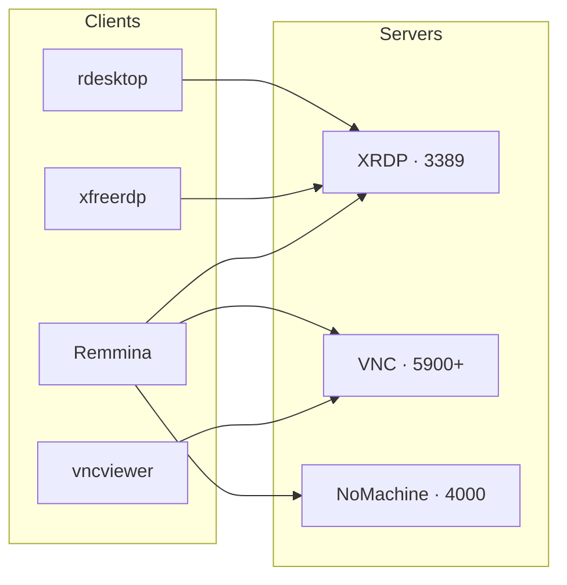

# Remote Desktop Setup

## Overview

Remote desktop access lets an administrator drive a machine's **graphical** session from another host — invaluable for managing GUI-only applications, desktop environments, and workstations. This note surveys the common **server** options on Linux (XRDP, VNC, NoMachine) and the **client** tools used to reach them (`rdesktop`, `xfreerdp`, `vncviewer`, Remmina), with installation steps for RPM-, Debian-, and Arch-based distributions.

Each server has a companion note in this module with full configuration detail; this page is the map that ties them together.

## Concepts

### Server Options

| Server | Protocol | Notes |
|:--|:--|:--|
| **XRDP** | RDP (3389) | Open-source RDP server; connect with Windows' built-in Remote Desktop Connection or any RDP client. |
| **VNC** | RFB (5900+) | Graphical desktop sharing. Several implementations exist: `tigervnc`, `tightvnc`, `realvnc`. |
| **NoMachine** | NX (4000) | High-performance proprietary server; optimized for both LAN and WAN, smoother than plain VNC/RDP. |

### Client Options

| Client | Protocols | Strengths |
|:--|:--|:--|
| `rdesktop` | RDP | Lightweight, simple RDP client. |
| `xfreerdp` | RDP | Modern, feature-rich RDP client (clipboard, audio, drive/USB redirection). |
| `vncviewer` | VNC/RFB | Connects to any VNC server. |
| Remmina | RDP, VNC, NX, XDMCP, SSH | GUI client with saved connection profiles; great for many hosts. |



## Client Installation & Usage

### rdesktop

> [!NOTE]
> `rdesktop` is a lightweight and simple RDP client for Linux. It connects to Windows systems or any server supporting RDP.

- First, install the EPEL (Extra Packages for Enterprise Linux) repository:

```bash
yum -y install epel-release
```

- Download and install the Nux Dextop repository which includes `rdesktop`:

```bash
rpm -Uvh http://li.nux.ro/download/nux/dextop/el7/x86_64/nux-dextop-release-0-5.el7.nux.noarch.rpm
```

- After setting up the repositories, install `rdesktop`:

```bash
yum install rdesktop
```

- To connect to a remote desktop using just an IP address:

```bash
rdesktop 192.168.1.71
```

- To connect specifying a username and password:

```bash
rdesktop 192.168.1.71 -u administrator -p 123
```

> Example:
> IP address: `192.168.1.71`
> Username: `administrator`
> Password: `123`

### xfreerdp

> [!NOTE]
> **xfreerdp** is a modern and feature-rich Remote Desktop Protocol (RDP) client for Linux. It supports various RDP features and provides additional flexibility.

- To install **xfreerdp** on CentOS/RHEL, enable the **EPEL** repository first, then install **freerdp**:

> On CentOS/RHEL

```bash
yum install epel-release
```

```bash
yum install freerdp
```

```bash
dnf install freerdp
```

- To install **xfreerdp** on Ubuntu or Debian, use **APT**:

> On Ubuntu/Debian

```bash
apt update
```

```bash
apt install freerdp2-x11
```

- On Arch Linux, install **xfreerdp** from the official repositories:

> On Arch Linux

```bash
pacman -S freerdp
```

- The basic syntax for running **xfreerdp** is:

```bash
xfreerdp [options] /u:<username> /p:<password> /v:<server_address>
```

```bash
xfreerdp /u:administrator /p:123 /v:192.168.1.71
```

> `/u:` = Username
> `/p:` = Password
> `/v:` = Server address (IP or hostname)

#### Fullscreen Mode

- To launch **xfreerdp** in **fullscreen** mode, use the `+f` option:

```bash
xfreerdp /u:administrator /p:123 /v:192.168.1.71 +f
```

> `+f`: Forces **xfreerdp** to enter fullscreen mode.

#### Set Screen Resolution

- To set a specific screen resolution for the remote session, use the `/size` option:

```bash
xfreerdp /u:administrator /p:123 /v:192.168.1.71 +f /size:1920x1080
```

> `/size:1920x1080`: Sets the resolution to Full HD (1920x1080).
> You can adjust the resolution as needed, e.g., `1366x768`, `1280x720`, etc.

#### Redirect Local Drives

- To redirect your local drives to the remote session, use the `/drive` option:

```bash
xfreerdp /u:administrator /p:123 /v:192.168.1.71 +f /drive:/opt/share
```

> `/drive:<local_path>`: Redirects a local directory to the remote session.

#### Redirect Local Clipboard

- To enable clipboard sharing between local and remote systems:

```bash
xfreerdp /u:administrator /p:123 /v:192.168.1.71 +f +clipboard
```

> `+clipboard`: Enables clipboard redirection, allowing you to copy and paste between local and remote systems.

#### Redirect Local Audio

- To redirect local audio to the remote session, use the `/audio` option:

```bash
xfreerdp /u:administrator /p:123 /v:192.168.1.71 +f +audio
```

> `+audio`: Redirects audio from the remote desktop to the local machine.

#### Redirect USB Devices

- To redirect USB devices (such as a USB mouse or USB storage), use the `/usb` option:

```bash
xfreerdp /u:administrator /p:123 /v:192.168.1.71 +f +usb
```

> `+usb`: Enables USB redirection.

#### Disable TLS Security

- If you're connecting to a server that doesn't support modern encryption, use the `/sec` option to change the security mode:

```bash
xfreerdp /u:administrator /p:123 /v:192.168.1.71 +f /sec:rdp
```

> `/sec:rdp`: Forces **xfreerdp** to use RDP (older, less secure) security mode instead of the default TLS.

> [!WARNING]
> `/sec:rdp` falls back to legacy, weak RDP security. Use it only against isolated lab hosts that cannot negotiate TLS — never across untrusted networks.

#### Use Network Level Authentication (NLA)

- If the remote server requires **NLA** (Network Level Authentication), ensure TLS is enabled:

```bash
xfreerdp /u:administrator /p:123 /v:192.168.1.71 +f +tls
```

> `+tls`: Forces the use of **TLS** encryption for **secure connections** (often required by newer servers).

#### Quick Summary

| Option | Description | Example |
|:--|:--|:--|
| `+f` | Fullscreen mode | `xfreerdp /u:administrator /p:123 /v:192.168.1.71 +f` |
| `/size:` | Set screen resolution | `xfreerdp /u:administrator /p:123 /v:192.168.1.71 +f /size:1920x1080` |
| `+clipboard` | Redirect clipboard | `xfreerdp /u:administrator /p:123 /v:192.168.1.71 +f +clipboard` |
| `+audio` | Redirect audio | `xfreerdp /u:administrator /p:123 /v:192.168.1.71 +f +audio` |
| `/drive:` | Redirect local drive | `xfreerdp /u:administrator /p:123 /v:192.168.1.71 +f /drive:/home/administrator/Documents` |
| `/sec:rdp` | Use RDP security | `xfreerdp /u:administrator /p:123 /v:192.168.1.71 +f /sec:rdp` |
| `+usb` | Redirect USB devices | `xfreerdp /u:administrator /p:123 /v:192.168.1.71 +f +usb` |

### vncviewer

> [!NOTE]
> `vncviewer` is a client application used to connect to VNC servers. Common implementations include `tigervnc-viewer`, `realvnc`, and `tightvnc`.

- Install the TigerVNC client:

> Install vncviewer On CentOS/RHEL

```bash
yum install tigervnc
```

- Install the VNC viewer on Ubuntu or Debian systems:

> Install vncviewer On Debian/Ubuntu

```bash
apt install tigervnc-viewer
```

- Connect to a VNC server by specifying its IP address and display/port (default VNC port is 5901):

```bash
vncviewer 192.168.1.71:1
```

### Remmina

> [!TIP]
> Remmina is a modern, feature-rich remote desktop client supporting RDP, VNC, NX, XDMCP, and SSH. It is highly recommended for managing multiple connections and saved profiles.

- Install Remmina using YUM:

> Install Remmina On CentOS/RHEL

```bash
yum install remmina
```

- Install Remmina using APT:

> Install Remmina On Debian/Ubuntu

```bash
apt install remmina
```

- After installation, launch Remmina from the terminal:

```bash
remmina
```

> Or find it in your desktop environment's application menu.

> [!NOTE]
> **📸 Screenshot**
> _Capture: Remmina main window showing a list of saved RDP and VNC connection profiles with a New connection button_

## Best Practices

- **Firewall settings**: ensure your firewall allows connections on RDP (port `3389`) and VNC (ports `5900+`).
- **SSH tunneling**: for secure VNC or RDP sessions over the internet, tunnel the session through SSH rather than exposing the raw port.
- **Session management**: clients like Remmina let you save multiple remote sessions for quick access.
- **NoMachine installation**: NoMachine can be downloaded from the [official website](https://www.nomachine.com/) and is available for Linux, Windows, and macOS.

> Example of installing NoMachine on Linux:

```bash
wget https://download.nomachine.com/download/8.10/Linux/nomachine_8.10.1_1_x86_64.rpm
```

```bash
rpm -i nomachine_8.10.1_1_x86_64.rpm
```

## Security Considerations

> [!WARNING]
> RDP and VNC are frequent targets for brute-force and exploitation. Do not expose ports `3389` or `5900+` directly to the internet. Restrict access with a firewall allow-list or VPN, wrap sessions in an SSH tunnel, and enforce strong, unique credentials.

## Related
- [VNC-Server](VNC-Server.md) — VNC remote-desktop server setup
- [XRDP-Server-Configuration](XRDP-Server-Configuration.md) — RDP remote-desktop server setup
- [NoMachine](NoMachine.md) — NoMachine (NX) remote-desktop server setup
- RDP-Enumeration — enumerating remote-desktop services
- [Linux Administration & Server Hardening](../Readme.md) — course hub
