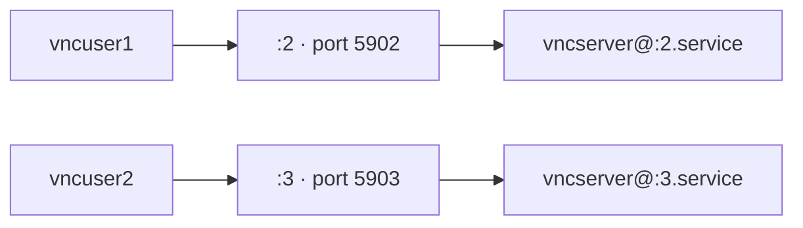

# VNC Server

## Overview

VNC (Virtual Network Computing) shares a graphical desktop over the network using the RFB protocol. On RPM-based distributions, **TigerVNC** is the standard implementation. This note walks through installing TigerVNC server, provisioning per-user VNC sessions, wiring each session to a display number via systemd template units, and opening the required firewall and SELinux paths.

Each user gets a dedicated display (`:2`, `:3`, …) which maps to a TCP port in the `5900 + display` range — for example display `:2` listens on **5902** and display `:3` on **5903**.

> [!NOTE]
> VNC on its own is not encrypted. For access beyond a trusted LAN, tunnel the session through SSH or a VPN.

## Concepts

| Term | Meaning |
|:--|:--|
| Display number | Per-session identifier (`:2`, `:3`, …); one session per user. |
| Port mapping | `5900 + display` — `:2` → `5902`, `:3` → `5903`. |
| `vncserver.users` | Maps display numbers to usernames (`/etc/tigervnc/vncserver.users`). |
| Template unit | `vncserver@:<display>.service` — one systemd instance per display. |
| VNC password | Per-user session password, separate from the Linux login password. |



## Installation

- Check if any VNC packages are already installed:

```bash
rpm -qa | grep vnc
```

- Verify SELinux status:

```bash
sestatus
```

- Install the TigerVNC server and necessary fonts. The `xorg-x11-fonts-Type1` package ensures compatibility with graphical sessions:

```bash
yum install tigervnc-server xorg-x11-fonts-Type1
```

- Install all packages related to `tigervnc`:

```bash
yum install tigervnc*
```

- Inspect the installed server package:

```bash
rpm -qi tigervnc-server
```

- Display the documentation shipped with `tigervnc-server`:

```bash
rpm -qd tigervnc-server
```

- List all the files installed by `tigervnc-server`:

```bash
rpm -ql tigervnc-server
```

- Display configuration files related to `tigervnc-server`:

```bash
rpm -qc tigervnc-server
```

## Create VNC Users

- Create new users that will access the VNC sessions:

```bash
useradd vncuser1
```

```bash
useradd vncuser2
```

- Set login passwords for the created users:

```bash
passwd vncuser1
```

```bash
passwd vncuser2
```

## Set VNC Passwords for the Users

> Switch to each user account and set an individual VNC session password.

- Switch to `vncuser1`:

```bash
su - vncuser1 -c "vncserver :2 -geometry 1920x1080 -depth 24"
```

- Switch to `vncuser2`:

```bash
su - vncuser2 -c "vncserver :3 -geometry 1920x1080 -depth 24"
```

## Configure VNC Users and Display Numbers

- Edit the `/etc/tigervnc/vncserver.users` file to map display numbers to users:

```bash
vim /etc/tigervnc/vncserver.users
```

> Example content:

```text
# TigerVNC user assignment
# VNC Server
# This file assigns users to specific VNC display numbers.
# The syntax is <display>=<username>. E.g.:
#
# :2=andrew
# :3=lisa
:2=vncuser1
:3=vncuser2
```

> Each display number (`:2`, `:3`, etc.) maps to a different user session.

## Create and Configure VNC systemd Service Files

- Confirm the shipped template unit exists:

```bash
ls -lh /lib/systemd/system/vncserver@.service
```

- Create and edit `/etc/systemd/system/vncserver@:2.service`:

```bash
vim /etc/systemd/system/vncserver@:2.service
```

> Example content:

```systemd
[Unit]
Description=Remote Desktop Service (VNC)
After=syslog.target network.target

[Service]
Type=forking
User=vncuser1
PAMName=system-auth
PIDFile=/home/vncuser1/.vnc/%H%i.pid
ExecStart=/usr/bin/vncserver -fg -geometry 1920x1080 -depth 24 :2
ExecStop=/usr/bin/vncserver -kill :2

[Install]
WantedBy=multi-user.target
```

- Copy the service file for the second user:

```bash
	cp -v /etc/systemd/system/vncserver@:2.service /etc/systemd/system/vncserver@:3.service
```

```bash
vim /etc/systemd/system/vncserver@:3.service
```

> Edit `/etc/systemd/system/vncserver@:3.service` to reflect `vncuser2` and display `:3`.
> Example content:

```systemd
[Unit]
Description=Remote Desktop Service (VNC)
After=syslog.target network.target

[Service]
Type=forking
User=vncuser2
PAMName=system-auth
PIDFile=/home/vncuser2/.vnc/%H%i.pid
ExecStart=/usr/bin/vncserver -fg -geometry 1920x1080 -depth 24 :3
ExecStop=/usr/bin/vncserver -kill :3

[Install]
WantedBy=multi-user.target
```

## Set Permissions, Reload systemd, Enable and Start Services

- Set correct permissions for the service files:

```bash
chmod 755 /etc/systemd/system/vncserver@:2.service /etc/systemd/system/vncserver@:3.service
```

- Reload the systemd manager configuration:

```bash
systemctl daemon-reload
```

- Enable and start the VNC services for each display.

> Enable and start the service for `vncuser1`:

```bash
systemctl enable vncserver@:2.service
```

```bash
systemctl start vncserver@:2.service
```

> Enable and start the service for `vncuser2`:

```bash
systemctl enable vncserver@:3.service
```

```bash
systemctl start vncserver@:3.service
```

## Verify VNC Services and Network Ports

- Check the service logs for any issues:

```bash
journalctl -u vncserver@:2.service
```

- Check if the VNC server is listening on the correct port:

```bash
netstat -nltup | grep 5902
```

- List all ports related to VNC services:

```bash
netstat -nltp | grep 5903
```

## Firewall and SELinux Considerations

> If you are running a firewall, you must allow the VNC ports (`5901`, `5902`, etc.).

- Open the VNC ports permanently:

```bash
firewall-cmd --permanent --add-port=5901-5910/tcp
firewall-cmd --reload
```

> If SELinux is enforcing and interferes with VNC, you may need to label the ports or adjust contexts.

- Example (for learning, not a complete fix):

```bash
semanage port -a -t vnc_port_t -p tcp 5901-5910
```

- Install `policycoreutils-python` if the `semanage` command is not found:

```bash
yum install policycoreutils-python
```

## Connect Using VNC Viewer

- You can use any VNC viewer application to connect to your server.

> Example to view help options:

```bash
vncviewer -h
```

- Connect to the server by specifying the IP address and port number:

```bash
vncviewer 192.168.1.33:5903
```

> Replace `192.168.1.33` with your actual server IP address and ensure the client machine has access.

> [!NOTE]
> **📸 Screenshot**
> _Capture: TigerVNC viewer displaying the remote GNOME desktop of vncuser2 on display :3_

## Troubleshooting

| Symptom | Check |
|:--|:--|
| Session fails to start | Inspect `/home/<username>/.vnc/*.log` for errors. |
| Password/session missing | Ensure each user has a `.vnc` directory in their home folder. |
| Server not running | Confirm processes with `ps aux | grep vnc`. |
| Cannot reach server | Confirm hostname resolution and firewall policies between client and server. |

- Check per-session logs:

```bash
ls /home/username/.vnc/
```

- Confirm running server processes:

```bash
ps aux | grep vnc
```

## Related
- [Remote-Desktop-Setup](Remote-Desktop-Setup.md) — remote-desktop setup overview
- [XRDP-Server-Configuration](XRDP-Server-Configuration.md) — sibling RDP remote desktop
- [NoMachine](NoMachine.md) — sibling remote-desktop service
- VNC-Enumeration — attacker-side VNC recon
- [Linux Administration & Server Hardening](../Readme.md) — course hub
