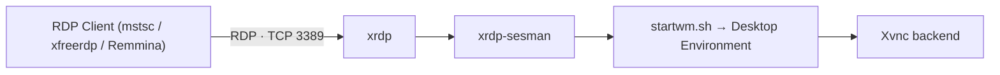

# XRDP Server Configuration

## Overview

XRDP is an open-source implementation of Microsoft's **Remote Desktop Protocol (RDP)** for Linux. It lets users reach a Linux graphical session (listening on TCP port **3389**) from any RDP client — including Windows' built-in Remote Desktop Connection (`mstsc`), `rdesktop`, `xfreerdp`, or Remmina.

This guide covers installing a desktop environment and XRDP on an RPM-based distribution, tuning its SSL/TLS protocols, fixing the common post-login black-screen issue, opening the firewall, applying the required SELinux policy, connecting from clients, and troubleshooting.

> [!NOTE]
> XRDP bridges an RDP client to a local X session (typically via an internal Xvnc backend). A graphical environment must be installed for sessions to render.

## Concepts

| Item | Value / Meaning |
|:--|:--|
| Protocol | RDP (Remote Desktop Protocol) |
| Port | 3389/TCP |
| Server package | `xrdp` |
| Session manager | `xrdp-sesman` (authenticates and spawns the desktop session) |
| Session script | `/etc/xrdp/startwm.sh` (launches the window manager / desktop) |
| Main config | `/etc/xrdp/xrdp.ini` |

## Architecture

An RDP client connects to `xrdp` on port 3389; `xrdp` hands authentication to `xrdp-sesman`, which starts a desktop session via `startwm.sh` and attaches it through an Xvnc backend.



## Install GUI Environment (Required for XRDP)

XRDP needs a graphical desktop to serve. Install one first:

```bash
yum groupinstall "Server with GUI"
```

- Set the system to boot with graphical mode (optional):

```bash
systemctl set-default graphical.target
```

## XRDP Installation & Verification

- Check if XRDP is installed:

```bash
rpm -qa | grep xrdp
```

- Install XRDP:

```bash
yum install xrdp
```

- Verify installation again:

```bash
rpm -qa | grep xrdp
```

- Get package details:

```bash
rpm -qi xrdp
```

- List files installed by XRDP:

```bash
rpm -ql xrdp
```

- Show XRDP configuration files:

```bash
rpm -qc xrdp
```

- Show XRDP documentation:

```bash
rpm -qd xrdp
```

## Configuration

### Configure XRDP SSL Protocols

- Edit the configuration file:

```bash
vim /etc/xrdp/xrdp.ini
```

> Inside **[Globals]**, set allowed SSL versions:

```ini
ssl_protocols=TLSv1, TLSv1.1, TLSv1.2, TLSv1.3
```

> [!TIP]
> Disable TLSv1 & TLSv1.1 in production for security — leave only `TLSv1.2, TLSv1.3`.

### Sample `/etc/xrdp/xrdp.ini` Configuration

```ini
[Globals]
ini_version=1
fork=true
port=3389
use_vsock=false
runtime_user=xrdp
runtime_group=xrdp
tcp_nodelay=true
tcp_keepalive=true
security_layer=negotiate
crypt_level=high
certificate=
key_file=
ssl_protocols=TLSv1, TLSv1.1, TLSv1.2, TLSv1.3

allow_channels=true
allow_multimon=true
bitmap_cache=true
bitmap_compression=true
bulk_compression=true
max_bpp=32
use_fastpath=both

[Logging]
LogFile=xrdp.log
LogLevel=INFO
EnableSyslog=true

[Channels]
rdpdr=true
rdpsnd=true
drdynvc=true
cliprdr=true
rail=true
xrdpvr=true

[Xvnc]
name=Xvnc
lib=libvnc.so
username=ask
password=ask
port=-1
code=1
```

### Configure `startwm.sh` (Fix Black Screen Issue)

A blank/black screen after login usually means the session script did not launch a desktop. Adjust `startwm.sh` to start the correct environment.

- Edit the XRDP session start script:

```bash
vim /etc/xrdp/startwm.sh
```

> Replace contents with:

```bash
#!/bin/sh
unset DBUS_SESSION_BUS_ADDRESS
unset XDG_RUNTIME_DIR
. /etc/X11/Xsession
```

> OR for GNOME (CentOS/RHEL 7/8/9):

```bash
#!/bin/sh
unset DBUS_SESSION_BUS_ADDRESS
unset XDG_RUNTIME_DIR
gnome-session
```

## Commands

### Restart & Enable XRDP Service

```bash
systemctl restart xrdp
```

```bash
systemctl enable xrdp
```

- Verify service status:

```bash
systemctl status xrdp
```

### Verify XRDP Port Listening (3389)

```bash
netstat -nltup | grep 3389
```

> or

```bash
ss -nltp | grep xrdp
```

## Configure Firewall (Firewalld)

- Open port 3389:

```bash
firewall-cmd --permanent --add-port=3389/tcp
```

```bash
firewall-cmd --reload
```

- Verify open ports:

```bash
firewall-cmd --list-ports
```

- Zone-specific rule:

```bash
firewall-cmd --zone=public --permanent --add-port=3389/tcp
```

```bash
firewall-cmd --reload
```

- Check active zones:

```bash
firewall-cmd --get-active-zones
```

## SELinux Configuration for XRDP

- Allow XRDP to access the system:

```bash
chcon --type=bin_t /usr/sbin/xrdp
```

```bash
chcon --type=bin_t /usr/sbin/xrdp-sesman
```

- Allow XRDP to connect to the user's home dir:

```bash
setsebool -P xrdp_connect_all_unreserved 1
```

- Show SELinux denials (for troubleshooting):

```bash
ausearch -m avc -ts recent
```

## Examples

### Connecting to the XRDP Server

- From Linux:

```bash
rdesktop 192.168.1.37
```

- From Windows:

> Press **Win + R**
> Type: `mstsc`
> Enter server IP: `192.168.1.37`

> [!NOTE]
> **📸 Screenshot**
> _Capture: Windows Remote Desktop Connection prompting for credentials against the XRDP login screen at 192.168.1.37_

### Optional: Disable GUI Mode on Boot

- If you want CLI-only:

```bash
systemctl set-default multi-user.target
```

## Troubleshooting

| Issue | Solution |
|:--|:--|
| Black screen after login | Fix `startwm.sh`, use correct desktop environment |
| Connection drops immediately | Check SELinux AVC logs |
| Port not open | Verify firewalld & service status |
| Authentication fails | Check `/var/log/xrdp-sesman.log` |
| High CPU usage | Disable bitmap cache |

## Security Considerations

> [!WARNING]
> RDP is a top target for brute-force and exploitation. Never expose port 3389 directly to the internet — front it with a VPN or SSH tunnel and restrict source addresses with the firewall.

- Use **TLSv1.2 or TLSv1.3 only**.
- Replace self-signed certs with real SSL certs.
- Restrict XRDP access with firewall or VPN.
- Disable root GUI login.
- Keep system packages updated.

## Related
- [XRDP-Server-Kali-Linux](XRDP-Server-Kali-Linux.md) — XRDP on Kali variant
- [Remote-Desktop-Setup](Remote-Desktop-Setup.md) — remote-desktop setup overview
- [VNC-Server](VNC-Server.md) — sibling remote-desktop service
- [NoMachine](NoMachine.md) — sibling NX-based remote desktop
- RDP-Enumeration — attacker-side RDP recon
- [Linux Administration & Server Hardening](../Readme.md) — course hub
