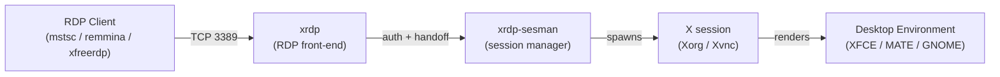

# XRDP Server Kali Linux

## Overview

**xrdp** is an open-source implementation of the Microsoft Remote Desktop Protocol (RDP) server for Linux. Installing it on Kali Linux lets you connect to the machine's graphical desktop from any standard RDP client — the built-in **Remote Desktop Connection** (`mstsc.exe`) on Windows, `remmina` or `xfreerdp` on Linux, or Microsoft Remote Desktop on macOS — without deploying a separate proprietary agent.

This note walks through a minimal, production-aware xrdp deployment on Kali: installing the package, enabling it at boot, restarting the two cooperating services, and confirming the listener on TCP `3389`. Kali ships headless-by-default in many install profiles, so a working desktop environment (XFCE, MATE, GNOME) is a prerequisite for a usable session.

> [!WARNING]
> RDP transmits an entire interactive desktop session. Expose port `3389` **only** on trusted management networks or behind a VPN/SSH tunnel. A directly Internet-facing xrdp listener is a high-value target for credential-stuffing and BlueKeep-class exploitation.

## Concepts

xrdp is not a single monolithic daemon. Two systemd units cooperate to serve a session:

| Component | systemd unit | Role |
| --- | --- | --- |
| RDP front-end | `xrdp` | Listens on TCP `3389`, terminates the RDP protocol, negotiates encryption, and hands authenticated connections to the session manager. |
| Session manager | `xrdp-sesman` | Spawns and manages per-user backend sessions (typically a local X server via Xorg/Xvnc) and ties them to the desktop environment. |

Because the two units are distinct, a configuration change frequently requires restarting **both** so the front-end and the session manager stay in sync.

## Architecture



## Configuration

Run the following steps as root (or prefix each command with `sudo`).

- Update the system's package lists:

```bash
apt update
```

- Install the xrdp package:

```bash
apt install xrdp
```

- Enable xrdp to start automatically on boot:

```bash
systemctl enable xrdp
```

- Restart xrdp service:

```bash
systemctl restart xrdp
```

- Restart xrdp-sesman service:

```bash
systemctl restart xrdp-sesman
```

> [!TIP]
> After installation, `apt` usually starts and enables xrdp automatically. The explicit `enable`/`restart` steps above make the state deterministic — useful when scripting a rebuild or recovering a broken service.

## Commands

- Check network listening ports:

```bash
netstat -nltup
```

> Look for `xrdp` listening on TCP port `3389`.

The following reference summarizes the day-to-day management commands for the xrdp stack:

| Task | Command |
| --- | --- |
| Update package index | `apt update` |
| Install xrdp | `apt install xrdp` |
| Enable at boot | `systemctl enable xrdp` |
| Restart RDP front-end | `systemctl restart xrdp` |
| Restart session manager | `systemctl restart xrdp-sesman` |
| Check service status | `systemctl status xrdp` |
| Verify listener on 3389 | `netstat -nltup` (or `ss -nltup`) |

> [!NOTE]
> **📸 Screenshot**
> _Capture: Terminal output of netstat -nltup showing the xrdp process bound to 0.0.0.0:3389 in the LISTEN state_

## Examples

Confirm the listener is up and bound to the expected port after a restart:

```bash
ss -nltup | grep 3389
```

Connect from a Windows workstation using the built-in client, pointing at the Kali host's IP:

```powershell
mstsc /v:192.168.1.50:3389
```

Connect from another Linux host with FreeRDP:

```bash
xfreerdp /v:192.168.1.50 /u:kali /dynamic-resolution
```

## Best Practices

- **Install a desktop environment first.** xrdp only serves a graphical session if one exists. Without XFCE, MATE, or GNOME the connection authenticates but presents a blank or failing session.
- **Prefer a lightweight DE.** XFCE and MATE render far more responsively over RDP than GNOME, especially on constrained links.
- **Keep both services in lock-step.** After editing `/etc/xrdp/xrdp.ini` or `/etc/xrdp/sesman.ini`, restart `xrdp` **and** `xrdp-sesman`.
- **Pin the state at boot.** Use `systemctl enable xrdp` so the listener returns after a reboot, and `systemctl disable xrdp` the moment remote access is no longer needed.

## Security Considerations

> [!IMPORTANT]
> xrdp defaults are convenient, not hardened. Treat any RDP exposure as a privileged remote-shell equivalent and layer defenses accordingly.

- **Never expose 3389 to the Internet.** Restrict access with the host firewall (`nftables`/`iptables`/`ufw`) to trusted management subnets, and prefer reaching the desktop over a VPN or an SSH tunnel (`ssh -L 3389:localhost:3389 user@host`).
- **Enforce strong authentication.** Use complex, unique credentials; xrdp authenticates against local PAM accounts, so account-lockout and password policy carry directly into RDP.
- **Constrain the surface with the firewall.** Explicitly open `3389` only where required rather than leaving it wide open.
- **Encryption negotiation.** Ensure TLS security layer is enabled in `xrdp.ini` (`security_layer=tls`) so sessions are not downgraded to the legacy RDP encryption.
- **Monitor the logs.** Watch `/var/log/xrdp.log` and `/var/log/xrdp-sesman.log` for repeated failed logins that indicate brute-force activity.
- **Disable when idle.** The most reliable hardening for a pentest workstation is to stop and disable xrdp whenever it is not actively in use.

## Troubleshooting

- Make sure the desktop environment is installed (like XFCE, MATE) for GUI access.

- Kali might block RDP connections by firewall; ensure ports are open if necessary.

- If issues occur, check logs located at `/var/log/xrdp-sesman.log` and `/var/log/xrdp.log`.

| Symptom | Likely cause | Resolution |
| --- | --- | --- |
| Login succeeds, then blank/black screen | No desktop environment, or wrong session type | Install XFCE/MATE; verify `~/.xsession` and the DE selected in `sesman.ini`. |
| Connection refused on 3389 | Service down or firewall blocking | `systemctl status xrdp`; open the port in the host firewall for the management subnet. |
| Not listed in `netstat -nltup` | xrdp failed to start | Check `/var/log/xrdp.log`; restart both `xrdp` and `xrdp-sesman`. |
| Immediate disconnect after credentials | `sesman` cannot spawn a session | Review `/var/log/xrdp-sesman.log`; confirm PAM/account is valid and a DE is present. |

## References

- xrdp project documentation — https://github.com/neutrinolabs/xrdp
- Kali Linux documentation — https://www.kali.org/docs/
- Microsoft Remote Desktop Protocol overview — https://learn.microsoft.com/windows-server/remote/remote-desktop-services/

## Related
- [XRDP-Server-Configuration](XRDP-Server-Configuration.md) — general XRDP configuration
- [Remote-Desktop-Setup](Remote-Desktop-Setup.md) — remote-desktop setup overview
- [VNC-Server](VNC-Server.md) — alternative graphical remote-access server
- RDP-Enumeration — attacker-side RDP recon
- [Linux Administration & Server Hardening](../Readme.md) — course hub
