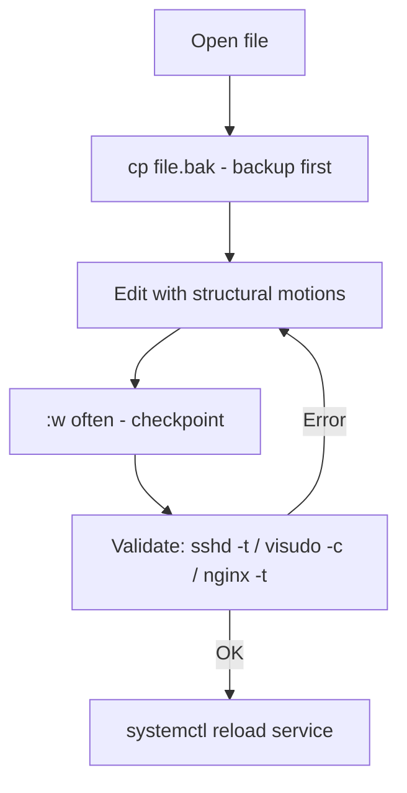

# Editor Productivity Tips

Speed in a terminal editor comes less from memorizing exotic commands than from a handful of reliable habits: navigate without leaving home row, edit by structure rather than character, and never lose work. This note collects practical, production-safe productivity techniques for nano and Vim on Debian/Ubuntu and RHEL-family systems.

## Overview

An administrator edits configuration files dozens of times a day, often over SSH on unfamiliar hosts. Small efficiencies compound: jumping straight to a line, changing a whole word with one motion, replaying a recorded edit, or splitting the screen to compare two files. Equally important are the *safety* habits — backups, validation, and recovering unsaved work — that keep speed from turning into an outage.

This note ties together the whole module: modes ([Vim-Modes](Vim-Modes.md)), search/replace ([Search-and-Replace-in-Vim](Search-and-Replace-in-Vim.md)), macros ([Vim-Macros](Vim-Macros.md)), and configuration ([Vim-Configuration-vimrc](Vim-Configuration-vimrc.md)).

> [!IMPORTANT]
> The highest-leverage habit is boring: **back up before you edit, validate after you save.** `cp file file.bak`, edit, then run the service's own config checker before reloading.

## Concepts

### Edit by structure, not by character

Vim's power is the **operator + text-object** grammar. Instead of counting characters, describe the structure:

| Command | Meaning |
|---------|---------|
| `ciw` | Change inner word |
| `ci"` | Change text inside quotes |
| `ci(` | Change inside parentheses |
| `cit` | Change inside an XML/HTML tag |
| `dap` | Delete a paragraph (with surrounding blank line) |
| `dt,` | Delete up to the next comma |
| `>ip` | Indent the inner paragraph |

### Navigate efficiently

| Command | Jump to |
|---------|---------|
| `gg` / `G` | Top / bottom of file |
| `{count}G` or `:{count}` | Line number `{count}` |
| `Ctrl+d` / `Ctrl+u` | Half-page down / up |
| `f{char}` / `t{char}` | Next occurrence of a char on the line |
| `%` | Matching bracket/brace/paren |
| `*` / `#` | Next / previous instance of the word under cursor |
| `` `` `` (backtick backtick) | Back to the position before the last jump |

### Never lose work

| Feature | Editor | Benefit |
|---------|--------|---------|
| Swap file recovery | Vim | Recover edits after a crash/disconnect |
| Persistent undo (`undofile`) | Vim | Undo across sessions |
| Autosave habit (`:w` often) | Both | Frequent checkpoints |
| Backup on save | Both | Roll back to the previous version |

## Architecture



## Commands

### Working with multiple files (Vim)

| Command | Action |
|---------|--------|
| `:split file` / `:sp` | Horizontal split |
| `:vsplit file` / `:vs` | Vertical split |
| `Ctrl+w` then `h/j/k/l` | Move between split windows |
| `:tabnew file` | Open a file in a new tab page |
| `gt` / `gT` | Next / previous tab |
| `:bn` / `:bp` / `:ls` | Next / previous buffer / list buffers |
| `:e!` | Reload the file, discarding changes |

### Running shell commands without leaving the editor

```vim
:!systemctl status ssh      " Run a shell command, show output
:r !date                    " Read command output into the buffer
:%!sort                     " Filter the whole buffer through 'sort'
:'<,'>!column -t            " Align a selection into columns
```

> [!TIP]
> `:%!` pipes the entire buffer through an external filter. `:%!sort -u` sorts and de-duplicates a list; `:%!jq .` pretty-prints JSON in place — powerful for cleaning up data files.

### Jump straight to a line from the shell

```bash
vim +72 /etc/ssh/sshd_config     # Open at line 72
vim +/PermitRootLogin sshd_config # Open at the first match
nano +72 /etc/ssh/sshd_config     # nano equivalent
```

## Examples

### Comment out a block quickly (Vim, Visual-Block)

```text
1. Ctrl+v         -> Visual-Block mode on the first line, column 0
2. jjj            -> extend down 3 lines
3. I#             -> insert "#" at the block's left edge
4. Esc            -> applied to all selected lines
```

### Align a table of values

```vim
:'<,'>!column -t
```

Select the lines in Visual mode first, then run the filter to align columns on whitespace.

### Recover after an SSH disconnect (Vim)

```bash
vim -r /etc/nginx/nginx.conf   # Recover from the swap file left by the dead session
```

Vim reads the orphaned `.swp` and reconstructs your unsaved edits; save the recovered buffer, then delete the swap file.

> [!NOTE]
> **📸 Screenshot**
> _Capture: Vim split vertically into two windows comparing an nginx.conf on the left and its backup on the right, with differing lines and line numbers visible in both panes_

## Best Practices

- **Back up, edit, validate, reload** — make this four-step loop muscle memory for every `/etc` change.
- **Learn ten motions well** rather than a hundred poorly: `w b e`, `0 ^ $`, `gg G`, `f t`, `%`, `ciw`, `ci"`, `dd`, `.` (repeat), `u`.
- **Use the `.` (dot) command.** It repeats your last change; combined with `n` (next search match) it makes many manual edits trivial.
- **Split windows to compare**, or use `vimdiff file file.bak` before reloading a service.
- **Keep `EDITOR`/`VISUAL` set** so `crontab -e`, `visudo`, and `git` use the editor you know (see [Introduction-to-Text-Editors](Introduction-to-Text-Editors.md)).
- **Prefer `sudoedit`** for ownership-sensitive files instead of `sudo vim`/`sudo nano`.

## Security Considerations

- **Validate privileged files with their own checkers**, never by "it looked right": `visudo -c` for sudoers, `sshd -t` for SSH, `nginx -t`/`apachectl configtest` for web servers, `named-checkconf` for BIND. A fast edit that breaks `sshd_config` can lock you out of a remote host.
- **`:!` and `:r !` execute shell commands** with the editor's privileges. Under `sudo vim` that is root — be deliberate about what you run, especially on files or in directories you do not fully trust.
- **Recovered swap files may contain secrets.** After using `vim -r` on a sensitive file, securely remove the leftover `.swp`. On shared hosts, keep swap/undo dirs at mode `0700` (see [Vim-Configuration-vimrc](Vim-Configuration-vimrc.md)).
- **Disable modelines** (`set nomodeline`) before opening untrusted files, since a crafted modeline can alter editor behavior.
- **Test remote-affecting changes safely.** When editing `sshd_config` over SSH, keep your current session open and open a *second* session to confirm you can still log in before closing the first.

> [!WARNING]
> Never reboot after editing `/etc/fstab` without running `sudo mount -a` first — a typo can leave the machine unable to boot. Validation before reload/reboot is the difference between a quick fix and an outage.

## Troubleshooting

| Symptom | Cause | Fix |
|---------|-------|-----|
| Repeated manual edits are slow | Not using `.` repeat or macros | Make the change once, then `.` or record a macro (see [Vim-Macros](Vim-Macros.md)) |
| Lost work after disconnect | SSH session died mid-edit | `vim -r file` to recover from the swap file |
| Locked out after editing sshd_config | Bad directive, service reloaded | Fix via console/second session; always `sshd -t` before reload |
| `:!command` output vanishes instantly | Command ran but returned to editor | Use `:!command | less` or `:r !command` to capture output |
| Can't tell which file is active in splits | Multiple windows/buffers open | `Ctrl+g` shows the current filename; `:ls` lists buffers |
| Pasting into a config mangles indentation | Auto-indent in Insert mode | `:set paste`, paste, `:set nopaste` (Vim); `Alt+I` toggles in nano |

## References

- Vim tips and grammar — `:help motion.txt`, `:help text-objects`, `:help usr_10.txt`
- Interactive tutorial — run `vimtutor`
- GNU nano manual — https://www.nano-editor.org/docs.php
- Vim documentation — https://www.vim.org/docs.php

## Related

- [Introduction-to-Text-Editors](Introduction-to-Text-Editors.md) — choosing the right editor and setting `EDITOR`
- [Vim-Modes](Vim-Modes.md) — the modal grammar behind structural editing
- [Search-and-Replace-in-Vim](Search-and-Replace-in-Vim.md) — pattern-based bulk edits
- [Vim-Macros](Vim-Macros.md) — automating repetitive edits
- [Vim-Configuration-vimrc](Vim-Configuration-vimrc.md) — the config that enables these habits
- [Nano-Editor](Nano-Editor.md) — productivity within the simpler editor
- [Linux Administration & Server Hardening](../Readme.md) — Linux administration & server hardening hub
