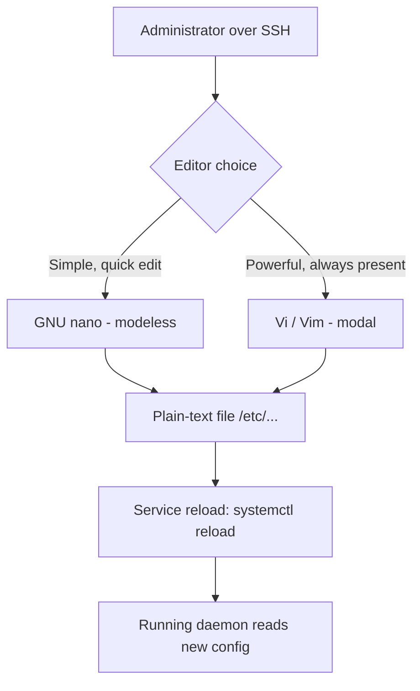

# Introduction to Text Editors

Text editors are the primary tools a Linux administrator uses to create and modify configuration files, scripts, and documentation directly on a server. Because most production Linux hosts are administered over SSH without a graphical desktop, mastery of terminal-based editors is a core, non-negotiable sysadmin skill.

## Overview

Almost every administrative task on Linux eventually touches a plain-text file: `/etc/ssh/sshd_config`, `/etc/fstab`, a systemd unit, a shell script, a `crontab`, or an application config. Unlike word processors, Linux text editors work on **plain text** with no hidden formatting, which is exactly what daemons and interpreters expect.

This module covers the two editors you will find on virtually every Debian/Ubuntu and RHEL-family system — **GNU nano** (simple, modeless, beginner-friendly) and **Vi/Vim** (powerful, modal, ubiquitous) — plus the advanced Vim workflows (modes, search/replace, macros, `vimrc` tuning) that make experienced administrators fast and accurate.

> [!IMPORTANT]
> `vi` (or a `vi`-compatible clone) is mandated by the POSIX standard and is present on essentially every Unix-like system, including minimal container images, rescue shells, and appliance firmware. Even if you prefer nano, you **must** be able to survive in `vi`.

## Concepts

### Line editors vs. screen editors

| Type | Example | Description |
|------|---------|-------------|
| Line editor | `ed`, `sed` | Operate on text one line (or stream) at a time; no full-screen view. Still used non-interactively in scripts. |
| Screen (visual) editor | `nano`, `vim`, `emacs` | Show a full page of text and let you move the cursor freely around the screen. |

### Modal vs. modeless editors

| Model | Example | How it works |
|-------|---------|--------------|
| Modeless | `nano`, `gedit` | Keystrokes always insert text; commands use modifier keys (`Ctrl`, `Alt`). |
| Modal | `vi`, `vim` | The editor has distinct **modes** (e.g. Normal, Insert). The same key does different things depending on the current mode. |

Modal editing is the single biggest conceptual hurdle for newcomers to Vim; it is covered in depth in [Vim-Modes](Vim-Modes.md).

### Where editors fit in administration

- **Configuration management** — hand-editing files under `/etc`, then reloading the service.
- **Scripting** — authoring Bash/Python automation (see [Shell-Scripting](../Shell-Scripting/Shell-Scripting.md)).
- **Troubleshooting** — reading logs, patching a broken `fstab` from a rescue shell.
- **Remote work** — everything above, over SSH, where a GUI is unavailable.

## Architecture



## Editor comparison

| Feature | nano | vi / vim | ed | emacs |
|---------|------|----------|----|-------|
| Learning curve | Very low | Steep | Steep | Steep |
| Modal | No | Yes | Yes | No |
| Always installed | Usually | Almost always (`vi`) | Yes (POSIX) | Rarely |
| On-screen key help | Yes | No | No | Partial |
| Macros / scripting | Limited | Powerful | Powerful | Very powerful |
| Syntax highlighting | Yes | Yes | No | Yes |
| Typical use | Quick config edits | Everything, remote/rescue | Scripted stream edits | Power users |
| Package (Debian/RHEL) | `nano` | `vim` / `vim-enhanced` | `ed` | `emacs` |

## Configuration

Each editor stores per-user preferences in a dotfile in the home directory, with a system-wide default under `/etc`:

| Editor | Per-user config | System-wide config |
|--------|-----------------|--------------------|
| nano | `~/.nanorc` | `/etc/nanorc` |
| vim | `~/.vimrc` | `/etc/vim/vimrc` (Debian), `/etc/vimrc` (RHEL) |

### The `EDITOR` and `VISUAL` variables

Many tools (`crontab -e`, `visudo`, `git commit`, `systemctl edit`) launch whatever editor is named in the `EDITOR` (or `VISUAL`) environment variable. Set it in your shell profile so these commands open the editor you actually know.

```bash
# Add to ~/.bashrc or ~/.profile
export EDITOR=vim
export VISUAL=vim
```

> [!TIP]
> On a shared or unfamiliar host, run `echo $EDITOR` before typing `crontab -e` — being dropped into an unexpected `vi` session is the classic reason new admins get "stuck" in an editor.

## Commands

### Installing the editors

```bash
# Debian / Ubuntu
sudo apt update
sudo apt install nano vim
```

```bash
# RHEL / CentOS / Rocky / AlmaLinux / Fedora
sudo dnf install nano vim-enhanced
```

### Selecting the default editor (Debian/Ubuntu)

Debian provides the `update-alternatives` system to set a machine-wide default `editor`:

```bash
sudo update-alternatives --config editor
```

### Checking what is installed

```bash
which nano vi vim
vim --version | head -n 1
```

## Examples

### Deciding which editor to reach for

```bash
# Quick one-line change to a config, you know exactly what to type:
sudo nano /etc/hosts

# Complex multi-file edit, search/replace, or a rescue shell with only vi:
sudo vim /etc/ssh/sshd_config
```

> [!NOTE]
> **📸 Screenshot**
> _Capture: Split terminal showing GNU nano on the left with its two-row shortcut bar at the bottom, and Vim on the right in Normal mode editing the same sshd_config file_

## Best Practices

- **Learn `vi` survival keys** even if nano is your daily driver — `Esc`, `:w`, `:q!`, `i`, `dd`. You will eventually land on a box with nothing else.
- **Always back up a critical file before editing** it in production: `sudo cp /etc/fstab /etc/fstab.bak`.
- **Validate after editing** where a validator exists (`visudo -c`, `sshd -t`, `nginx -t`, `named-checkconf`) rather than blindly reloading a service.
- **Use the tool's own safe-edit wrapper** for sensitive files: `visudo` for `/etc/sudoers`, `vipw`/`vigr` for account files. These lock the file and syntax-check on save.
- **Set `EDITOR`/`VISUAL` in your profile** so `crontab -e` and `git` behave predictably.

## Security Considerations

- **Never edit `/etc/sudoers` directly** with a plain editor. A syntax error can lock every user out of `sudo`. Use `visudo`, which validates before committing (see [Sudo](../Users-Groups-and-Permissions/Sudo.md)).
- **Swap and backup files leak data.** Vim writes a `.swp` swap file and can leave `file~` backups; nano can leave `file~` backups. On multi-user or sensitive hosts these may expose secrets from files like `/etc/shadow`. Control their location with the config directives covered in [Vim-Configuration-vimrc](Vim-Configuration-vimrc.md), or disable backups for sensitive edits.
- **Respect file permissions and ownership.** Editing a root-owned file as an unprivileged user via `sudo` is correct; copying it to your home directory to edit and copying back can silently change owner/mode. Prefer `sudo -e` (`sudoedit`), which edits a temporary copy and preserves the original's ownership and SELinux/AppArmor context.
- **Beware editor command execution.** Vim can run shell commands (`:!cmd`) and, if compiled with scripting, execute embedded modelines. Disable modelines for untrusted files (`set nomodeline`) — a maliciously crafted file has historically been used to trigger code execution via modeline parsing.

> [!WARNING]
> Editing `/etc/fstab` incorrectly can render a server unbootable. Always keep a backup and, after editing, test with `sudo mount -a` before rebooting.

## Troubleshooting

| Symptom | Likely cause | Fix |
|---------|--------------|-----|
| "Stuck" in an editor, keys do nothing useful | You are in `vi`/`vim` Normal mode | Press `Esc`, then `:q!` + `Enter` to quit without saving |
| `E45: 'readonly' option is set` on save | File opened without write permission | `:w !sudo tee %` then reload, or reopen with `sudoedit` |
| Changes not taking effect | Edited the wrong file, or service not reloaded | Confirm path; run `systemctl reload <service>` |
| `crontab -e` opens an unfamiliar editor | `EDITOR` unset or set to `vi` | `export EDITOR=nano` (or `vim`) and retry |
| Garbled display / colors wrong over SSH | `TERM` mismatch | `export TERM=xterm-256color` |

## References

- GNU nano manual — https://www.nano-editor.org/docs.php
- Vim documentation — https://www.vim.org/docs.php
- POSIX `vi` specification — https://pubs.opengroup.org/onlinepubs/9699919799/utilities/vi.html
- `man 1 nano`, `man 1 vim`, `man 1 sudoedit`

## Related

- [Nano-Editor](Nano-Editor.md) — the simple, modeless terminal editor in depth
- [Vi-and-Vim-Editor](Vi-and-Vim-Editor.md) — the ubiquitous modal editor and its history
- [Vim-Modes](Vim-Modes.md) — understanding Normal, Insert, Visual, and Command-line modes
- [Editor-Productivity-Tips](Editor-Productivity-Tips.md) — workflow habits that make editing fast and safe
- [Nano-Command](Nano-Command.md) — nano command and shortcut reference
- [Vim-Command](Vim-Command.md) — Vim command reference
- [Linux Administration & Server Hardening](../Readme.md) — Linux administration & server hardening hub
