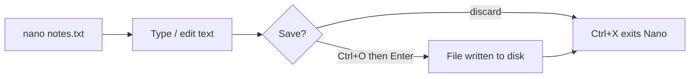

# Nano Command

The `nano` command is a simple, beginner-friendly terminal text editor for Linux and other Unix-like operating systems. It lets you create, edit, and save text files directly from the command line without leaving the shell — making it ideal for quick edits of configuration files over SSH, writing short scripts, or taking notes.

## Overview

Unlike modal editors such as `vi`/`vim`, Nano is **modeless**: you type to insert text immediately, and every action is driven by a `Ctrl` (`^`) or `Alt` (`M-`) key combination shown in the two-line help bar at the bottom of the screen. This low learning curve is why Nano is the default editor on many desktop distributions and a common first stop for administrators who need to make a fast, reliable change.

> [!NOTE]
> **📸 Screenshot**
> _Capture: Nano editing a file, showing the title bar with the filename, the text body, and the two-row shortcut bar listing Ctrl-key commands such as ^O Write Out and ^X Exit at the bottom_

## Concepts

| Concept | Meaning |
|---|---|
| Modeless editing | Text is inserted as you type; no separate insert/command modes. |
| `^` notation | The caret shown in Nano's help bar means the `Ctrl` key (e.g. `^O` = `Ctrl+O`). |
| `M-` notation | `M-` means the `Meta`/`Alt` key (e.g. `M-A` = `Alt+A`). |
| Marking | Selecting a region of text with `Alt+A` before cutting or copying. |
| `nanorc` | The configuration file that sets persistent options and syntax highlighting. |

## Installation

Nano ships with most distributions. Install it with the native package manager if it is missing.

- RHEL / CentOS / Fedora

```bash
yum install nano
```

- Debian / Ubuntu

```bash
apt install nano
```

- Arch Linux

```bash
pacman -S nano
```

## Configuration

Nano reads options and syntax-highlighting rules from a configuration file, so you can make preferences (line numbers, auto-indent, tab width) persistent instead of passing flags every time.

- Per-user configuration:

```bash
~/.nanorc
```

- System-wide configuration:

```bash
/etc/nanorc
```

> [!TIP]
> **Setting `set linenumbers`, `set autoindent`, and `set backupdir "~/.cache/nano/backups"` in `~/.nanorc` gives every session line numbers, indentation, and a single collated location for backup (`~`) files.**

## Commands

### Open Nano

- Launch Nano without opening a file.

```bash
nano
```

- Open an existing file, or create a new one if it does not exist.

```bash
nano armour.txt
```

```bash
nano notes.txt
```

### Open at a Specific Line

- Open a file with the cursor placed directly on a chosen line.

```bash
nano +10 test.txt
```

> Opens `test.txt` at line 10.

### Open in Read-Only Mode

- Prevent accidental edits — useful when only reviewing a sensitive file.

```bash
nano -v test.txt
```

### Enable Line Numbers

```bash
nano -l filename.txt
```

### Automatic Backup

- Creates a backup of the original file before saving.

```bash
nano -B notes.txt
```

- The backup file is written alongside the original with a trailing tilde:

```text
notes.txt~
```

### Open Multiple Files

```bash
nano file1.txt file2.txt
```

- Switch between open buffers using:

```text
Alt + <
Alt + >
```

### Command-Line Options

| Option | Description |
|---|---|
| `-l` | Show line numbers |
| `-v` | View-only mode |
| `-B` | Create backup files |
| `-c` | Show cursor position |
| `-m` | Enable mouse support |
| `-i` | Auto-indent |

### Basic Navigation Keys

| Key | Function |
|---|---|
| Arrow Keys | Move cursor |
| `Ctrl+A` | Move to beginning of line |
| `Ctrl+E` | Move to end of line |
| `Ctrl+Y` | Previous page |
| `Ctrl+V` | Next page |

### Common Nano Shortcuts

| Shortcut | Description |
|---|---|
| `Ctrl+O` | Save file (write out) |
| `Ctrl+X` | Exit Nano |
| `Ctrl+K` | Cut current line |
| `Ctrl+U` | Paste cut text |
| `Ctrl+W` | Search text |
| `Ctrl+G` | Open help menu |
| `Ctrl+C` | Show cursor position |
| `Ctrl+\` | Search and replace |
| `Ctrl+J` | Justify paragraph |
| `Ctrl+_` | Go to line number |

> [!TIP]
> **The bottom shortcut bar always lists the most common commands. Press `Ctrl+G` at any time to open the full help browser.**

## Examples

### Save a File

- Press:

```text
Ctrl + O
```

> Then press:

```text
Enter
```

> to confirm the filename.

### Exit Nano

- Press:

```text
Ctrl + X
```

### Search Text

- Press:

```text
Ctrl + W
```

- Enter the search term and press:

```text
Enter
```

### Search and Replace

- Press:

```text
Ctrl + \
```

> Example:

```text
Search: admin
Replace: root
```

### Cut and Paste

- Cut the current line:

```text
Ctrl + K
```

- Paste the cut text at the cursor:

```text
Ctrl + U
```

### Copy Text

Nano has no direct "copy" shortcut like GUI editors. The usual approach is to mark, cut, then immediately paste back so the text remains in place while a copy is also on the cutbuffer.

1. Mark the start of the selection:

```text
Alt + A
```

2. Move the cursor to extend the selection.

3. Cut the marked text:

```text
Ctrl + K
```

4. Paste it back (and again wherever the copy is needed):

```text
Ctrl + U
```

### Go To a Specific Line

- Press:

```text
Ctrl + _
```

- Enter the line number:

```text
25
```

### Example Workflow

- Create or open a file:

```bash
nano notes.txt
```

> Add content:

```text
Linux Notes
Nano Editor Practice
```

> Save the file:

```text
Ctrl + O
```

> Press:

```text
Enter
```

> Exit the editor:

```text
Ctrl + X
```

The end-to-end flow of a typical edit is:



## Best Practices

- **Enable line numbers** (`-l` or `set linenumbers` in `~/.nanorc`) when editing config files so error messages that reference a line are easy to locate.
- **Use `-B`** to keep an automatic backup before overwriting important files; pair it with `set backupdir` to collect the `~` files in one place.
- **Prefer `-v` (view-only)** when you only need to read a file, to avoid accidental changes.
- **Confirm the filename** on the save prompt (`Ctrl+O`) — Nano lets you write to a different path, which is easy to do by mistake.

## Security Considerations

> [!WARNING]
> **Editing a root-owned file (e.g. anything under `/etc`) requires `sudo nano <file>`. Only elevate for the specific edit you need, and re-check file ownership and permissions afterward so a config file is not left world-writable.**

- Editing sensitive files such as `/etc/passwd`, `/etc/shadow`, or `/etc/sudoers` can lock users out or open a privilege-escalation path if a value is corrupted. For `/etc/sudoers` specifically, prefer `visudo`, which validates syntax before saving.
- On shared or hardened systems, be aware that Nano writes a temporary/backup file (`~`) that may briefly expose sensitive content; restrict directory permissions accordingly.
- When editing files over SSH, remember the change lands on the remote host immediately on save — double-check you are on the intended machine before writing.

## Troubleshooting

| Symptom | Likely Cause | Resolution |
|---|---|---|
| Cannot save, "Permission denied" | File owned by another user (e.g. root) | Re-open with `sudo nano <file>`. |
| `Alt`/`Meta` shortcuts do nothing | Terminal intercepts the `Alt` key | Press `Esc` then the letter, or fix the terminal's Meta-key setting. |
| Coloring/options not applied | `~/.nanorc` not read or has a typo | Verify the path and syntax; test with `nano --rcfile`. |
| Unexpected line wrapping | Soft/hard wrap enabled | Toggle with `Alt+$` (soft wrap) or set `set nowrap`. |

## Use Cases

- Editing configuration files
- Writing shell scripts
- Creating notes
- Quick terminal-based file editing
- Editing remote files over SSH
- Beginner-friendly Linux text editing

## References

- GNU Nano manual: <https://www.nano-editor.org/dist/latest/nano.html>
- `man nano` and the built-in help (`Ctrl+G`)

## Related

- [Vim-Command](Vim-Command.md) — modal terminal editor and its command reference
- [Introduction-to-Text-Editors](Introduction-to-Text-Editors.md) — comparison of terminal editors in this module
- [Nano-Editor](Nano-Editor.md) — deeper look at Nano configuration and features
- [Editor-Productivity-Tips](Editor-Productivity-Tips.md) — workflow tips shared across editors
- [Shells-in-Linux](../Shells-and-Environment/Shells-in-Linux.md) — editors run from the interactive shell
- [Linux Administration & Server Hardening](../Readme.md) — course hub
