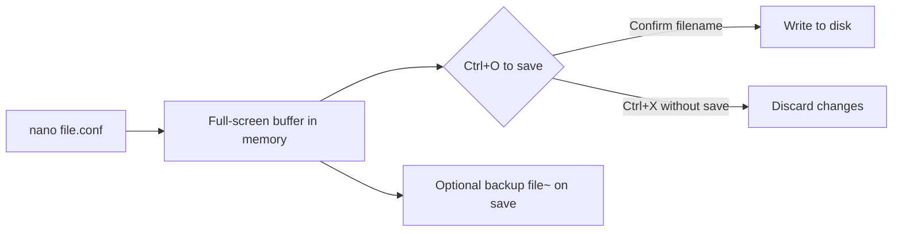

# Nano Editor

GNU nano is a small, modeless terminal text editor designed to be immediately usable: every important shortcut is printed along the bottom of the screen, and typed characters always insert text. It is the default editor on many Debian/Ubuntu systems and the fastest tool for quick, low-risk configuration edits.

## Overview

nano is a free clone of the older **Pico** editor (from the Pine mail client). Its guiding principle is discoverability — you do not need to memorize modes or arcane commands, because the two help rows at the bottom always show the current key bindings. This makes nano ideal for:

- Quick single-line edits to a config file.
- Administrators and users who edit files infrequently.
- Environments where the modal complexity of Vim is unwarranted.

For the full command and shortcut reference, see the existing [Nano-Command](Nano-Command.md) note; this note focuses on concepts, configuration, and production use.

> [!NOTE]
> In nano documentation the caret (`^`) means **Ctrl** and `M-` means **Meta** (usually the `Alt` key, or `Esc` pressed first). So `^X` is `Ctrl+X` and `M-U` is `Alt+U`.

## Concepts

### Modeless editing

Unlike Vim, nano has no modes. You open a file, type to insert text exactly where the cursor is, and issue commands with `Ctrl`/`Alt` combinations. There is no "Insert mode" to enter or "Normal mode" to return to — which is precisely why beginners rarely get "stuck" in nano.

### The on-screen shortcut bar

The bottom two rows list the most common commands. A few essentials:

| Shortcut | Action |
|----------|--------|
| `Ctrl+O` | Write out (save) the file |
| `Ctrl+X` | Exit nano (prompts to save if modified) |
| `Ctrl+K` | Cut the current line |
| `Ctrl+U` | Uncut (paste) |
| `Ctrl+W` | Where Is (search) |
| `Ctrl+\` | Search and replace |
| `Ctrl+G` | Open the built-in help |
| `Ctrl+_` | Go to a specific line/column |

## Architecture



## Configuration

nano reads two configuration files: the system-wide `/etc/nanorc` and the per-user `~/.nanorc`. Per-user settings override the system defaults.

### Common `~/.nanorc` settings

```conf
# ~/.nanorc — GNU nano configuration
set linenumbers          # Show line numbers in the left margin
set constantshow         # Constantly show cursor position (line/col)
set softwrap             # Wrap long lines visually instead of scrolling
set tabsize 4            # Display tabs as 4 columns
set tabstospaces         # Convert typed tabs to spaces
set autoindent           # Match the indentation of the previous line
set mouse                # Enable mouse support in terminals that allow it
set backup               # Keep a backup (filename~) when saving
set backupdir "~/.cache/nano/backups"
```

### Enabling syntax highlighting

Modern nano ships syntax-highlighting definitions (usually in `/usr/share/nano/`). Include them from your rc file:

```conf
# Load all bundled syntax definitions
include "/usr/share/nano/*.nanorc"
```

> [!TIP]
> On Debian/Ubuntu the system `/etc/nanorc` already contains a commented `include` block. Uncomment it, or add the line above to your `~/.nanorc`, to get highlighting for shell, Python, JSON, and dozens of other file types.

## Commands

### Installation

```bash
# Debian / Ubuntu
sudo apt update
sudo apt install nano
```

```bash
# RHEL / CentOS / Rocky / AlmaLinux / Fedora
sudo dnf install nano
```

### Launch patterns

```bash
nano                     # Start with an empty buffer
nano notes.txt           # Open (or create) a file
nano +25 script.sh       # Open at line 25
nano +25,10 script.sh    # Open at line 25, column 10
sudo nano /etc/hosts     # Edit a root-owned file
nano -Y sh deploy.sh     # Force the "sh" syntax highlighting
nano -v /etc/fstab       # Open read-only (view mode)
```

### Useful command-line flags

| Flag | Long form | Effect |
|------|-----------|--------|
| `-l` | `--linenumbers` | Show line numbers |
| `-c` | `--constantshow` | Constantly show cursor position |
| `-m` | `--mouse` | Enable mouse support |
| `-i` | `--autoindent` | Auto-indent new lines |
| `-B` | `--backup` | Save a backup of the previous version |
| `-v` | `--view` | Read-only view mode |
| `-w` | `--nowrap` | Do not hard-wrap long lines |

## Examples

### Safe edit of a service config

```bash
# 1. Back up first
sudo cp /etc/ssh/sshd_config /etc/ssh/sshd_config.bak

# 2. Edit
sudo nano /etc/ssh/sshd_config

# 3. Validate the syntax before reloading
sudo sshd -t

# 4. Apply
sudo systemctl reload ssh    # 'sshd' on RHEL-family
```

### Search and replace inside nano

1. Press `Ctrl+\`.
2. Type the search text, press `Enter`.
3. Type the replacement text, press `Enter`.
4. For each match press `Y` to replace, `N` to skip, or `A` to replace all.

> [!NOTE]
> **📸 Screenshot**
> _Capture: GNU nano editing /etc/ssh/sshd_config with line numbers shown in the left margin and the two-row Ctrl-key shortcut bar highlighted at the bottom of the terminal_

## Best Practices

- **Back up before editing** any file under `/etc`.
- **Turn on line numbers** (`set linenumbers`) so error messages that reference a line number are actionable.
- **Use `tabstospaces` for YAML** and Python files, where a stray tab breaks parsing.
- **Validate configs** with the service's own checker before reloading.
- **Prefer `sudoedit`** over `sudo nano` for sensitive, ownership-critical files so the original file's owner and security context are preserved.

## Security Considerations

- **Backup files (`filename~`) can leak sensitive data.** If you enable `set backup` while editing files such as `/etc/shadow`, the backup inherits potentially readable content. Point `backupdir` at a directory only root can read, or disable backups for sensitive edits.
- **`sudo nano` runs the whole editor as root.** Its `Ctrl+R` (read file) and `Ctrl+T` (file browser / spell-check) features then operate with root privileges. Use `sudoedit` where you only need to change one file.
- **Mouse mode can interfere with terminal copy/paste** and, in some terminals, with escape-sequence handling over untrusted connections; leave it off on remote/shared hosts unless needed.
- nano does **not** execute embedded modelines or scripts, which makes it a safer choice than Vim for opening untrusted files.

## Troubleshooting

| Symptom | Cause | Fix |
|---------|-------|-----|
| `[ Error writing ...: Permission denied ]` on save | Editing a root-owned file as a normal user | Reopen with `sudo nano` or `sudoedit` |
| Pasted text is auto-indented into a staircase | `autoindent` is on | Toggle it off with `Alt+I` (`M-I`) before pasting, or use bracketed paste |
| Long lines scroll off-screen | Soft wrap disabled | `Alt+$` toggles soft wrap, or `set softwrap` in `~/.nanorc` |
| No syntax colors | Syntax includes not loaded | Add `include "/usr/share/nano/*.nanorc"` to `~/.nanorc` |
| `Ctrl+S`/`Ctrl+Q` freeze the terminal | Terminal XON/XOFF flow control | Avoid those keys, or run `stty -ixon` in your shell |

## References

- GNU nano homepage and manual — https://www.nano-editor.org/docs.php
- `man 1 nano`, `man 5 nanorc`
- Bundled syntax files — `/usr/share/nano/`

## Related

- [Nano-Command](Nano-Command.md) — nano command and keyboard-shortcut reference
- [Introduction-to-Text-Editors](Introduction-to-Text-Editors.md) — how editors fit into Linux administration
- [Vi-and-Vim-Editor](Vi-and-Vim-Editor.md) — the modal alternative you should also know
- [Editor-Productivity-Tips](Editor-Productivity-Tips.md) — habits that speed up any editor
- [Linux Administration & Server Hardening](../Readme.md) — Linux administration & server hardening hub
