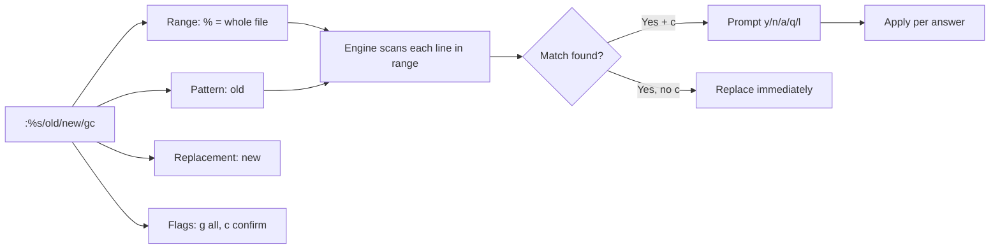

# Search and Replace in Vim

Finding text and substituting it across a file is one of the most common editing tasks a Linux administrator performs — bulk-renaming a variable, updating an IP address in a config, or cleaning up a data file. Vim's `/` search and `:substitute` command make this fast, precise, and scriptable.

## Overview

Vim provides two complementary facilities:

- **Search** (`/`, `?`, `*`, `n`) to *locate* text and move the cursor to it.
- **Substitute** (`:s`, the ex `:substitute` command) to *replace* text, optionally across a range of lines, the whole file, or every open buffer.

Both use Vim's regular-expression engine. This note focuses on interactive and batch search/replace; the broader modal context is in [Vim-Modes](Vim-Modes.md) and the full command list is in [Vim-Command](Vim-Command.md).

> [!IMPORTANT]
> The substitute command is `:[range]s/pattern/replacement/[flags]`. Everything hinges on the `range` (which lines) and the `flags` (how to replace). Get those two right and the rest follows.

## Concepts

### Searching

| Command | Action |
|---------|--------|
| `/pattern` | Search **forward** for `pattern` |
| `?pattern` | Search **backward** for `pattern` |
| `n` | Repeat the last search in the **same** direction |
| `N` | Repeat the last search in the **opposite** direction |
| `*` | Search forward for the word under the cursor |
| `#` | Search backward for the word under the cursor |
| `:noh` | Clear search highlighting |

### The substitute command

```text
:[range]s/pattern/replacement/[flags]
```

| Part | Meaning |
|------|---------|
| `range` | Which lines to act on (omitted = current line only) |
| `pattern` | The regex to find |
| `replacement` | Text to substitute in |
| `flags` | Modifiers such as `g`, `c`, `i` |

### Ranges

| Range | Lines affected |
|-------|----------------|
| *(none)* | Current line only |
| `%` | The **entire file** |
| `1,10` | Lines 1 through 10 |
| `.,$` | Current line to end of file |
| `.,+5` | Current line and the next 5 |
| `'a,'b` | From mark `a` to mark `b` |
| `'<,'>` | The current Visual selection |

### Substitute flags

| Flag | Effect |
|------|--------|
| `g` | Replace **all** occurrences on each line (not just the first) |
| `c` | **Confirm** each replacement interactively |
| `i` | Case-**insensitive** match |
| `I` | Case-**sensitive** match (force) |
| `n` | Report the match **count** without replacing |
| `e` | Do not error if the pattern is not found |

## Architecture



## Commands

### Search options in `~/.vimrc`

```vim
set incsearch    " Jump to matches as you type the search
set hlsearch     " Highlight all matches
set ignorecase   " Case-insensitive search...
set smartcase    " ...unless the pattern contains an uppercase letter
```

> [!TIP]
> The `ignorecase` + `smartcase` pair is the ergonomic default: `/error` matches any case, but `/Error` matches only the capitalized form.

### Confirmation prompt answers

When you add the `c` flag, Vim prompts for each match:

| Key | Meaning |
|-----|---------|
| `y` | Yes, replace this match |
| `n` | No, skip this match |
| `a` | Replace this and **all** remaining |
| `q` | Quit substituting |
| `l` | Replace this one, then quit ("last") |
| `Ctrl+e` / `Ctrl+y` | Scroll the screen while deciding |

## Examples

### Replace every occurrence in the file

```vim
:%s/8080/443/g
```

Replaces every `8080` with `443` throughout the file.

### Replace with confirmation

```vim
:%s/DEBUG/INFO/gc
```

Prompts before each replacement — the safe choice on production configs.

### Case-insensitive, whole word only

```vim
:%s/\<port\>/PORT/gi
```

`\<` and `\>` are word boundaries, so `port` matches but `report` and `portal` do not.

### Substitute only within a Visual selection

```text
1. V         -> Visual-Line mode
2. select the target lines with j
3. :         -> the command line pre-fills with '<,'>
4. s/foo/bar/g   -> applies only to the selected lines
```

### Use capture groups to reorder text

```vim
:%s/\(\w\+\)@\(\w\+\)/\2_\1/g
```

Swaps `user@host` into `host_user`. `\( \)` capture; `\1`, `\2` reference the captured groups.

### Count matches without changing anything

```vim
:%s/error//gn
```

The `n` flag reports how many times `error` occurs and makes **no** changes.

### Delete lines matching a pattern (global command)

```vim
:g/^#/d
```

Deletes every line beginning with `#` (e.g. stripping comments). Use `:v/pattern/d` (or `:g!/pattern/d`) to delete lines that do **not** match.

> [!NOTE]
> **📸 Screenshot**
> _Capture: Vim showing a :%s/8080/443/gc substitution in progress, with the current match highlighted and the replace-confirmation prompt "replace with 443 (y/n/a/q/l/^E/^Y)?" on the command line_

## Best Practices

- **Use the `c` flag on production files.** Confirming each change prevents an over-broad pattern from corrupting a config.
- **Test the pattern with search first.** Type `/pattern` and press `n` to see what it matches before turning it into a substitution.
- **Anchor with word boundaries** (`\<`, `\>`) to avoid replacing substrings inside larger words.
- **Choose a different delimiter for paths.** When the pattern contains `/`, use another separator: `:%s#/old/path#/new/path#g` avoids escaping every slash.
- **`u` undoes a runaway substitution.** If a global replace goes wrong, a single `u` reverts the whole `:s` command.

## Security Considerations

- **`:g` combined with `:!` can execute shell commands per line** (e.g. `:g/pattern/.!command`). On files from untrusted sources, review commands before running; they execute with the privileges of the Vim process (root under `sudo vim`).
- **Over-broad substitutions on security-critical files** — `/etc/sudoers`, `/etc/ssh/sshd_config`, firewall rules — can silently weaken policy (e.g. turning `PermitRootLogin no` into `yes` by a careless pattern). Always use `gc` and re-validate with the service's checker (`visudo -c`, `sshd -t`) afterward.
- **Search history persists** in `~/.viminfo` (or `~/.vim/viminfo`), which can record fragments of edited content and search terms, including secrets. On sensitive hosts restrict `viminfo` (see [Vim-Configuration-vimrc](Vim-Configuration-vimrc.md)) or clear it.

> [!WARNING]
> A substitution without a range acts only on the current line, but one with `%` acts on the whole file. Double-check the range before pressing `Enter` on a live production config.

## Troubleshooting

| Symptom | Cause | Fix |
|---------|-------|-----|
| `E486: Pattern not found` | Typo or case mismatch | Check spelling; add `i` flag or enable `smartcase` |
| Only the first match per line changed | Missing `g` flag | Add `g`: `:%s/x/y/g` |
| Matched more than intended | Pattern too greedy / no anchors | Add `\<...\>` boundaries or refine the regex |
| Special characters not matching | Regex metacharacters (`.` `*` `[` `\`) unescaped | Escape them, or use `\V` (very nomagic) for literal search |
| Highlighting stays after search | `hlsearch` on | `:noh` to clear temporarily |
| `/` in the replacement breaks the command | Delimiter collision | Switch delimiter: `:%s#a/b#c/d#g` |

## References

- Vim substitute documentation — `:help :substitute`
- Vim pattern (regex) reference — `:help pattern`
- Vim global command — `:help :global`
- Vim documentation — https://www.vim.org/docs.php

## Related

- [Vim-Modes](Vim-Modes.md) — Command-line mode, where `:s` and `/` are issued
- [Vim-Macros](Vim-Macros.md) — combine search/replace with recorded keystrokes for bulk edits
- [Vi-and-Vim-Editor](Vi-and-Vim-Editor.md) — the editor these commands run in
- [Vim-Command](Vim-Command.md) — full Vim command reference
- [Vim-Configuration-vimrc](Vim-Configuration-vimrc.md) — configuring search behavior (`hlsearch`, `smartcase`)
- [Linux Administration & Server Hardening](../Readme.md) — Linux administration & server hardening hub
