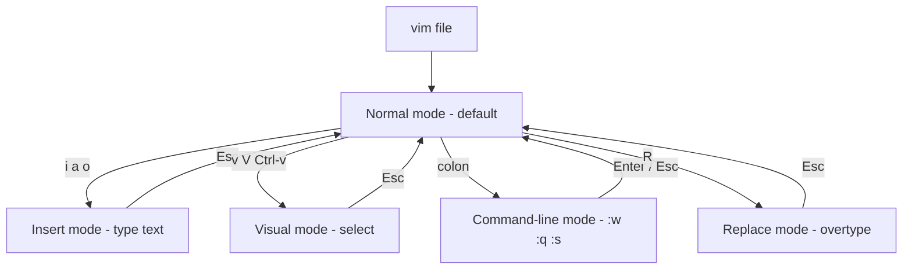

# Vi and Vim Editor

`vi` is the standard, POSIX-mandated visual editor found on virtually every Unix-like system; `vim` ("Vi IMproved") is its feature-rich, backward-compatible successor. Because a `vi`-compatible editor is present even on the most minimal systems, rescue shells, and appliance firmware, fluency in vi/Vim is an essential Linux administration skill.

## Overview

Vim is a **modal** editor: keystrokes mean different things depending on the active mode. This is unfamiliar at first but, once learned, allows editing to happen at the speed of thought without leaving the keyboard's home row. Vim is used for editing configuration files, writing scripts, programming, and — critically for admins — recovering broken systems where nothing else is installed.

For a hands-on command reference, see the existing [Vim-Command](Vim-Command.md) note. This note covers history, installation, the buffer/window model, and production usage; the modal system itself is detailed in [Vim-Modes](Vim-Modes.md).

> [!IMPORTANT]
> On a broken or minimal system you may only have `vi` (often BusyBox `vi` or the tiny `nvi`/`elvis`). The core keys — `i`, `Esc`, `:w`, `:q`, `dd`, `x` — behave the same everywhere. Learn those first; they always work.

## Concepts

### vi vs. Vim vs. other clones

| Editor | Package | Notes |
|--------|---------|-------|
| `vi` (original) | — | Bill Joy's 1976 editor; the standard being emulated |
| `vim` | `vim` / `vim-enhanced` | The de facto modern implementation; syntax highlighting, multi-level undo, plugins |
| `vim.tiny` / `vim-minimal` | Debian `vim.tiny`, RHEL `vim-minimal` | Stripped build shipped as `/usr/bin/vi` on minimal installs |
| `nvi`, `elvis`, BusyBox vi | varies | Lightweight clones on embedded/rescue systems |
| `neovim` | `neovim` | Modern fork with async plugins and Lua config |

On many minimal RHEL/CentOS installs, typing `vim` fails but `vi` works — because only `vim-minimal` (providing `/usr/bin/vi`) is installed. Install `vim-enhanced` for the full editor.

### The modal principle

Vim starts in **Normal mode**, where letters are commands (move, delete, copy), not text. You switch to **Insert mode** to type text, then press `Esc` to return to Normal mode. This is the source of the classic beginner confusion and is explained fully in [Vim-Modes](Vim-Modes.md).

### Buffers, windows, and tabs

| Term | Meaning |
|------|---------|
| Buffer | An in-memory copy of a file being edited |
| Window | A viewport onto a buffer (you can split the screen into several) |
| Tab page | A collection of windows, like a workspace |

## Architecture



## Configuration

Vim reads a per-user `~/.vimrc` and a system-wide file (`/etc/vim/vimrc` on Debian, `/etc/vimrc` on RHEL). Runtime files, colorschemes, and syntax definitions live under `/usr/share/vim/`. Configuration is covered in depth in [Vim-Configuration-vimrc](Vim-Configuration-vimrc.md); a minimal, safe starting point:

```vim
" ~/.vimrc — minimal sane defaults
set nocompatible          " Use Vim features, not strict vi compatibility
syntax on                 " Syntax highlighting
set number                " Absolute line numbers
set expandtab             " Tabs insert spaces
set shiftwidth=4          " Indent width for autoindent
set tabstop=4             " A tab is shown as 4 columns
set incsearch             " Show matches as you type a search
set hlsearch              " Highlight all search matches
```

> [!NOTE]
> On Debian/Ubuntu, `vim.tiny` reads `/etc/vim/vimrc.tiny` and ignores `~/.vimrc`. Install the full `vim` package to get a Vim that honors your personal config.

## Commands

### Installation

```bash
# Debian / Ubuntu — full Vim
sudo apt update
sudo apt install vim
```

```bash
# RHEL / CentOS / Rocky / AlmaLinux / Fedora — full Vim
sudo dnf install vim-enhanced
```

### Launching and quitting

```bash
vim file.conf            # Open (or create) a file
vim +42 file.conf        # Open at line 42
vim + file.conf          # Open at the last line
vim -R /etc/fstab        # Read-only mode
vim -d old.conf new.conf # Diff two files (vimdiff)
view file.conf           # Same as vim -R
```

### The must-know survival keys

| Key(s) | Mode entered / action |
|--------|-----------------------|
| `i` | Insert before cursor |
| `a` | Insert after cursor |
| `o` | Open a new line below and insert |
| `Esc` | Return to Normal mode |
| `x` | Delete the character under the cursor |
| `dd` | Delete (cut) the current line |
| `yy` | Yank (copy) the current line |
| `p` | Paste after the cursor |
| `u` | Undo |
| `Ctrl+r` | Redo |
| `:w` | Write (save) |
| `:q` | Quit |
| `:wq` or `ZZ` | Save and quit |
| `:q!` | Quit without saving |

## Examples

### Edit, then save a file you opened read-only or without permission

If you started `vim /etc/hosts` as a normal user, saving will fail. Write through `sudo` without leaving Vim:

```vim
:w !sudo tee % > /dev/null
```

Then reload the now-changed file with `:e!`.

> [!TIP]
> The cleaner approach is to open the file correctly in the first place with `sudoedit /etc/hosts` (or `sudo -e`), which edits a temporary copy as your user and installs it back with the original owner, mode, and security context.

### Comparing two config versions

```bash
sudo vimdiff /etc/nginx/nginx.conf /etc/nginx/nginx.conf.bak
```

> [!NOTE]
> **📸 Screenshot**
> _Capture: Vim in a terminal showing /etc/ssh/sshd_config in Normal mode with line numbers enabled and the mode indicator area empty, the status line showing the filename and cursor position_

## Best Practices

- **Learn the survival keys cold** — you will one day edit `fstab` from an initramfs rescue shell with only BusyBox `vi`.
- **Set `nocompatible`** at the top of `~/.vimrc` so Vim behaves like Vim, not strict vi.
- **Back up before editing** production configs, and validate with the service checker afterward.
- **Use `vimdiff`** to review changes against a backup before reloading a service.
- **Prefer `sudoedit`** over `sudo vim` for ownership-sensitive files.

## Security Considerations

- **Swap files (`.filename.swp`) persist sensitive data.** If Vim crashes or the session is killed, the swap file remains and may contain the full contents of files like `/etc/shadow`. Recover or delete stale swap files, and consider directing them to a private location (see [Vim-Configuration-vimrc](Vim-Configuration-vimrc.md)).
- **Modelines can execute settings from the file itself.** A crafted file's modeline has historically been an attack vector. Add `set nomodeline` to `~/.vimrc`, or at minimum keep Vim patched.
- **`:!command` runs an arbitrary shell** as the user running Vim. Running `sudo vim` therefore grants a root shell one keystroke away; prefer `sudoedit`.
- **`vim-minimal` on RHEL** lacks some hardening features present in `vim-enhanced`; know which build you are on.

> [!WARNING]
> If you `sudo vim` a file and Vim is compiled with `+python`/`+lua`, a malicious plugin or modeline can execute code as root. Treat editing untrusted files as root as a privileged operation.

## Troubleshooting

| Symptom | Cause | Fix |
|---------|-------|-----|
| Can't quit; keys type garbage | You are in Insert mode | Press `Esc`, then `:q!` |
| `E37: No write since last change` | Trying to quit with unsaved edits | `:w` to save, or `:q!` to discard |
| `E45: 'readonly' option is set` | File opened read-only / no permission | `:w !sudo tee %`, or reopen with `sudoedit` |
| `E325: ATTENTION ... swap file already exists` | Stale `.swp` from a prior crash | Choose `(R)ecover` or `(D)elete`; remove the `.swp` if unneeded |
| `vim: command not found` but `vi` works | Only `vim-minimal`/`vim.tiny` installed | `sudo dnf install vim-enhanced` / `sudo apt install vim` |
| Arrow keys print `A B C D` in Insert mode | Old vi in compatible mode / bad `TERM` | `set nocompatible`; `export TERM=xterm-256color` |

## References

- Vim documentation — https://www.vim.org/docs.php
- POSIX `vi` specification — https://pubs.opengroup.org/onlinepubs/9699919799/utilities/vi.html
- Interactive tutorial — run `vimtutor` on any system with Vim installed
- `man 1 vim`, `man 1 vi`, `man 1 sudoedit`

## Related

- [Vim-Command](Vim-Command.md) — Vim command and keybinding reference
- [Vim-Modes](Vim-Modes.md) — Normal, Insert, Visual, Replace, and Command-line modes explained
- [Search-and-Replace-in-Vim](Search-and-Replace-in-Vim.md) — pattern searching and substitution
- [Vim-Configuration-vimrc](Vim-Configuration-vimrc.md) — tuning Vim with `~/.vimrc`
- [Introduction-to-Text-Editors](Introduction-to-Text-Editors.md) — where vi/Vim fit among Linux editors
- [Linux Administration & Server Hardening](../Readme.md) — Linux administration & server hardening hub
