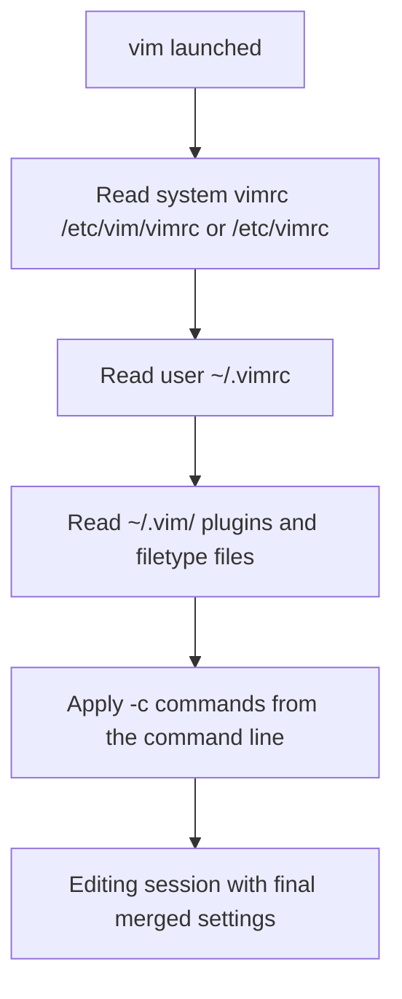

# Vim Configuration vimrc

Vim's behavior is controlled by a plain-text configuration file, the `vimrc`. A well-tuned `~/.vimrc` transforms Vim from a bare, vi-compatible editor into a comfortable, consistent, and safer tool. This note covers where the config lives, the settings that matter most for administration, and how to keep it portable and secure across Debian/Ubuntu and RHEL-family systems.

## Overview

When Vim starts it reads a **system-wide** configuration and then a **per-user** one, applying user settings last so they win. Options are set with `set`, key mappings with `map`/`nnoremap`, and per-filetype tweaks with autocommands. Because Vim reads the file top to bottom, order matters — notably, `set nocompatible` must come first.

This note complements [Vi-and-Vim-Editor](Vi-and-Vim-Editor.md) (installing/using Vim) and configures the behaviors described in [Vim-Modes](Vim-Modes.md) and [Search-and-Replace-in-Vim](Search-and-Replace-in-Vim.md).

> [!IMPORTANT]
> The very first line of a hand-written `~/.vimrc` should be `set nocompatible`. Without it, Vim may fall back to strict vi behavior and disable multi-level undo, syntax highlighting, and other modern features.

## Concepts

### Configuration file locations

| Scope | Debian / Ubuntu | RHEL / CentOS / Fedora |
|-------|-----------------|------------------------|
| System-wide | `/etc/vim/vimrc` (and `/etc/vim/vimrc.local`) | `/etc/vimrc` |
| Per-user | `~/.vimrc` | `~/.vimrc` |
| Runtime/plugins | `/usr/share/vim/` | `/usr/share/vim/` |
| Per-user runtime | `~/.vim/` | `~/.vim/` |

> [!NOTE]
> The mere **existence** of `~/.vimrc` makes Vim start in `nocompatible` mode automatically. But when you invoke `vim -u NONE` or run `vim.tiny`, that default does not apply — so set it explicitly.

### Setting options

| Syntax | Meaning |
|--------|---------|
| `set option` | Enable a boolean option |
| `set nooption` | Disable a boolean option |
| `set option=value` | Set a valued option |
| `set option?` | Query the current value |
| `set option!` | Toggle a boolean option |

### Precedence

System `vimrc` → per-user `~/.vimrc` → command-line `-c` commands. Later sources override earlier ones, which is why personal settings belong in `~/.vimrc`.

## Architecture



## Configuration

### A practical, well-commented `~/.vimrc`

```vim
" ~/.vimrc — practical defaults for a Linux administrator

" --- Core behavior ---
set nocompatible          " Use full Vim features (must be first)
filetype plugin indent on " Detect file types, load plugins and indent rules
syntax on                 " Enable syntax highlighting

" --- Display ---
set number                " Absolute line numbers
set ruler                 " Show line/column in the status area
set showcmd               " Show partial commands as you type them
set showmode              " Show -- INSERT -- / -- VISUAL -- indicators
set laststatus=2          " Always show the status line
set cursorline            " Highlight the line the cursor is on
set scrolloff=3           " Keep 3 lines of context above/below the cursor

" --- Indentation ---
set expandtab             " Insert spaces instead of tab characters
set tabstop=4             " A tab is displayed as 4 columns
set shiftwidth=4          " Autoindent uses 4 columns
set softtabstop=4         " Backspace removes 4 spaces at once
set autoindent            " Copy indent from the current line to the new one

" --- Search ---
set incsearch             " Show matches while typing the search
set hlsearch              " Highlight all matches
set ignorecase            " Case-insensitive search...
set smartcase             " ...unless the pattern has an uppercase letter

" --- Editing safety ---
set backspace=indent,eol,start  " Sane backspace behavior in Insert mode
set undofile              " Persistent undo across sessions
set nomodeline            " Do not execute in-file modelines (security)

" --- Quality-of-life mappings ---
nnoremap <silent> <C-l> :nohlsearch<CR>   " Ctrl-L clears search highlight
```

### YAML / Python filetype tuning

Tab-vs-space mistakes break YAML and Python. Enforce spaces automatically per filetype:

```vim
" Two-space indent for YAML; strict spaces for Python
autocmd FileType yaml setlocal ts=2 sts=2 sw=2 expandtab
autocmd FileType python setlocal ts=4 sts=4 sw=4 expandtab
```

### Relocating swap, backup, and undo files

By default Vim litters the working directory with `.swp` and `~` files. Keep them in one private place:

```vim
" Centralize scratch files under ~/.vim/ (create these dirs first)
set directory=~/.vim/swap//     " swap files
set backupdir=~/.vim/backup//   " backup files
set undodir=~/.vim/undo//       " persistent undo files
```

Create the directories once:

```bash
mkdir -p ~/.vim/{swap,backup,undo}
chmod 700 ~/.vim ~/.vim/swap ~/.vim/backup ~/.vim/undo
```

> [!TIP]
> The trailing `//` on these paths tells Vim to build the scratch filename from the file's **full path**, preventing name collisions when two files in different directories share a basename.

## Commands

### Applying and testing changes without restarting

```vim
:source ~/.vimrc     " Reload the config in the current session
:set number?         " Check whether an option is on
:verbose set expandtab?   " Show where an option was last set
:options             " Open the interactive option browser
```

### Which vimrc is in effect

```vim
:echo $MYVIMRC       " Path to the user vimrc Vim actually loaded
:scriptnames         " List every sourced script in load order
```

## Examples

### Minimal server-safe config

On a shared production box you may want a tiny, predictable config:

```vim
" ~/.vimrc — minimal, predictable
set nocompatible
syntax on
set number
set expandtab shiftwidth=4 tabstop=4
set incsearch hlsearch ignorecase smartcase
set nomodeline
```

### Version-controlling your dotfile

```bash
# Keep your vimrc in a dotfiles repo and symlink it onto each host
git clone https://example.com/you/dotfiles.git ~/dotfiles
ln -sf ~/dotfiles/vimrc ~/.vimrc
```

> [!NOTE]
> **📸 Screenshot**
> _Capture: Vim editing ~/.vimrc itself, with syntax highlighting coloring the comments green, set commands, and string values, line numbers visible on the left_

## Best Practices

- **Put `set nocompatible` first** and `filetype plugin indent on` + `syntax on` near the top.
- **Comment every non-obvious setting** — a `vimrc` is documentation for your future self and teammates.
- **Use `expandtab` for YAML/Python** and set width per filetype with autocommands.
- **Centralize swap/backup/undo** into `~/.vim/` with `0700` permissions rather than scattering them.
- **Version-control your dotfiles** so every server you touch behaves the same.
- **Keep a system default too** (`/etc/vim/vimrc.local` on Debian) for settings all users should share, but never store secrets there.

## Security Considerations

- **Disable modelines with `set nomodeline`.** A modeline is a specially formatted comment inside a file that Vim can read as configuration; historically, crafted modelines have been used to trigger code execution. Turning them off means opening an untrusted file cannot silently change your Vim settings or run code. If you must keep modelines, restrict them with `set modelines=0` as a defense-in-depth measure.
- **Restrict `viminfo`.** The `~/.viminfo` file records command history, search terms, registers, and marks — which can include fragments of sensitive files. Limit or disable it on shared/sensitive hosts:

```vim
" Limit what is persisted; '0 = no file marks, disable if truly sensitive
set viminfo='20,<50,s10,h
" Or disable entirely:
" set viminfo=
```

- **Protect swap and undo files.** Persistent `undofile` and `.swp` files can contain the full contents of edited files (e.g. `/etc/shadow`). Keep `undodir`/`directory` under a `0700` directory owned by you, and avoid persistent undo when editing secrets.
- **Never source an untrusted `vimrc` or plugin.** A `vimrc` is executable configuration; a malicious one can run shell commands via autocommands. Review third-party configs before use, and be cautious with `exrc`/`set exrc` which reads a project-local `.vimrc` from the current directory (`set noexrc` unless you fully trust every directory you edit in).

> [!WARNING]
> Setting `set exrc` makes Vim read a `.vimrc` from whatever directory you launch it in. An attacker who can drop a `.vimrc` into a directory you edit in can then run commands as you. Leave `exrc` off (the default) on any multi-user or download directory.

## Troubleshooting

| Symptom | Cause | Fix |
|---------|-------|-----|
| Settings ignored | Editing `~/.vimrc` but running `vim.tiny`/`vim -u NONE` | Install full `vim`; check `:echo $MYVIMRC` |
| Syntax highlighting off | `syntax on` missing or `filetype` detection off | Add `syntax on` and `filetype plugin indent on` |
| `E319`/option errors on start | Typo or option unsupported by this Vim build | `:scriptnames` and `:messages` to find the failing line |
| Swap-file warnings everywhere | `directory` not writable / dir missing | Create `~/.vim/swap` with `0700`, set `directory=~/.vim/swap//` |
| Tabs still inserted in YAML | Filetype autocmd not loaded | Ensure `filetype plugin indent on` precedes the autocmds |
| Config change not taking effect | Session started before the edit | `:source ~/.vimrc` or restart Vim |

## References

- Vim options reference — `:help options`, `:help vimrc`
- Vim security notes on modelines — `:help modeline`, `:help 'modelines'`
- Vim `viminfo` — `:help viminfo`
- Vim documentation — https://www.vim.org/docs.php

## Related

- [Vi-and-Vim-Editor](Vi-and-Vim-Editor.md) — installing and running the editor this config tunes
- [Vim-Modes](Vim-Modes.md) — the modal behavior these options affect
- [Search-and-Replace-in-Vim](Search-and-Replace-in-Vim.md) — configured here via `hlsearch`, `incsearch`, `smartcase`
- [Vim-Command](Vim-Command.md) — Vim command reference
- [Editor-Productivity-Tips](Editor-Productivity-Tips.md) — workflow habits that build on a good config
- [Linux Administration & Server Hardening](../Readme.md) — Linux administration & server hardening hub
