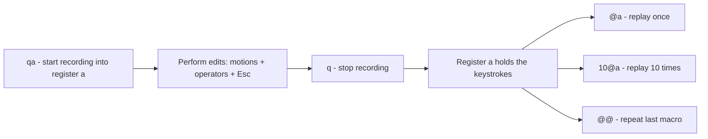

# Vim Macros

A Vim macro records a sequence of keystrokes into a register and replays them on demand. Macros turn a repetitive, error-prone edit — reformatting a hundred config lines, wrapping each entry in quotes, renumbering a list — into a single command, making them one of the most powerful productivity tools an administrator has.

## Overview

A macro is simply **a recording of the exact keys you press**, stored in a named register (`a`–`z`). You record once, then play it back as many times as needed. Because a macro replays literal keystrokes in Normal mode, anything you can do by hand you can automate — no scripting language required.

Macros build directly on Vim's modal grammar ([Vim-Modes](Vim-Modes.md)) and pair naturally with search/replace ([Search-and-Replace-in-Vim](Search-and-Replace-in-Vim.md)) for structured bulk edits.

> [!IMPORTANT]
> The core workflow is: **`q{register}`** to start recording, do your edits, **`q`** to stop, then **`@{register}`** to replay. `@@` repeats the last-played macro.

## Concepts

### Registers

Macros are stored in the same named registers used for yank/paste. Register `a` through `z` each hold one macro (or one block of yanked text). This means you can keep several macros ready at once — one in `a`, another in `b`.

### Recording, playback, and repetition

| Command | Action |
|---------|--------|
| `q{a-z}` | Start recording into register `{a-z}` |
| `q` | Stop recording (while recording) |
| `@{a-z}` | Play the macro in register `{a-z}` once |
| `@@` | Replay the **last** executed macro |
| `{count}@{a-z}` | Play the macro `count` times, e.g. `10@a` |
| `Q` (Ex mode) / `@:` | `@:` repeats the last `:` command line |

### Appending to a macro

Recording into an **uppercase** register **appends** to the existing macro instead of overwriting it. So `qA` continues recording onto whatever is already in register `a`.

### Editing a macro

Because a macro is just text in a register, you can paste it, fix it, and load it back:

```text
"ap        paste register a into the buffer to inspect it
... edit the keystrokes ...
"ayy       yank the corrected line back into register a
```

## Architecture



## Commands

### Making macros repeatable

A robust macro should position the cursor for the **next** iteration as its last action — typically by moving to the next line with `j` and to the start with `0`, or by using a search (`n`) so playback lands exactly on the next target regardless of line length.

```vim
" Optional: view the raw contents of macro register a
:registers a
```

## Examples

### Quote every line and add a trailing comma

Turn a list of bare words into a quoted, comma-terminated list.

```text
Starting file:
  alpha
  bravo
  charlie

1. Cursor on line "alpha"
2. qa            -> begin recording into register a
3. I"            -> Insert at start, type a double quote, Esc? no, keep typing:
   type: "
   Esc
4. A",           -> Append at end, type ",  then Esc
   Esc
5. j0            -> move to next line, column 0 (sets up next iteration)
6. q             -> stop recording
7. 2@a           -> replay twice for the remaining lines
```

Result:

```text
  "alpha",
  "bravo",
  "charlie",
```

### Renumber a list using an increment

Combine a macro with `Ctrl+a` (increment the number under the cursor):

```text
1. Put "1." on the first line manually
2. yyp           -> duplicate the line
3. Ctrl+a        -> increment the number (1 -> 2)
... or record this as a macro and replay N times.
```

### Replay across all matching lines with `:g`

Instead of counting repetitions, run a macro on every line matching a pattern:

```vim
:g/^server/normal @a
```

For every line starting with `server`, execute macro `a` in Normal mode. This is often cleaner than guessing a repeat count.

> [!TIP]
> Use a large repeat count and let the macro fail safely at end-of-file: `99@a`. When a motion in the macro can no longer be performed (e.g. `j` past the last line), playback stops automatically. This works only if the macro errors at the boundary rather than looping.

> [!NOTE]
> **📸 Screenshot**
> _Capture: Vim status line showing the "recording @a" indicator at the bottom of the screen while a macro is being recorded, with a column of list items being quoted in the buffer above_

## Best Practices

- **Start each macro from a predictable position** — press `0` (or `^`) at the beginning so the macro does not depend on where the cursor happened to be.
- **End each macro by advancing to the next target** (`j0` or `n`) so repeated playback flows line to line.
- **Prefer motions over arrow-key counts.** Use `w`, `f,`, `t"`, `$` instead of pressing `l` a fixed number of times — the macro then adapts to varying line content.
- **Test on one line, then batch.** Play the macro once (`@a`), verify the result, then apply the count (`10@a`).
- **Use `:g/pattern/normal @a`** for "run on every matching line" instead of a fragile repeat count.
- **`u` undoes an entire macro run** if the count went too far — one undo step per macro execution.

## Security Considerations

- **Macros replay whatever you recorded, including `:!shell` commands.** A macro that contains a shell escape will run that command on every playback with the Vim process's privileges (root under `sudo vim`). Review a macro's contents (`:registers`) before replaying it on a privileged session.
- **Macros loaded from a shared `viminfo` or pasted from an untrusted source are code.** Do not blindly `@` a register whose contents you have not inspected; a crafted keystroke sequence could execute commands.
- **Bulk edits on security-critical files** (sudoers, sshd_config, firewall rules) can propagate a single mistake across dozens of lines. Run the file's validator (`visudo -c`, `sshd -t`) after a macro batch, and keep a pre-edit backup.

> [!WARNING]
> A macro replayed with a high count on the wrong buffer can make sweeping changes before you notice. Always confirm which file is active and keep a backup before large macro runs on production configs.

## Troubleshooting

| Symptom | Cause | Fix |
|---------|-------|-----|
| Macro drifts / edits the wrong column after a few lines | Macro relies on cursor position instead of a repeatable start | Add `0` at the start and a reliable motion at the end |
| Playback stops early | A motion failed (e.g. `f;` with no `;` on that line) | Make the macro tolerant, or fix the outlier line manually |
| `@a` does nothing | Register `a` is empty or you never stopped recording | Re-record; ensure you pressed `q` to finish |
| Macro includes stray characters | You pressed extra keys while recording | Re-record cleanly; inspect with `:registers a` |
| Runaway change across the whole file | Count too large / wrong buffer | Press `u` to undo the entire macro execution |
| Recording indicator won't turn off | Still in recording mode | Press `q` (in Normal mode) to stop |

## References

- Vim macro / recording documentation — `:help recording`, `:help q`, `:help @`
- Vim registers — `:help registers`
- Vim `:normal` command — `:help :normal`
- Vim documentation — https://www.vim.org/docs.php

## Related

- [Vim-Modes](Vim-Modes.md) — macros record Normal-mode keystrokes; understanding modes is prerequisite
- [Search-and-Replace-in-Vim](Search-and-Replace-in-Vim.md) — combine `:g` and `:s` with macros for structured bulk edits
- [Vi-and-Vim-Editor](Vi-and-Vim-Editor.md) — the editor macros run in
- [Vim-Command](Vim-Command.md) — Vim command reference
- [Editor-Productivity-Tips](Editor-Productivity-Tips.md) — broader speed-and-safety workflow habits
- [Linux Administration & Server Hardening](../Readme.md) — Linux administration & server hardening hub
