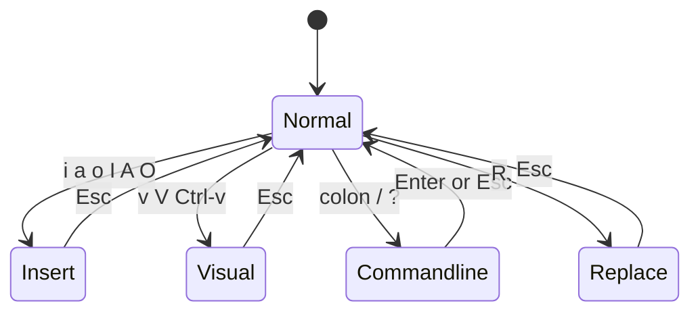

# Vim Modes

The single concept that separates Vim from every other editor is **modes**. In Vim the same key does different things depending on which mode is active — this is what makes Vim confusing to newcomers and fast for experts. Understanding the modes and how to move between them is the foundation of all Vim usage.

## Overview

Vim is a **modal editor**. When you open a file you land in **Normal mode**, where letters are commands, not text. To type text you switch to **Insert mode**; to select a region you use **Visual mode**; to run editor commands (save, quit, search/replace) you use **Command-line mode**. Every mode returns to Normal mode with `Esc` (or `Ctrl+[`).

Mastering the transitions between modes eliminates the "why is my text turning into commands?" frustration and is the prerequisite for the workflows in [Search-and-Replace-in-Vim](Search-and-Replace-in-Vim.md) and [Vim-Macros](Vim-Macros.md).

> [!IMPORTANT]
> `Esc` is the universal "get back to safety" key. If you are ever unsure what mode you are in, press `Esc` a couple of times — you will be in Normal mode, from which every command is reachable.

## Concepts

### The six modes

| Mode | Enter from Normal with | Purpose |
|------|------------------------|---------|
| Normal (Command) | `Esc` (default on start) | Move, delete, copy, and issue operator commands |
| Insert | `i` `a` `o` `I` `A` `O` | Type and insert text |
| Visual | `v` `V` `Ctrl+v` | Select characters, lines, or blocks |
| Command-line (Last-line) | `:` `/` `?` | Run ex commands, search |
| Replace | `R` | Overtype existing text |
| Select | rarely used directly | Mouse-driven selection that types over |

### Normal mode — the home base

Normal mode is where you spend most of your time. Keys move the cursor and act as **operators** that combine with **motions**:

| Category | Keys |
|----------|------|
| Movement | `h` `j` `k` `l` (left/down/up/right), `w` `b` `e` (word), `0` `^` `$` (line), `gg` `G` (file) |
| Delete | `x` (char), `dd` (line), `dw` (word), `d$` (to end of line) |
| Copy / paste | `yy` (yank line), `yw` (yank word), `p` / `P` (paste) |
| Change | `cw` (change word), `cc` (change line), `r` (replace one char) |
| Undo / redo | `u` / `Ctrl+r` |

### Insert mode — entering text

Several keys enter Insert mode at different positions:

| Key | Where insertion begins |
|-----|------------------------|
| `i` | Before the cursor |
| `a` | After the cursor |
| `I` | At the first non-blank of the line |
| `A` | At the end of the line |
| `o` | On a new line **below** |
| `O` | On a new line **above** |

Press `Esc` to leave Insert mode and return to Normal mode.

### Visual mode — selecting

| Key | Selection type |
|-----|----------------|
| `v` | Character-wise |
| `V` | Line-wise |
| `Ctrl+v` | Block-wise (columnar) |

Once text is selected you can operate on it: `d` deletes, `y` yanks, `>` indents, `u`/`U` change case, `:` starts a range command over the selection.

### Command-line mode — ex commands

Typing `:` in Normal mode drops to the last line for **ex commands**: `:w` (write), `:q` (quit), `:s` (substitute), `:g` (global), `:set` (options). Typing `/` or `?` starts a forward or backward search. Press `Enter` to run or `Esc` to cancel.

### Replace mode

`R` enters Replace mode, where typing overwrites existing characters instead of inserting. `Esc` returns to Normal mode.

## Architecture



## Commands

### Identifying and switching modes

```vim
" Show the current mode name in the status area
:set showmode

" Always show the status line (helps see the mode/file/position)
:set laststatus=2
```

With `showmode` on, Vim prints `-- INSERT --`, `-- VISUAL --`, or `-- REPLACE --` at the bottom of the screen; a blank there means you are in Normal mode.

### Operator + motion grammar

Normal-mode power comes from combining an **operator** with a **motion** or **text object**:

```text
operator   motion/text-object      result
d          w                       delete to next word
d          $                       delete to end of line
c          i"                      change text inside quotes
y          ap                      yank a paragraph
=          G                       reindent to end of file
```

## Examples

### A typical edit cycle

```text
1. vim config.conf        -> opens in Normal mode
2. /timeout   + Enter     -> search, cursor jumps to "timeout" (Command-line search)
3. cw                     -> change the word (enters Insert mode)
4. type the new value     -> Insert mode
5. Esc                    -> back to Normal mode
6. :wq  + Enter           -> save and quit (Command-line mode)
```

### Block editing with Visual-Block mode

To comment out five consecutive lines by inserting `#` at the start:

```text
1. Move to the first line's column 0
2. Ctrl+v                 -> Visual-Block mode
3. jjjj                   -> extend the block down 4 lines
4. I                      -> insert at the left of the block
5. #                      -> type the comment character
6. Esc                    -> the # is applied to all selected lines
```

> [!NOTE]
> **📸 Screenshot**
> _Capture: Vim terminal showing the -- INSERT -- indicator at the bottom-left of the status area while text is being typed into a configuration file, with line numbers on the left_

## Best Practices

- **Return to Normal mode after every edit.** Habitually press `Esc` so the next keystroke is a command, not stray text.
- **Stay in Normal mode when reading.** Navigate with `h/j/k/l`, `w/b`, `gg/G`, `Ctrl+d`/`Ctrl+u` rather than entering Insert mode by accident.
- **Learn text objects** (`iw`, `i"`, `ip`, `it`) — they make operators far more precise than counting characters.
- **Enable `showmode` and `laststatus=2`** so the current mode is always visible while learning.
- **Prefer `cw`/`ciw` over deleting then inserting** — one motion instead of two.

## Security Considerations

- Editing files is done in Normal/Insert/Visual/Command-line modes, but Command-line mode is also where `:!command` (shell execution) and `:w !sudo tee %` live. Be deliberate: a command typed into Command-line mode runs with the privileges of the user running Vim (root, if you used `sudo vim`).
- Accidentally staying in Insert mode and pasting into a config file can silently corrupt it (auto-indent staircase, or literal control characters). Verify the file after large pastes; use `:set paste` before pasting and `:set nopaste` after (see [Vim-Configuration-vimrc](Vim-Configuration-vimrc.md)).
- Replace mode (`R`) overwrites in place — easy to unintentionally clobber adjacent settings in a dense config. Prefer `cw`/`ciw` targeted changes on sensitive files.

## Troubleshooting

| Symptom | Cause | Fix |
|---------|-------|-----|
| Typed letters run commands / delete text | You are in Normal mode, expecting Insert | Press `i` to insert, or `Esc` first if unsure |
| Text won't type; screen flickers | Not in Insert mode | `i`/`a`/`o` to enter Insert mode |
| `Esc` seems to do nothing | Already in Normal mode (that is fine) | Proceed with your command |
| Pasting produces cascading indentation | Auto-indent active in Insert mode | `:set paste`, paste, then `:set nopaste` |
| Stuck in Visual mode highlighting | Entered Visual with `v` | Press `Esc` to clear the selection |
| Overtyping instead of inserting | Accidentally pressed `R` (Replace) | Press `Esc`, then `i` |

## References

- Vim user manual, "Modes" — `:help vim-modes`
- Interactive tutorial — run `vimtutor`
- Vim documentation — https://www.vim.org/docs.php

## Related

- [Vi-and-Vim-Editor](Vi-and-Vim-Editor.md) — installing and using the vi/Vim editor
- [Search-and-Replace-in-Vim](Search-and-Replace-in-Vim.md) — Command-line-mode search and substitution
- [Vim-Macros](Vim-Macros.md) — recording and replaying keystrokes in Normal mode
- [Vim-Command](Vim-Command.md) — Vim command reference
- [Vim-Configuration-vimrc](Vim-Configuration-vimrc.md) — configuring mode-related behavior
- [Linux Administration & Server Hardening](../Readme.md) — Linux administration & server hardening hub
