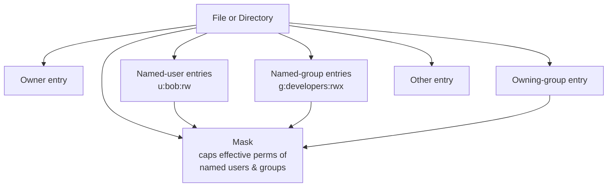

# Access Control List (ACL) in Linux

## Overview

Access Control Lists (ACLs) extend the standard Linux permission model by enabling you to grant fine-grained permissions to multiple users and groups for files and directories beyond the traditional owner-group-other scheme. With ACLs you can specify detailed access rights for many individual users and groups on the same object, overcoming the limitations of basic mode bits.

> [!NOTE]
> The traditional UNIX model allows only **one** owning user and **one** owning group per file. ACLs remove that restriction, letting you attach an arbitrary number of named-user and named-group entries.

## Why Use ACL?

| Benefit | Description |
| :-- | :-- |
| **Granular control** | Assign different permissions to different users and groups, beyond just the file owner or primary group. |
| **Flexible collaboration** | Allow or deny specific access to users without changing file ownership or group membership. |
| **Enhanced security** | Fine-tune access in shared environments such as team folders or project directories. |

## Key Concepts

- **Standard Permissions**: Linux uses three permission sets per file/directory: *user (owner)*, *group*, and *others*.
- **Extended Permissions (ACLs)**: Allow specifying permissions for multiple individual users and groups.
- **Supported Filesystems**: Filesystems like ext3, ext4, and XFS support ACLs *if* mounted with the `acl` option enabled.

### The ACL Permission Model



Each file or directory can carry:

- **User entries**: Permissions for individual users.
- **Group entries**: Permissions for specific groups.
- **Other**: Permissions for everyone else not mentioned.
- **Mask entry**: Sets the maximum effective permissions for users and groups besides the owner.

## Commands

| Command | Description | Example |
| :-- | :-- | :-- |
| `getfacl <file>` | View ACL for a file or directory | `getfacl myfile.txt` |
| `setfacl -m u:user:perm <file>` | Set ACL for a user (modify/add entry) | `setfacl -m u:bob:rw myfile.txt` |
| `setfacl -m g:group:perm <file>` | Set ACL for a group | `setfacl -m g:developers:rwx project/` |
| `setfacl -x u:user <file>` | Remove ACL for a user | `setfacl -x u:bob myfile.txt` |
| `setfacl -b <file>` | Remove all ACL entries (reset to default) | `setfacl -b myfile.txt` |
| `setfacl -m d:u:user:perm <directory>` | Set default ACL (applies to new items in directory) | `setfacl -m d:u:bob:rw sharedir/` |

## Configuration

### Enabling ACL on the Filesystem

Mount the filesystem with ACL support:

```bash
mount -o acl /dev/sdX /mountpoint
```

To make this permanent, edit `/etc/fstab`:

```bash
/dev/sdX /mountpoint ext4 defaults,acl 0 0
```

```bash
vim /etc/fstab
```

```bash
UUID=50705329-bc44-4c8c-a9c4-cf017a00404e /                       xfs     defaults        0 0
UUID=e8b49578-4abd-4328-9199-9a670eec4376 /boot                   xfs     defaults        0 0
UUID=04173dec-b439-43a6-bfde-6aa6e2000083 none                    swap    defaults        0 0
```

Install ACL tools if not already installed:

```bash
yum install acl
```

> [!TIP]
> Most modern distributions mount ext4/XFS with ACL support **enabled by default**, so an explicit `acl` mount option is often unnecessary. Verify with `tune2fs -l /dev/sdX | grep "Default mount options"` on ext filesystems.

## Examples

### Viewing ACLs

Use `getfacl` to display ACL entries for files and directories:

```bash
getfacl /path/to/file_or_directory
```

```bash
getfacl /data
```

Recursive ACL display:

```bash
getfacl -R /path/to/directory
```

```bash
getfacl -R /data
```

> [!NOTE]
> A `+` in an `ls -l` listing (e.g., `-rw-rw-r--+`) indicates the presence of ACLs on that object.

> [!NOTE]
> **📸 Screenshot**
> _Capture: Terminal showing ls -l output with a trailing plus sign on a file and the getfacl output listing user, named-user, group, mask, and other entries_

### Setting ACL Entries

Add or modify ACL entries with `setfacl -m`.

Add user permissions:

```bash
setfacl -m u:username:permissions filename
```

```bash
setfacl -m u:armour:rwx /data
```

Add group permissions:

```bash
setfacl -m g:groupname:permissions filename
```

```bash
setfacl -m g:EMP:rwx /data
```

Recursive set ACL on a directory:

```bash
setfacl -R -m u:armour:rwx /data
```

### Default ACLs on Directories

Default ACLs apply automatically to newly created files and directories inside the directory:

```bash
setfacl -d -m u:username:permissions directory
```

```bash
setfacl -d -m u:armour:rwx /data
```

### Removing ACL Entries

Remove a specific ACL entry:

```bash
setfacl -x u:armour /data
```

```bash
setfacl -d -x u:armour /data
```

```bash
setfacl -x g:EMP /data
```

Remove all ACL entries and reset to traditional permissions:

```bash
setfacl -b /data
```

Recursive removal:

```bash
setfacl -R -b /data
```

### Command Summary

| Action | Command Example | Description |
| :-- | :-- | :-- |
| View ACL | `getfacl filename` | Show ACL entries |
| Set ACL for user | `setfacl -m u:armour:rwx /data2` | Add rwx for user "armour" |
| Set ACL for group | `setfacl -m g:IT:rwx /data2` | Add rwx for group "IT" |
| Set default ACL on directory | `setfacl -d -m u:armour:rwx /data2` | Default ACL applies to new files |
| Remove specific ACL entry | `setfacl -x u:armour /data2` | Remove user "armour"'s ACL |
| Remove all ACL entries | `setfacl -b /data2` | Remove all ACLs |
| Recursive set ACL | `setfacl -R -m u:armour:rwx /data` | Recursively set ACL |
| List ACLs using chacl | `chacl -l filename` | Alternative ACL list command |

### Using `chacl` (Alternative ACL Tool)

List ACLs:

```bash
chacl -l filename_or_directory
```

```bash
chacl -l pass.txt
```

```bash
chacl -l dir1/
```

`chacl` can also modify ACLs, with flags:

| Flag | Meaning |
| :-- | :-- |
| `-b` | Change both file access ACL and directory default ACL |
| `-d` | Set only directory default ACL |
| `-r` | Recursive access ACL setting |
| `-D` | Remove directory default ACL |
| `-B` | Remove all ACLs |

## Best Practices

- Prefer ACLs over creating many single-purpose groups when access requirements are complex and change often.
- Use **default ACLs** on shared parent directories so new files inherit the correct access automatically.
- Keep the **mask** in mind: named-user and named-group effective permissions are capped by the mask; `setfacl` recalculates it unless you set it explicitly with `m::perm`.
- Document non-obvious ACLs; they are easy to overlook because they do not appear in a plain `ls -l` beyond the `+` indicator.

## Security Considerations

- ACLs can silently widen access. Audit them during reviews with `getfacl -R` on sensitive trees rather than relying on `ls -l` alone.
- A trailing `+` is the only signal in a standard listing that extended permissions exist — train responders to look for it.
- Backups and archive tools (`tar`, `rsync`, `cp`) must be invoked with ACL-aware flags (`--acls`, `-a`/`-p`, `cp --preserve=all`) or ACLs are lost on restore, potentially failing open or closed unexpectedly.
- Removing ACLs with `setfacl -b` reverts to the base mode bits — confirm those base bits are themselves least-privilege before relying on the reset.

## Additional Notes

- **Mask entry**: ACLs include a mask limiting effective permissions for groups and named users.
- **Presence indicator**: `ls -l` shows a trailing `+` on files/directories with ACLs.
- **Default ACLs** apply to newly created files/directories only.
- ACL usage is ideal for multi-user environments needing fine-grained access controls without changing ownership or group membership.

## Related

- [Linux-Permissions](Linux-Permissions.md) — base permission model ACLs extend
- [Linux-Permission-Assignment](Linux-Permission-Assignment.md) — assigning standard mode bits
- [chmod](chmod.md) — set mode bits
- [chown](chown.md) — change ownership
- [Special-Permission](Special-Permission.md) — SUID/SGID/sticky bits
- [Linux Administration & Server Hardening](../Readme.md) — course hub.
