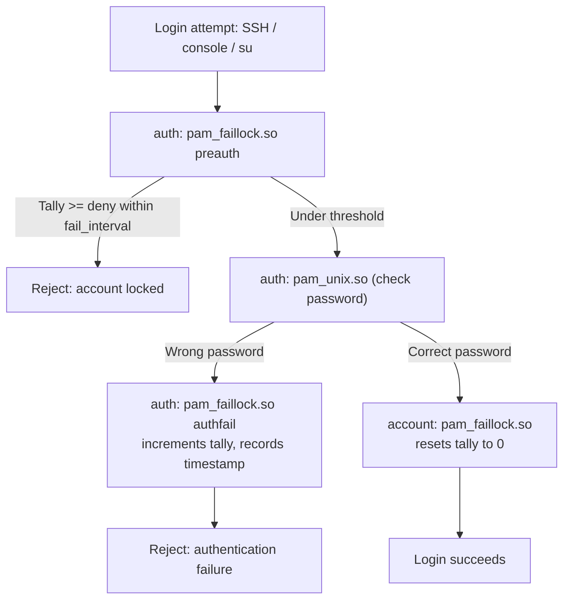

# Account Lockout with pam_faillock

`pam_faillock` is the PAM module that locks a local user account after a configurable number of consecutive failed login attempts, defending against online password-guessing and brute-force attacks against console, SSH, and `su`/`sudo` logins.

## Overview

| Item | Value |
|---|---|
| Module | `pam_faillock.so` |
| Config file | `/etc/security/faillock.conf` |
| Tally directory | `/var/run/faillock/` (tmpfs, per-user file) |
| Query/reset tool | `faillock` |
| Predecessor | `pam_tally2` (deprecated, removed from Linux-PAM 1.5.2+) |
| RHEL/CentOS wiring | `authselect enable-feature with-faillock` |
| Debian wiring | manual edit of `/etc/pam.d/common-auth` / `common-account` |

> [!NOTE]
> `pam_faillock` tracks failures **per user, per PAM service** by default (a failed SSH login and a failed console login count toward the same tally unless you scope it). It does not touch `/etc/shadow`'s own lock state (`passwd -l`) — a faillock lock and a shadow-file lock are two independent mechanisms and both must be checked when troubleshooting a login failure.

## How It Works

The module is invoked twice in the `auth` stack (once before the password is checked, once after) and once in the `account` stack. The "preauth" call checks whether the account is already locked *before* wasting a password check; the "authfail" call increments the tally *after* a wrong password; the `account` call resets the tally to zero on a fully successful login.



## Configuration

### Step 1: Set Policy in `/etc/security/faillock.conf`

This file holds the tunables; both distros use the same syntax once the module is wired into PAM.

> Example:

```bash
vim /etc/security/faillock.conf
```

```ini
# Number of consecutive failures before the account is locked
deny = 5

# Seconds the account stays locked before an automatic unlock (0 = admin must run --reset)
unlock_time = 900

# Sliding window in seconds during which failures accumulate toward "deny"
fail_interval = 900

# Also apply the lockout policy to root (root is exempt by default)
even_deny_root = yes
```

| Directive | Meaning |
|---|---|
| `deny` | Failed attempts allowed before the account locks. Default is `3`. |
| `unlock_time` | Seconds after the last failure before the module auto-unlocks the account. `0` disables auto-unlock — an administrator must run `faillock --reset`. |
| `fail_interval` | Rolling window (seconds) in which failures are counted; a failure older than this is not counted toward `deny`. Default is `900` (15 minutes). |
| `even_deny_root` | Root is normally never locked by pam_faillock. Set `yes` to include root — combine carefully with a working console/single-user recovery path. |

> [!IMPORTANT]
> Setting `unlock_time = 0` with `even_deny_root = yes` and no other admin access path is a classic self-inflicted denial of service: root and every user can lock themselves out with no automatic recovery. Keep a break-glass path (single-user mode, console access, or a second privileged account) before enabling that combination in production.

### Step 2: Wire the Module Into PAM

**CentOS Stream 10 / RHEL family** — never hand-edit `/etc/pam.d/system-auth` or `password-auth` directly; both are symlinks managed by `authselect` and your edits will be silently discarded on the next `authselect select`. Use the built-in feature instead:

```bash
authselect current
```

```bash
authselect enable-feature with-faillock
```

`authselect` regenerates `system-auth` and `password-auth` with the three `pam_faillock.so` lines inserted in the correct order automatically.

**Debian 12** — `pam_faillock.so` ships in `libpam-modules` but is not enabled by default; edit the PAM stacks by hand:

```bash
vim /etc/pam.d/common-auth
```

```text
auth    required                        pam_faillock.so preauth
auth    [success=1 default=ignore]      pam_unix.so nullok
auth    [default=die]                   pam_faillock.so authfail
```

```bash
vim /etc/pam.d/common-account
```

```text
account required                        pam_faillock.so
account required                        pam_unix.so
```

### The Three `pam_faillock` Lines

| Phase | Line | Purpose |
|---|---|---|
| `auth` (preauth) | `auth required pam_faillock.so preauth` | Runs **before** the password is checked; rejects immediately if the tally already exceeds `deny`. |
| `auth` (authfail) | `auth [default=die] pam_faillock.so authfail` | Runs **after** a failed `pam_unix.so` check; increments the failure tally and records the timestamp/source. |
| `account` | `account required pam_faillock.so` | Runs on a successful login; resets the user's tally to zero (the "authsucc" role, without needing an explicit argument). |

> [!NOTE]
> Both files (RHEL: `system-auth` + `password-auth`; Debian: `common-auth` + `common-account`) must carry matching entries — SSH, console login, `su`, and `sudo` all traverse these stacks, so an inconsistency between them produces confusing, service-specific lockout behaviour.

## Commands

### View a User's Lockout Status

```bash
faillock --user jdoe
```

> Example output (columns from the `faillock` man page format):

```text
jdoe / when                type            source                                      valid
2026-07-22 09:14:02        RHOST           192.168.1.50                                V
2026-07-22 09:14:11        RHOST           192.168.1.50                                V
2026-07-22 09:14:19        RHOST           192.168.1.50                                V
```

Three `V` (valid) entries within `fail_interval` at `deny = 3` means the account is now locked.

### Reset (Unlock) a User

```bash
faillock --user jdoe --reset
```

This clears the tally file immediately — use it instead of waiting out `unlock_time`, or when `unlock_time = 0` requires manual intervention.

### List All Users' Tallies

```bash
faillock
```

Run without `--user` to enumerate every account with a non-empty tally file under `/var/run/faillock/`.

## Deprecated: `pam_tally2`

`pam_faillock` **replaces** the older `pam_tally2` module. `pam_tally2` and its `pam_tally2` CLI were removed from upstream Linux-PAM starting with 1.5.2 and are absent from CentOS Stream 10 and current Debian entirely — do not write new configuration around it.

| Aspect | `pam_tally2` (deprecated) | `pam_faillock` (current) |
|---|---|---|
| Status | Removed upstream (Linux-PAM ≥ 1.5.2) | Actively maintained, default on RHEL 8/9/10 |
| Config location | Arguments on the PAM line itself | Centralized `/etc/security/faillock.conf` |
| CLI tool | `pam_tally2` | `faillock` |
| RHEL wiring | `authconfig --enablefaillock` (old) | `authselect enable-feature with-faillock` |
| Per-user reset | `pam_tally2 --user <u> --reset` | `faillock --user <u> --reset` |

## Best Practices

- Set `deny` and `fail_interval` to values that stop brute-force guessing without generating excessive help-desk tickets for typo-prone humans (a common baseline: `deny = 5`, `fail_interval = 900`, `unlock_time = 600`).
- Prefer `unlock_time = 0` (admin-only reset) only on systems with a reliable out-of-band unlock path — otherwise a sustained brute-force attempt becomes a self-service DoS against your own users.
- Enable `even_deny_root` only after confirming console or single-user-mode recovery works, and preferably alongside a break-glass local account.
- On RHEL/CentOS, always use `authselect enable-feature with-faillock`/`authselect select` rather than editing `system-auth`/`password-auth` by hand — those files are generated symlinks.
- Keep `common-auth`/`common-account` (Debian) or `system-auth`/`password-auth` (RHEL) in sync across both files so SSH, `su`, and `sudo` share consistent lockout behavior.

## Security Considerations

> [!WARNING]
> `pam_faillock` only throttles **local PAM-authenticated** logins. It does nothing against SSH key-based authentication, and it does not protect network services with their own authentication stack (a web app login form, a database, etc.). Pair it with `fail2ban`/`sshd` rate limiting and application-level lockout for full coverage.

- Failure records under `/var/run/faillock/` reset on reboot (tmpfs) unless the distro mounts a persistent path — factor that into forensic timelines.
- An attacker who can trigger lockouts (`even_deny_root = yes`, low `deny`) can weaponize the control itself as a denial-of-service against legitimate admins; balance sensitivity against availability.
- The `RHOST`/source column in `faillock --user` output is valuable for detecting distributed or scripted brute-force attempts — correlate it with `/var/log/secure` (RHEL) or `/var/log/auth.log` (Debian).

## Troubleshooting

| Symptom | Likely cause | Resolution |
|---|---|---|
| User locked out, correct password still rejected | Tally still within `fail_interval`, `unlock_time` not yet elapsed | `faillock --user <u> --reset` |
| `faillock` shows no records but login still fails | Separate lock via `/etc/shadow` (`passwd -l`) or account expiry, not pam_faillock | `passwd -S <u>`; unlock with `passwd -u <u>` or `usermod -U <u>` |
| Edits to `system-auth` disappear after reboot/update | File is an `authselect`-managed symlink | Re-apply with `authselect enable-feature with-faillock` (or build a custom profile with `authselect create-profile`) |
| Root gets locked unexpectedly | `even_deny_root = yes` combined with failed `su`/console attempts | `faillock --user root --reset`; reconsider `even_deny_root` policy |
| `faillock` command not found (Debian) | `libpam-modules` package missing or too old | `apt install libpam-modules` (Debian 12 ships a version with `pam_faillock`/`faillock`) |
| Lockout applies to SSH but not `su`, or vice versa | `pam_faillock.so` lines present in one PAM stack file but not the other | Add matching entries to both `system-auth`+`password-auth` (RHEL) or `common-auth`+`common-account` (Debian) |

## References

- [`pam_faillock(8)` — man7.org](https://man7.org/linux/man-pages/man8/pam_faillock.8.html)
- [`faillock(1)` — man7.org](https://man7.org/linux/man-pages/man1/faillock.1.html)
- [Red Hat Documentation: Locking user accounts after failed login attempts](https://docs.redhat.com/en/documentation/red_hat_enterprise_linux/9/html/configuring_basic_system_settings/assembly_locking-and-unlocking-user-accounts_configuring-basic-system-settings)
- `man authselect` / `man authselect-profiles` — feature-based PAM stack management on RHEL/CentOS

## Related

- [PAM-Pluggable-Authentication-Modules](PAM-Pluggable-Authentication-Modules.md) — the PAM framework pam_faillock plugs into
- [Password-Policy-with-pam_pwquality](Password-Policy-with-pam_pwquality.md) — companion PAM module enforcing password strength/composition
- [Shadow-File-Secure-User-Passwords-File](Shadow-File-Secure-User-Passwords-File.md) — the independent account-lock state in `/etc/shadow`
- [Sudo](Sudo.md) — privilege delegation whose `auth` stack also traverses pam_faillock
- [Users, Groups & Permissions](Readme.md) — module hub
- [Linux Administration & Server Hardening](../Readme.md)
