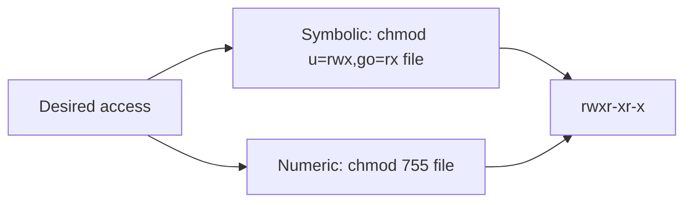

# Linux Permission Assignment

## Overview

Linux allows assigning file and directory permissions using two primary, interchangeable methods:

- **Symbolic Method** — human-readable letters and operators (`u+x`, `g-w`, `o=r`).
- **Numeric Method** — octal representation (`644`, `755`, `700`).

These permissions govern access to files and directories for three user classes: **owner (user)**, **group**, and **others**. This note is a hands-on companion to [Linux-Permissions](Linux-Permissions.md): where that note explains the permission *model*, this one focuses on *assigning* permissions correctly with `chmod` and predicting the defaults produced by `umask`.

## Concepts

### Two Ways to Express the Same Permissions



Both methods set the same underlying mode bits. The symbolic form is ideal for *relative* changes (add/remove one permission), while the numeric form is ideal for setting a complete, exact mode.

## Commands

### Symbolic Method

The symbolic method uses letters and symbols to assign permissions.

#### Syntax

```bash
chmod [user_class][operation][permission] file.txt
```

#### User Classes (`user_class`)

| Symbol | Description |
|--------|-------------|
| `u`    | User (owner) |
| `g`    | Group |
| `o`    | Others |
| `a`    | All (user + group + others) |

#### Operations (`operation`)

| Symbol | Description |
|--------|-------------|
| `+`    | Add permission |
| `-`    | Remove permission |
| `=`    | Set exact permission (overwrite existing permissions) |

#### Permission Types (`permission`)

| Symbol | Description |
|--------|-------------|
| `r`    | Read |
| `w`    | Write |
| `x`    | Execute |

#### Examples

Add execute permission for the owner:

```bash
chmod u+x file.txt
```

Remove write permission for others:

```bash
chmod o-w file.txt
```

Set read and write permissions for the group:

```bash
chmod g=rw file.txt
```

### Numeric Method

The numeric method assigns permissions using octal values.

#### Permission Values

| Permission   | Value |
|--------------|-------|
| Read (`r`)   | 4 |
| Write (`w`)  | 2 |
| Execute (`x`)| 1 |

> [!NOTE]
> For each user class (user, group, others), the values are added together to form a single octal digit.

#### Common Permission Combinations

| Permissions       | Octal |
|-------------------|-------|
| `rwx` (4+2+1)     | 7 |
| `rw-` (4+2)       | 6 |
| `r-x` (4+1)       | 5 |
| `r--` (4)         | 4 |
| `--x` (1)         | 1 |
| `---` (0)         | 0 |

#### Examples

`chmod 644` — Owner: `rw-` (6), Group: `r--` (4), Others: `r--` (4):

```bash
chmod 644 file.txt
```

`chmod 755` — Owner: `rwx` (7), Group: `r-x` (5), Others: `r-x` (5):

```bash
chmod 755 file.txt
```

### Symbolic ↔ Numeric Mapping

| Symbolic     | Numeric | Description |
|--------------|---------|-------------|
| `rwxr-xr-x`  | `755`   | Full permissions for owner, read and execute for group and others |
| `rw-r--r--`  | `644`   | Read and write for owner, read-only for group and others |
| `rwx------`  | `700`   | Private file or directory |
| `rw-------`  | `600`   | Private file |
| `rwxrwxrwx`  | `777`   | Full permissions for everyone |

## Viewing Permissions

Use the `ls -l` command to view file and directory permissions:

```bash
ls -l file.txt
```

Example output:

```text
-rw-r--r-- 1 user user 1024 Jun 23 10:00 file.txt
```

Permission breakdown:

```text
-rw-r--r--
││ │ │
││ │ └── Others (r--)
││ └──── Group (r--)
│└────── Owner (rw-)
└─────── File type (- = regular file)
```

### Common File Type Indicators

| Symbol | Type |
|--------|------|
| `-`    | Regular file |
| `d`    | Directory |
| `l`    | Symbolic link |
| `c`    | Character device |
| `b`    | Block device |

> [!NOTE]
> **📸 Screenshot**
> _Capture: Terminal output of ls -l showing the ten-character permission string with owner, group, and others fields visually separated_

## Configuration

### Default File Permission Calculation (umask)

When a file is created, Linux applies a **umask** to determine the final permissions.

Files are created with a maximum permission of:

```text
666 (rw-rw-rw-)
```

Execute permission is not assigned by default to files.

Formula:

```text
Final File Permission = 666 - umask
```

Example:

```bash
umask 022
```

```text
666 - 022 = 644
```

Result:

```text
rw-r--r--
```

| Class  | Default   | umask | Final     |
|--------|-----------|-------|-----------|
| Owner  | 6 (rw-)   | 0     | 6 (rw-)   |
| Group  | 6 (rw-)   | 2     | 4 (r--)   |
| Others | 6 (rw-)   | 2     | 4 (r--)   |

### Default Directory Permission Calculation (umask)

Directories are created with a maximum permission of:

```text
777 (rwxrwxrwx)
```

Directories keep their execute (traversal) bit, so the base is `777`.

Formula:

```text
Final Directory Permission = 777 - umask
```

Example:

```bash
umask 022
```

```text
777 - 022 = 755
```

Result:

```text
rwxr-xr-x
```

| Class  | Default   | umask | Final     |
|--------|-----------|-------|-----------|
| Owner  | 7 (rwx)   | 0     | 7 (rwx)   |
| Group  | 7 (rwx)   | 2     | 5 (r-x)   |
| Others | 7 (rwx)   | 2     | 5 (r-x)   |

> [!TIP]
> The subtraction formula is a convenient mental model, but strictly speaking umask is a *bitwise mask*: each masked bit is cleared. The results match for the common values, so `666 - umask` and `777 - umask` are reliable shortcuts in practice.

### Using the `umask` Command

Show the current umask:

```bash
umask
```

Show its symbolic representation:

```bash
umask -S
```

Set umask to `0000` — no restrictions on newly created files and directories:

```bash
umask 0000
```

Set umask to `0022` — typical default on many Linux systems:

```bash
umask 0022
```

Set umask to `0027` — more secure setting for multi-user systems:

```bash
umask 0027
```

### Common umask Values

| umask   | File Permissions      | Directory Permissions |
|---------|-----------------------|-----------------------|
| `0000`  | `666` (`rw-rw-rw-`)   | `777` (`rwxrwxrwx`)   |
| `0002`  | `664` (`rw-rw-r--`)   | `775` (`rwxrwxr-x`)   |
| `0022`  | `644` (`rw-r--r--`)   | `755` (`rwxr-xr-x`)   |
| `0027`  | `640` (`rw-r-----`)   | `750` (`rwxr-x---`)   |
| `0077`  | `600` (`rw-------`)   | `700` (`rwx------`)   |

> [!WARNING]
> A secure `umask` helps prevent unauthorized access to newly created files and directories, especially on shared systems. The CIS Benchmarks recommend a default of `027` (or stricter) for hardened multi-user hosts.

## Examples

### Give Owner Full Access

```bash
chmod 700 script.sh
```

Result:

```text
rwx------
```

### Make a Script Executable

```bash
chmod +x script.sh
```

### Allow Everyone to Read a File

```bash
chmod 644 document.txt
```

### Shared Directory for a Group

```bash
chmod 775 shared/
```

### Restrict Access to Sensitive Data

```bash
chmod 600 secrets.txt
```

## Best Practices

- Prefer the **numeric method** when setting a complete, known mode; use the **symbolic method** for targeted, relative changes.
- Never use `chmod 777` as a "fix" — it grants write access to every user on the system.
- Set a restrictive **umask** (`027` or `077`) in shell startup files on servers.
- Reserve `600`/`700` for sensitive files and private directories (keys, secrets, `~/.ssh`).
- Use `775` with an appropriate **owning group** (plus the SGID bit) for collaborative directories instead of loosening permissions to "others".

## Summary

### Permission Values

| Permission | Symbol | Numeric |
|------------|--------|---------|
| Read       | `r`    | `4` |
| Write      | `w`    | `2` |
| Execute    | `x`    | `1` |

### Common Actions

| Action | Symbolic | Numeric |
|--------|----------|---------|
| Add read permission to owner | `chmod u+r file` | — |
| Remove execute permission from group | `chmod g-x file` | — |
| Owner full access only | `chmod u=rwx file` | `chmod 700 file` |
| Read/write for owner, read-only for others | — | `chmod 644 file` |
| Full access for everyone | `chmod a+rwx file` | `chmod 777 file` |

### Default Permissions

| Object    | Default Before umask   |
|-----------|------------------------|
| File      | `666` (`rw-rw-rw-`)    |
| Directory | `777` (`rwxrwxrwx`)    |

### Common Secure Permissions

| Permission | Usage |
|------------|-------|
| `600`      | Private file |
| `644`      | Standard file |
| `700`      | Private directory or script |
| `755`      | Standard executable or directory |
| `775`      | Shared group directory |

## Related

- [Linux Administration & Server Hardening](../Readme.md) — course hub.
- [Linux-Permissions](Linux-Permissions.md) — the underlying permission model and ownership overview.
- [chmod](chmod.md) — assign mode bits.
- [chown](chown.md) — assign ownership.
- [chgrp](chgrp.md) — change a file's owning group.
- [Special-Permission](Special-Permission.md) — SUID, SGID, and sticky bits.
