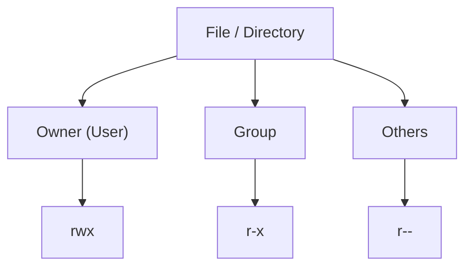

# Linux Permissions

## Overview

In Linux, **permissions** define *who* can access a file or directory and *what* they can do with it. This discretionary access control (DAC) system is the foundation of multi-user security on every Unix-like system: it enforces confidentiality, integrity, accountability, and controlled access across all users and processes.

Every file and directory carries an owner, an owning group, and a set of permission bits. The kernel consults these bits on every access attempt to decide whether an operation is allowed.

> [!NOTE]
> Permissions in Linux are *discretionary* — the file owner controls access. This differs from *mandatory* access control (MAC) systems such as SELinux or AppArmor, which layer additional, policy-enforced restrictions on top of the traditional permission model.

## Concepts

### The Three-Tiered Permission Model

Linux applies permissions to three distinct classes of user:

- **User (Owner)** — the user who owns the file.
- **Group** — the group associated with the file.
- **Others** — all remaining users on the system.

Each tier can be granted any combination of three permissions:

| Symbol | Permission | Bit Value |
|--------|------------|-----------|
| `r`    | Read       | 4 |
| `w`    | Write      | 2 |
| `x`    | Execute    | 1 |

### The Permission Model at a Glance



The kernel evaluates access in that order: if the requesting user *is* the owner, only the owner bits apply; otherwise if the user belongs to the file's group, only the group bits apply; otherwise the others bits apply.

## Understanding the Permission String (`ls -l`)

Display permissions with the long listing format:

```bash
ls -l /path/to/file
```

Example:

```bash
ls -l /etc/passwd
```

Example output:

```text
-rwxr-xr-- 1 armour infosec 1234 Jul 21 20:00 script.sh
```

### Breakdown

| Position | Symbol | Meaning |
|----------|--------|---------|
| 1        | `-`    | File type (`-` = file, `d` = directory, `l` = symbolic link) |
| 2–4      | `rwx`  | Owner permissions |
| 5–7      | `r-x`  | Group permissions |
| 8–10     | `r--`  | Others permissions |

### Permission Meanings

The same bit means different things for a file versus a directory:

| Permission | File Meaning          | Directory Meaning                    |
|------------|-----------------------|--------------------------------------|
| `r`        | Read file contents    | List directory contents              |
| `w`        | Modify file contents  | Create, delete, or rename files      |
| `x`        | Execute file          | Access or traverse directory         |

> [!IMPORTANT]
> On a directory, `x` (the "search" bit) is required to *enter* the directory or access anything inside it — even if you have `r`. A directory with `r` but no `x` lets you list names but not `stat` or open the entries.

### File Type Characters

| Character | File Type        |
|-----------|------------------|
| `-`       | Regular file     |
| `d`       | Directory        |
| `l`       | Symbolic link    |
| `c`       | Character device |
| `b`       | Block device     |
| `p`       | Named pipe       |
| `s`       | Socket           |

## Ownership and Groups

- **User (Owner)** — usually the creator of the file.
- **Group** — assigned at creation or changed later.

Ownership information is resolved through:

- `/etc/passwd`
- `/etc/group`

View ownership:

```bash
ls -l filename
```

Change ownership:

```bash
chown user:group filename
```

Change group only:

```bash
chgrp group filename
```

Change ownership recursively:

```bash
chown -R user:group directory
```

## Configuration

### Umask — Default Permissions

The `umask` (user file-creation mask) controls the default permissions assigned to newly created files and directories. It works by *removing* permission bits from the base creation mode (`666` for files, `777` for directories).

View the current umask:

```bash
umask
```

View it in symbolic format:

```bash
umask -S
```

Set the umask temporarily for the current shell session:

```bash
umask 022
```

To make it persistent, set `umask` in a shell startup file (`/etc/profile`, `/etc/bashrc`, or a user's `~/.bashrc`).

#### Common Umask Values

| Umask | Files | Directories | Use Case |
|-------|-------|-------------|----------|
| 022   | 644   | 755         | Default — world-readable |
| 027   | 640   | 750         | Hardened — group-readable, no "others" access |
| 077   | 600   | 700         | Strict — owner-only |

> [!TIP]
> On multi-user or internet-facing servers, a umask of `027` or `077` is recommended by the CIS Benchmarks to prevent newly created files from being world-readable by default.

## Commands

### Setting Permissions — Numeric (Octal) Method

Each permission has an octal value; sum them per tier to build a three-digit number:

| Symbol | Value |
|--------|-------|
| `r`    | 4 |
| `w`    | 2 |
| `x`    | 1 |

Example calculation:

| Entity | Value       | Result |
|--------|-------------|--------|
| Owner  | 7 = 4+2+1   | `rwx`  |
| Group  | 5 = 4+0+1   | `r-x`  |
| Others | 4 = 4+0+0   | `r--`  |

Set permissions:

```bash
chmod 754 filename
```

Result:

```text
rwxr-xr--
```

#### Common Permission Values

| Octal | Symbolic     | Meaning |
|-------|--------------|---------|
| 777   | rwxrwxrwx    | Full access for everyone |
| 755   | rwxr-xr-x    | Owner full access, others read and execute |
| 750   | rwxr-x---    | Owner full access, group read and execute |
| 700   | rwx------    | Owner only |
| 644   | rw-r--r--    | Standard file permission |
| 640   | rw-r-----    | Private group-readable file |
| 600   | rw-------    | Private file |

### Setting Permissions — Symbolic Method

Add execute permission for the owner:

```bash
chmod u+x file
```

Remove write permission from the group:

```bash
chmod g-w file
```

Set read-only permission for others:

```bash
chmod o=r file
```

### Recursive Permission Changes

Change permissions recursively through a directory tree:

```bash
chmod -R 755 directory
```

> [!WARNING]
> Avoid blindly applying `chmod -R 755` (or worse, `777`) to a directory that contains files needing different modes. Recursively marking data files as executable is a common misconfiguration. Prefer `find` with `-type f` / `-type d` to apply distinct modes to files and directories.

### Special Permission Bits

| Name       | Symbol | Purpose |
|------------|--------|---------|
| SUID       | `s`    | Execute file with the owner's privileges |
| SGID       | `s`    | Execute file with the group's privileges |
| Sticky Bit | `t`    | Restrict file deletion to file owners |

#### Set SUID

```bash
chmod u+s file
```

Numeric form:

```bash
chmod 4755 file
```

#### Set SGID

```bash
chmod g+s file
```

Numeric form:

```bash
chmod 2755 file
```

#### Set Sticky Bit

```bash
chmod +t directory
```

Numeric form:

```bash
chmod 1755 directory
```

### Uppercase vs Lowercase Special Bits

The case of the special-bit letter in an `ls -l` listing tells you whether the underlying execute bit is also set:

| Symbol | Meaning |
|--------|---------|
| `s`    | Execute bit **and** SUID/SGID enabled |
| `S`    | SUID/SGID enabled but execute bit missing |
| `t`    | Execute bit **and** Sticky Bit enabled |
| `T`    | Sticky Bit enabled but execute bit missing |

Example:

```text
-rwsr-xr-x
```

SUID enabled and executable.

Example:

```text
-rwSr-xr-x
```

SUID enabled but not executable.

### Checking Permissions

View detailed file metadata:

```bash
stat filename
```

Example:

```bash
stat /etc/passwd
```

Check shared memory permissions:

```bash
ls -ld /dev/shm
```

Check `/tmp` permissions:

```bash
ls -ld /tmp
```

List user home directories:

```bash
ls -lh /home
```

View a specific user's files:

```bash
ls -lh /home/armour/
```

## Examples

### Real-World Permission Inspection

Check `/tmp`:

```bash
ls -ld /tmp
```

Typical output:

```text
drwxrwxrwt
```

The trailing `t` is the sticky bit — everyone can create files in `/tmp`, but only a file's owner can delete it.

Check `/etc/passwd`:

```bash
ls -l /etc/passwd
```

Typical output:

```text
-rw-r--r--
```

Check `/etc/shadow`:

```bash
ls -l /etc/shadow
```

Typical output:

```text
-rw-r-----
```

The password hash file is deliberately *not* world-readable — only root and the `shadow` group can read it.

> [!NOTE]
> **📸 Screenshot**
> _Capture: Terminal showing ls -l output for /tmp, /etc/passwd, and /etc/shadow with their differing permission strings highlighted_

## Managing Permissions — Quick Reference

| Task | Command |
|------|---------|
| View permissions | `ls -l` |
| Detailed file information | `stat file` |
| Change permissions (octal) | `chmod 755 file` |
| Change permissions (symbolic) | `chmod u+x file` |
| Change owner | `chown user file` |
| Change group | `chgrp group file` |
| Change owner and group | `chown user:group file` |
| Recursive ownership change | `chown -R user:group directory` |
| Recursive permission change | `chmod -R 755 directory` |

## Security Considerations

Avoid granting universal access:

```bash
chmod 777 file
```

Prefer least-privilege alternatives:

```bash
chmod 755 script.sh
chmod 644 config.txt
chmod 700 ~/.ssh
chmod 600 ~/.ssh/authorized_keys
```

> [!WARNING]
> World-writable files (`chmod 777`, or any mode ending in a writable "others" bit) are a leading cause of privilege escalation. An attacker who can write to a script, cron job, or configuration file that runs as a more privileged user can hijack that privilege. Audit for them with `find / -perm -0002 -type f 2>/dev/null`.

### Best Practices

- Follow the **principle of least privilege** — grant only the access each user or process genuinely needs.
- Use the **Sticky Bit** on shared directories such as `/tmp` to prevent users from deleting each other's files.
- **Avoid world-writable permissions** whenever possible.
- Use **`umask`** (`027` or `077` on servers) to control default permissions.
- Prefer proper **ownership and group assignments** over `chmod 777`.
- Use **`sudo`** when administrative privileges are required, rather than working as root.
- Regularly audit **SUID/SGID binaries**, which are a common privilege-escalation surface: `find / -perm -4000 -o -perm -2000 2>/dev/null`.

## Related

- [Linux Administration & Server Hardening](../Readme.md) — course hub.
- [chmod](chmod.md) — change permission bits.
- [chown](chown.md) — change file ownership.
- [chgrp](chgrp.md) — change a file's owning group.
- [Special-Permission](Special-Permission.md) — SUID, SGID, and sticky bits explained.
- [Sticky-Bit](Sticky-Bit.md) — restricting deletion in shared directories.
- [Access-Control-List(ACL)](Access-Control-List(ACL).md) — fine-grained, per-user/per-group permissions.
- [Linux-Permission-Assignment](Linux-Permission-Assignment.md) — worked exercises applying these permissions.
- Privilege-Escalation — how misconfigured permissions enable privilege escalation.
