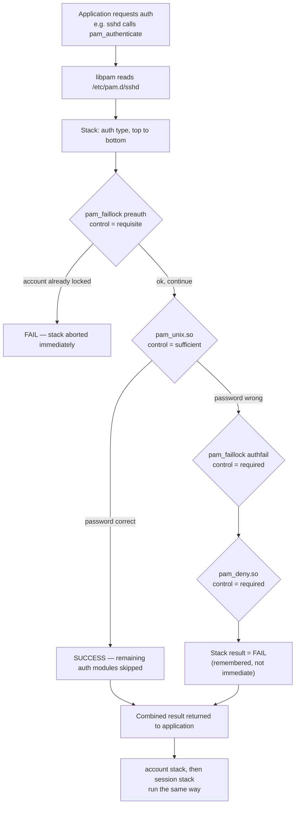

# PAM (Pluggable Authentication Modules)

PAM is the pluggable middleware framework that lets applications on Linux authenticate users, check account status, manage password changes, and set up sessions without hard-coding any of that logic themselves — every PAM-aware program (`login`, `sshd`, `sudo`, `su`, `passwd`, display managers) simply calls into `libpam`, which reads a per-service configuration and runs whatever stack of modules an administrator has configured.

## Overview

| Concept | Detail |
|---|---|
| Library | `libpam` — linked by any "PAM-aware" application (`sshd`, `sudo`, `su`, `login`, `passwd`, `cron`, display managers) |
| Per-service config | `/etc/pam.d/<service-name>` — one file per application, filename matches the program invoking PAM |
| Fallback | `/etc/pam.d/other` — applied to any service without its own file (default-deny is standard) |
| RHEL/CentOS master stacks | `/etc/pam.d/system-auth`, `/etc/pam.d/password-auth` — pulled in by most other RHEL service files via `include` |
| Debian/Ubuntu master stacks | `/etc/pam.d/common-auth`, `common-account`, `common-password`, `common-session` — pulled in via `@include` |
| Safe stack manager (RHEL) | `authselect` — generates `system-auth`/`password-auth` from named profiles |
| Safe stack manager (Debian) | `pam-auth-update` — merges/removes package-provided PAM fragments interactively |

> [!NOTE]
> PAM's whole point is decoupling **authentication policy** from **application code**. An application only asks PAM "is this user allowed in?" (`auth`), "is the account usable?" (`account`), "can they change their credential?" (`password`), and "set up/tear down whatever the session needs" (`session`) — the *how* lives entirely in `/etc/pam.d/`, so you can add MFA, lockout policy, or password complexity rules to every service at once without touching a single binary.

## How It Works

Each service file is a **stack** of module lines: `type control module-path [arguments]`. PAM walks the stack top to bottom for the requested management group (`auth`, `account`, `password`, or `session`), and each module's **control flag** decides whether a failure aborts the stack immediately, is remembered but deferred, or is ignored outright. The final pass/fail combines every module's outcome according to those flags.



### The Four Module Types

| Type | Purpose | Typical modules |
|---|---|---|
| `auth` | Establishes *who* the user is — prompts for/validates a credential, may also set credentials (Kerberos tickets, etc.). | `pam_unix`, `pam_faillock`, `pam_sss`, `pam_deny` |
| `account` | Checks whether the already-authenticated account is *allowed* right now — expired password, locked account, time-of-day restrictions. | `pam_unix`, `pam_faillock`, `pam_nologin`, `pam_access` |
| `password` | Handles updating the authentication token (i.e. changing a password) and enforces complexity on the new value. | `pam_pwquality`, `pam_unix` |
| `session` | Runs *before and after* a session is granted — mounts, logging, resource limits, environment setup. | `pam_limits`, `pam_env`, `pam_lastlog`, `pam_systemd` |

### Control Flags

| Flag | Behaviour on success | Behaviour on failure |
|---|---|---|
| `required` | Continue to next module | Remember the failure but **keep processing the rest of the stack**; overall result still fails |
| `requisite` | Continue to next module | **Abort the stack immediately** and return failure to the application (no further modules run) |
| `sufficient` | If all prior `required` modules also passed, **stop and return success immediately** | Ignored — processing continues to the next module (not fatal on its own) |
| `optional` | Ignored unless it's the only module of that type in the stack | Ignored unless it's the only module of that type in the stack |
| `include` | Pulls in **all four** stacks from another file (legacy syntax) — a `requisite` failure inside can terminate the *entire* transaction, not just that type | same |
| `substack` | Pulls in one specific type's stack from another file as a self-contained unit — a failure inside only ends that substack, then control returns to the parent stack | same |

> [!NOTE]
> **Stack ordering matters.** A `sufficient` `pam_unix` line placed *before* a `requisite` `pam_faillock` preauth check would let a correct password bypass the lockout check entirely. Lockout/deny checks belong early (as `requisite`), the actual credential check in the middle, and a catch-all `pam_deny` at the bottom.

## Configuration

### Step 1: Inspect a Per-Service File

Every PAM-aware service has its own file under `/etc/pam.d/`. Most service files don't list `pam_unix`/`pam_faillock` directly — they `include` (RHEL) or `@include` (Debian) the shared master stack so policy stays consistent across every service.

> Example — RHEL/CentOS `sudo`:

```bash
cat /etc/pam.d/sudo
```

```text
#%PAM-1.0
auth       include      system-auth
account    include      system-auth
password   include      system-auth
session    optional     pam_keyinit.so revoke
session    required     pam_limits.so
session    include      system-auth
```

> Example — Debian 12 `sudo`:

```bash
cat /etc/pam.d/sudo
```

```text
#%PAM-1.0
session    required   pam_env.so readenv=1 user_readenv=0
@include common-auth
@include common-account
@include common-session-noninteractive
```

### Step 2: The RHEL Master Stacks (`system-auth` / `password-auth`)

`system-auth` covers local console/service auth; `password-auth` covers remote/network paths (`sshd`, etc.). On modern RHEL/CentOS Stream both are **generated files** — the header warns you not to hand-edit them.

> Example:

```bash
cat /etc/pam.d/system-auth
```

```text
# This file is auto-generated.
# User changes will be destroyed the next time authselect is run.
auth        required                                     pam_env.so
auth        required                                     pam_faildelay.so delay=2000000
auth        [default=1 ignore=ignore success=ok]          pam_usertype.so isregular
auth        [default=1 ignore=ignore success=ok]          pam_localuser.so
auth        sufficient                                    pam_unix.so nullok
auth        [default=1 ignore=ignore success=ok]          pam_usertype.so isregular
auth        requisite                                     pam_faillock.so preauth
auth        required                                      pam_deny.so

account     required     pam_faillock.so
account     required     pam_unix.so
account     sufficient   pam_localuser.so
account     required     pam_permit.so

password    requisite    pam_pwquality.so try_first_pass local_users_only
password    sufficient   pam_unix.so sha512 shadow try_first_pass use_authtok
password    required     pam_deny.so

session     optional     pam_keyinit.so revoke
session     required     pam_limits.so
session     optional     pam_systemd.so
session     required     pam_unix.so
```

### Step 3: The Debian `common-*` Stacks

Debian splits the same four types into four separate files instead of one combined `system-auth`.

> Example:

```bash
cat /etc/pam.d/common-auth
```

```text
auth    [success=1 default=ignore]  pam_unix.so nullok
auth    requisite                   pam_deny.so
auth    required                    pam_permit.so
auth    optional                    pam_cap.so
```

```bash
cat /etc/pam.d/common-password
```

```text
password  requisite                   pam_pwquality.so retry=3
password  [success=1 default=ignore]  pam_unix.so obscure use_authtok try_first_pass yescrypt
password  requisite                   pam_deny.so
password  required                    pam_permit.so
```

### Step 4: Manage Stacks Safely — `authselect` (RHEL) / `pam-auth-update` (Debian)

Hand-editing `system-auth` or `common-auth` directly is fragile and, on RHEL, gets **overwritten** the next time `authselect` runs. Use the profile tools instead.

> Example — RHEL/CentOS Stream 10:

```bash
authselect current
```

```bash
authselect list
```

```bash
authselect select sssd with-faillock --force
```

```bash
authselect enable-feature with-pam-access
```

Custom local tweaks live in a **custom profile** so `authselect` can regenerate the stack without losing them:

```bash
authselect create-profile my-hardened -b sssd
```

```bash
authselect select custom/my-hardened
```

> Example — Debian 12:

```bash
pam-auth-update
```

Running it without arguments opens an interactive whiptail menu of available PAM profiles (Unix authentication, `pwquality`, SSSD, etc.) to enable/disable. For scripted/unattended use:

```bash
pam-auth-update --package --enable pwquality
```

## Common Modules (with usage)

| Module | Type(s) | Usage |
|---|---|---|
| `pam_unix.so` | `auth`, `account`, `password`, `session` | Traditional Unix credential check against `/etc/shadow`. `auth sufficient pam_unix.so nullok` — `nullok` permits empty passwords (remove in hardened configs). |
| `pam_pwquality.so` | `password` | Enforces password complexity (length, class count, dictionary check) before `pam_unix` stores the hash. `password requisite pam_pwquality.so retry=3 minlen=14`. |
| `pam_faillock.so` | `auth`, `account` | Tracks failed login attempts per user and locks the account after a threshold. `auth requisite pam_faillock.so preauth` / `auth [default=die] pam_faillock.so authfail`. |
| `pam_limits.so` | `session` | Applies resource limits (`ulimit`) from `/etc/security/limits.conf` and `limits.d/`. `session required pam_limits.so`. |
| `pam_env.so` | `auth`, `session` | Loads environment variables from `/etc/security/pam_env.conf` and `/etc/environment` at login. `session required pam_env.so`. |
| `pam_wheel.so` | `auth` | Restricts `su` to members of a designated group (usually `wheel`). Added to `/etc/pam.d/su`: `auth required pam_wheel.so use_uid group=wheel`. |

## Examples

### Restrict `su` to the `wheel` Group

```bash
grep pam_wheel /etc/pam.d/su
```

```text
#auth       required   pam_wheel.so use_uid
```

Uncomment and pin the group explicitly:

```bash
sed -i 's/^#auth\s*required\s*pam_wheel.so use_uid/auth       required   pam_wheel.so use_uid group=wheel/' /etc/pam.d/su
# untested
```

Any user not in `wheel` who runs `su -` will now be denied before ever being prompted for the root password.

### Reading a Failure Path End to End

For the RHEL `auth` snippet above: if `pam_faillock.so preauth` (`requisite`) sees the account already over its failure threshold, the whole stack returns failure to `sshd` immediately — `pam_unix` never even runs, so no password prompt is even attempted for a locked account. If the account isn't locked, `pam_unix` (`sufficient`) runs; a correct password short-circuits straight to success, while a wrong one falls through to `pam_faillock authfail` (recording the failure) and finally `pam_deny` (`required`, always fails) so the net stack result is failure.

## Best Practices

- Never edit `/etc/pam.d/system-auth` / `password-auth` by hand on RHEL — use `authselect` custom profiles so your changes survive regeneration.
- On Debian, prefer `pam-auth-update` over manually patching `common-*` files when a package (SSSD, `libpam-pwquality`) ships its own PAM fragment.
- Keep lockout/deny checks (`pam_faillock preauth`, `pam_access`) early in the stack as `requisite` so they short-circuit before a password prompt even happens.
- Put the "real" credential module (`pam_unix`, `pam_sss`) as `sufficient` and end every stack with a `required pam_deny`/`pam_permit` so the default is deterministic, not "whatever the last line happened to do."
- Test any PAM change against a **second, still-authenticated session** (see warning below) before closing your original one.
- Version-control or `cp -a` a copy of `/etc/pam.d/` before major changes so you can restore it from single-user/rescue mode if needed.

## Security Considerations

> [!WARNING]
> **Always keep a root shell or a second, already-authenticated session open while editing PAM configuration.** A single typo, missing module, or mis-ordered control flag in `system-auth`, `common-auth`, or a service file can lock out **every** authentication path on the box — including `sudo`, `su`, and console login — leaving rescue/single-user mode as the only recovery. Test changes (`sudo -k; sudo whoami`, a fresh SSH connection) *before* closing the session you edited from.

- PAM sits directly in the credential path, making it a classic **backdoor and persistence target** — a trojanized `pam_unix.so` (or a rogue module inserted into a service stack) can silently log or exfiltrate every plaintext password that flows through it.
- Verify PAM package integrity against the distro's package database:
  ```bash
  rpm -V pam pam-cracklib   # RHEL/CentOS
  ```
  ```bash
  dpkg --verify libpam-modules libpam-runtime   # Debian
  ```
- Monitor `/etc/pam.d/` for unauthorized changes with file-integrity tooling (AIDE, `auditd` watches on `/etc/pam.d/*`).
- `pam_faillock` failures and `pam_unix` auth events are logged to `/var/log/secure` (RHEL) or `/var/log/auth.log` (Debian) — feed these into centralized logging/SIEM and alert on repeated `pam_faillock` lockouts, which often indicate brute-force or credential-stuffing activity.
- Remove `nullok` from any `pam_unix.so auth` line — it silently permits empty passwords to authenticate.

## Troubleshooting

| Symptom | Likely cause | Resolution |
|---|---|---|
| All logins fail after editing PAM ("cannot authenticate") | Syntax error, missing `.so`, or bad control flag in a hand-edited stack | Fix from the still-open root shell/rescue mode; on RHEL rerun `authselect select <profile> --force` to regenerate a known-good stack |
| `sudo`/`su` broken but `sshd` still works (or vice versa) | Edit only touched one service's `include`d master stack path, or the two distros' file layout was confused | Check which master stack (`system-auth`/`password-auth` vs `common-*`) the broken service actually includes |
| Password change rejected as "too weak" unexpectedly | `pam_pwquality` line is `requisite` and running with strict `minlen`/`minclass` | Review `/etc/security/pwquality.conf` and the `password` stack arguments; see [Password-Policy-with-pam_pwquality](Password-Policy-with-pam_pwquality.md) |
| Account locks after a few bad attempts and won't unlock | `pam_faillock` threshold hit | `faillock --user <name> --reset`; see [Account-Lockout-with-pam_faillock](Account-Lockout-with-pam_faillock.md) |
| RHEL edits to `system-auth` disappear | `authselect` regenerated the file from its profile | Create/select a custom `authselect` profile instead of editing the generated file directly |
| Non-wheel user can still `su` to root | `pam_wheel.so` line commented out or missing `group=wheel` | Uncomment/add the line in `/etc/pam.d/su` and confirm with `grep pam_wheel /etc/pam.d/su` |

## References

- [pam(8) man page](https://man7.org/linux/man-pages/man8/pam.8.html)
- [pam.d(5) man page](https://man7.org/linux/man-pages/man5/pam.d.5.html)
- [pam.conf(5) man page](https://man7.org/linux/man-pages/man5/pam.conf.5.html)
- [pam_unix(8) man page](https://man7.org/linux/man-pages/man8/pam_unix.8.html)
- [authselect(8) man page](https://man7.org/linux/man-pages/man8/authselect.8.html)
- [Red Hat: Configuring authentication and authorization in RHEL](https://docs.redhat.com/en/documentation/red_hat_enterprise_linux/9/html/configuring_authentication_and_authorization_in_rhel/)
- [Debian PAM Wiki](https://wiki.debian.org/PAM)

## Related

- [Password-Policy-with-pam_pwquality](Password-Policy-with-pam_pwquality.md) — configuring the `password` stack's complexity module in depth
- [Account-Lockout-with-pam_faillock](Account-Lockout-with-pam_faillock.md) — configuring the `auth`/`account` lockout module in depth
- [Shadow-File-Secure-User-Passwords-File](Shadow-File-Secure-User-Passwords-File.md) — the credential store `pam_unix` reads and writes
- [Sudo](Sudo.md) — a PAM-aware service whose stack this note walks through
- [Users, Groups & Permissions](Readme.md) — module hub
- [Linux Administration & Server Hardening](../Readme.md)
