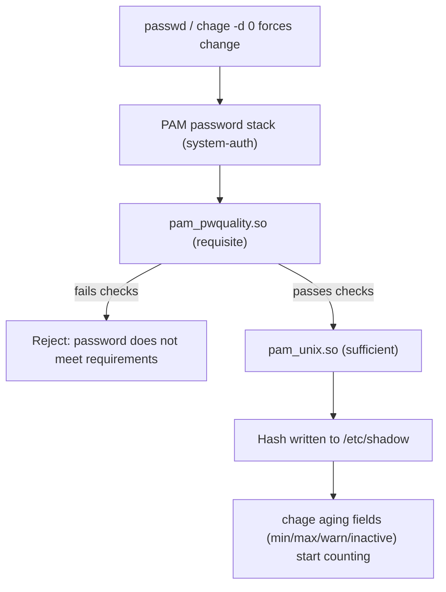

# Password Policy with pam_pwquality

`pam_pwquality` is the PAM module that enforces password *strength* (length, character-class diversity, dictionary checks) at the moment a password is set, while `chage` and `/etc/login.defs` enforce password *aging* (how long a password stays valid). Together they form the two halves of a Linux password policy that both RHCSA and LFCS/LPIC-1 expect you to configure and troubleshoot.

## Overview

| Layer | Mechanism | Controls |
|---|---|---|
| Quality (composition) | `pam_pwquality.so` + `/etc/security/pwquality.conf` | length, character classes, repeats, dictionary, similarity to old password |
| Aging (lifecycle) | `chage` + `/etc/login.defs` defaults | max/min age, warning period, inactivity grace period |
| Delivery | `/etc/pam.d/system-auth` (and `password-auth`) | which module runs, in what order, with what control flags |
| Profile management | `authselect` | generates/regenerates the PAM stack on RHEL-family systems |

> [!NOTE]
> `pam_pwquality` only fires when a password is **set or changed** (`passwd`, `chage -d 0` forced change at next login, etc.). It never re-validates an existing password, and it does not apply to accounts whose password is set non-interactively with `usermod -p` or `chpasswd`.

## How It Works

`pam_pwquality` sits in the `password` group of the PAM stack. When a user runs `passwd`, PAM walks the stack top to bottom for the `password` type; `pam_pwquality` runs first (as a `requisite` check) and rejects a weak candidate *before* `pam_unix` ever hashes and writes it to `/etc/shadow`.



## Configuration

### Step 1: The pam_pwquality Line in the Password Stack

On RHEL-family systems (CentOS Stream 10) the stack lives in `/etc/pam.d/system-auth` and `/etc/pam.d/password-auth`, both generated by `authselect` — do not hand-edit them directly (see Step 3). On Debian 12, `pam_pwquality` (from the `libpam-pwquality` package) is wired into `/etc/pam.d/common-password`, which *is* hand-edited.

> Example (the relevant line, both distros use the same module):

```text
password    requisite     pam_pwquality.so retry=3
```

| Field | Meaning |
|---|---|
| `password` | PAM management group — this rule applies during password change |
| `requisite` | Fail immediately (stop the stack) if this module fails — the weak password never reaches `pam_unix` |
| `pam_pwquality.so` | The quality-checking module |
| `retry=3` | Number of attempts to enter a compliant password before returning failure (mirrors the `retry` directive below) |

### Step 2: pwquality.conf Directives

Policy lives in `/etc/security/pwquality.conf` (and optionally drop-ins under `/etc/security/pwquality.conf.d/`) on both distros — the file and package name are the same (`libpwquality` / `libpam-pwquality`).

> Example:

```bash
vim /etc/security/pwquality.conf
```

| Directive | Meaning |
|---|---|
| `minlen` | Minimum acceptable password length (default `8`) |
| `minclass` | Minimum number of character classes required (lower, upper, digit, other/symbol) out of 4 |
| `dcredit` | Digit credit: negative = require at least *N* digits; positive = credit toward length for each digit |
| `ucredit` | Uppercase-letter credit, same sign convention |
| `lcredit` | Lowercase-letter credit, same sign convention |
| `ocredit` | "Other" (symbol/punctuation) credit, same sign convention |
| `maxrepeat` | Maximum number of times the same character may repeat consecutively (`0` = no limit) |
| `retry` | Number of prompts before `passwd` gives up and returns failure |
| `difok` | Number of characters that must differ from the previous password |
| `dictcheck` | Reject passwords found in a cracklib dictionary (`1` = enabled, requires `cracklib-words` / `wamerican`-style word lists installed) |
| `enforce_for_root` | If set to `1`, quality checks also apply to `root`'s own `passwd` (unset by default) |

> [!NOTE]
> The `credit` fields use a **sign convention**: a positive value (`ucredit=1`) *credits* the password's effective length for each character of that class (making the policy easier to satisfy); a negative value (`ucredit=-1`) *requires* at least that many characters of the class. For a mandatory-composition policy, always use negative values.

### Step 3: Enforce a 12-Character, 3-Class Policy

This example requires at least 12 characters, at least 3 of the 4 character classes, no more than 2 repeated characters in a row, and rejects dictionary words.

> Example:

```bash
vim /etc/security/pwquality.conf
```

```ini
minlen = 12
minclass = 3
maxrepeat = 2
retry = 3
difok = 5
dictcheck = 1
```

`minclass = 3` is deliberately used instead of stacking individual `*credit` requirements — it lets a user satisfy the policy with any 3 of the 4 classes (e.g., lower + upper + digit, no symbol required), which is friendlier for password managers while still enforcing real diversity. If you need to *mandate* specific classes (e.g., always require a symbol), use the credit directives instead:

```ini
minlen = 12
dcredit = -1
ucredit = -1
lcredit = -1
ocredit = -1
```

### Step 4: Apply the Change via authselect (RHEL-family)

On CentOS Stream 10, `authselect` owns `/etc/pam.d/system-auth` and `/etc/pam.d/password-auth`. `pwquality.conf` itself takes effect immediately (no regeneration needed), but if you need to *add or change* PAM features (for example enabling `with-pwquality` explicitly, or combining with `pam_faillock`), you select a profile and enable features.

```bash
authselect current
```

```bash
authselect select sssd with-pwquality with-faillock --force
```

```bash
authselect enable-feature with-pwquality
```

```bash
authselect apply-changes
```

| Command | Effect |
|---|---|
| `authselect current` | Shows the active profile and enabled features |
| `authselect select <profile> <features> --force` | Switches profile and (re)generates PAM files with the listed features |
| `authselect enable-feature with-pwquality` | Adds the `pam_pwquality` line to the current profile without a full reselect |
| `authselect apply-changes` | Regenerates `/etc/pam.d/system-auth` and `/etc/pam.d/password-auth` from the profile |

> [!WARNING]
> Never hand-edit `/etc/pam.d/system-auth` or `/etc/pam.d/password-auth` on a system managed by `authselect` — they are symlinks into `/etc/authselect/`, and the next `authselect apply-changes` (or package update that triggers one) silently discards manual edits. On Debian, `/etc/pam.d/common-password` has no such manager and is safe to edit directly.

### Step 5: Debian 12 — Editing common-password Directly

```bash
apt install libpam-pwquality
```

```bash
vim /etc/pam.d/common-password
```

```text
password    requisite     pam_pwquality.so retry=3
password    [success=1 default=ignore]    pam_unix.so obscure use_authtok try_first_pass sha512
```

`common-password` is included by every service's PAM file via `@include common-password`, so one edit applies the policy system-wide (`passwd`, `sshd`, `login`, `su`, etc.).

## Password Aging: chage and /etc/login.defs

Composition rules (`pwquality.conf`) only run at password-set time. **Aging** is the complementary control that forces periodic rotation and is enforced continuously by PAM at login, independent of `pam_pwquality`.

### login.defs Defaults (new accounts)

`/etc/login.defs` sets the aging defaults applied to every account created afterward by `useradd`; it does not retroactively change existing accounts.

```bash
vim /etc/login.defs
```

```text
PASS_MAX_DAYS   90
PASS_MIN_DAYS   1
PASS_WARN_AGE   7
PASS_MIN_LEN    12
```

| Directive | Meaning |
|---|---|
| `PASS_MAX_DAYS` | Days a password stays valid before it must be changed |
| `PASS_MIN_DAYS` | Days that must pass before the password can be changed again (prevents rapid-cycling back to an old password) |
| `PASS_WARN_AGE` | Days before expiry the user starts seeing a warning at login |
| `PASS_MIN_LEN` | Legacy minimum length; superseded by `pam_pwquality`'s `minlen` on modern systems |

> [!NOTE]
> `PASS_MIN_LEN` in `login.defs` is a leftover from the pre-PAM `login`/`shadow-utils` era. On any system running `pam_pwquality`, `minlen` in `pwquality.conf` is authoritative — set both for defense in depth, but treat `pwquality.conf` as the real policy.

### chage: Per-User Aging Overrides

`chage` edits the aging fields directly in `/etc/shadow` for a specific account, overriding whatever `login.defs` set at creation time.

```bash
chage -M 90 -m 1 -W 7 -I 30 alice
```

| Flag | Meaning |
|---|---|
| `-M` (`--maxdays`) | Maximum password age in days |
| `-m` (`--mindays`) | Minimum days before the password can be changed again |
| `-W` (`--warndays`) | Days of login warning before expiry |
| `-I` (`--inactive`) | Days after expiry before the account is locked entirely (grace period expires) |

- View current aging status for a user:

```bash
chage -l alice
```

- Force a password change at next login (sets last-change date to epoch):

```bash
chage -d 0 alice
```

## Best Practices

- Set `minclass = 3` or explicit negative `*credit` values rather than relying on `minlen` alone — length without diversity is still weak against targeted guessing.
- Keep `retry` low (2-3) to avoid PAM prompting indefinitely; a hard failure after a few tries is expected UX.
- Enable `dictcheck = 1` and ensure a word-list package (`cracklib-dicts` on RHEL-family, `wamerican`/`cracklib-runtime` on Debian) is installed, or the check silently no-ops.
- Pair composition rules with aging (`PASS_MAX_DAYS`, `chage -M`) — a strong password that never rotates still ages poorly after a credential leak.
- On CentOS Stream 10, always go through `authselect enable-feature` / `authselect apply-changes` for PAM stack changes; treat `pwquality.conf` itself as freely editable outside `authselect`.
- Combine with [Account-Lockout-with-pam_faillock](Account-Lockout-with-pam_faillock.md) so brute-force login attempts are throttled in addition to weak passwords being rejected.

## Security Considerations

> [!WARNING]
> `enforce_for_root` defaults to unset (root exempt) on most distributions. A weak root password bypasses every quality control you configure for regular users — explicitly set `enforce_for_root = 1` if root ever authenticates with a password rather than key-based/console-only access.

- `pam_pwquality` is a client-side check only — it does not stop an attacker who sets a password non-interactively via `usermod -p` with a pre-computed hash, or via a configuration-management tool that bypasses PAM entirely.
- `difok` compares against the *previous* password only (from PAM's memory of the old value during the change), not the full password history; use `pam_pwhistory` (`remember=N` in the password stack) if you need to block reuse across many prior passwords.
- During an offensive engagement, a permissive `pwquality.conf` (`minlen` low, `minclass` unset, `dictcheck=0`) is a fast indicator that captured `/etc/shadow` hashes are likely to fall to a dictionary/rules attack with Hashcat or John the Ripper.
- `PASS_MIN_DAYS` set to `0` (the shadow-utils default) lets a user immediately change a freshly forced password right back to the old one unless `pam_pwhistory` is also configured — don't rely on `pam_pwquality` alone to prevent reuse.

## Troubleshooting

| Symptom | Likely cause | Resolution |
|---|---|---|
| New password rejected as "too simple" even though it looks strong | `minclass`/`*credit` requires classes not present in the candidate | Check `pwquality.conf` values; add missing character classes |
| `pwquality.conf` edits have no effect | Editing a competing drop-in under `pwquality.conf.d/` that overrides it, or wrong file entirely | Check for `/etc/security/pwquality.conf.d/*.conf` overrides (later files win) |
| Edits to `system-auth` disappear after a reboot/update | `authselect`-managed symlink was reverted | Use `authselect enable-feature` / re-select the profile instead of hand-editing |
| `chage -M` change has no effect on existing sessions | Aging is enforced at next login/`passwd`, not live | Confirm with `chage -l <user>`; effect is on next authentication cycle |
| Root can still set a trivial password | `enforce_for_root` not set | Add `enforce_for_root = 1` to `pwquality.conf` |
| "Authentication token manipulation error" on `passwd` | Underlying `pam_pwquality` rejection or `/etc/shadow` permission issue | Re-run with a compliant password; verify `/etc/shadow` is `root:shadow 0640/0600` |

## References

- [pam_pwquality(8) man page](https://man7.org/linux/man-pages/man8/pam_pwquality.8.html)
- [pwquality.conf(5) man page](https://man7.org/linux/man-pages/man5/pwquality.conf.5.html)
- [chage(1) man page](https://man7.org/linux/man-pages/man1/chage.1.html)
- [login.defs(5) man page](https://man7.org/linux/man-pages/man5/login.defs.5.html)
- [authselect(8) man page / Red Hat authselect docs](https://man7.org/linux/man-pages/man8/authselect.8.html)

## Related
- [PAM-Pluggable-Authentication-Modules](PAM-Pluggable-Authentication-Modules.md) — the framework pam_pwquality plugs into
- [Account-Lockout-with-pam_faillock](Account-Lockout-with-pam_faillock.md) — complementary brute-force throttling module
- [passwd](passwd.md) — the command that triggers pam_pwquality checks
- [Shadow-File-Secure-User-Passwords-File](Shadow-File-Secure-User-Passwords-File.md) — where the resulting hash and aging fields are stored
- [Users, Groups & Permissions](Readme.md) — module index
- [Linux Administration & Server Hardening](../Readme.md)
