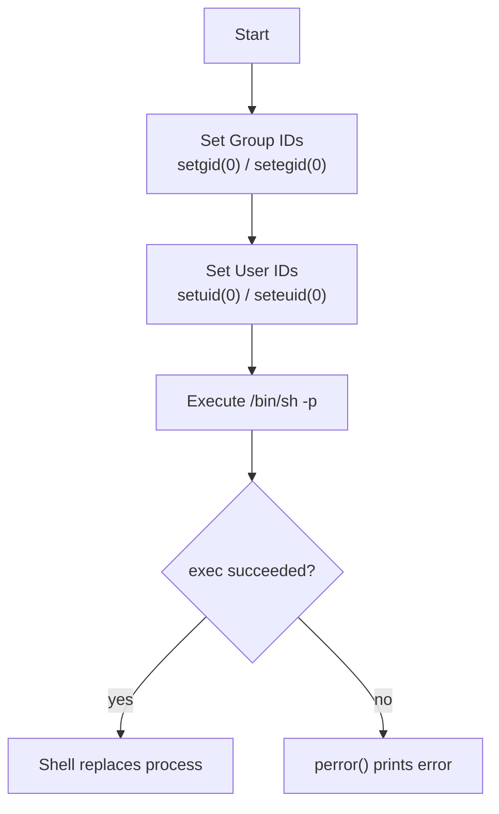

# Privilege Escalation Example Using `setuid()`, `setgid()`, and `execvp()`

> [!WARNING]
> **Educational Use Only**
> This example demonstrates how Unix user and group IDs relate to process privileges. Use it only in authorized lab environments (learning about Linux security, SUID behavior, or operating-system internals). Running such code on systems you do not own or administer may violate laws or organizational policies.

## Overview

This note walks through a small C program that attempts to drop the process to a root shell. It is a canonical teaching example of how the **setuid family** of system calls interacts with a process's real, effective, and saved credentials — and, importantly, why calling `setuid(0)` does **not** magically grant root to an unprivileged process.

The program only succeeds when it is already running with sufficient privilege — for example, when it has been installed as a **SUID-root binary** (owner `root`, `chmod u+s`). In that scenario it is the classic payload compiled and dropped by an attacker who has found a writable SUID-root file, illustrating why SUID binaries are such a sensitive privilege-escalation surface.

## Concepts

### Source Code

```c
#include <stdio.h>
#include <unistd.h>

int main(void) {
    // Force Group IDs
    setgid(0);
    setegid(0);

    // Force User IDs
    setuid(0);
    seteuid(0);

    // Execute a shell
    char *args[] = {"/bin/sh", "-p", NULL};
    execvp(args[0], args);

    perror("execvp failed");
    return 1;
}
```

### Header Files

```c
#include <stdio.h>
#include <unistd.h>
```

| Header | Provides |
|---|---|
| `stdio.h` | `perror()` |
| `unistd.h` | POSIX system calls: `setuid()`, `seteuid()`, `setgid()`, `setegid()`, `execvp()` |

## Architecture

### Program Flow



## Commands

### `setgid(0)`

```c
setgid(0);
```

Attempts to set the **real**, **effective**, and (on many systems) **saved** group ID to **0** (the `root` group).

> [!IMPORTANT]
> Success depends on the process already having the required privilege. An ordinary unprivileged process cannot simply become root by calling `setgid(0)`.

### `setegid(0)`

```c
setegid(0);
```

Attempts to set only the **effective group ID** to **0**. The effective GID is the group identity used during permission checks.

### `setuid(0)`

```c
setuid(0);
```

Attempts to change the process's user IDs to **UID 0** (the `root` user). On most Unix-like systems this succeeds only if the process already has sufficient privilege — for example, it is already running with an effective UID of 0.

### `seteuid(0)`

```c
seteuid(0);
```

Attempts to set only the **effective user ID** to **0**. The effective UID determines the process's permissions.

### Executing a Shell

```c
char *args[] = {"/bin/sh", "-p", NULL};
execvp(args[0], args);
```

`execvp()` replaces the current process image with `/bin/sh`.

If successful:

- The current program stops running.
- The shell becomes the new process.

If it fails:

```c
perror("execvp failed");
```

prints the reason.

### About the `-p` Option

Some POSIX-compatible shells support the `-p` option (often called **privileged mode**). Depending on the shell implementation, this option may preserve the process's existing effective user or group IDs instead of voluntarily dropping elevated privileges. Support and behavior vary by shell.

> [!NOTE]
> Modern shells such as `bash` and `dash` deliberately drop privileges at startup when the real and effective UIDs differ, *unless* `-p` is supplied. This is why real-world SUID-shell payloads pass `-p` — without it the shell would reset its effective UID back to the invoking (unprivileged) user.

## Examples

### Building and Installing as a SUID-Root Binary (Lab Only)

```bash
gcc privesc.c -o privesc
sudo chown root:root privesc
sudo chmod u+s privesc
```

Once installed with the SUID bit and owned by `root`, running `./privesc` as an unprivileged user yields a shell whose effective UID is `0`. Run as a normal executable without the SUID bit, the `setuid(0)`/`setgid(0)` calls fail and no privilege is gained.

## Security Considerations

- Calling `setuid(0)` or `setgid(0)` **does not grant root privileges by itself.** These calls only succeed when the process already has the necessary privilege (running as root, holding `CAP_SETUID`/`CAP_SETGID`, or executing a SUID-root binary).
- **SUID-root binaries are a top privilege-escalation surface.** Any writable SUID-root file, or one that trusts attacker-controlled input, can be turned into a root shell exactly like this. Audit them: `find / -perm -4000 -type f 2>/dev/null`.
- **Prefer capabilities and `sudo` over blanket SUID.** Fine-grained Linux capabilities grant only the specific privilege a program needs instead of full root, shrinking the blast radius (NIST/CIS least-privilege guidance).
- **Mount partitions `nosuid` where SUID is not required** (for example `/tmp`, `/home`, removable media) so dropped binaries like this one cannot escalate.
- On a normal executable run by a regular user, these calls typically fail — the shell that would spawn runs with the caller's own unprivileged identity.

## Summary Table

| Function | Purpose |
|----------|---------|
| `setgid(0)` | Attempt to set group IDs to 0 (root group) |
| `setegid(0)` | Attempt to set the effective group ID to 0 |
| `setuid(0)` | Attempt to set user IDs to 0 (root) |
| `seteuid(0)` | Attempt to set the effective user ID to 0 |
| `execvp()` | Replace the current process with another program |
| `perror()` | Display an error if `execvp()` fails |

## Key Takeaways

- User and group IDs determine a process's identity and permissions.
- The **effective** UID and GID are used for access control.
- `setuid()` and `setgid()` only succeed if the process already has sufficient privilege.
- `execvp()` replaces the current process with a new executable.
- The shell's `-p` option, where supported, requests that the shell preserve existing privileges rather than dropping them.

## Related

- [Linux Administration & Server Hardening](../Readme.md) — course hub.
- [Real-UID-vs-Effective-UID-in-Linux](Real-UID-vs-Effective-UID-in-Linux.md) — inspecting real vs effective UID/GID from C.
- [Setuid(Set-User-ID)](Setuid(Set-User-ID).md) — the SUID bit that makes this payload work.
- [Setgid(Set-Group-ID)](Setgid(Set-Group-ID).md) — the SGID bit and group-privilege inheritance.
- [Special-Permission](Special-Permission.md) — SUID, SGID, and sticky bits explained.
- [Linux-Permissions](Linux-Permissions.md) — the underlying permission model.
