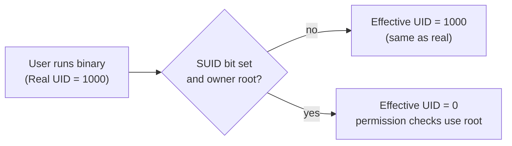

# Real UID vs Effective UID in Linux (C Example)

## Overview

Every Linux process carries multiple credential IDs. The two most important are the **Real UID** (who launched the process) and the **Effective UID** (the identity the kernel uses when deciding what the process is allowed to do). They are usually equal, but the **setuid** and **setgid** bits deliberately make them differ, which is the mechanism behind privileged helper programs such as `passwd` and `sudo`.

This note uses a tiny C program to print all four identity values and demonstrates how they change under SUID and SGID binaries.

> [!NOTE]
> A process also has a **saved** set-UID/GID, which lets a privileged program temporarily drop and later regain privilege. The example below focuses on the real and effective IDs, which govern day-to-day permission checks.

## Concepts

### Source Code

```c
#include <stdio.h>
#include <unistd.h>

int main(void)
{
    printf("Real UID      : %d\n", getuid());
    printf("Effective UID : %d\n", geteuid());
    printf("Real GID      : %d\n", getgid());
    printf("Effective GID : %d\n", getegid());

    return 0;
}
```

### Header Files

```c
#include <stdio.h>
#include <unistd.h>
```

| Header | Provides |
|---|---|
| `stdio.h` | `printf()` |
| `unistd.h` | POSIX functions `getuid()`, `geteuid()`, `getgid()`, `getegid()` |

### Function Reference

#### `getuid()`

Returns the **Real User ID (UID)** of the user who started the process.

```c
printf("Real UID      : %d\n", getuid());
```

Example:

```text
Real UID : 1000
```

#### `geteuid()`

Returns the **Effective User ID (EUID)**. The effective UID determines what permissions the process has when accessing files or performing privileged operations.

```c
printf("Effective UID : %d\n", geteuid());
```

Normally:

```text
Real UID = Effective UID
```

With a **setuid** program:

```text
Real UID      = 1000
Effective UID = 0
```

The process runs with the privileges of the executable's owner (typically `root`).

#### `getgid()`

Returns the **Real Group ID (GID)**.

```c
printf("Real GID      : %d\n", getgid());
```

#### `getegid()`

Returns the **Effective Group ID (EGID)**.

```c
printf("Effective GID : %d\n", getegid());
```

If the executable has the **setgid** bit set, the effective GID may differ from the real GID.

## Concepts — Real vs Effective IDs

| Type | Description |
|------|-------------|
| **Real UID** | User who launched the process |
| **Effective UID** | User identity used for permission checks |
| **Real GID** | Group of the user who launched the process |
| **Effective GID** | Group identity used for permission checks |



## Examples

### Example 1: Normal Program

Compile:

```bash
gcc uid.c -o uid
```

Run:

```bash
./uid
```

Output:

```text
Real UID      : 1000
Effective UID : 1000
Real GID      : 1000
Effective GID : 1000
```

Since there is no special permission, all IDs are identical.

### Example 2: Setuid Program

Make the executable owned by `root` and enable the **setuid** bit:

```bash
sudo chown root:root uid
sudo chmod u+s uid
```

Check permissions:

```bash
ls -l uid
```

Output:

```text
-rwsr-xr-x 1 root root ...
```

Run the program:

```bash
./uid
```

Output:

```text
Real UID      : 1000
Effective UID : 0
Real GID      : 1000
Effective GID : 1000
```

#### Explanation

- **Real UID** → the user who started the process.
- **Effective UID** → the owner of the executable (`root`).
- Permission checks are performed using the **Effective UID**.

> [!NOTE]
> **📸 Screenshot**
> _Capture: Terminal comparing ls -l showing the rws SUID bit and the program output where Effective UID is 0 while Real UID stays 1000_

### Example 3: Setgid Program

Assign a different group and enable the **setgid** bit:

```bash
sudo chgrp developers uid
sudo chmod g+s uid
```

Output:

```text
Real UID      : 1000
Effective UID : 1000
Real GID      : 1000
Effective GID : 2000
```

The process now runs with the permissions of the executable's group.

## Summary Table

| Function | Returns | Purpose |
|----------|----------|---------|
| `getuid()` | Real User ID | Identifies who started the process |
| `geteuid()` | Effective User ID | Determines process permissions |
| `getgid()` | Real Group ID | Original group of the user |
| `getegid()` | Effective Group ID | Group used for permission checks |

## Security Considerations

- **The effective UID/GID is the security boundary.** Permission checks — file access, signal delivery, privileged syscalls — use the effective IDs, not the real ones. Auditing "what can this process do" means inspecting its EUID/EGID.
- **SUID-root binaries elevate the EUID to 0** while the real UID stays that of the invoking user. Any flaw in such a program (command injection, path/`$PATH` abuse, unsafe `system()` calls) can be turned into full root. Keep the SUID set minimal and audit it: `find / -perm -4000 -type f 2>/dev/null`.
- **Privileged programs should drop privilege promptly.** A well-written SUID program does its privileged work, then uses `setresuid()`/`setuid()` to permanently drop to the real UID (clearing the saved set-UID) before running any untrusted logic.
- **Prefer file capabilities over SUID-root** where possible, granting only the specific privilege needed (least privilege, per CIS/NIST guidance).

## Key Points

- **Real UID/GID** identifies the user who started the process.
- **Effective UID/GID** determines what the process is allowed to do.
- **Permission checks** are based on the **Effective UID/GID**.
- The **setuid** bit changes the **Effective UID** to the executable owner's UID.
- The **setgid** bit changes the **Effective GID** to the executable group's GID.
- If no special permission bits are set, the **Real** and **Effective** IDs are identical.

## Related

- [Linux Administration & Server Hardening](../Readme.md) — course hub.
- [Privilege-Escalation-Example-Using](Privilege-Escalation-Example-Using.md) — a SUID payload that weaponises these IDs.
- [Setuid(Set-User-ID)](Setuid(Set-User-ID).md) — the SUID bit that raises the effective UID.
- [Setgid(Set-Group-ID)](Setgid(Set-Group-ID).md) — the SGID bit that raises the effective GID.
- [Special-Permission](Special-Permission.md) — SUID, SGID, and sticky bits explained.
- [Linux-Permissions](Linux-Permissions.md) — the underlying permission model.
