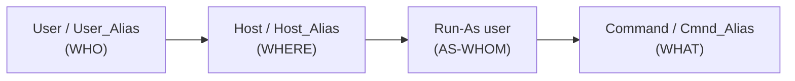

# Real World Examples Combine Aliases

## Overview

Combining **Host**, **User**, and **Command** aliases in `/etc/sudoers` lets you express complex, least-privilege delegation policies in a compact, auditable form. Instead of repeating long lists of hosts, users, and command paths across many rules, you define each group **once** as an alias and then reference it — mirroring how enterprise environments separate duties between IT, HR, and administrative teams.

This note builds three real-world sudoers policies from a single set of aliases and explains the security intent behind each rule.

> [!IMPORTANT]
> Always edit `/etc/sudoers` (and files under `/etc/sudoers.d/`) with `visudo`. It validates syntax before saving — a malformed sudoers file can lock every user out of `sudo`, including root recovery paths.

## Concepts

### Why Combine Aliases?

| Goal | How aliases help |
| :-- | :-- |
| **Simplify complex configurations** | Group hosts, users, and commands into named, reusable units. |
| **Avoid repetition** | Define an alias once and reference it in many rules. |
| **Improve security** | Grant least privilege by precisely scoping *where*, *who*, and *what* may run under sudo. |
| **Improve readability** | Shorter rules are easier to audit, review, and maintain. |

### Alias Types Recap

| Alias Type | Directive | Description | Example |
| :-- | :-- | :-- | :-- |
| Host Alias | `Host_Alias` | Groups of machines/hosts | `Host_Alias IT_HOST=server1, server2` |
| User Alias | `User_Alias` | Groups of users | `User_Alias IT_USERS=alice, bob` |
| Command Alias | `Cmnd_Alias` | Groups of commands | `Cmnd_Alias NETWORKING=/sbin/ifconfig, /bin/ping` |

### How a sudoers Rule Reads

Every rule follows the pattern `WHO  WHERE = (AS-WHOM)  WHAT`:



## Configuration

### Sample sudoers File Combining Aliases

```conf
# Host Aliases
Host_Alias    IT_HOSTS = ns1, webserver, localhost
Host_Alias    HR_HOSTS = hr1, hr2, hrbox

# User Aliases
User_Alias    IT_USERS = it1, it2, it3
User_Alias    HR_USERS = hr1, hr2, hr3
User_Alias    ADMINS = admin1, admin2

# Command Aliases
Cmnd_Alias   SOFTWARE = /bin/rpm, /usr/bin/yum, /usr/bin/up2date
Cmnd_Alias   NETWORKING = /sbin/ifconfig, /bin/ping, /sbin/iptables
Cmnd_Alias   ACCOUNT_MGMT = /usr/sbin/useradd, /usr/sbin/usermod, /usr/sbin/userdel
Cmnd_Alias   SYSTEM = /bin/systemctl, /usr/sbin/service, /sbin/reboot

# Defaults for security and environment
Defaults    env_reset
Defaults    secure_path = /sbin:/bin:/usr/sbin:/usr/bin

# Rules

# Allow ADMINS to execute any command as any user on any host
ADMINS   ALL = (ALL) ALL

# Allow IT_USERS to run software and networking commands on IT_HOSTS as root
IT_USERS IT_HOSTS = (root) SOFTWARE, NETWORKING

# Allow HR_USERS to manage accounts and reboot on HR_HOSTS only as root
HR_USERS HR_HOSTS = (root) ACCOUNT_MGMT, SYSTEM

# Allow IT_USERS to run software commands on HR_HOSTS but only as user 'it1'
IT_USERS HR_HOSTS = (it1) SOFTWARE
```

> [!NOTE]
> The two `Defaults` lines matter for security. `env_reset` strips the invoking user's environment (preventing tricks like `LD_PRELOAD` injection), and `secure_path` forces a trusted `PATH`, so an attacker cannot hijack a command by placing a malicious binary earlier in the search path.

## Examples

### 1. Limited Admin Access

An admin team (`ADMINS`) can perform any operation anywhere — trusted administrators with full privileges:

```conf
ADMINS ALL=(ALL) ALL
```

### 2. IT Department Software and Network Management

IT users often need to manage software and networking **only** on designated IT servers:

```conf
IT_USERS IT_HOSTS = (root) SOFTWARE, NETWORKING
```

This prevents IT users from accidentally performing privileged actions on unrelated hosts.

### 3. HR Department Account and Service Management

HR users may only manage user accounts and system services on HR servers:

```conf
HR_USERS HR_HOSTS = (root) ACCOUNT_MGMT, SYSTEM
```

This scoped access follows the principle of least privilege.

### 4. Cross-Host Delegation with Reduced Rights

IT users can run software-management commands on HR hosts, but constrained to the user `it1` for auditing and control:

```conf
IT_USERS HR_HOSTS = (it1) SOFTWARE
```

## Commands

Verify and test the policy after every change:

- Check allowed sudo commands for the current user:

```bash
sudo -l
```

- Test running a command as another user:

```bash
sudo -u otheruser command
```

- Test running a command with specific group permissions:

```bash
sudo -u someuser -g somegroup command
```

## Best Practices

- **Use aliases liberally.** They prevent long, unreadable rule lines and ease maintenance.
- **Follow the principle of least privilege.** Allow only the minimum commands, from specific hosts, as needed.
- **Keep sudoers readable.** Use comments and logical grouping (all `Host_Alias`, then `User_Alias`, then `Cmnd_Alias`).
- **Test changes with `visudo`** for syntax, plus small per-user tests, before wide deployment.
- **Review effective rights with `sudo -l`** as the target user.
- **Keep environment variables tightly controlled** (`env_reset`, `secure_path`) to prevent privilege escalation.

## Security Considerations

> [!WARNING]
> Command aliases that resolve to shells, editors, or interpreters can be abused to escape into a root shell. Never place binaries like `/bin/bash`, `vim`, `less`, `awk`, `find`, or `tar` in a `Cmnd_Alias` granted to non-admins — consult [GTFOBins](https://gtfobins.github.io/) for the full list of `sudo`-abusable binaries.

- Prefer absolute paths in `Cmnd_Alias` entries; relative names combined with a weak `PATH` are exploitable.
- Avoid wildcards (`*`) in command arguments — they frequently allow argument injection that bypasses the intended restriction.
- Audit `ALL=(ALL) ALL` grants regularly; they are effectively full root and should be reserved for a minimal admin group.
- Ship policies via drop-in files in `/etc/sudoers.d/` with mode `0440` so changes are modular and reviewable.

## Troubleshooting

| Symptom | Likely cause | Fix |
| :-- | :-- | :-- |
| `>>> /etc/sudoers: syntax error` | Malformed alias or rule | `visudo` refuses to save; correct the flagged line. |
| `user is not allowed to run … on host` | Host portion of the rule doesn't match this machine's hostname | Ensure the host is a member of the referenced `Host_Alias`. |
| Command still denied despite alias | Path in `Cmnd_Alias` differs from the real binary path | Compare with `which <cmd>`; paths must match exactly. |
| Rule ignored | A later rule overrides it | sudoers applies the **last** matching rule; reorder accordingly. |

## Related

- [Sudo](Sudo.md) — parent sudo command and rule syntax.
- [User-Aliases-in-sudoers](User-Aliases-in-sudoers.md) — the `User_Alias` type combined here.
- [Command-Aliases-in-sudoers](Command-Aliases-in-sudoers.md) — the `Cmnd_Alias` type combined here.
- [Host-Aliases-in-sudoers](Host-Aliases-in-sudoers.md) — the `Host_Alias` type combined here.
- Privilege-Escalation — sudoers misconfigurations as a privesc surface.
- [Linux Administration & Server Hardening](../Readme.md) — Linux administration & server hardening hub.
