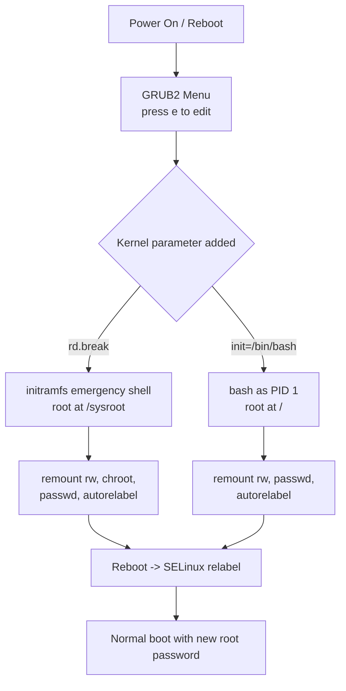

# Reset the Root Password in CentOS Stream 10

## Overview

This guide explains how to reset a lost or forgotten `root` password on a **CentOS Stream 10** system by interrupting the boot process at the GRUB2 bootloader and dropping into an early emergency shell. The same procedure applies to RHEL 10, AlmaLinux 10, and Rocky Linux 10.

Two methods are covered:

- **Method 1 — `rd.break`** (recommended): breaks out of the initramfs before the real root is mounted, giving a controlled, SELinux-aware recovery.
- **Method 2 — `init=/bin/bash`**: boots straight into a bash shell as PID 1.

> [!IMPORTANT]
> **Prerequisites**
> - Physical or console access (KVM / IPMI / VM console) to the system.
> - Permission to reboot the server.
> - Ability to edit the GRUB2 boot entry (no GRUB password, or knowledge of it).

> [!WARNING]
> Any user who can reach the GRUB menu and edit boot parameters can reset root. On production systems this is exactly why you should set a **GRUB bootloader password** and enforce **full-disk encryption (LUKS)** — see Security Considerations.

## Architecture

Where each method interrupts the normal boot flow:



## Method 1: Reset the Root Password Using `rd.break` (Recommended)

### Step 1: Reboot the System

Restart the server.

### Step 2: Edit the GRUB Boot Entry

1. At the **GRUB** menu, highlight the default kernel.
2. Press **`e`** to edit the boot entry.

Locate the line beginning with either:

```text
linux
```

or

```text
linuxefi
```

Append the following parameter to the end of the line:

```text
rd.break
```

Example:

```text
linux ... ro rhgb quiet rd.break
```

> [!NOTE]
> **📸 Screenshot**
> _Capture: GRUB2 edit screen with the highlighted linux line and rd.break appended at the end of the kernel command line_

### Step 3: Boot into Emergency Mode

Press one of the following:

- **Ctrl + X**
- **F10**

The system will boot into an emergency shell.

### Step 4: Remount the Root Filesystem

The real root filesystem is mounted read-only at `/sysroot`. Remount it read-write:

```bash
mount -o remount,rw /sysroot
```

### Step 5: Change Root into the Installed System

```bash
chroot /sysroot
```

### Step 6: Reset the Root Password

```bash
passwd root
```

Example:

```text
New password:
Retype new password:
passwd: all authentication tokens updated successfully.
```

### Step 7: Relabel SELinux

If SELinux is enabled (default), create the autorelabel file:

```bash
touch /.autorelabel
```

This ensures the correct SELinux contexts are restored on the next boot.

> [!WARNING]
> Skipping this step on an SELinux-enforcing system can leave `/etc/shadow` with the wrong security context, which may prevent login even with the correct new password.

### Step 8: Exit the Recovery Environment

Exit the chroot:

```bash
exit
```

Exit again to continue booting:

```bash
exit
```

The system will reboot normally. The first boot may take several minutes while SELinux relabels the filesystem.

## Method 2: Boot Directly into Bash

Instead of adding `rd.break`, append the following kernel parameter:

```text
rw init=/bin/bash
```

After the system boots, run:

```bash
passwd root
touch /.autorelabel
exec /sbin/reboot -f
```

Alternatively:

```bash
sync
exec /sbin/init
```

## Verification

### Verify the Password Reset

After the system finishes booting, log in as the `root` user.

```bash
su -
```

or

```text
Username: root
Password: <new_password>
```

### Verify SELinux Status

After logging in, verify that SELinux is enabled:

```bash
getenforce
```

Expected output:

```text
Enforcing
```

## Troubleshooting

### LUKS-Encrypted Systems

If the root filesystem is encrypted, you will be prompted to enter the LUKS passphrase before the emergency shell is available.

### SELinux Relabel Takes Time

The first reboot after creating `/.autorelabel` may take several minutes depending on the size of the filesystem.

Do **not** interrupt the process.

## Security Considerations

Local password reset via GRUB is a feature, not a flaw — but it is only safe if physical/console access is controlled. Harden the boot path:

- **Set a GRUB2 password** so boot entries cannot be edited without authentication (`grub2-setpassword`, then regenerate `grub.cfg`).
- **Enable LUKS full-disk encryption** so an attacker with console access still cannot mount `/sysroot` without the passphrase.
- **Restrict physical, IPMI/BMC, and hypervisor console access** — these are all equivalent to sitting at the keyboard.
- **Log and alert on unexpected reboots** into emergency or single-user mode.

These controls align with CIS Benchmark guidance for bootloader and single-user-mode protection.

## Summary

| Step | Command |
| :-- | :-- |
| Remount root filesystem | `mount -o remount,rw /sysroot` |
| Change root | `chroot /sysroot` |
| Reset password | `passwd root` |
| Enable SELinux relabel | `touch /.autorelabel` |
| Exit chroot | `exit` |
| Continue boot | `exit` |
| Check SELinux | `getenforce` |

## Related

- [passwd](passwd.md) — the command used to set the new root password.
- [Shadow-File-Secure-User-Passwords-File](Shadow-File-Secure-User-Passwords-File.md) — where the reset password hash is stored.
- [Passwd-File-Linux-User-Account-File](Passwd-File-Linux-User-Account-File.md) — the companion account database.
- [Linux Administration & Server Hardening](../Readme.md) — Linux administration & server hardening hub.
