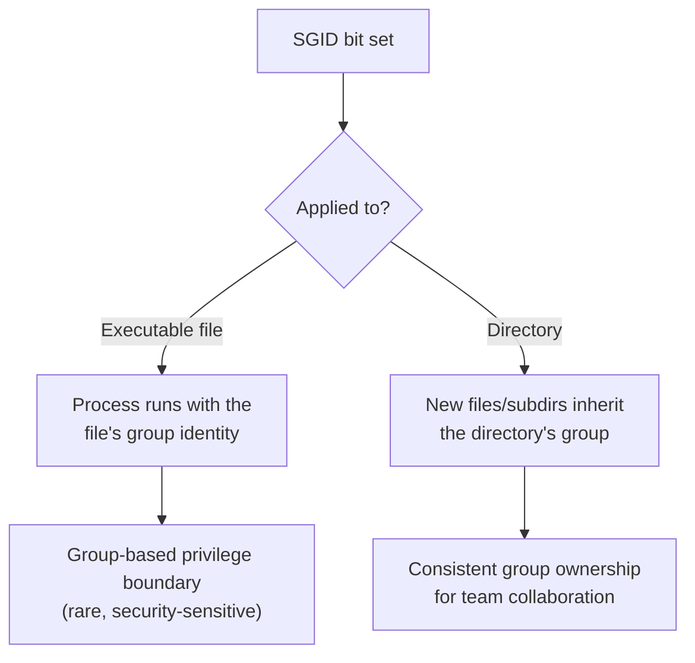

# Setgid (Set Group ID)

## Overview

**SGID** (Set Group ID) is a special Linux permission bit that changes how the *group* identity is applied to a file or directory. It has two distinct behaviours depending on where it is set:

- **On executable files** — when the program runs, it executes with the permissions of the file's **group owner**, rather than the primary group of the user who launched it (the group-side counterpart of SUID).
- **On directories** — any new file or subdirectory created inside **inherits the group of the parent directory**, instead of the creating user's primary group. This is the mechanism that makes shared, collaborative directories work reliably.

SGID is represented by an `s` in the **group execute** position of an `ls -l` listing and by the octal digit **`2`** in the special-permissions field.

> [!IMPORTANT]
> SGID on a directory is a legitimate, everyday collaboration tool. SGID on an executable is far rarer and, on system binaries or user-supplied programs, is a well-known privilege-escalation vector — see [Security Considerations](#security-considerations).

## Concepts

### The Special-Permission Bits

The leading (fourth) octal digit in `chmod` selects the special permission bits:

| Octal | Bit | Effect |
| :-- | :-- | :-- |
| `4` | setuid | Run with the file owner's UID |
| `2` | setgid | Run with the file's group / inherit group on directories |
| `1` | sticky | Restrict deletion in shared directories |

So `chmod 2777 data/` sets SGID (`2`) plus `rwxrwxrwx` (`777`) on the directory.

### File vs Directory Behaviour



## Commands

Typical workflow for setting, verifying, and removing the SGID bit.

- Set directory permissions so everyone can read, write, and execute:

```bash
chmod 777 /data/
```

- Create directories and files (as a regular user):

```bash
mkdir a1
```

```bash
touch f1
```

- Set the SGID bit on a directory (ensures group inheritance):

```bash
chmod g+s data/
```

- Check permissions — SGID shows as `s` in the group-execute field:

```bash
ls -lh /
```

- Create more test directories and files after SGID is set:

```bash
mkdir a2
```

```bash
touch f2
```

- Remove the SGID bit:

```bash
chmod g-s data/
```

```bash
ls -lh /
```

- Set all permissions plus SGID at once using octal notation (`2` for SGID):

```bash
chmod 2777 data/
```

```bash
ls -lh /
```

- Remove SGID using octal notation:

```bash
chmod g-s data/
```

```bash
ls -lh /
```

- Change group ownership of a directory:

```bash
chgrp u1 data/
```

- Set SGID again after changing group:

```bash
chmod g+s data/
```

## Examples

### Shared Group Directory

Create a directory owned by an employee group so every file created inside stays in that group:

```bash
mkdir emp
```

```bash
chgrp EMP emp/
```

```bash
chmod 770 emp/
```

```bash
chmod g+s emp/
```

Now any member of `EMP` who creates a file in `emp/` produces a file owned by group `EMP`, regardless of their own primary group — the foundation of a working team directory.

### SGID on an Executable

Set the SGID bit on a compiled binary (for example, a custom root shell used to demonstrate the effect):

```bash
chmod g+s rootshell
```

### How to Identify SGID

In `ls -l` output, a directory or file with SGID shows an `s` in the group-execute position:

```text
drwxrwsr-x 2 root staff 4096 Jan 1 12:34 data/
```

> [!NOTE]
> If the group does **not** already have the execute bit set, SGID appears as a capital `S` instead of a lowercase `s`, signalling that the bit is set but not effective for execution.

## Best Practices

- Use SGID on **shared project directories** to keep group ownership consistent across all contributors.
- Combine SGID with a restrictive base mode (for example `2770`) so only group members — not the world — can read and write.
- Prefer symbolic (`chmod g+s`) or octal (`chmod 2xxx`) notation consistently within a team so intent is obvious in scripts and documentation.
- Periodically audit for unexpected SGID files with `find / -perm -2000 -type f 2>/dev/null` and confirm each is a known, trusted binary.

## Security Considerations

> [!WARNING]
> Granting broad write/execute rights together with SGID (for example `chmod 2777`) on important directories, or setting SGID on user-created programs, can introduce serious risk in multi-user systems. Attackers enumerate SGID binaries as a privilege-escalation path.

- SGID directories are safe and expected; **SGID executables** deserve scrutiny. Every SGID binary is a potential group-privilege boundary an attacker may try to abuse.
- Never set SGID on shells, interpreters, or scripts (`bash`, `python`, `perl`, `awk`) — these hand the caller an interactive session running with the elevated group.
- Baseline the SGID inventory (`find / -perm -2000 2>/dev/null`) and alert on additions, in line with CIS Benchmark file-permission auditing.

The C programs below illustrate how a process observes and manipulates its real vs effective IDs — the mechanism SGID/SUID rely on.

```c
#include <stdio.h>
#include <unistd.h>

int main(void)
{
    printf("Real UID      : %d\n", getuid());
    printf("Effective UID : %d\n", geteuid());
    printf("Real GID      : %d\n", getgid());
    printf("Effective GID : %d\n", getegid());

    return 0;
}
```

```c
#include <stdio.h>
#include <unistd.h>

int main(void) {
    // Force Group IDs
    setgid(0);
    setegid(0);

    // Force User IDs
    setuid(0);
    seteuid(0);

    // Pass the "-p" flag to prevent the shell from dropping privileges
    char *args[] = {"/bin/sh", "-p", NULL};
    execvp(args[0], args);

    perror("execvp failed");
    return 1;
}
```

## Troubleshooting

| Symptom | Likely cause | Fix |
| :-- | :-- | :-- |
| New files still land in the user's primary group | SGID not set on the directory | Re-apply `chmod g+s <dir>` and confirm with `ls -ld <dir>`. |
| SGID shows as capital `S` | Group execute bit is missing | Add group execute: `chmod g+x <dir>` (or set mode `2775`). |
| SGID lost after `chgrp` / `chmod` | Some `chmod` numeric modes without a leading digit clear special bits | Re-set with the four-digit form, e.g. `chmod 2770 <dir>`. |
| Unexpected SGID binary found | Possible tampering or misconfiguration | Verify against the package database and remove if unauthorised. |

## Related

- [Setuid(Set-User-ID)](Setuid(Set-User-ID).md) — counterpart user-ID bit.
- [Sticky-Bit](Sticky-Bit.md) — companion special permission bit for shared directories.
- [Special-Permission](Special-Permission.md) — overview of setuid, setgid, and the sticky bit.
- [chmod](chmod.md) — the command used to set and clear the SGID bit.
- Privilege-Escalation — SGID binaries as a privilege-escalation vector.
- [Linux Administration & Server Hardening](../Readme.md) — course hub.
