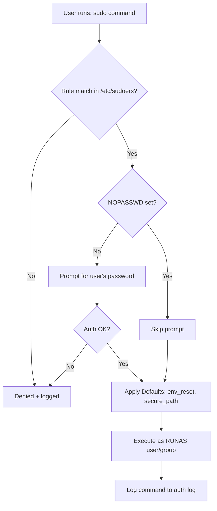

# Sudo

## Overview

The `sudo` command allows permitted users to execute commands with the privileges of the superuser (root) or another specified user, following rules defined in the **/etc/sudoers** file. Unlike `su`, `sudo` lets users run single commands as root or other users without switching sessions, often without needing the target user's password, based on configured policies.

`sudo` is the primary mechanism for **least-privilege administration** on Linux: instead of sharing the root password, you grant narrowly scoped, individually attributable, and fully audited privilege. Every invocation is logged, making it central to both operations and security compliance.

> [!IMPORTANT]
> Because `sudo` grants elevated privilege, a loose sudoers rule (`ALL`, `NOPASSWD:`, or an editor/interpreter left runnable as root) is one of the most exploited Linux privilege-escalation paths. Grant the minimum command set required and never more.

## Concepts

| Term | Meaning |
| --- | --- |
| `/etc/sudoers` | The policy file that defines who may run what, as whom |
| `visudo` | The **only** safe editor for sudoers — it validates syntax before saving |
| Privilege spec | A single rule line: `USER HOST = (RUNAS) COMMANDS` |
| `Defaults` | Global options controlling environment handling, logging, and security |
| Aliases | Named groups of users, hosts, commands, or run-as identities |

## Architecture



## Installation and Package Management (RPM Based Systems)

- Check if sudo is installed

```bash
rpm -qa | grep sudo
```

- Install sudo if missing

```bash
yum install sudo
```

- List files installed by sudo package

```bash
rpm -ql sudo
```

- List sudo configuration files

```bash
rpm -qc sudo
```

- List sudo documentation files

```bash
rpm -qd sudo
```

## Configuration

### The sudoers File (/etc/sudoers)

- Controls who can run what commands, as which users or groups.
- Must **only** be edited using the secure `visudo` tool to prevent syntax errors:

```bash
visudo
```

- or specify editor

```bash
EDITOR=vim visudo
```

> [!WARNING]
> A syntax error saved directly into `/etc/sudoers` can lock every user out of sudo. `visudo` refuses to save an invalid file — always use it. For drop-in rules, prefer files under `/etc/sudoers.d/` edited with `visudo -f /etc/sudoers.d/<name>`.

### Syntax of sudoers Privilege Specification

```text
USER    HOST = (RUNAS_USER:RUNAS_GROUP) COMMANDS
```

- `USER` — user or group that gets access
- `HOST` — host(s) where the rule applies (`ALL` for any host)
- `RUNAS_USER` — user identity to assume (e.g., `root`, `armour`)
- `RUNAS_GROUP` — optional group identity
- `COMMANDS` — allowed commands or aliases

**Example:**

```bash
root    ALL=(ALL) ALL
```

```bash
emp1   ALL=(armour:EMP) /usr/sbin/fdisk
```

`emp1` can run `/usr/sbin/fdisk` as user `armour` and group `EMP`.

### User and Group Privileges

- Root user can run any command on all hosts as any user

```bash
root    ALL=(ALL) ALL
```

- Members of wheel group can run any command as any user

```bash
%wheel  ALL=(ALL) ALL
```

- User armour can run all commands

```bash
armour  ALL=(ALL) ALL
```

- IT group members allowed full sudo access

```bash
%IT     ALL=(ALL) ALL
```

> [!NOTE]
> A leading `%` denotes a **group** rather than a user. `%wheel` (RHEL/CentOS) and `%sudo` (Debian/Ubuntu) are the conventional administrator groups.

### Defaults (Security and Environment)

- **Shows only comment lines** in the sudoers file (lines starting with `#`).

```bash
grep "^#" /etc/sudoers
```

- **Shows all non-comment lines** (active configuration lines) by excluding lines starting with `#`.

```bash
grep -v "^#" /etc/sudoers
```

- Displays the sudoers file content without comments or empty lines:

```bash
cat /etc/sudoers | grep -v "^#" | sed '/^$/d'
```

- Same as above but **without using `cat`**, which is more efficient by directly piping grep output to `sed`.

1. `cat` outputs the entire file
2. `grep -v "^#"` removes comment lines
3. `sed '/^$/d'` deletes empty lines

```bash
grep -v "^#" /etc/sudoers | sed '/^$/d'
```

A typical active configuration looks like:

```text
Defaults   !visiblepw
Defaults    always_set_home
Defaults    match_group_by_gid
Defaults    always_query_group_plugin
Defaults    env_reset
Defaults    env_keep =  "COLORS DISPLAY HOSTNAME HISTSIZE KDEDIR LS_COLORS"
Defaults    env_keep += "MAIL PS1 PS2 QTDIR USERNAME LANG LC_ADDRESS LC_CTYPE"
Defaults    env_keep += "LC_COLLATE LC_IDENTIFICATION LC_MEASUREMENT LC_MESSAGES"
Defaults    env_keep += "LC_MONETARY LC_NAME LC_NUMERIC LC_PAPER LC_TELEPHONE"
Defaults    env_keep += "LC_TIME LC_ALL LANGUAGE LINGUAS _XKB_CHARSET XAUTHORITY"
Defaults    secure_path = /sbin:/bin:/usr/sbin:/usr/bin
root	ALL=(ALL) 	ALL
%wheel	ALL=(ALL)	ALL
```

### Environment Security Defaults Summary

| Default | Purpose |
| --- | --- |
| `env_reset` | Clears environment, only preserving whitelisted variables (`env_keep`) |
| `always_set_home` | Sets `$HOME` to the target user's home directory |
| `secure_path` | Restricts `PATH` to trusted directories, blocking PATH-hijack attacks |
| `!visiblepw` | Prevents sudo from running if password input cannot be hidden |

> [!TIP]
> `env_reset` and `secure_path` are your primary defenses against environment-based privilege escalation (`LD_PRELOAD`, `PATH`, and `IFS` attacks). Keep `env_keep` as short as possible and never add `LD_*` variables to it.

### Aliases for Easier Management

- **User Aliases**: Group several users

```bash
User_Alias ADMINS = jsmith, mikem
```

- **Command Aliases**: Group related commands

```bash
Cmnd_Alias NETWORKING = /sbin/route, /sbin/ifconfig, /bin/ping
Cmnd_Alias SOFTWARE = /bin/rpm, /usr/bin/yum
```

- **Group Aliases** also possible.

## Commands

### Check Allowed Commands (for current user)

```bash
sudo -l
```

```bash
sudo --list
```

### Run Commands as Root

```bash
sudo id
```

```bash
sudo fdisk -l
```

### Run Commands as Another User

```bash
sudo -u armour id
```

```bash
sudo --user=armour mkdir d1
```

```bash
sudo -u infosec whoami
```

### Run Commands as Another User and Group

```bash
sudo -u armour -g IT id
```

```bash
sudo --user=infosec --group=IT mkdir /tmp/d2
```

### Background Command Execution

```bash
sudo -b --user=infosec id
```

### Start Login Shell as Another User

```bash
sudo --user=infosec --login
```

```bash
sudo --user=infosec -i
```

### List Files and Directories as Another User

```bash
sudo -u it1 ls -lh /home/it1/
```

## Managing sudo Privileges via Groups

- Add user to group `wheel` (enable sudo access):

```bash
gpasswd -a armour wheel
```

```bash
usermod -aG wheel it1
```

- Remove user from `wheel` group:

```bash
gpasswd -d armour wheel
```

- List members of `wheel` group:

```bash
gpasswd wheel
```

## Best Practices

> [!TIP]
> - **Least privilege:** grant specific command paths, not `ALL`. Use full absolute paths so a rule cannot be satisfied by a planted binary.
> - **Avoid `NOPASSWD`** except for genuinely safe, automated commands (see [Understanding-NOPASSWD-in-sudoers](Understanding-NOPASSWD-in-sudoers.md)).
> - **Never grant** editors, pagers, interpreters, or shell-spawning tools (`vi`, `less`, `find`, `awk`, `python`) as root — each is a one-command root shell (see GTFOBins).
> - Prefer **drop-in files** in `/etc/sudoers.d/` over editing the main file, and keep them under configuration management.
> - Enable per-command logging / I/O logging (`log_input`, `log_output`) for high-value rules.

## Security Considerations

- `sudo -l` is the first thing an attacker runs after landing on a host; audit your own rules with it regularly and assume adversaries will too.
- Wildcards in command arguments (`/usr/sbin/service apache2 *`) can often be abused — keep argument patterns tight.
- Keep `sudo` patched: several high-impact CVEs (e.g. Baron Samedit / CVE-2021-3156, and CVE-2023-22809 affecting `sudoedit`) allowed local root. Track your distro's advisories.
- Review `/etc/sudoers` and `/etc/sudoers.d/*` as part of every hardening baseline (CIS "Ensure sudo commands use pty", "Ensure sudo log file exists").

## Troubleshooting

| Symptom | Likely cause / fix |
| --- | --- |
| `user is not in the sudoers file` | User not granted; add via a rule or group (`%wheel`/`%sudo`) |
| `sudo: /etc/sudoers is world writable` | Fix perms: sudoers must be `0440`, owned by root |
| Syntax error locks out sudo | Boot to recovery/root shell, fix with `visudo`; always edit via `visudo` |
| Command works interactively but not in cron/script | Environment reset by `env_reset`; set full paths and needed `env_keep` vars |
| Password prompt loops | Wrong password, or `!visiblepw` blocking a non-tty session |

## References

| Resource | Description |
| --- | --- |
| `man sudoers` | Complete grammar and `Defaults` reference |
| `man sudo` | Command-line options |
| `man visudo` | Safe editing and validation (`visudo -c`) |
| GTFOBins | Catalog of binaries that break out of restricted sudo rules |
| CIS Linux Benchmark | Hardening controls for sudo configuration and logging |

## Related

- [User-and-Group-Management](User-and-Group-Management.md) — sudo grants escalated user privileges.
- [Understanding-NOPASSWD-in-sudoers](Understanding-NOPASSWD-in-sudoers.md) — passwordless sudo behaviour and risks.
- [Command-Aliases-in-sudoers](Command-Aliases-in-sudoers.md) — structuring sudoers rules with command groups.
- [User-Aliases-in-sudoers](User-Aliases-in-sudoers.md) — grouping users for cleaner rules.
- [su-and-sg](su-and-sg.md) — related identity-switching commands.
- Privilege-Escalation — sudo misconfiguration is a top Linux privesc path.
- [Linux Administration & Server Hardening](../Readme.md) — course hub.
