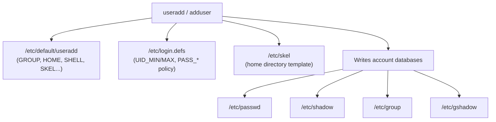

# User Management with useradd and adduser

## Overview

Linux provides multiple utilities for creating user accounts. The two most commonly used commands are `useradd` and `adduser`. Although both ultimately create user accounts, they differ significantly in behaviour, ergonomics, and intended use case: `useradd` is a low-level, script-friendly primitive, while `adduser` is a friendlier interactive wrapper found mostly on Debian-based systems.

> [!NOTE]
> Provisioning accounts correctly is a foundational hardening control. Consistent UID/GID allocation, deliberate shell assignment, and password hashing done right (never plaintext) are the difference between a maintainable estate and one riddled with orphaned or over-privileged accounts.

## Concepts

### What is `useradd`?

`useradd` is a low-level user creation utility available on virtually all Linux distributions.

- Non-interactive by default.
- Suitable for scripts and automation.
- Requires explicit options to create home directories, set shells, assign groups, and configure passwords.
- Draws its defaults from system configuration files (`/etc/default/useradd`, `/etc/login.defs`).

```bash
useradd username
```

> [!WARNING]
> On many distributions `useradd username` (without `-m`) does **not** create a home directory. Behaviour depends on system defaults such as `CREATE_HOME` in `/etc/login.defs`.

### What is `adduser`?

`adduser` is a higher-level user management utility available primarily on Debian-based distributions (it is a Perl wrapper around the low-level tools).

- Interactive user creation.
- Automatically creates a home directory.
- Prompts for password and GECOS user information.
- Easier for administrators performing manual, one-off account creation.

```bash
adduser username
```

Typical interactive prompts:

```text
Adding user 'username' ...
Adding new group 'username' ...
Creating home directory '/home/username' ...
Copying files from '/etc/skel' ...

New password:
Retype new password:

Full Name []:
Room Number []:
Work Phone []:
Home Phone []:
Other []:
```

### Comparison Between `useradd` and `adduser`

| Feature | `useradd` | `adduser` |
|---|---|---|
| Interactive | No | Yes |
| Prompts for password | No | Yes |
| Creates home directory automatically | Depends on configuration | Yes |
| Script-friendly | Yes | No |
| Available on most distributions | Yes | Mostly Debian-based |
| Suitable for automation | Yes | No |
| User-friendly | Moderate | High |

## Architecture

Account creation is driven by two configuration files that supply the defaults `useradd` applies when options are omitted.



## Configuration

### `/etc/default/useradd`

Displays default values used by `useradd`.

```bash
cat /etc/default/useradd
```

Example:

```text
GROUP=100
HOME=/home
INACTIVE=-1
EXPIRE=
SHELL=/bin/bash
SKEL=/etc/skel
CREATE_MAIL_SPOOL=yes
```

### `/etc/login.defs`

Contains additional user account defaults, including UID/GID ranges and password-aging policy.

```bash
cat /etc/login.defs
```

Important parameters include:

```text
UID_MIN      1000
UID_MAX      60000
GID_MIN      1000
GID_MAX      60000
PASS_MAX_DAYS   99999
PASS_MIN_DAYS   0
PASS_WARN_AGE   7
```

> [!TIP]
> Tightening `PASS_MAX_DAYS`, `PASS_MIN_DAYS`, and `PASS_WARN_AGE` here sets the policy for **future** accounts. Existing accounts must be updated separately with `chage`.

### Viewing Account Databases

Display recent entries across all four account databases:

```bash
tail -n 3 /etc/passwd /etc/shadow /etc/group /etc/gshadow
```

Verbose output (shows each file header):

```bash
tail -v -n 3 /etc/passwd /etc/shadow /etc/group /etc/gshadow
```

## Commands

### Help and Documentation

Display help for `useradd`:

```bash
useradd --help
```

Display help for `adduser`:

```bash
adduser --help
```

View manual pages:

```bash
man useradd
```

```bash
man adduser
```

### Basic User Creation

Create a user:

```bash
useradd u1
```

Create a user with a home directory:

```bash
useradd -m u3
```

Or, using the long option:

```bash
useradd --create-home u3
```

Create a user interactively (Debian-based):

```bash
adduser u2
```

### Home Directory Options

Custom home directory:

```bash
useradd -d /backup/u4 u4
```

Create the custom home directory as well:

```bash
useradd -m -d /opt/u4 u4
```

Do not create a home directory:

```bash
useradd -M u9
```

Or, using the long option:

```bash
useradd --no-create-home u13
```

### Comments (GECOS Information)

Add descriptive information:

```bash
useradd -c "Admin User" admin1
```

```bash
useradd --comment "Test User" testuser1
```

View the comment field:

```bash
grep "^u5:" /etc/passwd
```

Example:

```text
u5:x:1005:1005:Admin User:/home/u5:/bin/bash
```

### User Group Management

Create a user without a per-user private group:

```bash
useradd -N u15
```

```bash
useradd --no-user-group u14
```

Specify a primary group:

```bash
useradd -g 1000 u9
```

```bash
useradd -g 1011 u8
```

Add supplementary groups:

```bash
useradd -G wheel,docker u29
```

Combined example (home, shell, and a supplementary group):

```bash
useradd -m -s /bin/bash -G wheel u29
```

### Login Shell Configuration

Display available login shells:

```bash
cat /etc/shells
```

Specify a shell:

```bash
useradd -s /bin/sh u6
```

```bash
useradd --shell /usr/bin/fish u15
```

```bash
useradd -s /usr/bin/zsh u30
```

Verify:

```bash
grep "^u15:" /etc/passwd
```

### User ID (UID) Management

Create a user with a specific UID:

```bash
useradd -u 1010 u7
```

Create a user with a non-unique UID:

```bash
useradd -o -u 0 admin
```

```bash
useradd --non-unique --uid 0 u20
```

> [!WARNING]
> Creating multiple accounts with UID 0 effectively grants root privileges and should only be done in exceptional circumstances. Auditors treat any non-`root` UID 0 account as a critical finding.

### Password Management

Create the account:

```bash
useradd -m user1
```

Set the password interactively:

```bash
passwd user1
```

#### Create User with Pre-Encrypted Password

Generate an SHA-512 hash:

```bash
openssl passwd -6 "password123"
```

Create the user with the hash:

```bash
useradd -p '$6$hash_here' user1
```

```bash
useradd --password '$6$hash_here' user2
```

Generate an SHA-512 hash using Python:

```bash
python3 -c 'import crypt; print(crypt.crypt("password123", crypt.mksalt(crypt.METHOD_SHA512)))'
```

#### Generate Password Using `mkpasswd`

Install the package:

```bash
yum install mkpasswd
```

Verify supported methods:

```bash
mkpasswd --method=help
```

Generate a hash:

```bash
mkpasswd --method=yescrypt
```

```bash
mkpasswd --method=SHA-512
```

```bash
mkpasswd -m yescrypt
```

```bash
mkpasswd -m sha-512
```

> [!IMPORTANT]
> The `-p` option expects an **encrypted password hash**, never plaintext. The following stores the literal string `123` as the hash, producing an unusable, insecure account:
> ```bash
> useradd -p 123 user1
> ```

### Account Expiration

Expire an account on a set date:

```bash
useradd -e 2025-12-31 u15
```

Verify:

```bash
chage -l u15
```

Set the password inactivity period (disables the account 20 days after the password expires):

```bash
useradd -f 20 u19
```

### System Accounts

Create a system account:

```bash
useradd -r sys_u1
```

System accounts typically:

- Have low UIDs (below `UID_MIN`).
- Cannot log in interactively.
- Run services and daemons.

Verify:

```bash
id sys_u1
```

### Advanced User Creation

Create a user with multiple options at once:

```bash
useradd \
-m \
-d /backup/u26 \
-s /usr/bin/zsh \
-u 1030 \
-c "Test User 2" \
-p '$6$encrypted_hash' \
u26
```

```bash
useradd -m -d /backup/admin3 -s /usr/bin/zsh -u 1041 -c "Test User 2" -p '$y$j9T$uNe5bN4W4WbsgUQo52P/b/$W12GZqZyjNwdcAiyspVYcX9kTdpEIyx4aveuLwIcd75' admin3
```

## Examples

### Verifying User Creation

Check the account entry in `/etc/passwd`:

```bash
grep "^admin:" /etc/passwd
```

Display user identity information:

```bash
id admin
```

Check the home directory:

```bash
ls -ld /backup/admin3
```

Check group memberships:

```bash
groups u26
```

### Common Administrative Commands

| Task | Command |
|---|---|
| Create user | `useradd username` |
| Create user with home | `useradd -m username` |
| Interactive creation | `adduser username` |
| Create system account | `useradd -r username` |
| Set password | `passwd username` |
| Change shell | `usermod -s /bin/bash username` |
| Lock account | `usermod -L username` |
| Unlock account | `usermod -U username` |
| Expire account | `usermod -e YYYY-MM-DD username` |
| Delete user | `userdel username` |
| Delete user and home | `userdel -r username` |

## Best Practices

- Use `adduser` for manual account creation on Debian-based systems.
- Use `useradd` for scripting and automation, where deterministic, non-interactive behaviour matters.
- Always set passwords using `passwd`, or pass a properly generated hash to `-p` — never plaintext.
- Avoid assigning UID 0 to non-root accounts.
- Enforce strong password policies via `/etc/login.defs` and PAM.
- Create service/system accounts with `-r` and a non-login shell (`/usr/sbin/nologin`).
- Regularly review user accounts and group memberships for orphaned or over-privileged entries.
- Verify account creation using `id`, `groups`, and `/etc/passwd`.

## Security Considerations

- **Least privilege**: supplementary group grants (`-G wheel,docker`) confer real power — membership in `wheel`/`sudo` and `docker` is effectively administrative. Grant sparingly and audit periodically.
- **No plaintext secrets**: the `-p` flag and any hash embedded in provisioning scripts appear in shell history and process listings. Prefer `chpasswd`/`passwd` at first login, or a configuration-management secret store.
- **Hashing strength**: use SHA-512 (`-6`) or yescrypt (`$y$`) hashes; MD5/DES-based hashes are unacceptable under modern baselines.
- **Account lifecycle**: set expiry (`-e`) and inactivity (`-f`) on temporary and contractor accounts so dormant credentials cannot linger (aligns with CIS account-management guidance).
- **UID 0 uniqueness**: exactly one UID 0 account (`root`) should exist; enforce and monitor this.

## Troubleshooting

| Symptom | Likely Cause | Resolution |
|---|---|---|
| No home directory after `useradd` | `-m` omitted and `CREATE_HOME` disabled | Re-run with `-m`, or `mkdir` + copy `/etc/skel` and set ownership |
| User cannot log in | Non-login shell or locked/empty password | Check the shell field in `/etc/passwd` and status with `passwd -S username` |
| `-p 123` account cannot authenticate | Plaintext passed where a hash is expected | Set password with `passwd`, or pass a real hash from `openssl passwd -6` |
| Duplicate UID warning | Reusing an existing UID without `-o` | Choose a free UID, or intentionally allow with `--non-unique` |

## References

| Resource | Description |
|---|---|
| `man useradd` | Low-level account creation manual |
| `man adduser` | Debian interactive wrapper manual |
| `man login.defs` | Account creation defaults and policy |
| `man 5 passwd` / `man 5 shadow` | Account database file formats |

## Related

- [User-and-Group-Management](User-and-Group-Management.md) — parent topic covering the full user/group model
- [usermod](usermod.md) — modify the accounts you create
- [userdel](userdel.md) — remove created accounts
- [passwd](passwd.md) — set the new account's password
- [Passwd-File-Linux-User-Account-File](Passwd-File-Linux-User-Account-File.md) — where new accounts are recorded
- [Shadow-File-Secure-User-Passwords-File](Shadow-File-Secure-User-Passwords-File.md) — where password hashes live
- [Linux Administration & Server Hardening](../Readme.md) — course hub
