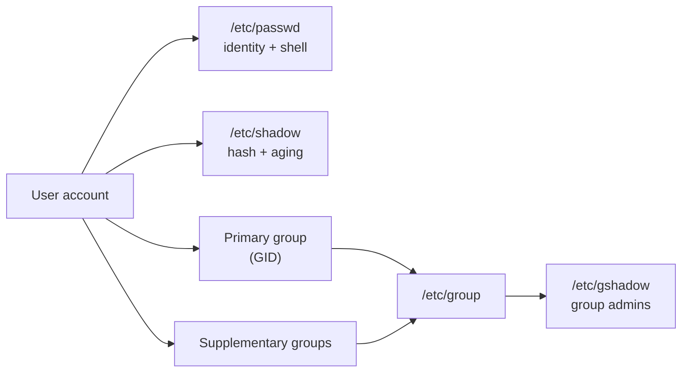

# User and Group Management

## Overview

Linux is a multi-user operating system. Managing users and groups is fundamental to securing and organizing access to system resources. Every process and file is owned by a user and associated with a group, and the identity model built on `/etc/passwd`, `/etc/shadow`, `/etc/group`, and `/etc/gshadow` underpins all access control on the system.

> [!NOTE]
> User and group management is a first-class hardening domain in both the CIS Benchmarks and NIST guidance. Deliberate UID/GID allocation, disciplined use of privileged groups (`sudo`, `wheel`, `docker`), and a clean account lifecycle directly reduce attack surface.

## Concepts

### Users

A user account defines who can log into the system and what they can access or do.

#### Components of a User Account

| Component | Description |
|---|---|
| Username | Unique name identifying the user (e.g., `armour`, `admin`) |
| UID | User ID — numerical value identifying the user |
| GID | Primary group ID the user belongs to |
| Home Directory | Default location for user files (e.g., `/home/armour`) |
| Shell | The command-line interface assigned (e.g., `/bin/bash`) |
| Password | Encrypted and stored in `/etc/shadow` |

#### Typical UID Ranges

| UID Range | Purpose |
|---|---|
| `0` | Root user |
| `1 – 999` | System and service accounts (varies by distribution) |
| `1000+` | Regular users |

View UID allocation settings:

```bash
grep -E 'UID_MIN|UID_MAX|SYS_UID_MIN|SYS_UID_MAX' /etc/login.defs
```

### Types of User Accounts

#### System Accounts

Created for operating system services and processes.

```text
root
daemon
bin
nobody
```

#### Regular User Accounts

Created for human users who log into and use the system.

#### Service Accounts

Created for applications and daemons, usually with restricted permissions and a non-login shell.

```text
nginx
mysql
postgres
sshd
```

### Groups

A group is a logical collection of users that share common access privileges.

#### Group Components

| Component | Description |
|---|---|
| Group Name | Human-readable group identifier |
| GID | Group ID |
| Members | Users assigned to the group |

#### Group Types

**Primary group** — assigned when a user is created. Files created by the user belong to this group by default.

**Supplementary groups** — additional groups that grant access to shared resources.

#### Common System Groups

| Group | Purpose |
|---|---|
| `wheel` / `sudo` | Administrative access |
| `adm` | System log access |
| `sys` | System administration tasks |
| `www-data` | Web server processes |
| `docker` | Docker management without sudo |

> [!WARNING]
> Membership in `wheel`/`sudo` or `docker` is effectively root-equivalent — the `docker` group grants trivial host root via container escape. Treat these grants as privileged and audit them.

## Architecture

### System Files

| File | Purpose |
|---|---|
| `/etc/passwd` | Stores basic user information (username, UID, GID, home directory, shell) |
| `/etc/shadow` | Stores encrypted passwords and password aging information |
| `/etc/group` | Stores group information including GIDs and members |
| `/etc/gshadow` | Secure group file containing group passwords and administrative information |
| `/etc/login.defs` | Default configuration used when creating new user accounts |
| `/etc/skel` | Skeleton directory used to populate new user home directories |

View the skeleton files copied into every new home directory:

```bash
ls -la /etc/skel
```



### What Is a Daemon?

A daemon is a background process that runs continuously and performs system-level tasks or services without user interaction.

Characteristics:

- Runs in the background.
- Usually starts automatically during boot.
- Typically has no controlling terminal (TTY).
- Commonly ends with the letter `d`.

```text
sshd
crond
systemd
httpd
```

### The daemon User and Group

Linux systems include a special `daemon` user and group used to run background services with limited privileges. Its purpose is to isolate services from regular users, reduce the impact of a service compromise, and follow the principle of least privilege.

#### Common Attributes

| Attribute | Value |
|---|---|
| Username | `daemon` |
| UID | Usually `2` |
| Group | `daemon` |
| GID | Usually `2` |
| Home Directory | `/usr/sbin` or `/nonexistent` |
| Shell | `/usr/sbin/nologin` or `/bin/false` |

The `daemon` user typically cannot log in interactively.

View the daemon account:

```bash
getent passwd daemon
```

Example:

```text
daemon:x:2:2:daemon:/usr/sbin:/usr/sbin/nologin
```

View the daemon group:

```bash
getent group daemon
```

Example:

```text
daemon:x:2:
```

View processes running as daemon:

```bash
ps -u daemon
```

> [!NOTE]
> Most modern services use dedicated service accounts rather than the shared `daemon` account, giving each service its own isolation boundary.

## Commands

### Create Users

Create a user:

```bash
useradd username
```

Create a user with a home directory:

```bash
useradd -m username
```

Create a user with a specific shell:

```bash
useradd -m -s /bin/bash username
```

Create a user with a custom home directory:

```bash
useradd -m -d /custom/home username
```

Create a user with a specific UID:

```bash
useradd -u 2001 username
```

Create a user with a specific UID and primary group:

```bash
useradd -u 2001 -g developers username
```

On Debian and Ubuntu systems, an interactive wrapper is available:

```bash
adduser username
```

### Manage Passwords

Set or change a password:

```bash
passwd username
```

Display password status:

```bash
passwd -S username
```

### Modify Users

Change a username:

```bash
usermod -l newname oldname
```

Move the home directory:

```bash
usermod -d /new/home -m username
```

Change the primary group:

```bash
usermod -g groupname username
```

Add a user to supplementary groups:

```bash
usermod -aG group1,group2 username
```

> [!WARNING]
> Always use `-a` (append) together with `-G`. Running `usermod -G` **without** `-a` replaces all supplementary group memberships, silently removing the user from every group not listed.

### Lock and Unlock Accounts

Lock an account:

```bash
passwd -l username
```

Unlock an account:

```bash
passwd -u username
```

### Delete Users

Delete a user account:

```bash
userdel username
```

Delete a user and their home directory:

```bash
userdel -r username
```

### User Account Expiration

View account aging information:

```bash
chage -l username
```

Set password expiration to 90 days:

```bash
chage -M 90 username
```

Set an account expiration date:

```bash
chage -E 2026-12-31 username
```

### Shell Management

List valid login shells:

```bash
cat /etc/shells
```

Change a user's shell:

```bash
chsh -s /bin/bash username
```

### Group Management

Create a group:

```bash
groupadd groupname
```

Delete a group:

```bash
groupdel groupname
```

Add a user to a supplementary group:

```bash
usermod -aG groupname username
```

Remove a user from a supplementary group:

```bash
gpasswd -d username groupname
```

Change a user's primary group:

```bash
usermod -g groupname username
```

### Viewing User and Group Information

Display the current user:

```bash
whoami
```

Display the current user's UID and groups:

```bash
id
```

Display information about a specific user:

```bash
id username
```

Display groups for a user:

```bash
groups username
```

View a specific user entry:

```bash
getent passwd username
```

View all users:

```bash
getent passwd
```

View a specific group:

```bash
getent group sudo
```

View all groups:

```bash
getent group
```

Display last login information:

```bash
lastlog
```

Show login history:

```bash
last username
```

### Switching Users

Switch to another user:

```bash
su - username
```

Start a root login shell:

```bash
sudo -i
```

Run a command as another user:

```bash
sudo -u username command
```

### Viewing Logged-In Users

Display currently logged-in users:

```bash
who
```

Show detailed login information:

```bash
w
```

Display usernames currently logged in:

```bash
users
```

## Examples

### Useful Administrative Commands

Find all users with UID 0 (root-equivalent accounts):

```bash
awk -F: '$3 == 0 {print $1}' /etc/passwd
```

Find users with interactive shells:

```bash
getent passwd | grep -vE 'nologin|false'
```

Check failed login attempts (RHEL/CentOS/Fedora):

```bash
faillock --user username
```

### The Unix Epoch

January 1, 1970, 00:00:00 UTC is known as the Unix Epoch — the date and time from which Unix and Linux systems measure time. It represents timestamp `0`. Unix time is the number of seconds that have elapsed since that moment.

Display the current Unix timestamp:

```bash
date +%s
```

Convert a timestamp to a human-readable date:

```bash
date -d @0
```

Output:

```text
Thu Jan 1 00:00:00 UTC 1970
```

Unix timestamps are used for system clocks, file timestamps, log entries, databases, and application scheduling. A timestamp of `0` — or a date near January 1, 1970 — often indicates missing timestamp data, incorrect system time, hardware clock issues, or date-parsing failures.

## Configuration

### Default User Configuration

View login defaults:

```bash
cat /etc/login.defs
```

Display the configuration without comments or blank lines:

```bash
grep -v "^#" /etc/login.defs | grep -v "^$"
```

## Best Practices

- Enforce the principle of least privilege — grant supplementary groups only when required.
- Keep exactly one UID 0 account (`root`); treat any other as a critical finding.
- Assign non-login shells (`/usr/sbin/nologin`) to service and system accounts.
- Apply password aging (`chage`) and expiry to human accounts.
- Prefer dedicated per-service accounts over the shared `daemon` account.
- Review group membership, especially `sudo`/`wheel`/`docker`, on a regular cadence.
- Use `getent` rather than reading files directly so NSS sources (LDAP, SSSD) are honoured.

## Security Considerations

- **Root-equivalent groups**: `sudo`, `wheel`, and `docker` grant effective root; monitor and minimize membership.
- **Shadow protection**: `/etc/shadow` and `/etc/gshadow` must remain root-owned and unreadable by others; world-readable hashes enable offline cracking.
- **Dormant accounts**: expire and disable accounts for departed users and contractors; dormant credentials are a common initial-access vector.
- **Audit UID 0**: continuously verify only `root` has UID 0 (`awk -F: '$3==0'`).
- **Login shells**: any service account with an interactive shell widens the attack surface — set `nologin`.

## Troubleshooting

| Symptom | Likely Cause | Resolution |
|---|---|---|
| User dropped from groups after `usermod -G` | `-a` omitted, memberships replaced | Re-add with `usermod -aG`; verify with `id` |
| `groupdel` refuses to remove a group | It is a user's primary group | Change the user's primary group first, then delete |
| User exists but cannot log in | Non-login shell or locked password | Check shell in `/etc/passwd`, status via `passwd -S` |
| Group members not visible in `/etc/group` | Membership is primary (GID in passwd), not supplementary | Cross-check with `id username` |

## References

| Resource | Description |
|---|---|
| `man 5 passwd` | `/etc/passwd` format |
| `man 5 shadow` | `/etc/shadow` format |
| `man 5 group` | `/etc/group` format |
| `man login.defs` | Account creation defaults and policy |
| CIS Benchmarks | User/group and account-management hardening controls |

## Related

- [Passwd-File-Linux-User-Account-File](Passwd-File-Linux-User-Account-File.md) — user account database
- [Shadow-File-Secure-User-Passwords-File](Shadow-File-Secure-User-Passwords-File.md) — password hash store
- [Group-File-Linux-Group-Account-File](Group-File-Linux-Group-Account-File.md) — group account database
- [User-Management-with-useradd-and-adduser](User-Management-with-useradd-and-adduser.md) — account creation tools in depth
- [usermod](usermod.md) — modify existing accounts
- [userdel](userdel.md) — remove accounts
- [passwd](passwd.md) — set and manage passwords
- [Sudo](Sudo.md) — granting privileges to users and groups
- [Linux Administration & Server Hardening](../Readme.md) — course hub
