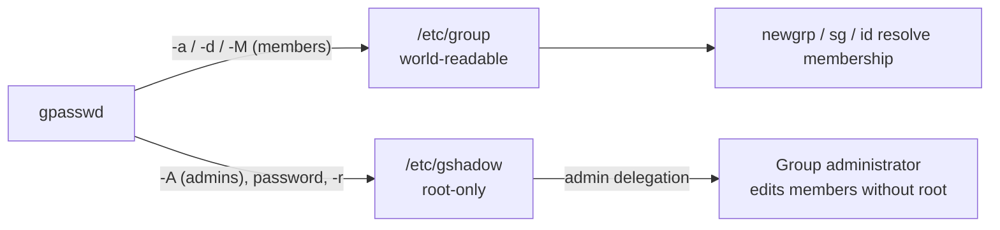

# gpasswd

The `gpasswd` command administers the group databases `/etc/group` and `/etc/gshadow`. It manages group membership, delegates group administration, and sets or removes group passwords — making it the primary day-to-day tool for controlling who belongs to a group and who is allowed to change that.

## Overview

Where [groupadd](groupadd.md), [groupmod](groupmod.md), and [groupdel](groupdel.md) manage the *existence* of a group, `gpasswd` manages its *contents*: the member list and the administrator list. It is designed to be delegated — a user named as a group administrator (via `-A`) can add and remove members of that group with `gpasswd` **without** having full `root`. This makes `gpasswd` the standard mechanism for handing team-lead-level control of a group to a non-root account while keeping the rest of the system locked down.

Most member operations (`-a`, `-d`, `-M`, `-r`) require either `root` or being an administrator of the target group. Setting a group password (bare `gpasswd <group>`) prompts interactively.

## Concepts

| Concept | Description |
| --- | --- |
| Member | A user listed in the group's member field in `/etc/group`; gains the group's access. |
| Group administrator | A user in the `/etc/gshadow` admin field who may add/remove members without `root`. |
| Group password | An optional secret in `/etc/gshadow` that lets a non-member temporarily join with `newgrp`. Discouraged. |
| `/etc/group` | World-readable: group name, GID, member list. |
| `/etc/gshadow` | Root-only: group password hash and administrator list. |

## Architecture

`gpasswd` is the write path into the two group files; membership and administration live in different files with different visibility:



## Commands

| Option | Meaning |
| --- | --- |
| `-a USER` | **Add** a single user to the group. |
| `-d USER` | **Delete** a single user from the group. |
| `-M USER,USER,…` | Set the **entire** member list (replaces existing members). |
| `-A USER,USER,…` | Set the group **administrators**. |
| `-r` | **Remove** the group password. |
| `-R` | **Restrict** access: disable the password so `newgrp` is denied to non-members. |
| (no option) | Prompt to set the group password interactively. |
| `-h`, `--help` | Show help. |

### Display Help

- Show help information.

```bash
gpasswd --help
```

- Show help using the short option.

```bash
gpasswd -h
```

## Examples

### View Group Membership

- Display groups for user `root`.

```bash
groups root
```

- Display groups for user `armour`.

```bash
groups armour
```

- Display groups for user `u1`.

```bash
groups u1
```

### Set a Group Password

- Set a password for group `HR`.

```bash
gpasswd HR
```

- Set a password for group `armour`.

```bash
gpasswd armour
```

> [!WARNING]
> Group passwords are rarely used on modern Linux systems and are generally not recommended for security reasons. A shared secret cannot be attributed to an individual; prefer administrator delegation (`-A`) or `sudo` membership instead.

### Add Users to a Group

- Add user `armour` to group `IT`.

```bash
gpasswd -a armour IT
```

- Add user `armour` to group `EMP`.

```bash
gpasswd -a armour EMP
```

- Add user `armour` to group `IT`.

```bash
gpasswd -a armour IT
```

- Add user `u1` to group `mgr`.

```bash
gpasswd -a u1 mgr
```

- Add user `armour` to group `demo2`.

```bash
gpasswd -a armour demo2
```

> [!TIP]
> `gpasswd -a` is safe and additive — it appends one member without touching the rest of the list, unlike the `-M` replacement below or a raw `usermod -G` (which can drop existing memberships).

### Replace Group Members

- Set the members of group `SALES` to `armour`, `u1`, `u2`, and `u4`.

```bash
gpasswd -M armour,u1,u2,u4 SALES
```

- Set the members of group `admin1` to `u2`, `u3`, and `u4`.

```bash
gpasswd -M u2,u3,u4 admin1
```

> [!WARNING]
> The `-M` option replaces the entire member list for the group. Any user not named in the list is removed. Snapshot the current members first (`grep '^SALES:' /etc/group`) if you are unsure.

### Remove Users from a Group

- Remove user `armour` from group `SALES`.

```bash
gpasswd -d armour SALES
```

- Remove user `armour` from group `root`.

```bash
gpasswd -d armour root
```

### Manage Group Administrators

- Assign user `u1` as a group administrator for group `armour`.

```bash
gpasswd -A u1 armour
```

- Assign multiple group administrators.

```bash
gpasswd -A u1,u2 armour
```

> [!NOTE]
> An administrator named with `-A` can add and remove members of that group using `gpasswd` **without** root. This is the intended way to delegate group management to a team lead. Like `-M`, the `-A` list is a full replacement of the administrator set.

### Remove Group Passwords

- Remove the password from group `armour`.

```bash
gpasswd -r armour
```

- Remove the password from group `admin1`.

```bash
gpasswd -r admin1
```

### Verify Group Configuration

- Display group information.

```bash
grep '^armour:' /etc/group /etc/gshadow
```

- Display multiple groups.

```bash
grep -E 'IT|EMP|SALES|admin1|armour' /etc/group
```

- Check a user's group memberships.

```bash
id armour
```

```bash
id u1
```

## Best Practices

> [!TIP]
> - Prefer `-a` / `-d` (single-member, additive/subtractive) over `-M` (whole-list replacement) for routine changes — it avoids accidentally dropping members.
> - Use `-A` to delegate group management instead of handing out `root`; this follows least-privilege.
> - Remove any group password with `-r` once a group is created — an empty password field is safer than a shared secret.
> - A membership change does not affect a user's **current** login sessions. The user must re-login (or run `newgrp <group>`) for a new supplementary group to take effect.

## Security Considerations

> [!WARNING]
> - Group passwords let a non-member join a group via `newgrp` if they know the secret — a lateral-movement risk. Remove them with `-r` (or block with `-R`).
> - Adding a user to a high-impact group (`sudo`, `wheel`, `docker`, `adm`, `disk`, `shadow`) can be equivalent to granting root. Treat `gpasswd -a … sudo` as a privilege grant and log it.
> - Group administrators (`-A`) can add anyone — including themselves' collaborators — to the group they administer. Only delegate groups whose membership is not privilege-bearing.
> - `/etc/gshadow` is root-only for a reason; never loosen its `0640 root:shadow` permissions.

## Troubleshooting

| Symptom | Cause / Fix |
| --- | --- |
| `gpasswd: user 'x' does not exist` | The account must exist before it can be added. Create it with `useradd`/`adduser` first. |
| `gpasswd: group 'IT' does not exist` | Create the group with `groupadd IT` before adding members. |
| Change not reflected in `id` | The user's existing sessions cache group data. Have them re-login or run `newgrp IT`. |
| `gpasswd: Permission denied` | You are neither `root` nor an administrator of that group. Use `sudo` or get added via `-A`. |
| `-M` wiped members you wanted to keep | `-M` replaces the full list. Restore from a snapshot; use `-a` next time. |

## References

| Resource | Description |
| --- | --- |
| `man 1 gpasswd` | Full manual page and option reference. |
| `man 5 group` / `man 5 gshadow` | Format of the group databases gpasswd edits. |
| `man 1 newgrp` | How group passwords are consumed at login. |
| CIS Linux Benchmark | Auditing membership of privilege-bearing groups. |

## Related
- [User-and-Group-Management](User-and-Group-Management.md) — parent topic
- [Group-File-Linux-Group-Account-File](Group-File-Linux-Group-Account-File.md) — group records gpasswd edits
- [Gshadow-File-Secure-Group-Access-File](Gshadow-File-Secure-Group-Access-File.md) — secure group passwords gpasswd manages
- [groupadd](groupadd.md) — create the group before managing its members
- [groupmod](groupmod.md) — modify group attributes
- [su-and-sg](su-and-sg.md) — switch group context with the memberships gpasswd assigns
- [passwd](passwd.md) — analogous password tool for users
- [Linux Administration & Server Hardening](../Readme.md) — course hub
