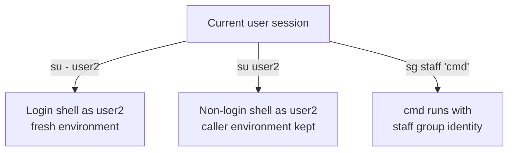

# su and sg

## Overview

`su` and `sg` are the two classic identity-switching commands on Linux. `su` (**substitute user**) changes the *user* identity of a shell session; `sg` (**switch group**) runs a command or shell under the identity of one of the invoking user's *groups*. Both change the security context under which subsequent commands execute, so both are relevant to administration and to privilege-escalation analysis.

> [!NOTE]
> `su` authenticates against the *target* account's password (or requires you to already be root), whereas `sudo` authenticates the *invoking* user against a policy in `/etc/sudoers`. Prefer `sudo` for delegated administration because it is logged and finely scoped.

## Concepts

### Login shell vs. non-login shell

The single most important `su` distinction is whether a **login shell** is started:

| Invocation | Environment | Working directory |
| :-- | :-- | :-- |
| `su user` | keeps the caller's environment (except `PATH`/`HOME` partially) | unchanged |
| `su - user` | full reset — reads target's login profile, sets `HOME`, `SHELL`, `PATH` | target's home |

A login shell (`-`, `-l`, `--login`) reproduces a fresh interactive login, so it is the safer choice when you need the target user's complete, correct environment.



## su (Substitute User)

The `su` command in Unix/Linux allows you to switch the current user identity to another user account within the same shell session. By default, it switches to the root user if no username is specified. You need to provide the target user's password unless you are already root. It can be used to start a login shell simulating a fresh login environment or to run commands as another user.

**Usage:**

```bash
su [options] [username]
```

- If `[username]` is omitted, it defaults to the root user.
- You will be prompted for the target user's password unless you are root.

**Common Options:**


| Option | Description |
| :-- | :-- |
| `-` or `-l` or `--login` | Start a login shell; sets the environment as if the target user logged in directly. |
| `-c 'command'` | Execute the specified command as the target user and then exit. |
| `-s /path/to/shell` | Specify a shell to use for the session. |
| `-m` or `-p` or `--preserve-environment` | Preserve the current environment variables instead of resetting to target user's environment. |
| `-h` or `--help` | Show help information for the `su` command. |

**Examples:**

- Switch to root user (default):

```bash
su
```

- Switch to root with full login environment:

```bash
su -
```

- Switch to user `user2` with login shell and environment:

```bash
su - user2
```

- Run `whoami` as root and return to current user:

```bash
su -c 'whoami'
```

- Run `id` command as user `infosec` with login environment:

```bash
su -c id -l infosec
```

- Switch to root using bash shell:

```bash
su - root -s /usr/bin/bash
```

- Switch to user `armour` but keep current environment:

```bash
su armour -m
```

**Notes:**

- `su -` or `su --login` fully simulates the target user's login session, resetting environment variables, working directory, and user shell.
- Without `-` option, `su` retains current working directory and environment variables.
- Unlike `sudo`, `su` requires the target user password and switches sessions interactively.


## sg (Switch Group)

The `sg` command allows a user to execute commands with the privileges and identity of a different group. This is useful when the user is a member of multiple groups and needs to operate with permissions of a specific group for a command or session.

**Usage:**

```bash
sg [group] [command]
```

- Switches to the specified `group` and executes the `command` with that group identity.
- If no command is specified, it opens a new shell with the group identity.

**Common Usage Examples:**

- Show help:

```bash
sg --help
```

- Run `id` command as member of `developers` group:

```bash
sg developers 'id'
```

```bash
sg developers -c 'id'
```

- List `/staff_data` directory as member of `staff` group:

```bash
sg staff 'ls /staff_data'
```

- Start a shell with the `hr` group:

```bash
sg hr
```

- Execute `id` command using `hr` group permissions:

```bash
sg hr 'id'
```

- Add and remove users from groups (administrative commands often used with `sg`):

 - Add user armour to hr group

```bash
gpasswd -a armour hr
```

- Remove user armour from hr group

```bash
gpasswd -d armour hr
```

> [!TIP]
> `sg` only lets you *activate* a group you already belong to (or one whose group password you know). It does not grant new group membership — use `usermod -aG` or `gpasswd -a` for that, then start a fresh session so the membership takes effect.

## Best Practices

- Prefer `sudo -u <user> <command>` over `su` for one-off delegated actions: it is logged, scoped, and does not require sharing the target account's password.
- Use `su -` (login shell) rather than bare `su` so the target user's full, correct environment is loaded and stale variables are not inherited.
- Restrict who may `su` to root by requiring membership of the `wheel` group via `pam_wheel.so` in `/etc/pam.d/su`.

## Security Considerations

- `su` to root with a shared root password defeats accountability — the audit trail cannot attribute actions to an individual. Disable direct root login and route administration through `sudo`.
- Inheriting the caller's environment (bare `su`, `-m`/`-p`) can carry attacker-controlled variables (e.g., `LD_PRELOAD`, `PATH`) into the elevated session; a login shell resets these.
- On a compromised host, `su`/`sg` are common lateral-movement and escalation steps once a password or group password is recovered; monitor `auth.log`/`secure` for repeated or unusual `su` events.
- Group passwords used by `sg` are stored in `/etc/gshadow`; a set group password is an often-overlooked authentication surface.

## Troubleshooting

| Symptom | Likely cause / fix |
| :-- | :-- |
| `su: Authentication failure` | wrong target-account password (remember: it is the *target's* password, not yours) |
| Environment looks wrong after `su` | you used bare `su`; use `su -` for a login shell |
| `sg: Permission denied` / prompts for password | you are not a member of the group, or a group password is set in `/etc/gshadow` |
| New group membership not active | membership changes require a fresh login/session; verify with `id` |

## Related

- [Sudo](Sudo.md) — alternative privilege-elevation command
- [User-and-Group-Management](User-and-Group-Management.md) — switching user/group identities
- [gpasswd](gpasswd.md) — sets the group passwords `sg` uses
- [Gshadow-File-Secure-Group-Access-File](Gshadow-File-Secure-Group-Access-File.md) — where group passwords are stored
- [Real-UID-vs-Effective-UID-in-Linux](Real-UID-vs-Effective-UID-in-Linux.md) — the identity model behind `su`/`sg`
- Privilege-Escalation — `su`/`sg` are account-switch privesc vectors
- [Linux Administration & Server Hardening](../Readme.md) — course hub
