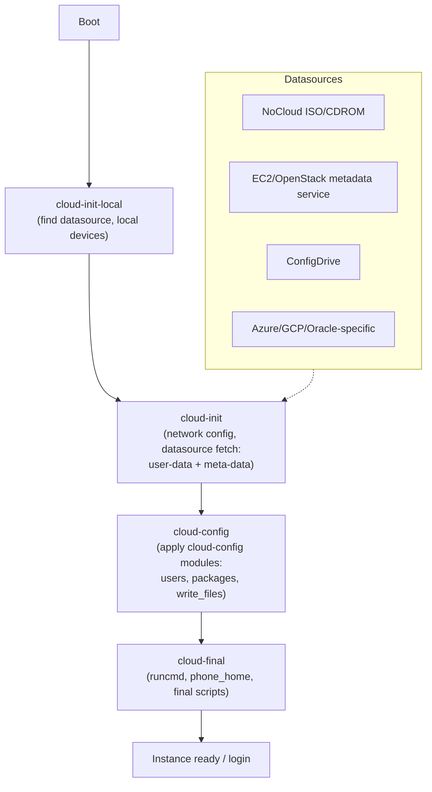
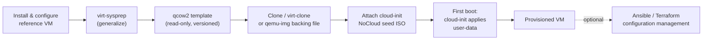

# Cloud-init and VM Templates

## Overview

Building servers by hand doesn't scale past a handful of machines — production environments need a repeatable way to turn a base OS install into a fleet of identically-provisioned VMs. The standard pattern is a **golden image** (a generalized, sysprep'd disk template) combined with **cloud-init**, the de-facto industry standard for first-boot instance configuration on Linux. This note covers building golden images with `virt-sysprep`, feeding per-instance configuration through cloud-init's `user-data`/`meta-data`, and wiring the result into automated provisioning pipelines alongside tools like [virt-manager](virt-manager.md) and [Ansible-Introduction](../Automation/Ansible-Introduction.md).

> [!IMPORTANT]
> Cloud-init only runs its full configuration stage **once per instance ID** (tracked in `/var/lib/cloud/instance-id`). If you clone a VM without regenerating machine-id, SSH host keys, and the cloud-init instance ID, every clone will think it's "already configured" and skip provisioning — or worse, all clones will share the same SSH host keys and D-Bus machine-id. This is the single most common cloud-init pitfall.

## Concepts

| Term | Meaning |
|---|---|
| **Golden image** | A generalized (de-identified) disk image used as the template for many VMs — no machine-specific identifiers, no user accounts left behind, no history. |
| **Sysprep / generalize** | The process of stripping machine-specific state (SSH host keys, machine-id, MAC bindings, log files, shell history, package caches) from an image before it is cloned. |
| **cloud-init** | A boot-time init tool that reads configuration from a **datasource** and applies it: users, SSH keys, networking, packages, arbitrary shell/config commands. |
| **Datasource** | The mechanism cloud-init uses to *discover* its configuration — e.g. an attached ISO (NoCloud), a metadata HTTP service (EC2/OpenStack), or config-drive. |
| **user-data** | Per-instance configuration payload — cloud-config YAML or a shell script — that tells cloud-init what to do on first boot. |
| **meta-data** | Instance identity data — instance-id, hostname — read by cloud-init before user-data. |
| **NoCloud** | A datasource that reads `user-data`/`meta-data` from a local ISO/vfat volume or filesystem path, with no network/metadata service required. Ideal for libvirt/KVM labs. |

## Architecture

Cloud-init runs in four ordered stages driven by systemd units, each of which can consume different config modules:



The golden-image workflow that feeds this pipeline typically looks like:



## Installation

Cloud-init ships as a package in every major distro and is pre-installed in most cloud/vendor images. `virt-sysprep` and `guestfish` come from the `libguestfs` toolset.

```bash
# RHEL / AlmaLinux / Rocky
sudo dnf install -y cloud-init cloud-utils-growpart libguestfs-tools virt-install

# Debian / Ubuntu
sudo apt update
sudo apt install -y cloud-init cloud-image-utils libguestfs-tools virtinst

# Verify
cloud-init --version
virt-sysprep --version
```

> [!NOTE]
> `cloud-image-utils` (Debian/Ubuntu) provides `cloud-localds`, the tool used to build a NoCloud seed ISO from user-data/meta-data files. On RHEL family, use `genisoimage` / `mkisofs` directly (shown below) since `cloud-localds` isn't packaged.

## Configuration

### 1. Generalize the reference VM with virt-sysprep

Shut the VM down first — `virt-sysprep` operates on the offline disk image.

```bash
# Shut down the reference VM
sudo virsh shutdown golden-rhel9

# List available sysprep operations
virt-sysprep --list-operations

# Generalize: strip host keys, machine-id, logs, hostname, udev net rules, etc.
sudo virt-sysprep -d golden-rhel9 \
  --operations defaults,-ssh-userdir \
  --hostname localhost.localdomain

# Or operate directly on a qcow2 file (no libvirt domain)
sudo virt-sysprep -a /var/lib/libvirt/images/golden-rhel9.qcow2 \
  --operations defaults
```

Key operations bundled in `defaults`: `machine-id`, `ssh-hostkeys`, `ssh-userdir`, `udev-persistent-net`, `logfiles`, `bash-history`, `net-hostname`, `cron-spool`, `tmp-files`, `package-manager-cache`.

### 2. Convert to a read-only template

```bash
sudo qemu-img convert -O qcow2 golden-rhel9.qcow2 templates/rhel9-golden.qcow2
sudo chmod 444 templates/rhel9-golden.qcow2

# Or keep a base + copy-on-write chain (space-efficient clones)
sudo qemu-img create -f qcow2 -F qcow2 -b templates/rhel9-golden.qcow2 vm01.qcow2
```

### 3. Author cloud-init user-data / meta-data

```yaml
# user-data (cloud-config format — the "#cloud-config" header is mandatory)
#cloud-config
hostname: web01
manage_etc_hosts: true

users:
  - name: sysadmin
    groups: [wheel, adm]
    sudo: "ALL=(ALL) NOPASSWD:ALL"
    shell: /bin/bash
    ssh_authorized_keys:
      - ssh-ed25519 AAAAC3NzaC1lZDI1NTE5AAAAI... admin@workstation

ssh_pwauth: false
disable_root: true

package_update: true
package_upgrade: true
packages:
  - firewalld
  - chrony
  - fail2ban

write_files:
  - path: /etc/motd
    content: |
      Provisioned by cloud-init - do not modify manually.
    permissions: '0644'

runcmd:
  - systemctl enable --now firewalld chronyd fail2ban
  - firewall-cmd --add-service=ssh --permanent
  - firewall-cmd --reload

power_state:
  mode: reboot
  message: Rebooting after first-boot provisioning
  condition: true
```

```yaml
# meta-data
instance-id: web01-20260722-001
local-hostname: web01
```

### 4. Build the NoCloud seed ISO

```bash
# Debian/Ubuntu (cloud-image-utils)
cloud-localds seed-web01.iso user-data meta-data

# RHEL family (genisoimage)
sudo dnf install -y genisoimage
genisoimage -output seed-web01.iso -volid cidata -joliet -rock user-data meta-data
```

### 5. Clone the golden image and attach the seed

```bash
qemu-img create -f qcow2 -F qcow2 -b templates/rhel9-golden.qcow2 web01.qcow2

virt-install \
  --name web01 \
  --memory 2048 --vcpus 2 \
  --disk path=web01.qcow2,format=qcow2 \
  --disk path=seed-web01.iso,device=cdrom \
  --os-variant rhel9.0 \
  --network network=default \
  --import --noautoconsole
```

On first boot, cloud-init detects the `cidata`-labeled ISO, applies the config, and (per `power_state`) reboots into a ready-to-use host.

## Commands

| Command | Purpose |
|---|---|
| `cloud-init status --long` | Show current stage/state and whether provisioning finished or errored. |
| `cloud-init analyze show` | Boot-time breakdown per cloud-init stage — useful for slow-boot diagnosis. |
| `cloud-init schema --config-file user-data` | Validate a cloud-config file before deploying it. |
| `cloud-init clean --logs --seed` | Wipe cloud-init's cached state on a *template* VM so the next clone re-runs provisioning. |
| `cloud-init init --local` | Force a re-run of the local stage (troubleshooting only). |
| `virt-sysprep --list-operations` | List all generalization operations available. |
| `virt-sysprep -a disk.qcow2 --enable customize-op` | Run a single named operation instead of the full default set. |
| `virsh dumpxml <vm> \| grep cidata` | Confirm a seed ISO is attached to a running domain. |

## Examples

Regenerating a clone that was made by disk copy instead of `virt-clone` (fixes duplicate machine-id/host keys after the fact):

```bash
sudo cloud-init clean --logs --seed
sudo rm -f /etc/machine-id
sudo systemd-machine-id-setup
sudo rm -f /etc/ssh/ssh_host_*
sudo ssh-keygen -A
sudo reboot
```

Injecting a network-config alongside user-data for a static-IP template (NoCloud v2 format):

```yaml
# network-config
version: 2
ethernets:
  eth0:
    dhcp4: false
    addresses: [192.168.50.20/24]
    gateway4: 192.168.50.1
    nameservers:
      addresses: [1.1.1.1, 9.9.9.9]
```

```bash
genisoimage -output seed-web01.iso -volid cidata -joliet -rock \
  user-data meta-data network-config
```

Ansible taking over after cloud-init hands off (common pattern in the flow diagram above):

```yaml
# runcmd stanza inside user-data, pulling a bootstrap playbook
runcmd:
  - dnf install -y ansible-core
  - ansible-pull -U https://git.example.com/infra/bootstrap.git site.yml
```

See [Ansible-Introduction](../Automation/Ansible-Introduction.md) for structuring the playbook this pulls.

> [!NOTE]
> **📸 Screenshot**
> _Capture: `cloud-init status --long` output on a freshly booted clone, showing `status: done` and the datasource detected (e.g. `DataSourceNoCloud`), next to `virsh dumpxml <vm> | grep -A2 cdrom` confirming the seed ISO attachment._

## Best Practices

- Version golden images (`rhel9-golden-2026.07.qcow2`) and keep the sysprep + build steps in a script or CI pipeline — never hand-edit a "golden" disk in place.
- Keep `user-data` secrets-free where possible; inject credentials via a secrets manager or Ansible Vault post-boot rather than embedding plaintext passwords in cloud-config.
- Always validate cloud-config with `cloud-init schema --config-file user-data` before building a seed ISO — a YAML indentation error silently no-ops that module.
- Prefer SSH-key-only auth (`ssh_pwauth: false`, `disable_root: true`) in every template; never ship a golden image with password auth enabled.
- Use `qemu-img create -b` backing-file clones for fast, disk-space-efficient test fleets; use fully independent copies for anything long-lived or production.
- Tag `instance-id` deterministically (hostname + timestamp) so re-provisioning is traceable in logs.
- Pair cloud-init's first-boot bootstrap with a configuration-management tool ([Ansible-Introduction](../Automation/Ansible-Introduction.md)) for ongoing drift correction — cloud-init is a *bootstrapper*, not a continuous-configuration engine.

## Security Considerations

- **CIS-aligned generalization**: `virt-sysprep`'s default operations remove SSH host keys and machine-id — both are identity material that, if reused across clones, weakens host authentication (SSH TOFU pinning becomes meaningless) and breaks D-Bus/systemd machine identity assumptions relied on by several CIS Level 1 checks.
- Treat `user-data` as sensitive: on cloud platforms the metadata service (`169.254.169.254`) is often readable by any local process unless IMDSv2/token-based access is enforced — don't put long-lived credentials there.
- Disable cloud-init's default `default_user` (e.g. `ubuntu`/`ec2-user`) password auth and rotate/replace its SSH key set per deployment; leaving the vendor default user active with a known key is a common initial-access vector in cloud environments.
- Remove or restrict the NoCloud seed ISO device after first boot in security-sensitive environments — a mounted seed volume left attached can be read by any process with disk access, exposing the original provisioning payload.
- Run `virt-sysprep`'s `--operations` explicitly rather than trusting `defaults` blindly in regulated environments; audit the operation list against your data-retention/PII policy (e.g. ensure `bash-history`, `logfiles`, and `tmp-files` are included).
- Firewall/harden inside `runcmd`/`bootcmd` at first boot (as shown above) so no instance is ever network-reachable before its host firewall is active — don't rely on the golden image alone to have a locked-down default posture if the template predates a policy change.

## Troubleshooting

| Symptom | Likely Cause | Fix |
|---|---|---|
| Cloud-init doesn't run on clone | Stale `/var/lib/cloud/instance-id` matches meta-data's instance-id | `cloud-init clean --logs --seed` on the template before cloning, or bump `instance-id` per clone |
| All clones share SSH host keys | `virt-sysprep` wasn't run, or `ssh-hostkeys` operation excluded | Re-run `virt-sysprep --operations ssh-hostkeys` or manually `rm /etc/ssh/ssh_host_*; ssh-keygen -A` |
| `user-data` changes have no effect | YAML syntax error or missing `#cloud-config` header | `cloud-init schema --config-file user-data`; check for the shebang-style header |
| Seed ISO not detected | Volume label isn't `cidata`, or ISO not attached as a CD-ROM device | Rebuild with `-volid cidata`; verify with `virsh dumpxml` that it's attached as `device=cdrom` |
| Networking not applied from `network-config` | Datasource ignoring network-config due to distro renderer mismatch (netplan vs. NetworkManager) | Check `/etc/cloud/cloud.cfg.d/` for `network: renderer:` override matching the distro's actual network stack |
| `cloud-init status` shows `error` | A `runcmd`/package step failed | `sudo journalctl -u cloud-final -u cloud-config` and `/var/log/cloud-init.log` for the failing module |

## References

- [cloud-init official documentation](https://cloudinit.readthedocs.io/)
- [cloud-init NoCloud datasource](https://cloudinit.readthedocs.io/en/latest/reference/datasources/nocloud.html)
- `man virt-sysprep` — libguestfs project documentation
- [libguestfs virt-sysprep operations reference](https://libguestfs.org/virt-sysprep.1.html)
- [CIS Benchmarks — Red Hat Enterprise Linux / Ubuntu](https://www.cisecurity.org/cis-benchmarks) (SSH host key and identity hardening sections)
- `man cloud-init` / `cloud-init devel schema --docs all`

## Related Notes

- [virt-manager](virt-manager.md) — GUI/CLI tooling for building and managing the reference VMs that become golden images
- [Ansible-Introduction](../Automation/Ansible-Introduction.md) — configuration management to layer on top of cloud-init's first-boot bootstrap
- [Linux Administration & Server Hardening](../Readme.md) — course hub and map of content
