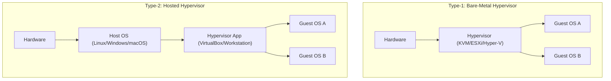
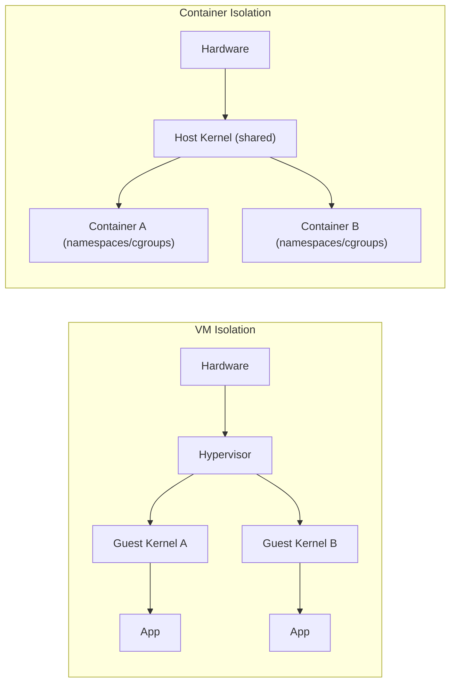

# Introduction to Virtualization

## Overview

Virtualization is the abstraction layer that lets one physical machine present itself as many independent logical machines, each with its own kernel, virtual CPUs, memory, and virtual devices. It is the foundation for [KVM](KVM-Kernel-Virtual-Machine.md) on Linux and sits one layer below [containers](../Containers/Introduction-to-Containers.md), which virtualize the OS instead of the hardware. Understanding hypervisor types, CPU extensions, and the VM-vs-container tradeoff is a prerequisite for every later note in this module — you need to know *why* KVM works the way it does before configuring it.

> [!IMPORTANT]
> **Why this matters for hardening**
> A hypervisor is a single point of failure and a single point of compromise for every guest it hosts ("VM escape" turns a guest compromise into a host compromise). Choosing the right virtualization model, verifying CPU extensions are enabled, and knowing when a container is the *wrong* isolation boundary are all security decisions, not just performance ones.

## Concepts

**Virtualization** creates a virtual machine (VM) — an isolated software emulation of a physical computer — by inserting a **hypervisor** (Virtual Machine Monitor, VMM) between the hardware and one or more **guest** operating systems. Each guest believes it owns real CPU, RAM, disk, and NICs; the hypervisor intercepts and arbitrates access to the real hardware.

Key terms:

| Term | Meaning |
|---|---|
| Host | The physical machine running the hypervisor |
| Guest | A virtual machine running under the hypervisor |
| Hypervisor / VMM | Software that creates and manages VMs |
| vCPU | A virtual CPU scheduled onto physical cores/threads |
| Domain | libvirt/Xen term for a running VM instance |
| Ring 0 / Ring -1 | Privilege rings; kernel runs in ring 0, hypervisor traps below it (ring -1 with hardware-assisted virt) |

## Architecture

### Type-1 (bare-metal) vs Type-2 (hosted) hypervisors

The defining architectural question is *where the hypervisor sits relative to the host OS*.

- **Type-1 (bare-metal / native)** — the hypervisor runs directly on hardware and is itself effectively the host kernel or a thin dedicated kernel. There is no general-purpose host OS underneath it competing for resources. Examples: **KVM** (the Linux kernel itself, via `kvm.ko`, acting as the hypervisor), VMware ESXi, Microsoft Hyper-V, Xen.
- **Type-2 (hosted)** — the hypervisor is an application running on top of a conventional host OS, which schedules it like any other process. Examples: VMware Workstation/Fusion, VirtualBox, QEMU running without KVM acceleration.



In practice KVM blurs the line: the Linux **host OS is present**, but the hypervisor logic (`kvm.ko` + a CPU-specific module) runs *inside the kernel*, in the same privileged ring as the host kernel — giving Type-1-class performance while retaining a general-purpose Linux userspace (QEMU, libvirt) for device emulation and management. This is why KVM is usually classified as Type-1, or as a hybrid.

### Full virtualization vs paravirtualization

| Model | How it works | Guest changes needed | Performance | Examples |
|---|---|---|---|---|
| **Full virtualization** | Hypervisor emulates complete hardware; guest OS is unmodified and unaware it's virtualized | None | Good with hardware assist (VT-x/AMD-V); poor with pure binary translation | KVM, VMware, Hyper-V (all modern, hardware-assisted) |
| **Paravirtualization (PV)** | Guest OS is modified to call the hypervisor directly (hypercalls) instead of trapping privileged instructions | Guest kernel/drivers modified or PV-aware | Very low overhead for the paravirtualized components | Xen PV domains, `virtio` drivers inside otherwise fully-virtualized guests |
| **Hardware-assisted (HVM)** | CPU extensions trap and virtualize privileged instructions in silicon; often combined with PV drivers ("PVHVM") for I/O | None required, PV drivers optional for speed | Best of both — near-native CPU, fast I/O | KVM + `virtio-net`/`virtio-blk`, Xen HVM |

Modern Linux virtualization (KVM) is **full virtualization accelerated by hardware extensions**, with **paravirtualized I/O** (`virtio` devices) layered on top so disk and network don't pay the full emulation tax. This hybrid is the practical default on every current hypervisor.

### CPU virtualization extensions: VT-x and AMD-V

Before hardware assist existed, x86 could not be virtualized cleanly (some privileged instructions silently failed instead of trapping — the "Popek and Goldberg" problem), forcing hypervisors into slow binary translation or paravirtualization. Intel **VT-x** (Vanderpool) and AMD **AMD-V** (Pacifica) added a new CPU mode (VMX root/non-root on Intel, SVM host/guest on AMD) so the hypervisor runs in a more privileged context (sometimes described as "ring -1") and privileged guest instructions trap to it automatically.

Extended Page Tables (Intel **EPT**) / Nested Page Tables (AMD **NPT**, aka RVI) further accelerate memory virtualization by letting the CPU walk guest-physical-to-host-physical mappings in hardware instead of the hypervisor shadowing page tables in software.

```bash
# Check for VT-x (Intel) or AMD-V (AMD) support and that it's exposed to the kernel
grep -E --color 'vmx|svm' /proc/cpuinfo

# Confirm the kernel modules loaded (Intel example)
lsmod | grep kvm
# kvm_intel             infolist   # or kvm_amd on AMD hosts
# kvm

# Ask libvirt whether the host can run full virtualization
virt-host-validate qemu
```

If `vmx`/`svm` is absent from `/proc/cpuinfo`, virtualization extensions are disabled in firmware (BIOS/UEFI setting, e.g. "Intel Virtualization Technology" or "SVM Mode") or the CPU/hypervisor (nested virt in a cloud VM) doesn't expose them — KVM will refuse to start accelerated guests.

## When to use VMs vs Containers

VMs and containers solve overlapping but distinct problems and are frequently combined (containers running inside VMs is the standard cloud pattern).



| Factor | Virtual Machine | Container |
|---|---|---|
| Isolation boundary | Full guest kernel + hypervisor | Linux namespaces + cgroups, shared host kernel |
| Attack surface between tenants | Hypervisor only (small, hardened) | Host kernel (much larger syscall surface) |
| Boot time | Seconds to tens of seconds | Milliseconds |
| Density per host | Tens of guests (GB-scale RAM each) | Hundreds to thousands |
| Can run a different kernel/OS | Yes (Windows guest on Linux host, etc.) | No — shares host kernel |
| Best for | Untrusted/multi-tenant workloads, different OS kernels, kernel-level testing, strong compliance boundaries | Fast-moving app deployment, microservices, CI/CD, high density, same-kernel workloads |
| Typical hardening controls | SELinux/sVirt, seccomp on QEMU, IOMMU/VFIO for passthrough | seccomp, AppArmor/SELinux profiles, rootless mode, read-only rootfs, dropped capabilities |

> [!TIP]
> **Rule of thumb**
> Reach for a **VM** when you need kernel-level or hardware-level isolation, must run a different OS, or are hosting mutually-untrusting tenants. Reach for a **container** when workloads share the same kernel/OS family and you need fast iteration and high density. In production these are layered: containers scheduled inside VMs (e.g. Kubernetes nodes that are themselves cloud VMs) gives defense-in-depth — an escape from a container still lands inside a disposable VM, not on bare metal.

> [!NOTE]
> **📸 Screenshot**
> _Capture: `grep -E 'vmx|svm' /proc/cpuinfo` and `virt-host-validate qemu` output side by side, showing a host confirmed ready for hardware-accelerated KVM._

## Security Considerations

- **Enable VT-x/AMD-V in firmware only where needed.** On dedicated hypervisor hosts this is required; on general-purpose servers that never run VMs, leaving it enabled is low-risk but unnecessary attack surface reduction favors disabling unused firmware features (CIS general hardening principle: disable unused functionality).
- **VM escape is the top threat model.** Keep the hypervisor (QEMU/KVM, libvirt) patched — CVEs in device emulation (e.g. historical QEMU floppy/USB/VGA emulation bugs) are the classic escape vector.
- **Use mandatory access control on the host**: SELinux with **sVirt** (or AppArmor equivalents) confines each QEMU process so a compromised guest process cannot read another guest's disk image or escape to arbitrary host files.
- **Prefer virtio over emulated legacy devices** — smaller, more scrutinized code paths than full hardware emulation (e.g. `e1000`/`rtl8139` NIC emulation has a larger historical CVE footprint than `virtio-net`).
- **Isolate management interfaces**: libvirt's `libvirtd` socket, VNC/SPICE consoles, and any web management UI should never be exposed to untrusted networks; bind to localhost or a management VLAN and require TLS + auth.
- **Don't use containers as a security boundary for untrusted code.** The shared kernel means a container escape (via a kernel bug or misconfigured capability/privileged flag) reaches the host directly — this is a NIST SP 800-190 (Container Security Guide) core recommendation: use VMs, gVisor, or Kata Containers to sandbox untrusted or multi-tenant workloads.
- **Nested virtualization** (VM-in-VM, common for CI) should be disabled unless explicitly required — it expands the hypervisor's exposed instruction surface to guest code.

## Troubleshooting

| Symptom | Likely cause | Fix |
|---|---|---|
| `virt-host-validate` reports "QEMU: Checking for hardware virtualization: FAIL" | VT-x/AMD-V disabled in firmware, or running inside a non-nested cloud VM | Enable in BIOS/UEFI; on cloud, request a bare-metal or nested-virt-enabled instance type |
| `grep vmx /proc/cpuinfo` empty despite BIOS setting enabled | Setting not applied, or CPU genuinely lacks the extension | Re-check BIOS after save/reboot; verify CPU model supports VT-x/AMD-V |
| VM runs but extremely slow, high host CPU | Falling back to TCG (software) emulation instead of KVM acceleration | Confirm `kvm_intel`/`kvm_amd` module loaded; check libvirt XML uses `type='kvm'` not `type='qemu'` |
| `/dev/kvm` missing or permission denied | `kvm` module not loaded, or user not in `kvm` group | `modprobe kvm_intel` (or `kvm_amd`); `usermod -aG kvm $USER` |
| Nested guest fails to start inside a cloud VM | Nested virtualization not exposed by cloud hypervisor | Use a bare-metal instance type, or enable nested virt flag if the provider supports it (e.g. `kvm-amd nested=1`) |

## References

- Red Hat Enterprise Linux Virtualization documentation — https://access.redhat.com/documentation/en-us/red_hat_enterprise_linux/latest/html/configuring_and_managing_virtualization/
- QEMU Documentation — https://www.qemu.org/docs/master/
- Linux KVM project — https://www.linux-kvm.org/page/Main_Page
- `man virt-host-validate`, `man kvm`
- NIST SP 800-190, *Application Container Security Guide* — https://csrc.nist.gov/pubs/sp/800/190/final
- CIS Benchmarks (Distribution Independent Linux, Docker) — https://www.cisecurity.org/cis-benchmarks

## Related Notes

- [KVM-Kernel-Virtual-Machine](KVM-Kernel-Virtual-Machine.md) — Linux's native Type-1-class hypervisor built on these concepts
- [Introduction-to-Containers](../Containers/Introduction-to-Containers.md) — the OS-level alternative to full virtualization
- [Linux Administration & Server Hardening](../Readme.md) — course hub and map of content
