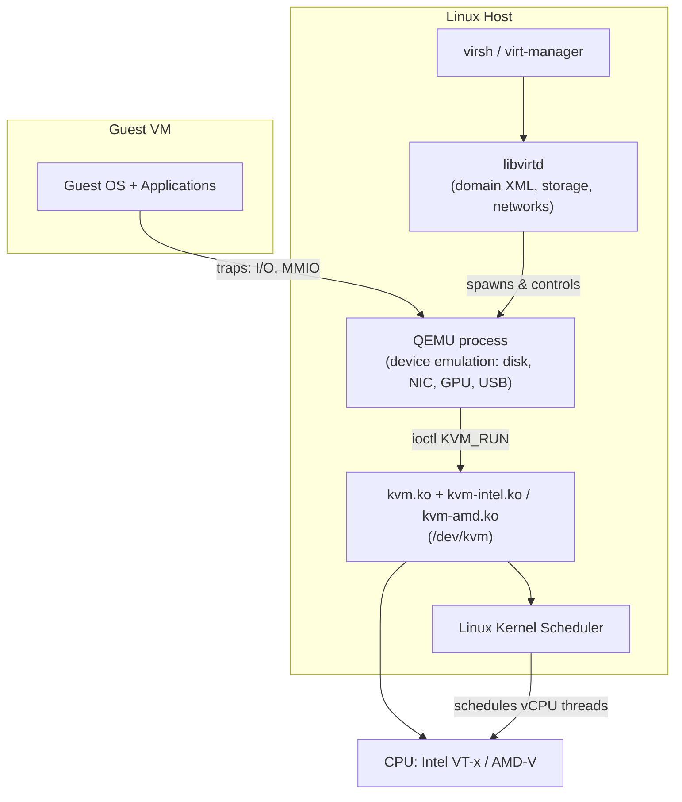

# KVM (Kernel-based Virtual Machine)

## Overview

KVM turns the Linux kernel itself into a bare-metal (Type-1) hypervisor: a loadable kernel module exposes the CPU's hardware virtualization extensions to userspace, and any process that opens `/dev/kvm` can create and run virtual machines with near-native performance. KVM does not do device emulation or provide a management CLI on its own — it relies on [QEMU](QEMU.md) for I/O emulation and on [libvirt-and-virsh](libvirt-and-virsh.md) for lifecycle management, storage, and networking. Because it ships in the mainline kernel, KVM is the default hypervisor backend for RHEL/oVirt, Proxmox, OpenStack, and most cloud providers' bare-metal hosts.

> [!IMPORTANT]
> KVM requires **hardware-assisted virtualization** (Intel VT-x or AMD-V) exposed to the running kernel. Nested virtualization (running KVM inside a VM, e.g. a cloud instance) needs the feature explicitly enabled on the host/hypervisor and is often disabled by default on cloud providers.

## Concepts

| Term | Role |
|---|---|
| `kvm.ko` | Core kernel module; generic virtualization infrastructure |
| `kvm-intel.ko` / `kvm-amd.ko` | Vendor-specific module using VT-x / AMD-V extensions |
| `/dev/kvm` | Character device userspace programs open to request VM creation (ioctl API) |
| QEMU | Userspace process that uses `/dev/kvm` to emulate CPU, chipset, disk, NIC, etc. for a guest |
| libvirt | Daemon + API (`libvirtd`) that manages QEMU/KVM domains, storage pools, virtual networks |
| virsh | CLI client to libvirt for domain lifecycle (start/stop/migrate/snapshot) |
| Domain | libvirt's term for a virtual machine instance |

KVM turns each guest vCPU into a Linux thread scheduled by the normal kernel scheduler, and each guest is a normal (if special) Linux process from the host's point of view — visible in `ps`, subject to cgroups, nice, taskset, etc.

## Architecture



Each guest vCPU maps to a host thread. When the guest executes a privileged instruction or does I/O, execution traps out of guest mode (VM-exit) back into KVM, which either handles it directly (e.g. some MMU operations) or hands it off to QEMU (e.g. a disk read), then re-enters guest mode (VM-entry).

## Installation

### 1. Verify hardware support

```bash
# Check CPU flags for virtualization extensions
egrep -c '(vmx|svm)' /proc/cpuinfo
# vmx = Intel VT-x, svm = AMD-V. A count > 0 means the CPU supports it.

# Ubuntu/Debian convenience tool (from cpu-checker package)
sudo apt install -y cpu-checker
kvm-ok
# Output: INFO: /dev/kvm exists — KVM acceleration can be used

# Confirm the kernel module loaded and matches your CPU vendor
lsmod | grep kvm
# Expect: kvm_intel (or kvm_amd) and kvm

# Confirm the device node exists with correct group
ls -l /dev/kvm
# crw-rw---- 1 root kvm 10, 232 ... /dev/kvm
```

> [!WARNING]
> `egrep -c '(vmx|svm)' /proc/cpuinfo` returning `0` usually means virtualization is **disabled in the BIOS/UEFI firmware**, not that the CPU lacks the feature — check firmware settings first. Nested VMs (cloud instances, other hypervisors' guests) commonly report `0` unless the outer hypervisor exposes the flag.

### 2. Install KVM + QEMU + libvirt

```bash
# RHEL / Rocky / AlmaLinux / Fedora
sudo dnf install -y qemu-kvm libvirt libvirt-client virt-install \
    virt-manager bridge-utils
sudo systemctl enable --now libvirtd

# Debian / Ubuntu
sudo apt update
sudo apt install -y qemu-kvm libvirt-daemon-system libvirt-clients \
    virtinst virt-manager bridge-utils
sudo systemctl enable --now libvirtd
```

### 3. Add your user to the required groups

```bash
sudo usermod -aG libvirt,kvm "$USER"
newgrp libvirt   # or log out/in for group membership to take effect
```

### 4. Verify libvirt sees KVM

```bash
virsh -c qemu:///system list --all
virt-host-validate
```

## Configuration

`kvm-intel`/`kvm-amd` module options are set via modprobe config, useful for enabling nested virtualization or tuning behavior.

```conf
# /etc/modprobe.d/kvm.conf

# Enable nested KVM (VM-in-VM) — Intel
options kvm-intel nested=1

# Enable nested KVM — AMD
options kvm-amd nested=1
```

```bash
# Reload the module for changes to take effect (unload any running guests first)
sudo modprobe -r kvm-intel   # or kvm-amd
sudo modprobe kvm-intel nested=1

# Confirm it stuck
cat /sys/module/kvm_intel/parameters/nested
```

libvirt's default network (`virbr0`, NAT + DHCP via dnsmasq) is defined in domain/network XML rather than a flat config file:

```bash
virsh net-list --all
virsh net-start default
virsh net-autostart default
```

## Commands

| Command | Purpose |
|---|---|
| `virsh list --all` | List all domains (running + defined) |
| `virsh start <domain>` | Boot a defined VM |
| `virsh shutdown <domain>` | Graceful ACPI shutdown |
| `virsh destroy <domain>` | Force power-off (like pulling the plug) |
| `virsh dominfo <domain>` | Show VM state, memory, vCPU count |
| `virsh dumpxml <domain>` | Show full domain XML definition |
| `virsh snapshot-create-as <domain> <name>` | Create a snapshot |
| `virt-install ...` | Create a new domain from CLI |
| `virt-host-validate` | Sanity-check host readiness for virtualization |
| `kvm-ok` (Debian/Ubuntu) | Quick yes/no on KVM acceleration availability |

## Examples

Create a VM directly with `virt-install`, backed by KVM acceleration:

```bash
sudo virt-install \
  --name rocky9-lab \
  --memory 4096 \
  --vcpus 2 \
  --disk size=20,path=/var/lib/libvirt/images/rocky9-lab.qcow2 \
  --os-variant rocky9 \
  --network network=default \
  --graphics none \
  --console pty,target_type=serial \
  --location /var/lib/libvirt/images/Rocky-9-x86_64-minimal.iso \
  --extra-args 'console=ttyS0,115200n8'
```

Confirm KVM (not plain QEMU software emulation) is actually being used for a running domain:

```bash
virsh dumpxml rocky9-lab | grep -A1 '<domain type'
# domain type="kvm" ... confirms hardware acceleration is active
# domain type="qemu" would mean pure software emulation (TCG) — much slower
```

## Best Practices

- Always confirm `domain type="kvm"` in the XML, not `qemu` (software emulation/TCG) — a silent fallback can happen if `/dev/kvm` permissions are wrong or the module isn't loaded.
- Pin vCPUs and reserve hugepages for latency-sensitive or high-throughput guests (databases, NFV workloads) rather than relying on default overcommit.
- Use `virtio` drivers (`virtio-net`, `virtio-blk`/`virtio-scsi`) for guest disk and network devices — far better throughput than emulated IDE/e1000.
- Keep guest images on a filesystem/storage pool that supports thin provisioning (`qcow2`) unless you specifically need raw-device performance.
- Use libvirt-managed networks or bridges rather than hand-rolled `iptables` NAT rules, so the network survives host reboots consistently.

## Security Considerations

- Enable **SELinux** (RHEL) or **AppArmor** (Debian/Ubuntu) confinement for QEMU processes — libvirt ships `sVirt` (SELinux) integration that assigns each guest a unique MCS label, preventing a compromised QEMU process from touching another guest's resources. Verify with `ps -Z` on the QEMU process.
- Restrict `/dev/kvm` and libvirt socket access to trusted admin groups only (`kvm`, `libvirt`) — CIS Linux benchmarks generally recommend minimizing membership in groups that grant hypervisor-level access, since a member can access any guest's memory/disk.
- Keep guest and host kernels patched against speculative-execution VM-escape classes (L1TF, MDS, Spectre/Meltdown variants) — these directly threaten hypervisor isolation guarantees; check `/sys/devices/system/cpu/vulnerabilities/*`.
- Don't expose libvirt's TCP/TLS management socket without authentication (`--listen` on `libvirtd`) — prefer the default local UNIX socket (`qemu:///system`) or SASL/TLS with client certs for remote management.
- Disable nested virtualization (`nested=0`) on hosts that don't need it — it's an additional trust boundary and attack surface.

> [!NOTE]
> **📸 Screenshot**
> _Capture: `virt-host-validate` output showing all `PASS` checks, alongside `lsmod | grep kvm` confirming the vendor module is loaded._

## Troubleshooting

| Symptom | Likely Cause | Fix |
|---|---|---|
| `/dev/kvm` missing | Module not loaded or CPU flag disabled in BIOS | `lsmod \| grep kvm`; enable VT-x/AMD-V in firmware |
| `Could not access KVM kernel module: Permission denied` | User not in `kvm`/`libvirt` group | `sudo usermod -aG kvm,libvirt $USER`; re-login |
| `virsh` fails with `Failed to connect socket ... Permission denied` | libvirtd not running or user lacks polkit rights | `sudo systemctl status libvirtd`; check polkit rules |
| Domain silently runs as `type="qemu"` (software emulated, slow) | `/dev/kvm` inaccessible to QEMU process | Fix device permissions; check `virt-host-validate` |
| Nested guest won't boot with `nested=1` set | Module option not reloaded, or outer hypervisor doesn't expose the flag | `modprobe -r`/`modprobe` cycle; check cloud provider nested-virt support |
| Poor disk/network throughput | Guest using emulated IDE/e1000 instead of virtio | Switch disk/NIC model to `virtio` in domain XML |

## References

- [KVM official documentation — linux-kvm.org](https://www.linux-kvm.org/page/Main_Page)
- `man kvm`, `man virsh`, `man virt-install`
- [Red Hat: Configuring and managing virtualization (RHEL 9)](https://access.redhat.com/documentation/en-us/red_hat_enterprise_linux/9/html/configuring_and_managing_virtualization/index)
- [libvirt: sVirt (SELinux VM isolation)](https://libvirt.org/drvqemu.html#securing-the-qemu-driver)
- CIS Distribution Independent Linux Benchmark — Access, Authentication and Authorization section (group membership hardening)

## Related Notes

- [QEMU](QEMU.md)
- [libvirt-and-virsh](libvirt-and-virsh.md)
- [Linux Administration & Server Hardening](../Readme.md) — course hub and map of content
