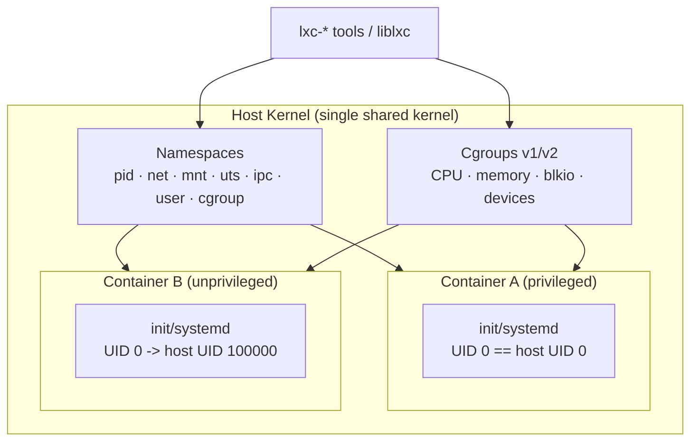

# LXC (Linux Containers)

## Overview

LXC is a userspace toolset for building **OS-level virtualization** containers directly on top of the kernel's [namespaces and cgroups](../Containers/Introduction-to-Containers.md) primitives, without the daemon-and-image layers that [Docker](../Containers/Introduction-to-Containers.md) adds on top. Where an application container packages one process and its dependencies, an LXC container behaves like a full lightweight Linux system — it boots init, runs multiple services, and gets its own PID 1 — which is why it is often described as "machine containers" rather than "application containers." LXC is also the low-level engine that [LXD](LXD.md) wraps with a REST API, image server, and simpler CLI; see [Introduction-to-Containers](../Containers/Introduction-to-Containers.md) for how it fits alongside chroot, jails, and Docker in the broader containerization landscape.

> [!IMPORTANT]
> **Mental model**
> LXC does not virtualize hardware like KVM/[QEMU](KVM-Kernel-Virtual-Machine.md) — there is no hypervisor and no emulated CPU. Every container shares the **host kernel**. Isolation is entirely a function of Linux namespaces (what a process can *see*) and cgroups (what resources it can *use*). A kernel exploit inside a container can, in principle, reach the host.

## Concepts

| Term | Role |
|---|---|
| **Namespace** | Kernel facility that gives a process its own view of a global resource: `pid`, `net`, `mnt`, `uts`, `ipc`, `user`, `cgroup`, `time`. A container is a process (or process tree) launched inside a fresh set of these namespaces. |
| **Cgroup (control group)** | Kernel facility that limits and accounts for resource usage (CPU, memory, block I/O, devices) for a group of processes. LXC uses cgroup v1 or v2 depending on distro. |
| **rootfs** | The container's root filesystem, populated from a template or image, typically stored under `/var/lib/lxc/<name>/rootfs`. |
| **Container config** | Declarative file (`config`) describing namespaces to unshare, cgroup limits, network setup, mounts, and capabilities — analogous to a libvirt domain XML but for containers. |
| **Privileged container** | UID 0 inside the container **is** UID 0 on the host (no UID mapping). Root in the container = root on the host if it escapes. |
| **Unprivileged container** | Runs under a `user` namespace with UID/GID mapping (`/etc/subuid`, `/etc/subgid`), so container root maps to an unprivileged host UID. Root inside cannot become root outside. |

## Architecture



Compared to a VM, there is no guest kernel, no virtual BIOS, no hypervisor trap-and-emulate layer — the container's "boot" is just an init process starting inside isolated namespaces with cgroup limits applied.

## LXC vs. Docker vs. VMs

| Aspect | LXC | Docker | KVM/QEMU VM |
|---|---|---|---|
| Isolation unit | Full OS process tree (init, multiple services) | Single process/app per container (convention) | Full virtual machine |
| Kernel | Shared with host | Shared with host | Own guest kernel |
| Image model | Templates / rootfs tarballs, distro-agnostic | Layered images, Dockerfile, registries (Hub) | Disk images (qcow2/raw) |
| Typical use | "Pet" containers acting like lightweight VMs | Immutable, disposable microservice containers | Strong isolation, different OS/kernel needed |
| Networking default | Bridge (`lxcbr0`) via veth | Bridge (`docker0`) via veth, NAT+port publish | Bridged/NAT via virtual NIC |
| Default privilege | Privileged (unless configured otherwise) | Rootless mode available, daemon often runs as root | N/A — hardware-isolated |

## Installation

**Debian/Ubuntu:**

```bash
sudo apt update
sudo apt install -y lxc lxc-templates bridge-utils uidmap
# Verify kernel supports required cgroups/namespaces
lxc-checkconfig
```

**RHEL/AlmaLinux/Fedora:**

```bash
# LXC is not in RHEL's default repos; EPEL provides it on RHEL-family distros
sudo dnf install -y epel-release
sudo dnf install -y lxc lxc-templates lxc-extra debootstrap
lxc-checkconfig
```

> [!NOTE]
> **Availability varies by distro**
> Fedora/RHEL packaging for LXC has shrunk in recent releases as the ecosystem consolidated around [LXD](LXD.md)/Incus and Podman/Docker. If `lxc-templates` is unavailable, use `debootstrap`-based or `download` templates, or consider Incus for a more actively maintained stack.

## Configuration

Default network bridge config (Debian, `/etc/lxc/default.conf`):

```conf
lxc.net.0.type = veth
lxc.net.0.link = lxcbr0
lxc.net.0.flags = up
lxc.net.0.hwaddr = 00:16:3e:xx:xx:xx
```

Per-container config lives at `/var/lib/lxc/<name>/config`. Key directives:

```conf
lxc.uts.name = webserver01
lxc.rootfs.path = dir:/var/lib/lxc/webserver01/rootfs
lxc.net.0.type = veth
lxc.net.0.link = lxcbr0

# Cgroup resource limits
lxc.cgroup2.memory.max = 512M
lxc.cgroup2.cpu.max = 50000 100000

# Unprivileged mapping (root -> host UID/GID 100000, 65536 IDs)
lxc.idmap = u 0 100000 65536
lxc.idmap = g 0 100000 65536
```

Enable unprivileged containers by allocating subordinate ID ranges for the launching user:

```bash
sudo usermod --add-subuids 100000-165536 --add-subgids 100000-165536 "$USER"
grep "$USER" /etc/subuid /etc/subgid
```

## Commands

| Command | Purpose |
|---|---|
| `lxc-checkconfig` | Verify kernel has required namespace/cgroup support |
| `lxc-create -n <name> -t <template>` | Create a container from a template |
| `lxc-ls -f` | List containers with state, IPv4, IPv6, autostart |
| `lxc-start -n <name> [-d]` | Start (daemonized with `-d`) |
| `lxc-attach -n <name>` | Get a shell inside the container without SSH |
| `lxc-stop -n <name>` | Stop a running container |
| `lxc-info -n <name>` | Show state, PID, memory/CPU usage |
| `lxc-console -n <name>` | Attach to the container's console (tty) |
| `lxc-destroy -n <name>` | Delete a stopped container and its rootfs |
| `lxc-snapshot -n <name>` | Snapshot the container's rootfs |
| `lxc-copy -n <name> -N <new>` | Clone a container |

## Examples

Create and start an unprivileged Debian container, then attach to it:

```bash
# Create from the "download" template (distro/release/arch prompt or flags)
lxc-create -n web01 -t download -- -d debian -r bookworm -a amd64

# Start it in the background
lxc-start -n web01 -d

# Confirm it's running and grab its IP
lxc-ls -f

# Get an interactive shell inside, no SSH daemon required
lxc-attach -n web01 -- bash

# Apply a live memory limit via cgroup, then stop and remove
lxc-cgroup -n web01 memory.limit_in_bytes 536870912
lxc-stop -n web01
lxc-destroy -n web01
```

Convert an existing config to run unprivileged by adding `lxc.idmap` lines (see Configuration) and restarting — the container's rootfs ownership must also be shifted to match, which `lxc-usernsexec` or a fresh unprivileged `lxc-create` handles automatically.

> [!NOTE]
> **📸 Screenshot**
> _Capture: `lxc-ls -f` output showing a running container's name, state, IPv4 address, and autostart flag, alongside `lxc-info -n <name>` showing PID/CPU/memory usage._

## Best Practices

- Default to **unprivileged containers** unless a specific workload requires host-equivalent root (rare, and usually a sign the workload belongs in a VM instead).
- Treat each LXC container as a mini-VM: patch it, run a minimal init, and don't assume Docker-style immutability — LXC containers are commonly long-lived and stateful.
- Pin memory (`lxc.cgroup2.memory.max`) and CPU (`lxc.cgroup2.cpu.max`) on every container to prevent noisy-neighbor resource exhaustion on shared hosts.
- Prefer `lxc-attach`/`lxc-console` over enabling SSH inside every container to reduce attack surface.
- For anything beyond a handful of hand-managed containers, move to [LXD](LXD.md) (or Incus) for image management, live migration, and a proper client/server API rather than hand-editing LXC config files.

## Security Considerations

- **Privileged containers are a known lateral-movement risk.** CIS Docker/Linux guidance and upstream LXC security notes both treat UID-0-mapped-to-host-UID-0 containers as equivalent to giving a workload root on the host; a container-escape CVE (there is a recurring history of these, e.g. via `/proc`, cgroup, or overlayfs handling) turns into full host compromise.
- **Always enable user namespaces** (`lxc.idmap`) for untrusted or internet-facing workloads — this is the single highest-leverage hardening step LXC offers.
- **Drop capabilities** you don't need with `lxc.cap.drop` (e.g. `lxc.cap.drop = sys_module mac_admin mac_override sys_time`) rather than relying on namespace isolation alone.
- **Enable an AppArmor or SELinux profile** per container (`lxc.apparmor.profile = lxc-container-default-cgns` on Debian/Ubuntu; SELinux contexts via `lxc.selinux.context` on RHEL-family) — namespaces alone do not implement mandatory access control.
- **Seccomp filtering**: keep the shipped default seccomp profile (`lxc.seccomp.profile`) enabled to block dangerous syscalls (e.g. `keyctl`, `mount` variants, kernel module loading) rather than running with `lxc.seccomp = 0`.
- **Firewall the bridge**: `lxcbr0` traffic should be constrained the same as any other host-facing network segment — RHEL/CentOS via `firewalld` zones on `lxcbr0`, Debian/Ubuntu via `ufw`/`nftables` rules scoping inter-container and container-to-host traffic.
- **Patch the host kernel aggressively** — since all containers share it, an unpatched kernel is a single point of failure for every container's isolation guarantee, unlike a VM boundary backed by hardware virtualization.

## Troubleshooting

| Symptom | Likely cause | Fix |
|---|---|---|
| `lxc-start` fails, container exits immediately | Missing cgroup controllers or kernel config | Run `lxc-checkconfig`; check for `CONFIG_CGROUPS`, `CONFIG_NAMESPACES` in kernel |
| Unprivileged container won't start, permission denied on rootfs | UID/GID range not allocated or rootfs not shifted | Verify `/etc/subuid`/`/etc/subgid`; re-create with `lxc-create` (auto-shifts) rather than editing an existing privileged rootfs |
| No network / no IP inside container | Bridge `lxcbr0` down or DHCP (`dnsmasq`) not running | `ip link show lxcbr0`; on Debian check `systemctl status lxc-net` |
| `lxc-attach` hangs or fails | Container's init never fully started | `lxc-info -n <name>` for state; `lxc-console -n <name>` to see boot output |
| Container can't reach the internet | Missing NAT/masquerade rule on host | RHEL: `firewall-cmd --add-masquerade --permanent --zone=<zone>`; Debian: ensure `iptables`/`nftables` MASQUERADE rule for `lxcbr0` subnet |
| `lxc-destroy` refuses to remove | Container still running or has active snapshots | `lxc-stop -n <name>` first; `lxc-snapshot -n <name> -d <snap>` to remove snapshots |

## References

- LXC upstream documentation: https://linuxcontainers.org/lxc/documentation/
- `man lxc.container.conf` — full config directive reference
- `man lxc-create`, `man lxc-start`, `man lxc-attach`
- Linux kernel namespaces: `man namespaces` (7)
- Linux kernel cgroups v2: `man cgroups` (7)
- CIS Docker Benchmark (namespace/capability hardening principles apply analogously to LXC): https://www.cisecurity.org/benchmark/docker

## Related Notes

- [LXD](LXD.md)
- [Introduction-to-Containers](../Containers/Introduction-to-Containers.md)
- [Introduction-to-Containers](../Containers/Introduction-to-Containers.md)
- [Introduction-to-Containers](../Containers/Introduction-to-Containers.md)
- [KVM-Kernel-Virtual-Machine](KVM-Kernel-Virtual-Machine.md)
- [Linux Administration & Server Hardening](../Readme.md) — course hub and map of content
