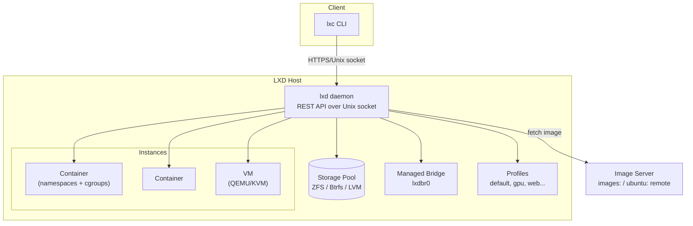

# LXD

## Overview

LXD (pronounced "lex-dee", now developed as **Incus** upstream after Canonical's fork, but still widely deployed under the LXD name) is a management layer built on top of [LXC](LXC-Linux-Containers.md) that turns raw kernel containers into a full system-container and lightweight-VM platform with a REST API, image server, and cluster support. Where LXC gives you `liblxc` primitives, LXD adds a daemon (`lxd`), a client (`lxc`), image handling, [storage pools and volumes](Storage-Pools-and-Volumes.md), network bridges, and profiles so containers behave like disposable virtual machines you can `lxc launch` in seconds. It is the tool of choice on Ubuntu/Debian hosts that need many isolated Linux systems (dev/test farms, CI runners, multi-tenant hosting) without the overhead of full KVM virtualization for every workload.

> [!IMPORTANT]
> LXD containers are **system containers** (a full init system, multiple services, SSH, package manager — like a mini VM) as opposed to **application containers** (Docker's one-process-per-container model). Don't reach for LXD to package a microservice; reach for it when you need something that behaves like a whole Linux box.

## Concepts

| Term | Meaning |
|---|---|
| Instance | An LXD-managed workload — either a **container** (shares host kernel) or a **virtual-machine** (`lxc launch --vm`, uses QEMU/KVM) |
| Image | A pre-built rootfs + metadata (e.g. `ubuntu:22.04`, `images:debian/12`) instances are launched from |
| Profile | A reusable, named bundle of config + devices applied to one or more instances (like a config "class") |
| Storage pool | A backend (ZFS, Btrfs, LVM, dir, ceph) that stores instance root disks and volumes |
| Network | A managed bridge/OVN network LXD creates and attaches instances to |
| Project | A namespace inside one LXD server isolating instances, images, networks per tenant |
| Cluster | Multiple `lxd` daemons on separate hosts presenting one logical API/scheduling domain |
| Remote | A named LXD server (local or remote) the `lxc` client can target, e.g. `images:`, `local:` |

## Architecture



LXD's daemon speaks a REST API (Unix socket locally, HTTPS on port `8443` for remote/cluster access). The `lxc` client is just a thin API consumer — everything it does can be scripted with `curl` against the same API, which is what makes LXD automation-friendly (Terraform, Ansible, Packer all have LXD providers/plugins).

## Installation

LXD ships as a snap on modern Ubuntu and as a distro package elsewhere.

```bash
# Ubuntu / Debian (snap — canonical upstream delivery)
sudo snap install lxd
sudo lxd init                     # interactive first-run wizard

# Debian/Ubuntu apt package (older LXD 4.x, or use Incus instead)
sudo apt update
sudo apt install lxd

# RHEL/Alma/Rocky family — LXD is not packaged upstream;
# use the Incus fork instead (COPR/EPEL varies by release)
sudo dnf install epel-release
sudo dnf install incus            # command-compatible: `incus` mirrors `lxc`

# Add your user to the lxd group to avoid sudo on every command
sudo usermod -aG lxd "$USER"
newgrp lxd
```

> [!NOTE]
> On RHEL-family systems, **Incus** (the community fork after Canonical moved LXD fully to snap-only) is the practical path — command syntax is a near drop-in match (`incus launch` ≈ `lxc launch`). This note uses `lxc` throughout; substitute `incus` on RHEL hosts.

## Configuration

`lxd init` walks through storage backend, networking, and whether to enable the cluster/remote API. Reasonable answers for a single-node lab:

```text
Would you like to use LXD clustering? (yes/no) [default=no]: no
Do you want to configure a new storage pool? (yes/no) [default=yes]: yes
Name of the new storage pool [default=default]: default
Name of the storage backend to use (dir, lvm, zfs, btrfs, ...) [default=zfs]: zfs
Create a new ZFS pool? (yes/no) [default=yes]: yes
Would you like to connect to a MAAS server? (yes/no) [default=no]: no
Would you like to create a new local network bridge? (yes/no) [default=yes]: yes
What should the new bridge be called? [default=lxdbr0]: lxdbr0
What IPv4 address should be used? [default=auto]: auto
What IPv6 address should be used? [default=auto]: auto
Would you like the LXD server to be available over the network? (yes/no) [default=no]: no
Would you like stale cached images to be updated automatically? (yes/no) [default=yes]: yes
Would you like a YAML "lxd init" preseed to be printed? (yes/no) [default=no]: no
```

For repeatable, non-interactive setup use a preseed YAML:

```yaml
config:
  core.https_address: "[::]:8443"
networks:
  - name: lxdbr0
    type: bridge
    config:
      ipv4.address: auto
      ipv6.address: none
storage_pools:
  - name: default
    driver: zfs
    config:
      size: 30GiB
profiles:
  - name: default
    devices:
      root:
        path: /
        pool: default
        type: disk
      eth0:
        name: eth0
        network: lxdbr0
        type: nic
```

```bash
lxd init --preseed < preseed.yaml
```

### Profiles

Profiles let you define config once and apply it to many instances (resource limits, GPU passthrough, extra mounts):

```bash
lxc profile create web
lxc profile set web limits.cpu 2
lxc profile set web limits.memory 2GB
lxc profile device add web eth0 nic network=lxdbr0
lxc profile device add web web-data disk source=/srv/web path=/var/www

lxc launch ubuntu:22.04 web01 --profile default --profile web
```

## Commands

| Task | Command |
|---|---|
| List remotes | `lxc remote list` |
| List images on a remote | `lxc image list images: ubuntu` |
| Launch container | `lxc launch ubuntu:22.04 mycontainer` |
| Launch VM | `lxc launch ubuntu:22.04 myvm --vm` |
| List instances | `lxc list` |
| Shell into instance | `lxc exec mycontainer -- bash` |
| Copy files in | `lxc file push app.tar mycontainer/root/` |
| Copy files out | `lxc file pull mycontainer/var/log/syslog .` |
| Stop / start | `lxc stop mycontainer` / `lxc start mycontainer` |
| Delete | `lxc delete mycontainer --force` |
| Snapshot | `lxc snapshot mycontainer snap1` |
| Restore snapshot | `lxc restore mycontainer snap1` |
| Publish as image | `lxc publish mycontainer --alias my-image` |
| Live migrate (cluster) | `lxc move mycontainer --target node2` |
| Show config | `lxc config show mycontainer --expanded` |
| Set limit live | `lxc config set mycontainer limits.cpu 1` |
| Storage pool list | `lxc storage list` |
| Create storage volume | `lxc storage volume create default data1 size=10GiB` |
| Attach volume | `lxc storage volume attach default data1 mycontainer /data` |
| Cluster member list | `lxc cluster list` |

## Examples

```bash
# 1. Launch and enter a container in one flow
lxc launch images:debian/12 db01
lxc exec db01 -- apt update
lxc exec db01 -- apt install -y postgresql

# 2. Constrain resources and forward a port via proxy device
lxc config set db01 limits.cpu 2
lxc config set db01 limits.memory 1GB
lxc config device add db01 pg-proxy proxy \
  listen=tcp:0.0.0.0:5432 connect=tcp:127.0.0.1:5432

# 3. Create a dedicated ZFS-backed storage pool and use it for one instance
lxc storage create fast-pool zfs source=/dev/sdb
lxc launch ubuntu:22.04 cache01 --storage fast-pool

# 4. Snapshot before an upgrade, roll back if it breaks
lxc snapshot db01 pre-upgrade
lxc exec db01 -- apt full-upgrade -y
lxc restore db01 pre-upgrade   # if the upgrade goes wrong

# 5. Bootstrap a 3-node cluster (run on the first node)
lxd init   # answer "yes" to clustering, become the bootstrap node
# on subsequent nodes, join using the join token lxc cluster add prints:
lxc cluster add node2
# then on node2: lxd init --preseed with the printed join token
```

## Best Practices

- Prefer **ZFS or Btrfs** storage backends over `dir` — you get instant copy-on-write clones, snapshots, and quotas; `dir` has none of this.
- Use **profiles**, not per-instance ad-hoc config, for anything applied to more than one instance — it keeps fleets consistent and auditable.
- Pin images by hash/alias, not `latest`, in automation (Packer/Terraform) to get reproducible builds.
- Set `limits.cpu` and `limits.memory` on every profile in shared/multi-tenant environments — an unconstrained container can starve the host.
- Use `lxc copy`/`lxc publish` to promote a hardened, patched "golden" container into a custom image instead of rebuilding from a stock image every time.
- For anything internet-facing, prefer **LXD VMs** over containers when you need a security boundary equivalent to a hypervisor (VMs get their own kernel via QEMU/KVM).

## Security Considerations

> [!WARNING]
> System containers share the host kernel. A kernel exploit inside a container can compromise the host. LXD mitigates this with unprivileged containers by default, but defense-in-depth still matters — see [LXC-Linux-Containers](LXC-Linux-Containers.md) for the underlying namespace/cgroup/AppArmor mechanics.

- **Run unprivileged containers by default** (LXD's default since 2.x) — root inside the container maps to an unprivileged UID/GID range on the host via `security.privileged=false`. Avoid `security.privileged=true` unless a workload truly requires host-equivalent capabilities.
- **Enable AppArmor/SELinux confinement** — LXD auto-generates a per-container AppArmor profile; verify it's active with `lxc config show <name> --expanded | grep security` and `aa-status`.
- **Restrict the REST API surface**: don't set `core.https_address` unless you need remote/cluster access; when you do, pair it with client certificate auth (`lxc remote add`) and firewall port `8443` (`firewalld`/`ufw`) to trusted management subnets only.
- **Use projects** (`lxc project create tenant-a`) to isolate multi-tenant instances, images, and networks from one another — this maps well to CIS-style least-privilege segmentation.
- **Patch the image, not just the host**: images go stale; schedule `lxc image list` reviews and rebuild/relaunch from refreshed base images rather than patching drifted long-lived containers.
- **Firewall the bridge**: `lxdbr0` NATs by default; explicitly manage forwarded ports with `proxy` devices instead of exposing broad `iptables`/`nftables` DNAT rules.
- Align resource limits and logging (`lxc config set <name> limits.*`, forward `lxc monitor` output to your SIEM) with your organization's CIS Docker/Linux Benchmark equivalents — LXD has no official CIS benchmark, so borrow control intent from the CIS Linux and Docker benchmarks where applicable.

> [!NOTE]
> **📸 Screenshot**
> _Capture: output of `lxc list` showing a running container/VM alongside `lxc info <name>` displaying its resource limits and network address, to illustrate instance state at a glance._

## Troubleshooting

| Symptom | Likely cause | Fix |
|---|---|---|
| `Error: LXD socket not accessible` | User not in `lxd` group | `sudo usermod -aG lxd $USER && newgrp lxd` |
| Container stuck in `STOPPED` after `start` | Storage pool full or corrupted | `lxc storage info default`; check `df -h`; inspect `lxc monitor` |
| No network inside container | `lxdbr0` down or firewall blocking DHCP | `ip a show lxdbr0`; `sudo systemctl status lxd`; check `ufw`/`firewalld` rules on host |
| `Failed to run: dnsmasq` errors | Port conflict with existing DHCP/DNS service | Disable competing `dnsmasq`/`systemd-resolved` stub listener or rebind LXD's bridge |
| Image pull hangs or fails | Firewall blocking outbound to image server | Check egress to `images.linuxcontainers.org`; use `lxc remote list` to confirm remote reachability |
| VM won't boot | Nested virtualization / KVM not enabled | `kvm-ok` (Ubuntu) or check `/dev/kvm` exists; enable VT-x/AMD-V in BIOS |
| Cluster node shows `OFFLINE` | Network partition or clock skew between nodes | Verify port `8443` reachability both ways; sync time with `chrony`/`ntp` |

## References

- LXD/Incus official documentation: https://linuxcontainers.org/incus/docs/main/
- `lxc` command manual: `man lxc`
- LXD REST API specification: https://linuxcontainers.org/incus/docs/main/rest-api/
- CIS Distribution Independent Linux Benchmark (apply general container/host hardening controls)
- Canonical LXD image server: https://images.linuxcontainers.org/

## Related Notes

- [LXC-Linux-Containers](LXC-Linux-Containers.md) — the underlying namespace/cgroup container primitives LXD builds on
- [Storage-Pools-and-Volumes](Storage-Pools-and-Volumes.md) — ZFS/Btrfs/LVM backends used by LXD storage pools
- [Linux Administration & Server Hardening](../Readme.md) — course hub and map of content
