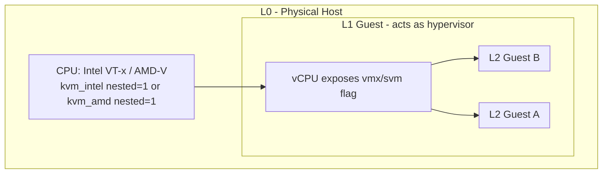

# Nested Virtualization

## Overview

Nested virtualization lets a KVM guest (the L1 hypervisor) itself run hypervisor workloads and host L2 guests, by exposing hardware virtualization extensions (Intel VMX / AMD SVM) through to the virtual CPU instead of trapping them. It underpins [KVM](KVM-Kernel-Virtual-Machine.md) test labs, CI runners that spin up disposable VMs per job, and cloud-in-a-VM training environments where a full [virtualization](Introduction-to-Virtualization.md) stack must run without physical hardware access. Because every instruction that touches virtualization state now has to be emulated or intercepted one extra layer down, the performance and support story is materially different from bare-metal KVM.

> [!IMPORTANT]
> Nested virtualization is officially supported by Red Hat and most distributions **only for testing and development** — not for production workloads. Treat any L2 guest as expendable, and never rely on nested KVM for a production hypervisor tier.

## Concepts

- **L0** — the physical host, running the outermost hypervisor directly on bare metal.
- **L1** — a KVM guest running on L0 that itself acts as a hypervisor (e.g., runs `libvirtd`/QEMU inside a VM).
- **L2** — a guest VM running inside L1, virtualized twice over.
- **VMX / SVM** — Intel's and AMD's hardware virtualization extension sets, respectively. For L1 to run L2 guests with hardware acceleration, L0 must expose these extensions to the L1 vCPU (either by passing through the host's real flag or emulating it).
- **Shadow-on-shadow / SVM nested paging** — when both layers use extended/nested page tables, L0 must maintain shadow page tables that combine L1's and L2's mappings, which is one of the main sources of nested-virt overhead.

## Architecture



The chain of trust for hardware acceleration must hold at every layer: L0's kernel module needs `nested=1`, the libvirt/QEMU CPU model handed to L1 must include `vmx` (Intel) or `svm` (AMD), and L1's own kernel must load its KVM module with nested support before L2 guests can be accelerated. If any link is missing, L2 falls back to slow, fully-emulated TCG execution.

## Installation

### 1. Enable nested support in the L0 kernel module

Check whether it's already on:

```bash
# Intel hosts
cat /sys/module/kvm_intel/parameters/nested
# AMD hosts
cat /sys/module/kvm_amd/parameters/nested
```

`Y` or `1` means enabled. If it shows `N`, enable it:

```bash
# Intel — unload/reload with the option (drops running VMs on this host, plan a maintenance window)
sudo modprobe -r kvm_intel
sudo modprobe kvm_intel nested=1

# AMD
sudo modprobe -r kvm_amd
sudo modprobe kvm_amd nested=1
```

Persist across reboots on both RHEL-family and Debian-family systems:

```bash
echo "options kvm_intel nested=1" | sudo tee /etc/modprobe.d/kvm-nested.conf
# or for AMD:
echo "options kvm_amd nested=1" | sudo tee /etc/modprobe.d/kvm-nested.conf

sudo dracut -f          # RHEL/Fedora — rebuild initramfs if kvm_intel is built into it
sudo update-initramfs -u # Debian/Ubuntu equivalent
```

### 2. Verify

```bash
sudo modprobe -r kvm_intel && sudo modprobe kvm_intel
cat /sys/module/kvm_intel/parameters/nested
# Expect: Y
```

## Configuration

### Expose VMX/SVM to the L1 guest

The L0 hypervisor must advertise the virtualization flag on the vCPU it hands to L1. With `virsh`/libvirt, edit the guest XML:

```bash
virsh edit l1-guest
```

```xml
<cpu mode='host-passthrough' check='none'>
  <!-- host-passthrough forwards vmx/svm automatically -->
</cpu>
```

If you must use a named CPU model instead of passthrough (e.g., for migration compatibility across a cluster), explicitly add the feature:

```xml
<cpu mode='custom' match='exact' check='partial'>
  <model fallback='allow'>Skylake-Client</model>
  <feature policy='require' name='vmx'/>
</cpu>
```

For AMD, the equivalent feature is `svm`:

```xml
<cpu mode='custom' match='exact' check='partial'>
  <model fallback='allow'>EPYC</model>
  <feature policy='require' name='svm'/>
</cpu>
```

With raw QEMU:

```bash
qemu-system-x86_64 -enable-kvm -cpu host \
  -m 4096 -smp 2 \
  -drive file=l1-guest.qcow2,format=qcow2
```

`-cpu host` (the CLI equivalent of `host-passthrough`) is the simplest reliable way to leak `vmx`/`svm` into L1.

### Verify inside L1

Once booted, confirm the flag landed and L1's own KVM module has nested enabled:

```bash
# Inside the L1 guest
lscpu | grep -i virtualization
grep -E 'vmx|svm' /proc/cpuinfo | head -1

# Load L1's KVM module with nested support (same as L0 steps, run inside L1)
cat /sys/module/kvm_intel/parameters/nested
```

If `/proc/cpuinfo` inside L1 shows no `vmx`/`svm`, the problem is at L0 — the CPU model handed to the guest doesn't expose it; fix step 2 first.

## Commands

| Task | Command |
|---|---|
| Check L0 nested status (Intel) | `cat /sys/module/kvm_intel/parameters/nested` |
| Check L0 nested status (AMD) | `cat /sys/module/kvm_amd/parameters/nested` |
| Reload module with nested on | `sudo modprobe -r kvm_intel && sudo modprobe kvm_intel nested=1` |
| Confirm vmx/svm reaches L1 | `grep -E 'vmx\|svm' /proc/cpuinfo` (run *inside* L1) |
| Inspect a guest's CPU XML | `virsh dumpxml l1-guest \| grep -A3 '<cpu'` |
| Edit a guest's CPU model | `virsh edit l1-guest` |
| Live CPU feature check via libvirt | `virsh capabilities \| grep -A5 features` |
| Confirm KVM accel active for L2 (inside L1) | `virt-host-validate qemu` |

## Examples

### CI runner use case

A GitLab/Jenkins CI host runs one persistent "runner" VM (L1) per project team, sized generously (8 vCPU / 16 GB RAM), with `host-passthrough` CPU mode. Each CI job spins up an ephemeral L2 VM inside the runner via `virt-install`, executes the pipeline, and destroys it — giving job isolation without provisioning new bare-metal or cloud instances per job.

```bash
# Inside L1 (the CI runner VM), spin up a throwaway L2 test VM
virt-install \
  --name ci-job-4471 \
  --memory 2048 --vcpus 2 \
  --disk size=10,format=qcow2 \
  --cdrom /var/lib/libvirt/images/debian-netinst.iso \
  --os-variant debian12 \
  --network network=default \
  --noautoconsole
```

### Lab use case: nested OpenStack/Kubernetes sandbox

Training environments (e.g., practicing `kubeadm` cluster builds or an OpenStack all-in-one) frequently run the entire stack inside one large L1 VM so students can destroy/rebuild the whole environment via a single snapshot revert, without touching the physical lab host.

```bash
# Snapshot L1 before a destructive lab exercise, revert afterward
virsh snapshot-create-as l1-lab-vm clean-state
virsh snapshot-revert l1-lab-vm clean-state
```

> [!NOTE]
> **📸 Screenshot**
> _Capture: `virsh dumpxml` output for an L1 guest showing the `<cpu mode='host-passthrough'>` block, alongside `lscpu` run inside that same guest showing the `vmx`/`svm` flag present — demonstrating the flag successfully passed through._

## Best Practices

- Use `host-passthrough` for L1 guests whenever you don't need live migration between dissimilar CPU hosts — it's the least error-prone way to expose vmx/svm.
- Give L1 generous vCPU/RAM headroom; nested page-table walks and VM-exit handling are more expensive than single-level virtualization, so undersized L1s show disproportionate L2 slowdown.
- Prefer `virtio` devices (disk, network) at both layers — nested emulated device I/O (e.g., emulated NICs) compounds badly.
- Pin L1 vCPUs to physical cores (`virsh vcpupin`) on latency-sensitive CI/lab hosts to reduce scheduler jitter across the two layers.
- Keep L0 and L1 kernels reasonably current — nested-virt bug fixes (especially around AMD SVM nested paging and Spectre/L1TF mitigations) land in kernel and QEMU updates regularly.
- Document that nested VMs are ephemeral/lab-only in your runbooks so nobody accidentally builds a production dependency on an unsupported configuration.

## Security Considerations

- **CIS Benchmark alignment**: general KVM host-hardening controls (control of `/etc/libvirt/qemu.conf`, hypervisor patching cadence, restricting who can define/edit guest XML) still apply to L0 unchanged — nested virt doesn't relax them, and CIS Benchmarks for RHEL/Ubuntu do not have nested-specific rules, so apply the standard virtualization-host guidance in the [KVM-Kernel-Virtual-Machine](KVM-Kernel-Virtual-Machine.md) note to L0.
- Exposing `vmx`/`svm` to a guest increases the guest's attack surface against hypervisor-level vulnerabilities (e.g., historical VENOM, and various KVM/QEMU CVEs affecting nested VM-exit handling); don't enable nested virt on any L0 host that also runs untrusted, security-sensitive workloads unless it's fully isolated for that purpose.
- Nested virtualization is a **known amplifier for side-channel risk** (L1TF, MDS, Spectre-class issues) because state can leak across more privilege boundaries than in single-level virtualization — keep host microcode and the `mitigations=` kernel boot parameters at their defaults unless you have a specific, reviewed reason to relax them.
- Treat L1 guests that host L2 workloads as a stronger trust boundary than an ordinary VM: if L1 is compromised, an attacker with nested vmx/svm access has a foothold closer to L0 hardware behavior than a normal single-level guest would.
- Never expose nested virtualization capability to guests owned by a different tenant/customer in a shared, multi-tenant environment — this is explicitly called out as unsupported/risky by most cloud and virtualization vendors.

## Troubleshooting

| Symptom | Likely Cause | Fix |
|---|---|---|
| `nested` parameter file shows `N` after setting `nested=1` in modprobe.d | Module was already loaded before the config was written | `sudo modprobe -r kvm_intel && sudo modprobe kvm_intel` to force reload, or reboot |
| `/proc/cpuinfo` inside L1 has no `vmx`/`svm` | L0 CPU model doesn't expose the flag to the guest | Switch guest XML to `<cpu mode='host-passthrough'>` or add `<feature policy='require' name='vmx'/>` |
| L2 guest boots but is extremely slow, `virt-host-validate qemu` inside L1 warns "KVM not accelerated" | L1's own `kvm_intel`/`kvm_amd` module isn't loaded, or `/dev/kvm` isn't accessible inside L1 | `lsmod \| grep kvm` inside L1; ensure `/dev/kvm` exists and the user running QEMU has access (`ls -l /dev/kvm`) |
| `modprobe -r kvm_intel` fails with "module in use" | Running VMs are still using the module | Stop/migrate all guests on that host first, or defer to next maintenance window |
| Nested guest randomly hangs or panics under load | Known nested-paging edge cases in older kernel/QEMU versions | Update L0 and L1 kernels and QEMU/libvirt to current stable releases; check distro erratum trackers for nested-virt CVEs |
| `virsh edit` change to CPU mode doesn't take effect | Guest wasn't fully powered off, only rebooted | `virsh shutdown l1-guest` (full ACPI shutdown), confirm `virsh list --all` shows it off, then `virsh start l1-guest` |

## References

- [KVM Nested Virtualization — kernel.org KVM documentation](https://www.kernel.org/doc/html/latest/virt/kvm/index.html)
- [Red Hat: Nested Virtualization support statement (RHEL Virtualization Deployment and Administration Guide)](https://access.redhat.com/documentation/)
- `man virsh`, `man qemu-system-x86_64`
- [QEMU CPU Models documentation](https://qemu.readthedocs.io/en/latest/system/i386/cpu.html)
- CIS Benchmark: Red Hat Enterprise Linux / Ubuntu — Virtualization and Hypervisor Hardening controls (applies to L0 host)

## Related Notes

- [KVM-Kernel-Virtual-Machine](KVM-Kernel-Virtual-Machine.md) — the base hypervisor whose kernel modules and CPU-model settings nested virt builds on
- [Introduction-to-Virtualization](Introduction-to-Virtualization.md) — foundational virtualization concepts and terminology
- [Linux Administration & Server Hardening](../Readme.md) — course hub and map of content
