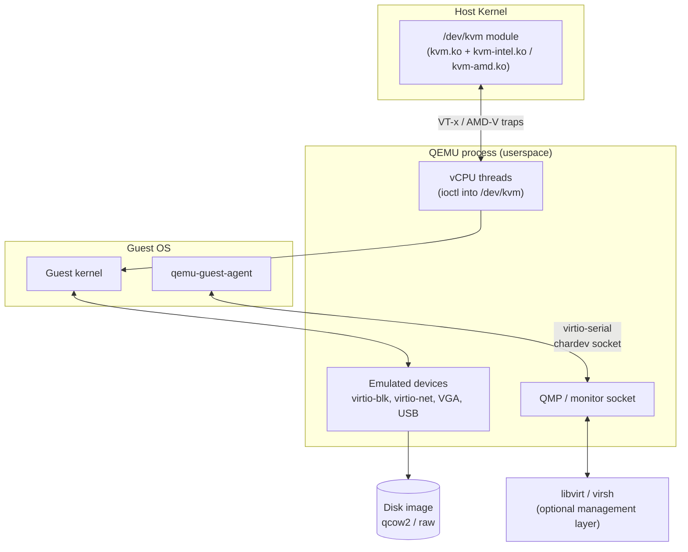

# QEMU

## Overview

QEMU (Quick EMUlator) is a generic, open-source machine emulator and virtualizer that forms the userspace half of Linux virtualization: [KVM-Kernel-Virtual-Machine](KVM-Kernel-Virtual-Machine.md) supplies the kernel-level hardware acceleration, while QEMU emulates CPU, chipset, disk, network, and peripheral devices and presents them to a guest OS. It can run entirely in software (pure emulation, even across CPU architectures) or hand off CPU execution to KVM for near-native speed, and it owns the disk image formats — notably qcow2 — managed by [Storage-Pools-and-Volumes](Storage-Pools-and-Volumes.md). Most production deployments never invoke `qemu-system-x86_64` by hand; libvirt/virsh or a hypervisor manager (virt-manager, Proxmox, OpenStack) generates the QEMU command line for you, but understanding the raw flags is essential for troubleshooting and scripting.

> [!IMPORTANT]
> QEMU is the **device model and instruction emulator**; KVM is the **acceleration layer**. QEMU alone (TCG mode) can emulate any guest architecture on any host but is 5-20x slower than native. QEMU+KVM restricts you to running guests matching the host CPU architecture but achieves near-native performance because guest code executes directly on host silicon.

## Concepts

| Term | Meaning |
|---|---|
| **TCG** (Tiny Code Generator) | QEMU's built-in JIT that translates guest machine code to host machine code in software. Used when KVM is unavailable or when emulating a foreign architecture (e.g., ARM guest on x86 host). Slow but universal. |
| **KVM acceleration** | QEMU delegates CPU virtualization to `/dev/kvm`; guest instructions run directly on host CPU with hardware-assisted traps (Intel VT-x / AMD-V). Requires host CPU == guest CPU architecture. |
| **Machine type** (`-machine`) | Virtual chipset/board QEMU emulates, e.g. `pc` (legacy i440FX) or `q35` (modern PCIe). `q35` is preferred for new guests. |
| **Device model** | Emulated hardware: virtio-blk/virtio-scsi (paravirtualized disk), virtio-net (paravirtualized NIC), e1000 (emulated NIC), VGA/virtio-gpu (display). |
| **qcow2** | QEMU Copy-On-Write v2 — sparse, snapshot-capable, compressible disk image format. Default choice for most KVM/libvirt deployments. |
| **raw** | Flat, unstructured disk image or block device passthrough. Fastest I/O, no snapshots, no compression, no thin provisioning. |
| **QEMU Guest Agent (qemu-ga)** | Daemon inside the guest that lets the host request filesystem freeze/thaw, graceful shutdown, IP address reporting, and memory ballooning coordination via a virtio-serial channel. |

## Architecture



## Installation

**RHEL-family (RHEL/AlmaLinux/Rocky/Fedora):**

```bash
sudo dnf install -y qemu-kvm libvirt virt-install virt-manager qemu-img edk2-ovmf
sudo systemctl enable --now libvirtd
# verify hardware virtualization is exposed to the host
lscpu | grep -E 'Virtualization'
sudo kvm-ok 2>/dev/null || egrep -c '(vmx|svm)' /proc/cpuinfo
```

**Debian-family (Debian/Ubuntu):**

```bash
sudo apt update
sudo apt install -y qemu-system-x86 qemu-utils libvirt-daemon-system virtinst \
    virt-manager ovmf cpu-checker
sudo systemctl enable --now libvirtd
kvm-ok   # from cpu-checker package
```

> [!NOTE]
> Add your admin user to the `libvirt` (Debian) or `libvirt`+`kvm` (RHEL) groups so `virsh`/`virt-manager` work without root: `sudo usermod -aG libvirt,kvm $USER`, then re-login.

## Configuration

Standalone QEMU is configured entirely via command-line flags (no persistent config file); libvirt wraps these into per-VM XML domain definitions under `/etc/libvirt/qemu/*.xml`. Key building blocks:

```bash
# Machine + acceleration + CPU model
-machine q35,accel=kvm -cpu host

# Memory and vCPUs
-m 8G -smp 4,sockets=1,cores=4,threads=1

# Disk via virtio for best performance
-drive file=/var/lib/libvirt/images/rocky9.qcow2,if=virtio,cache=none,discard=unmap

# Network: user-mode NAT (no root needed) vs. bridged (needs tap/bridge setup)
-netdev user,id=net0 -device virtio-net-pci,netdev=net0
-netdev bridge,br=br0,id=net0 -device virtio-net-pci,netdev=net0

# Guest agent channel (paired with qemu-guest-agent running inside guest)
-chardev socket,path=/var/lib/libvirt/qemu/channel/guest-agent.sock,server=on,wait=off,id=qga0 \
-device virtio-serial \
-device virtserialport,chardev=qga0,name=org.qemu.guest_agent.0
```

## Commands

### qemu-system-x86_64

| Flag | Purpose |
|---|---|
| `-machine q35,accel=kvm` | Modern PCIe chipset with KVM acceleration |
| `-machine pc,accel=tcg` | Legacy chipset, pure software emulation (no hardware virt required) |
| `-cpu host` | Expose host CPU features 1:1 to guest (best perf, breaks live migration to dissimilar hosts) |
| `-cpu qemu64` / `-cpu Skylake-Server` | Generic/named CPU model for migration compatibility |
| `-m <size>` | RAM, e.g. `-m 4096` or `-m 4G` |
| `-smp N` | vCPU count, optionally `sockets=,cores=,threads=` |
| `-drive file=...,if=virtio` | Attach disk with virtio-blk paravirtual driver |
| `-cdrom install.iso` | Attach ISO as CD-ROM for installation |
| `-boot d` | Boot from CD-ROM first (installer); `-boot c` boots from disk |
| `-nic user,model=virtio-net-pci` | Quick user-mode NAT networking, no privileges needed |
| `-vnc :1` | Expose display over VNC on port 5901 instead of local GTK/SDL window |
| `-display none -serial mon:stdio` | Headless with console redirected to terminal |
| `-enable-kvm` | Shorthand to force KVM acceleration (older syntax; prefer `-machine accel=kvm`) |
| `-snapshot` | Discard all writes on exit (ephemeral run against a base image) |

### qemu-img

```bash
# Create a new 20 GiB qcow2 image
qemu-img create -f qcow2 rocky9.qcow2 20G

# Create a qcow2 image with a backing file (linked clone / golden image pattern)
qemu-img create -f qcow2 -F qcow2 -b golden-base.qcow2 clone01.qcow2

# Convert raw -> qcow2 (compressed, preallocation off)
qemu-img convert -f raw -O qcow2 -c disk.raw disk.qcow2

# Convert qcow2 -> raw (e.g., for block-device passthrough or VMware export)
qemu-img convert -f qcow2 -O raw disk.qcow2 disk.raw

# Inspect image metadata, format, virtual/actual size, backing chain
qemu-img info disk.qcow2

# Resize (grow) an image; guest still needs to grow its filesystem
qemu-img resize disk.qcow2 +10G

# Check image consistency
qemu-img check disk.qcow2

# Internal qcow2 snapshots (fast, no external files)
qemu-img snapshot -c pre-upgrade disk.qcow2   # create
qemu-img snapshot -l disk.qcow2               # list
qemu-img snapshot -a pre-upgrade disk.qcow2   # apply/revert
qemu-img snapshot -d pre-upgrade disk.qcow2   # delete
```

## Examples

### Boot a new install from ISO (KVM-accelerated, headless-friendly)

```bash
qemu-img create -f qcow2 /var/lib/libvirt/images/debian12.qcow2 20G

qemu-system-x86_64 \
  -name debian12 \
  -machine q35,accel=kvm \
  -cpu host \
  -m 4096 -smp 2 \
  -drive file=/var/lib/libvirt/images/debian12.qcow2,if=virtio,cache=none \
  -cdrom /var/lib/libvirt/images/iso/debian-12-netinst.iso \
  -boot d \
  -nic user,model=virtio-net-pci \
  -vnc :1
```

### Run a foreign-architecture guest with pure TCG (no KVM)

```bash
qemu-system-aarch64 \
  -machine virt -cpu cortex-a72 \
  -m 2048 -smp 2 \
  -drive file=alpine-arm64.qcow2,if=virtio \
  -nic user \
  -display none -serial mon:stdio
```

### Query the guest agent through QMP-style socket (host side)

```bash
# Requires qemu-guest-agent running inside the guest and a virtserialport wired up
sudo virsh qemu-agent-command debian12 '{"execute":"guest-ping"}'
sudo virsh qemu-agent-command debian12 '{"execute":"guest-get-osinfo"}'
sudo virsh qemu-agent-command debian12 '{"execute":"guest-fsfreeze-freeze"}'
```

Inside the guest, install and enable the agent:

```bash
# RHEL-family guest
sudo dnf install -y qemu-guest-agent
sudo systemctl enable --now qemu-guest-agent

# Debian-family guest
sudo apt install -y qemu-guest-agent
sudo systemctl enable --now qemu-guest-agent
```

> [!NOTE]
> **📸 Screenshot**
> _Capture: `virt-manager` console view of a running guest, alongside a terminal showing `qemu-img info` output for its backing qcow2 file — useful to illustrate the image-to-running-VM relationship._

## Best Practices

- Prefer **virtio** devices (virtio-blk/virtio-scsi, virtio-net, virtio-gpu) over emulated legacy hardware (IDE, e1000, Cirrus VGA) — paravirtual drivers dramatically cut CPU overhead and I/O latency.
- Use `-machine q35` for new guests instead of the legacy `pc` (i440FX) machine type; q35 supports PCIe, more PCI slots, and native AHCI.
- Use **qcow2 with a backing file** for golden-image/linked-clone fleets to save disk space; flatten (`qemu-img convert`) before shipping a clone elsewhere so it isn't tied to the base image's path.
- Set `cache=none` (or `cache=writeback` only when you accept some data-loss risk on host crash) and `discard=unmap` on virtio-blk drives so guest TRIM/fstrim reclaims space from thin-provisioned qcow2 images.
- Avoid `-cpu host` for VMs that may need **live migration** to dissimilar hardware; use a named baseline CPU model instead so the feature set stays portable.
- Always install `qemu-guest-agent` in the guest — it enables clean shutdown, filesystem freeze for consistent snapshots/backups, and accurate IP reporting to the hypervisor.
- Let libvirt manage the QEMU command line in production (`virsh edit <domain>`) rather than hand-rolled `qemu-system-x86_64` invocations — you get persistent XML definitions, autostart, and a stable management API.

## Security Considerations

- **Run guests unprivileged**: libvirt's default QEMU driver runs guest processes as the `qemu`/`libvirt-qemu` user via `/etc/libvirt/qemu.conf` (`user = "qemu"`), not root — verify this hasn't been reverted to root for convenience (CIS Distribution Independent Linux Benchmark, virtualization hardening section).
- **Enable sVirt / SELinux-KVM (or AppArmor on Debian/Ubuntu)** so each guest's disk images and devices are confined by a unique security context, preventing a compromised QEMU process from touching another guest's image.
- **Restrict monitor/QMP sockets**: never expose the QEMU monitor or VNC display on `0.0.0.0` without authentication; bind to `127.0.0.1` or a management-only interface, and set a VNC password or use TLS (`-vnc :1,password=on` plus `set_password`).
- **Disk image permissions**: qcow2/raw files under `/var/lib/libvirt/images/` should be `0600`, owned by the `qemu`/`libvirt-qemu` service account, not world-readable — an image often contains an entire filesystem, secrets included.
- **Guest agent trust boundary**: `qemu-guest-agent` executes host-issued commands (`guest-exec`) inside the guest; only enable `guest-exec` support if you trust the management plane, and restrict `virsh` access on the host (`polkit` rules) to authorized admins.
- **Keep QEMU patched**: QEMU has a recurring CVE history in device emulation code (e.g., historical VENOM CVE-2015-3456 in the floppy controller) — track distro security advisories and apply updates promptly since a guest-to-host escape defeats the entire virtualization boundary.
- **Disable unneeded emulated devices** (floppy, parallel port, unused USB controllers) to shrink attack surface exposed to a potentially hostile guest.

## Troubleshooting

| Symptom | Likely Cause | Fix |
|---|---|---|
| `KVM internal error` / `failed to initialize KVM: Permission denied` | User not in `kvm` group, or `/dev/kvm` missing | `ls -l /dev/kvm`; `sudo usermod -aG kvm $USER`; confirm VT-x/AMD-V enabled in BIOS |
| Guest boots extremely slowly, high host CPU | Running without `accel=kvm` (falling back to TCG) | Check `-machine ...,accel=kvm` is present; verify `lscpu | grep Virtualization` shows VT-x/AMD-V |
| `Could not open '/dev/kvm': No such device` | Nested virtualization not enabled, or module not loaded | `lsmod | grep kvm`; on nested hosts enable `kvm_intel nested=1` / `kvm_amd nested=1` |
| `qemu-img convert` produces huge output file | Missing `-c` compression or wrong target format | Add `-c` for qcow2 compression; confirm `-O qcow2` not `-O raw` |
| `virsh qemu-agent-command` times out | `qemu-guest-agent` not installed/running in guest, or channel not wired in XML | Verify guest service active; check domain XML has `<channel type='unix'>` with `org.qemu.guest_agent.0` |
| Snapshot revert leaves guest in odd state | Reverted internal snapshot while guest was running / memory not included | Prefer external (libvirt) snapshots with `--live` support, or shut guest down before `qemu-img snapshot -a` |
| Disk full despite `discard=unmap` set | Guest never ran `fstrim`, or filesystem mounted without `discard` | Run `fstrim -av` in guest or mount with `discard` option; confirm virtio-scsi/virtio-blk backend supports unmap |

## References

- QEMU official documentation: https://www.qemu.org/docs/master/
- QEMU `qemu-img` manual: `man qemu-img`
- QEMU `qemu-system-x86_64` manual: `man qemu-system-x86_64` / `man qemu-doc`
- QEMU Guest Agent documentation: https://wiki.qemu.org/Features/GuestAgent
- libvirt domain XML format: https://libvirt.org/formatdomain.html
- Red Hat: Configuring and Managing Virtualization (RHEL 9): https://docs.redhat.com/en/documentation/red_hat_enterprise_linux/9/html/configuring_and_managing_virtualization/
- CIS Distribution Independent Linux Benchmark — Virtualization hardening section

## Related Notes

- [KVM-Kernel-Virtual-Machine](KVM-Kernel-Virtual-Machine.md) — the kernel acceleration layer QEMU rides on
- [Storage-Pools-and-Volumes](Storage-Pools-and-Volumes.md) — managing qcow2/raw image storage backing QEMU guests
- [Linux Administration & Server Hardening](../Readme.md) — course hub and map of content
