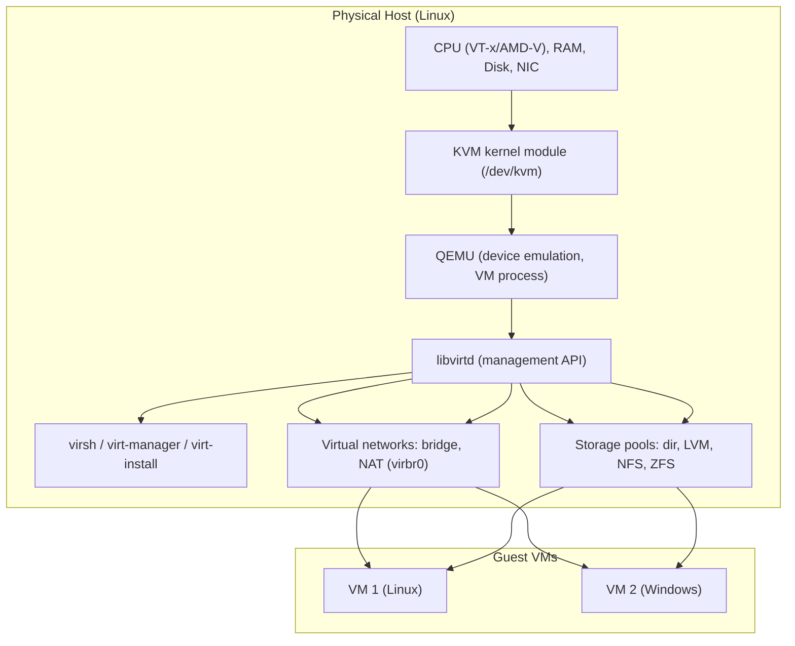

# Virtualization

## Overview

Virtualization lets a single physical host run multiple isolated operating system instances by abstracting CPU, memory, storage, and networking through a hypervisor. On Linux this spans full-machine hypervisors like [KVM-Kernel-Virtual-Machine](KVM-Kernel-Virtual-Machine.md) (paired with [QEMU](QEMU.md) and managed via [libvirt-and-virsh](libvirt-and-virsh.md)), desktop hypervisors like [VirtualBox](VirtualBox.md) and [VMware-Workstation-and-ESXi](VMware-Workstation-and-ESXi.md), and OS-level container virtualization such as [LXC-Linux-Containers](LXC-Linux-Containers.md) and [LXD](LXD.md). This module builds the mental model and hands-on skills needed before moving into the dedicated [Readme](../Containers/Readme.md) and [Introduction-to-Virtualization](Introduction-to-Virtualization.md) modules, since VM networking, storage, and templating patterns reappear there in containerized form.

> [!IMPORTANT]
> KVM turns the Linux kernel itself into a Type-1 (bare-metal-class) hypervisor via the `/dev/kvm` interface, while QEMU provides device emulation and libvirt provides the management API. Understanding this three-layer split (kernel driver → emulator → management daemon) is the single most important concept in this module — nearly every `virsh`/`virt-manager` action maps back to it.

## Concepts

- **Hypervisor types**: Type-1 (bare-metal, e.g., KVM, ESXi) runs directly on hardware with near-native performance; Type-2 (hosted, e.g., VirtualBox, VMware Workstation) runs as an application atop a host OS and is simpler for desktop labs but adds overhead.
- **Hardware-assisted virtualization**: Intel VT-x/EPT and AMD-V/NPT let a guest execute privileged instructions without the hypervisor trapping every one, which is what makes KVM performant. Verify support with `egrep -c '(vmx|svm)' /proc/cpuinfo`.
- **OS-level virtualization vs. hardware virtualization**: containers (LXC/LXD, Docker) share the host kernel and namespace/cgroup isolation instead of emulating hardware — lighter weight, faster boot, but a smaller isolation boundary than a full VM.
- **libvirt as an abstraction layer**: `libvirtd` exposes a stable API/CLI (`virsh`) over KVM/QEMU, Xen, and even VMware/ESXi in some configurations, so tooling and XML domain definitions are largely hypervisor-agnostic.
- **Nested virtualization**: running a hypervisor inside a VM (e.g., testing ESXi or another KVM host inside a KVM guest) — useful for labs, CI, and training environments, covered in [Nested-Virtualization](Nested-Virtualization.md).

## Architecture

## Learning Objectives

By the end of this module you will be able to:

- Explain the difference between Type-1 and Type-2 hypervisors and where KVM, VirtualBox, VMware, and LXC/LXD fit.
- Verify hardware virtualization support and install a KVM/QEMU/libvirt stack on both RHEL-family and Debian-family distributions.
- Create, configure, and manage VMs using `virsh`, `virt-install`, and `virt-manager`, including CPU/memory tuning and PCI passthrough basics.
- Design libvirt virtual networks (NAT, bridged, isolated) and storage pools/volumes (directory, LVM, NFS).
- Take and roll back VM snapshots, and clone VMs for rapid lab provisioning.
- Enable nested virtualization for lab and CI use cases.
- Bootstrap VMs unattended using cloud-init and cloud images instead of manual OS installers.
- Deploy and manage lightweight system containers with LXC/LXD as an alternative to full VMs.
- Compare desktop hypervisors (VirtualBox, VMware Workstation) against KVM for lab and production use cases.

## Topics Covered

| Note | What it covers |
|---|---|
| [Introduction-to-Virtualization](Introduction-to-Virtualization.md) | Hypervisor types, hardware-assisted virtualization, use cases, and choosing a platform |
| [KVM-Kernel-Virtual-Machine](KVM-Kernel-Virtual-Machine.md) | KVM kernel module, `/dev/kvm`, hardware requirements, verifying VT-x/AMD-V support |
| [QEMU](QEMU.md) | QEMU device emulation, `qemu-img`, disk formats (qcow2/raw), QEMU monitor |
| [libvirt-and-virsh](libvirt-and-virsh.md) | `libvirtd` architecture, domain XML, `virsh` command reference, connection URIs |
| [virt-manager](virt-manager.md) | GUI VM lifecycle management, `virt-install` scripted provisioning, remote connections |
| [VirtualBox](VirtualBox.md) | Oracle VirtualBox installation, Guest Additions, snapshots, host-only/NAT networking |
| [VMware-Workstation-and-ESXi](VMware-Workstation-and-ESXi.md) | VMware Workstation Pro on Linux hosts and ESXi bare-metal hypervisor basics |
| [LXC-Linux-Containers](LXC-Linux-Containers.md) | System container fundamentals, `lxc-create`/`lxc-start`, unprivileged containers |
| [LXD](LXD.md) | LXD daemon, `lxc` CLI, profiles, clustering, image management |
| [Virtual-Networking-in-libvirt](Virtual-Networking-in-libvirt.md) | NAT, bridged, and isolated virtual networks; `virbr0`, `dnsmasq`, macvtap |
| [Storage-Pools-and-Volumes](Storage-Pools-and-Volumes.md) | Directory, LVM, NFS, and iSCSI-backed storage pools; volume provisioning |
| [Snapshots-and-Cloning](Snapshots-and-Cloning.md) | Internal/external snapshots, full vs. linked clones, `virt-clone` |
| [Nested-Virtualization](Nested-Virtualization.md) | Enabling nested KVM, use cases (CI, labs), performance caveats |
| [Cloud-init-and-VM-Templates](Cloud-init-and-VM-Templates.md) | Cloud images, `cloud-init` user-data/meta-data, golden-image templating |

## Practical Labs

1. **Build a KVM lab host from scratch** — On a RHEL-family and a Debian-family VM (or bare metal), verify VT-x/AMD-V, install `qemu-kvm`/`libvirt`, add your user to the `libvirt` group, then use `virt-install` to provision a minimal Linux guest attached to the default NAT network. Confirm connectivity with `virsh domifaddr` and SSH into the guest.
2. **Design a segmented virtual network and storage pool** — Create an isolated libvirt network (no NAT/forwarding) for a "lab" VM group, an LVM-backed storage pool for performance-sensitive VMs, and an NFS-backed pool for shared ISO storage. Attach two VMs to the isolated network and verify they can reach each other but not the internet.
3. **Golden-image cloud-init workflow with snapshot rollback** — Download a cloud image (e.g., Ubuntu/AlmaLinux cloud variant), write a `cloud-init` user-data/meta-data pair to set hostname, SSH keys, and a package list, boot it with `virt-install --cloud-init`, take an external snapshot once configured, then intentionally break the guest and roll back with `virsh snapshot-revert`.

## Best Practices

- Prefer KVM/QEMU/libvirt for anything server-side or production-adjacent; reserve VirtualBox/VMware Workstation for desktop convenience and cross-platform GUI labs.
- Use qcow2 with backing files for linked clones in labs to save disk space; use raw or LVM volumes for production I/O-sensitive workloads.
- Automate VM provisioning with `virt-install` + cloud-init rather than manual ISO installs — it is repeatable, scriptable, and version-controllable.
- Keep libvirt network and storage pool definitions in XML under version control so lab environments can be rebuilt deterministically.
- Size VM vCPUs/memory to actual workload needs; over-provisioning vCPUs beyond host core count causes scheduling contention, not extra performance.

## Security Considerations

- Run guests as **unprivileged** where possible: prefer QEMU's default non-root `qemu` user session over running libvirt/QEMU as root, and use unprivileged LXC containers (UID/GID mapping) to reduce the impact of a container/VM breakout.
- Isolate management interfaces: bind `libvirtd`'s TCP/TLS listener to a management network only, and prefer the local Unix socket (`virsh -c qemu:///system`) or SSH-tunneled `qemu+ssh://` connections over unauthenticated TCP (CIS Linux guidance on minimizing exposed network services applies directly to hypervisor management daemons).
- Enable SELinux (`sVirt`) on RHEL-family hosts or AppArmor profiles on Debian/Ubuntu hosts for QEMU processes — both provide mandatory access control confinement per VM, limiting lateral movement if a guest escapes.
- Disable or firewall the default NAT network's DHCP/DNS (`dnsmasq`) exposure beyond the virtual bridge; treat `virbr0` like any other network segment requiring `firewalld`/`nftables`/`ufw` rules.
- Keep QEMU, libvirt, and the host kernel patched — VM escape vulnerabilities (e.g., historical QEMU device emulation CVEs) are the primary risk that erodes the hypervisor's isolation guarantee.
- Encrypt VM disk images at rest (LUKS on the host storage, or qcow2 encryption) for guests holding sensitive data, and disable unused QEMU devices/backends to shrink attack surface.

> [!WARNING]
> Never expose an unauthenticated libvirt TCP socket (`--listen` without TLS/SASL) to any network beyond a trusted management VLAN — it grants full VM lifecycle control, including disk read/write, to anyone who can reach the port.

> [!NOTE]
> **📸 Screenshot**
> _Capture: `virt-manager`'s main window showing a running VM's Overview tab (CPU/memory graphs) alongside the Virtual Networks and Storage tabs in Connection Details, illustrating the libvirt-managed network/storage/VM relationship._

## Troubleshooting

| Symptom | Likely Cause | Fix |
|---|---|---|
| `virsh` reports "Failed to connect to the hypervisor" | `libvirtd` not running, or user not in `libvirt` group | `sudo systemctl enable --now libvirtd`; `sudo usermod -aG libvirt $USER` then re-login |
| VM won't start: "KVM is not supported" | VT-x/AMD-V disabled in BIOS/UEFI, or running inside an unsupported nested VM | Enable virtualization extensions in firmware; check `egrep -c '(vmx|svm)' /proc/cpuinfo` returns > 0 |
| Guest has no network / can't resolve DNS | Default NAT network inactive, or `dnsmasq` not running | `virsh net-list --all`; `virsh net-start default`; check `virsh net-dumpxml default` |
| Poor disk I/O performance in guest | Using slow disk cache mode or emulated IDE instead of virtio | Use `virtio-scsi`/`virtio-blk` disk bus and `cache=none`/`writeback` as appropriate for the workload |
| Snapshot revert fails with "internal snapshot not supported" | Guest disk is raw format, not qcow2 | Convert to qcow2 with `qemu-img convert`, or use external (disk+memory) snapshots instead |
| Nested KVM guest is extremely slow or won't boot | Nested virtualization not enabled on host kernel module | `cat /sys/module/kvm_intel/parameters/nested` (or `kvm_amd`); enable per [Nested-Virtualization](Nested-Virtualization.md) |
| Bridged networking guest gets no IP | Host bridge not correctly enslaving the physical NIC, or NetworkManager conflict | Verify bridge with `ip link show`, `bridge link`; consider `nmcli` bridge profiles instead of manual scripts |

## References

- [Red Hat Documentation — Configuring and Managing Virtualization (RHEL 9)](https://access.redhat.com/documentation/en-us/red_hat_enterprise_linux/9/html/configuring_and_managing_virtualization/index)
- [libvirt Official Documentation](https://libvirt.org/docs.html)
- `man virsh`, `man virt-install`, `man qemu-img`, `man qemu-system-x86_64`
- [KVM Project — Linux KVM](https://www.linux-kvm.org/page/Main_Page)
- [Ubuntu Server Guide — Virtualization](https://ubuntu.com/server/docs/virtualization-libvirt)
- [Linux Containers — LXC/LXD Documentation](https://linuxcontainers.org/lxc/documentation/)
- [CIS Benchmarks — Distribution Independent Linux (virtualization/hypervisor hardening guidance)](https://www.cisecurity.org/benchmark/distribution_independent_linux)
- [Cloud-init Documentation](https://cloudinit.readthedocs.io/)

## Related Notes

- [Introduction-to-Virtualization](Introduction-to-Virtualization.md)
- [KVM-Kernel-Virtual-Machine](KVM-Kernel-Virtual-Machine.md)
- [libvirt-and-virsh](libvirt-and-virsh.md)
- [Readme](../Containers/Readme.md)
- [Introduction-to-Virtualization](Introduction-to-Virtualization.md)
- [Linux Administration & Server Hardening](../Readme.md) — course hub and map of content
